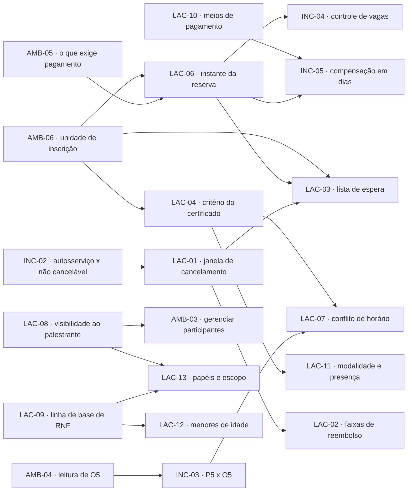

# Dúvidas, Ambiguidades, Inconsistências e Lacunas — Eventus SGE

Registro das 24 questões abertas identificadas na análise do documento de elicitação: **6 ambiguidades
(AMB-01 a AMB-06), 5 inconsistências (INC-01 a INC-05) e 13 lacunas (LAC-01 a LAC-13)**.

## 1. Como este documento classifica e o que faz com cada questão

### 1.1 Definição operacional das três classes

| Classe | Definição operacional | Teste que a caracteriza | Forma de resolução |
|---|---|---|---|
| **Ambiguidade** (`AMB-nn`) | A informação **existe** no documento fonte, mas o enunciado admite mais de uma leitura tecnicamente válida. | Duas pessoas competentes leem a mesma frase e constroem comportamentos diferentes, ambos defensáveis pelo texto. | Escolher uma leitura, registrar a escolha e reescrever o enunciado em voz normativa. |
| **Inconsistência** (`INC-nn`) | Duas afirmações — da mesma fonte ou de fontes distintas — **não podem ser simultaneamente verdadeiras** na mesma implementação. | Existe pelo menos um caso concreto em que atender a A viola B. | Reconciliar por desenho de produto (achar a solução que satisfaz ambas) ou hierarquizar explicitamente uma sobre a outra. |
| **Lacuna** (`LAC-nn`) | A informação necessária para construir **nunca foi fornecida**. | Não há nenhuma frase no documento fonte que responda à pergunta. | Propor valor padrão executável, marcá-lo como decisão proposta e submetê-lo a homologação. |

A distinção não é acadêmica: ela determina o tratamento. Ambiguidade se resolve com **redação**;
inconsistência se resolve com **decisão de arquitetura ou de produto**; lacuna se resolve com
**arbitramento de um valor**. Confundi-las produz o erro mais comum da fase de análise — tentar
resolver por texto (glossário, reescrita) um conflito que só se resolve por desenho, como em INC-01
e INC-03.

### 1.2 Postura adotada

Nenhuma questão deste documento fica registrada apenas como "pendente". Toda questão recebe uma
**recomendação padrão (decisão proposta)** suficiente para que a construção prossiga, marcada com
`⚠️ DECISÃO PROPOSTA — requer homologação do stakeholder responsável`. Isso significa,
explicitamente:

1. **A decisão final é do negócio, não da engenharia.** A recomendação é um valor operacional
   provisório, não uma definição de escopo aprovada.
2. **O default é construível e reversível.** Todos os oito parâmetros recomendados são atributos do
   Perfil de Política do Evento (RN-03, RF-19), alteráveis por interface administrativa (RNF-24) e
   sem efeito retroativo sobre inscrições já confirmadas (RN-14, RF-20). Reverter uma decisão custa
   configuração, não reescrita de código — desde que a reversão ocorra dentro do conjunto de valores
   previsto na ficha.
3. **Silêncio tem prazo.** Questão não decidida no bloco de pauta correspondente segue com o default
   registrado, sujeito a veto em até 5 dias úteis contados da ata (seção 4). Após esse prazo, o
   default passa a ser linha de base e qualquer alteração entra como pedido de mudança com
   reestimativa.
4. **Toda ficha é rastreável.** Evidência literal ou referência ao código do documento fonte
   (P1–P5, O1–O5, F1–F3, L1, OB1–OB9), IDs de requisitos e regras impactados, e o papel responsável.

### 1.3 Como ler cada ficha

Cada questão traz: evidência (citação ou referência); leituras possíveis com a consequência prática
de cada uma; por que a divergência quebra alguma coisa concreta; a recomendação padrão com
justificativa; **uma única pergunta fechada**, respondível em reunião sem consulta posterior; o papel
que decide; e os requisitos, regras, tabelas de decisão e casos de teste afetados.

O corpo (seção 3) está em ordem de identificador, para consulta. A ordem de **tratamento** é a do
painel de risco (seção 2) e a da agenda (seção 4).

## 2. Painel de risco — as 24 questões por criticidade

Critério de criticidade: **Alta** = bloqueia modelagem, cálculo de dinheiro ou exposição legal;
**Média** = permite construir com o default, mas o retrabalho é caro se a decisão mudar;
**Baixa** = o default é seguro e a reversão custa configuração.

| ID | Classe | Ponto | Impacto se não resolvido | Requisitos bloqueados | Criticidade |
|---|---|---|---|---|---|
| LAC-09 | Lacuna | Ausência integral de requisitos de segurança, desempenho, disponibilidade, acessibilidade e privacidade (OB9). | 24 metas assumidas pela engenharia sem aceite do negócio; custo de infraestrutura, acessibilidade e retenção entra no projeto sem orçamento; primeira abertura com dados reais ocorre sem linha de base contratada. | RNF-01 a RNF-24 (todos) | Alta |
| AMB-06 | Ambiguidade | A elicitação alterna entre inscrição em eventos e participação em workshops específicos, sem definir a unidade de inscrição. | Decisão estrutural do modelo de domínio; adiar obriga a refazer controle de vagas, filas e relatórios depois de codificados. | RF-04, RF-08, RF-12, RF-14, RN-01, RN-02, RN-07 | Alta |
| LAC-06 | Lacuna | Instante em que a vaga passa a ser reservada (OB6). | Sem o instante e a duração, o controle de vagas não tem invariante: ou há sobrevenda, ou há vaga presa indefinidamente. | RF-12, RF-13, RN-07, RN-11, RN-20, RNF-06, RNF-08 | Alta |
| INC-04 | Inconsistência | O1 promete controle automático de vagas; OB6 deixa indefinido o instante da reserva, o que torna o controle indeterminável. | "Automático" fica sem semântica; o número exibido no painel não é interpretável nem testável. | RF-12, RF-13, RF-29, RN-20, RNF-06 | Alta |
| LAC-02 | Lacuna | Hipóteses, percentuais, meio e prazo do reembolso (OB2, F2). | Cada caso é decidido por pessoa; sem faixa, não há valor a apurar, não há memória de cálculo e cria-se precedente contra a Eventus. | RF-18, RF-21, RN-22, RN-30, TD-02 | Alta |
| LAC-01 | Lacuna | Prazo-limite para o participante cancelar (OB1). | Sem janela, a autorização do cancelamento não tem condição de entrada e a fila de espera não tem tempo hábil para reagir à vaga liberada. | RF-21, RF-19, RN-09, RN-14, TD-01 | Alta |
| INC-02 | Inconsistência | P3 quer cancelar sem contato com a organização; O3 registra que nem todos os eventos permitem cancelamento. | Define se o autosserviço é regra ou exceção e qual aviso é obrigatório antes do pagamento; erro aqui vira reclamação de consumidor. | RF-21, RF-07, RN-09, TD-01, RNF-22 | Alta |
| LAC-03 | Lacuna | Funcionamento da lista de espera e sua existência nos dois níveis (OB3, O2). | Fila sem regra volta a ser operada por mensagem avulsa; ninguém sabe o que acontece com quem espera vaga em item pago. | RF-14, RF-15, RN-12, RN-21, RN-27, RN-29, TD-05 | Alta |
| LAC-04 | Lacuna | Critério, limiar e contestação do certificado (OB4). | O artefato que motiva P4 fica sem regra de elegibilidade; contestação em massa após o evento, quando a presença já não pode ser reconstituída. | RF-23, RF-24, RN-19, RN-23, RN-25, TD-03 | Alta |
| LAC-08 | Lacuna | Dados dos participantes visíveis ao palestrante, finalidade e exportação (OB8, L1). | Compartilhamento de dado pessoal com terceiro sem base legal nem minimização; exposição sancionatória e contratual. | RF-31, RF-32, RN-15, RNF-17, TD-07 | Alta |
| INC-01 | Inconsistência | P2 quer comprovante logo após a inscrição; F3 condiciona a liberação à confirmação do pagamento. | Documento com efeito probatório emitido antes de a vaga existir; conflito no credenciamento e disputa sobre vaga não garantida. | RF-26, RF-09, RF-27, RN-05, E-02, E-04 | Alta |
| AMB-05 | Ambiguidade | F3 exige confirmar pagamento antes de liberar "determinadas inscrições", sem qualificar quais. | Sem o critério, não se sabe qual submissão cria reserva e qual confirma na hora; a tabela de decisão da submissão não fecha. | RF-09, RF-16, RN-08, TD-06, E-02 | Alta |
| INC-05 | Inconsistência | A reserva de 30 minutos é incompatível com meios de pagamento cuja compensação leva dias, hipótese admitida por F1 e F3. | Participante paga e não tem vaga; a fila de exceções da conciliação vira operação diária permanente. | RF-13, RF-16, RF-17, RN-11, CT-05 | Média |
| LAC-07 | Lacuna | Tratamento de tentativas de inscrição em atividades com horários conflitantes (OB7). | Sem regra única, cada tela decide sozinha; lotação artificial distorce a ocupação real das salas. | RF-22, RN-13, TD-04 | Média |
| INC-03 | Inconsistência | P5 quer vários workshops no mesmo dia; O5 estabelece atividades simultâneas em paralelo. | Expectativa do participante e realidade da grade colidem no ato da inscrição, sem tratamento definido. | RF-22, RF-08, RN-13, RN-24, TD-04 | Média |
| AMB-04 | Ambiguidade | O5 é uma sentença circular que não expressa a regra pretendida. | É a frase da qual dependem INC-03 e LAC-07; lida como norma de inscrição, invalida a detecção de conflito. | RF-04, RF-22, RN-01, RN-13, TD-04 | Média |
| LAC-05 | Lacuna | Canais de envio, gatilhos e tratamento de falha de entrega (OB5). | Convite de fila não entregue faz o participante perder vaga sem culpa; sem registro de entrega não há como arbitrar. | RF-26, RF-27, RN-04, RNF-11, TD-05 | Média |
| LAC-13 | Lacuna | Papéis, escopo de acesso por evento e operador que registra presença no local (OB9 e L1, por omissão). | Sem escopo, qualquer organizador vê qualquer evento e o crachá de credenciamento sobrevive ao evento. | RF-33, RF-11, RF-34, RN-15, RN-17 | Média |
| LAC-10 | Lacuna | Meios aceitos, prestador, parcelamento e documento fiscal (F1, F3). | Define a duração viável da reserva e o desenho da conciliação; escolha tardia do prestador é retrabalho de integração. | RF-16, RF-17, RN-18, RNF-14 | Média |
| LAC-11 | Lacuna | Existência de atividades on-line ou híbridas e apuração da presença em cada modalidade. | Critério de certificado sem forma de apuração para a modalidade remota; check-in por QR não se aplica. | RF-04, RF-23, RF-24, RN-23, RNF-12 | Média |
| LAC-12 | Lacuna | Faixa etária mínima e tratamento de dados de crianças e adolescentes. | Tratamento de dado de menor sem consentimento de responsável; exposição legal desproporcional ao volume. | RF-01, RF-03, RNF-18, RNF-19 | Média |
| AMB-03 | Ambiguidade | O interesse dos organizadores inclui "gerenciar participantes", sem delimitar ações nem alcance sobre dados pessoais. | Diferença entre perfil operacional e perfil com poder sobre dados de terceiros; define o volume da trilha e o conteúdo da exportação. | RF-11, RF-30, RF-33, RF-34, RN-15, TD-07 | Média |
| AMB-01 | Ambiguidade | O4 pede acompanhar inscritos "em tempo real", sem latência aceitável. | Requisito não verificável: engenharia dimensiona para milissegundos e teste aceita minutos; painel sem critério de aceitação. | RF-29, RF-06, RNF-03, CT-24 | Baixa |
| AMB-02 | Ambiguidade | P1 fala em "todos os eventos disponíveis" sem definir o que entra no catálogo. | Evento corporativo fechado pode aparecer em busca pública — quebra de confidencialidade contratual. | RF-06, RF-05, RF-33, RN-26 | Baixa |

### 2.1 Precedência entre decisões

Nem todas as questões são independentes: seis delas condicionam a resposta de outras. Este grafo
justifica a ordem dos blocos da agenda de homologação — decidir na ordem errada obriga a reabrir
decisões já registradas.



## 3. Fichas das questões

### AMB-01 — Quantificação de "tempo real" no acompanhamento de inscritos

Classe: Ambiguidade · Criticidade: Baixa · Origem: O4 · Decide: Rafael Nunes com Téo Miranda

**Evidência.**

> O4: "Gostaríamos de acompanhar a quantidade de inscritos em tempo real."

**Leituras possíveis.**

| # | Leitura | Consequência prática se adotada |
|---|---|---|
| 1 | Tempo real estrito: atualização por envio ativo, abaixo de 1 segundo, sem recarregar a tela. | Exige canal persistente por sessão e propagação síncrona de eventos; encarece infraestrutura e disputa recurso com o pico de abertura de inscrições (RNF-04), sem ganho de decisão para o organizador. |
| 2 | Quase em tempo real: dezenas de segundos, com carimbo visível da última atualização. | Atende à decisão operacional (abrir sala maior, acionar fila) com custo compatível; exige exibir a defasagem para não induzir a erro. |
| 3 | Apenas "não esperar o relatório do dia seguinte": atualização a cada poucos minutos. | Satisfaz o contraste com a planilha atual, mas é insuficiente no dia da abertura, quando a ocupação muda a cada segundo. |

**Por que importa.** Sem número, cada equipe fixa o seu: a engenharia dimensiona para a leitura 1, o
teste aceita a leitura 3 e o requisito nunca é reprovado nem aprovado — ele é inverificável, que é a
pior condição possível. Além disso, o rótulo público de disponibilidade e o painel interno têm
exigências diferentes: um número defasado no rótulo público produz a percepção de sobrevenda
("estava disponível quando cliquei"), enquanto no painel interno a defasagem só atrasa uma decisão.
Exemplo: na abertura do **Congresso Eventus de Tecnologia 2026**, com 500 tentativas por minuto, um
painel com 3 minutos de atraso levaria Rafael Nunes a ampliar uma sala já esgotada.

**Recomendação padrão (decisão proposta).** Substituir "tempo real" por dois limites distintos:
defasagem máxima de **30 segundos** nos painéis internos e de **5 segundos** no rótulo público de
disponibilidade, ambos com o instante da última atualização visível na tela.
`⚠️ DECISÃO PROPOSTA — requer homologação do stakeholder responsável`
Justificativa: separa o número que apoia decisão gerencial do número que apoia decisão de compra, e
transforma um adjetivo em critério de aceitação mensurável (RNF-03, CT-24).

**Pergunta objetiva ao stakeholder.** ❓ Defasagem de até 30 segundos no painel do organizador, com o
instante da última atualização visível, atende ao que vocês chamam de tempo real? (sim / não)

**Quem decide.** Rafael Nunes, com validação técnica de Téo Miranda.
**Requisitos e regras impactados.** RF-29, RF-06, RF-07, RNF-03, RN-20, RN-26, CT-24.

### AMB-02 — Alcance de "todos os eventos disponíveis" no catálogo

Classe: Ambiguidade · Criticidade: Baixa · Origem: P1 · Decide: Rafael Nunes

**Evidência.**

> P1: "Gostaria de visualizar todos os eventos disponíveis em um único lugar."

**Leituras possíveis.**

| # | Leitura | Consequência prática se adotada |
|---|---|---|
| 1 | Todo evento cadastrado, inclusive rascunho e encerrado. | Expõe programação não fechada e preço não homologado; o participante se planeja a partir de dado instável e a organização perde controle do anúncio. |
| 2 | Todo evento publicado, inclusive corporativos fechados. | O **Encontro Corporativo Nexa**, contratado por um cliente, apareceria em busca pública com data, local e capacidade — quebra de confidencialidade contratual. |
| 3 | Eventos publicados e destinados ao público, com corporativos fechados acessíveis apenas por convite ou vínculo organizacional. | Catálogo previsível; exige atributo de visibilidade no evento e teste de autorização no acesso direto por URL. |

**Por que importa.** "Disponível" é, ao mesmo tempo, um estado de publicação e um estado de
disponibilidade de vagas. Se a equipe de catálogo ler como estado de publicação e a equipe de busca
ler como "tem vaga", eventos esgotados com lista de espera aberta desaparecem da busca — e a fila,
que é o mecanismo previsto em O2, deixa de receber gente exatamente quando é útil.

**Recomendação padrão (decisão proposta).** Disponível é o evento **publicado com inscrições abertas
ou com abertura anunciada**; eventos esgotados permanecem listados com o rótulo derivado da ocupação
(RN-26); eventos corporativos fechados ficam fora da busca pública e exigem convite ou vínculo
organizacional. `⚠️ DECISÃO PROPOSTA — requer homologação do stakeholder responsável`

**Pergunta objetiva ao stakeholder.** ❓ Evento corporativo fechado, como o Encontro Corporativo Nexa,
deve ficar fora da busca pública e acessível apenas por convite ou vínculo organizacional?
(sim / não)

**Quem decide.** Rafael Nunes.
**Requisitos e regras impactados.** RF-06, RF-05, RF-33, RN-26, AMB-06.

### AMB-03 — Alcance da expressão "gerenciar participantes"

Classe: Ambiguidade · Criticidade: Média · Origem: seção 2 do documento fonte · Decide: Rafael Nunes com Téo Miranda

**Evidência.**

> Organizadores — interesse: "Criar eventos, controlar vagas, acompanhar inscrições e gerenciar participantes."

**Leituras possíveis.**

| # | Leitura | Consequência prática se adotada |
|---|---|---|
| 1 | Somente consultar a lista de inscritos. | O organizador continua usando planilha para inscrever convidados e para cancelar em lote; o sistema não substitui o processo atual, que é o objetivo declarado do projeto. |
| 2 | Consultar e operar a inscrição de terceiros: inscrever em nome de outro, importar lote, cancelar administrativamente com motivo. | Cobre a operação real de um congresso (cortesias, patrocinadores, trocas de última hora) e exige motivo obrigatório e trilha de auditoria. |
| 3 | Operar a inscrição e ainda editar o cadastro do participante e exportar dados sem restrição. | O organizador passa a manipular dado pessoal de titular que não é seu cliente direto; exportação livre viabiliza uso secundário (mala direta) sem finalidade declarada. |

**Por que importa.** É a fronteira entre um perfil operacional e um perfil com poder sobre dados
pessoais de terceiros. A leitura escolhida define o escopo de RF-11, o conteúdo da autorização por
papel (RF-33), o volume de registros na trilha (RF-34) e quais campos saem numa exportação (RF-30).
Se o time de produto implementar a leitura 3 e o time de privacidade especificar a leitura 2, a
funcionalidade nasce em desacordo com a própria política do sistema.

**Recomendação padrão (decisão proposta).** Delimitar como **consulta filtrada, inscrição em nome de
terceiro, importação em lote, cancelamento administrativo com motivo obrigatório e exportação com
finalidade declarada e mascaramento por padrão**, tudo restrito aos eventos sob responsabilidade do
organizador e integralmente registrado em trilha. A **alteração de dados cadastrais do titular
permanece com o próprio titular** (RF-03).
`⚠️ DECISÃO PROPOSTA — requer homologação do stakeholder responsável`

**Pergunta objetiva ao stakeholder.** ❓ O organizador pode alterar dados cadastrais do participante
(nome, e-mail, documento) ou apenas operar a inscrição dele? (alterar cadastro / apenas operar
inscrição)

**Quem decide.** Rafael Nunes, com parecer de Téo Miranda sobre o alcance permitido.
**Requisitos e regras impactados.** RF-11, RF-30, RF-33, RF-34, RF-03, RN-15, RN-17, TD-07, LAC-13.

### AMB-04 — Sentença circular de O5 sobre atividades simultâneas

Classe: Ambiguidade · Criticidade: Média · Origem: O5 · Decide: Rafael Nunes

**Evidência.**

> O5: "Os workshops que acontecem no mesmo horário devem ocorrer simultaneamente."

**Leituras possíveis.**

| # | Leitura | Consequência prática se adotada |
|---|---|---|
| 1 | Descrição de um fato da programação: o congresso tem trilhas paralelas em salas distintas. | Nenhuma regra de sistema é derivada de O5; o tratamento da sobreposição passa integralmente para o parâmetro de conflito da política (LAC-07). |
| 2 | Norma de programação: o sistema deve permitir agendar atividades no mesmo horário, sem impedir. | Restringe RF-04 apenas nas colisões físicas — mesma sala ou mesmo palestrante em horários sobrepostos continuam bloqueados. |
| 3 | Norma de inscrição: o participante pode inscrever-se em atividades sobrepostas. | Contradiz RN-13, esvazia RF-22 e produz certificado com carga horária impossível (duas atividades de 4 h na mesma faixa somariam 8 h). |

**Por que importa.** É a frase da qual dependem INC-03 e LAC-07. Lida como norma de inscrição
(leitura 3), a detecção de conflito deixa de existir e TD-04 fica sem condição de entrada; lida como
fato (leitura 1), a mesma tabela é obrigatória. Duas equipes lendo diferente produzem uma tela que
alerta e um serviço que aceita silenciosamente.

**Recomendação padrão (decisão proposta).** Adotar as leituras 1 e 2 combinadas: O5 descreve a grade
(trilhas paralelas, presença efetiva em apenas uma atividade por faixa de horário) e autoriza o
agendamento simultâneo, **sem** autorizar a inscrição sobreposta, cujo tratamento fica no parâmetro
`politicaConflitoHorario`. `⚠️ DECISÃO PROPOSTA — requer homologação do stakeholder responsável`

**Pergunta objetiva ao stakeholder.** ❓ O5 descreve como a grade é montada (trilhas paralelas) e não
autoriza o participante a se inscrever em duas atividades sobrepostas — está correta essa leitura?
(sim / não)

**Quem decide.** Rafael Nunes.
**Requisitos e regras impactados.** RF-04, RF-07, RF-22, RN-01, RN-13, TD-04, INC-03, LAC-07.

### AMB-05 — Quais são as "determinadas inscrições" que dependem de confirmação de pagamento

Classe: Ambiguidade · Criticidade: Alta · Origem: F3 · Decide: Cleide Barros

**Evidência.**

> F3: "Precisamos confirmar os pagamentos antes de liberar determinadas inscrições."
> F1: "Alguns eventos são gratuitos e outros exigem pagamento."

**Leituras possíveis.**

| # | Leitura | Consequência prática se adotada |
|---|---|---|
| 1 | Somente inscrições acima de um valor mínimo. | Cria faixa de tolerância sem fundamento na elicitação; inscrições de baixo valor confirmadas sem liquidação geram inadimplência e conciliação manual. |
| 2 | Toda inscrição com valor devido maior que zero. | Regra única, testável e válida para cortesias (valor zero) e descontos de 100 %; a submissão tem um único ponto de decisão. |
| 3 | Somente determinadas categorias de participante (por exemplo, pessoa jurídica ou faturado). | Exige classificação de participantes que não existe na elicitação e cria dois fluxos paralelos de confirmação desde o MVP. |

**Por que importa.** Esta é a condição de entrada da tabela de decisão da submissão (TD-06) e do
estado E-02: sem ela não se sabe qual submissão cria reserva temporária e qual confirma no ato.
Exemplo concreto: uma cortesia de R$ 0,00 no **Workshop de Engenharia de Prompt** e o faturamento
pós-pago do **Encontro Corporativo Nexa** caem em ramos opostos, e hoje o documento fonte não
distingue os dois.

**Recomendação padrão (decisão proposta).** Adotar a leitura 2: **toda inscrição com valor devido
maior que zero exige liquidação para ser confirmada**; gratuitas e cortesias com valor zero são
confirmadas na submissão, sem reserva temporária (RN-08). O faturamento corporativo pós-pago, se
existir, é tratado como valor devido maior que zero com liquidação manual registrada (RF-17) — e
depende da decisão de LAC-10. `⚠️ DECISÃO PROPOSTA — requer homologação do stakeholder responsável`

**Pergunta objetiva ao stakeholder.** ❓ A única condição para exigir liquidação prévia é valor devido
maior que zero, sem nenhuma exceção por categoria de participante? (sim / não)

**Quem decide.** Cleide Barros.
**Requisitos e regras impactados.** RF-09, RF-16, RF-13, RN-08, RN-20, TD-06, E-02, E-04, LAC-10.

### AMB-06 — Unidade de inscrição: evento, atividade ou ambos

Classe: Ambiguidade · Criticidade: Alta · Origem: P1, P2, O1 versus P5, O5, L1 · Decide: Rafael Nunes

**Evidência.** P1, P2 e O1 falam em inscrição e vagas de **eventos**; P5 fala em inscrever-se em
**vários workshops**; L1 pede a lista de inscritos em **minhas atividades**. O documento fonte nunca
declara qual é a unidade que consome vaga.

**Leituras possíveis.**

| # | Leitura | Consequência prática se adotada |
|---|---|---|
| 1 | A inscrição ocorre apenas no evento; atividades são informativas. | P5 não é atendido; não há como controlar lotação por sala; L1 fica sem objeto, pois não existe lista por atividade. |
| 2 | A inscrição ocorre apenas na atividade. | Não existe credenciamento único do congresso nem preço de evento; o fechamento financeiro por evento vira soma frágil de itens e a fila de espera do evento inteiro não existe. |
| 3 | Dois níveis, com capacidade e fila próprias em cada um, e dependência do nível de atividade em relação ao de evento. | Atende P5, O1 e L1; custa modelo de dados mais rico e uma invariante adicional (ocupar vaga de atividade exige vaga válida no evento). |

**Por que importa.** É a decisão estrutural do modelo de domínio e antecede quase todas as demais:
lista de espera (LAC-03), reserva de vaga (LAC-06), certificado por carga horária (LAC-04) e conflito
de horário (LAC-07) mudam de forma conforme a unidade. Definir isso depois de codificar significa
refazer RF-08, RF-12 e RN-01 e migrar dados de inscrição já existentes.

**Recomendação padrão (decisão proposta).** Adotar a leitura 3, com um atributo por evento que defina
se a inscrição em atividades é **obrigatória, opcional ou inexistente** — assim, o **Encontro
Corporativo Nexa** (participação única) usa apenas o nível de evento, e o **Congresso Eventus de
Tecnologia 2026** usa os dois níveis.
`⚠️ DECISÃO PROPOSTA — requer homologação do stakeholder responsável`

**Pergunta objetiva ao stakeholder.** ❓ Adotamos inscrição em dois níveis (evento e atividade), com o
organizador escolhendo por evento se a inscrição em atividades é obrigatória, opcional ou
inexistente? (sim / não)

**Quem decide.** Rafael Nunes.
**Requisitos e regras impactados.** RF-04, RF-08, RF-12, RF-14, RN-01, RN-02, RN-07, TD-06, UC-01, UC-02.

### INC-01 — Comprovante imediato (P2) contra liberação condicionada ao pagamento (F3)

Classe: Inconsistência · Criticidade: Alta · Origem: P2 versus F3 · Decide: Cleide Barros com Rafael Nunes

**Evidência.**

> P2: "Seria interessante receber um comprovante logo após a inscrição."
> F3: "Precisamos confirmar os pagamentos antes de liberar determinadas inscrições."

Não podem ser simultaneamente verdadeiras se existir **um único** comprovante: ou ele é imediato e
atesta algo que ainda não é verdade, ou ele é verdadeiro e não é imediato.

**Leituras possíveis.**

| # | Leitura | Consequência prática se adotada |
|---|---|---|
| 1 | Um comprovante só, emitido após a confirmação do pagamento. | P2 é frustrado: entre pagar e receber nada, o participante abre chamado; em pagamento assíncrono, ele fica sem prova de que solicitou. |
| 2 | Um comprovante só, emitido imediatamente na submissão. | O documento afirma uma vaga que ainda não existe; quando a reserva vence (E-03), o participante chega ao credenciamento com um "comprovante" válido em mãos. |
| 3 | Dois artefatos distintos, com nomes e conteúdos inequívocos. | Satisfaz P2 e F3; exige que apenas o segundo habilite o check-in e que o primeiro declare de forma destacada que não garante vaga. |

**Por que importa.** É um documento com efeito probatório perante terceiros e perante a própria
operação. Exemplo: Marina Alves inicia o pagamento do **Congresso Eventus de Tecnologia 2026** às
23h58 por PIX; a reserva vence às 00h28; a liquidação é reconhecida às 00h35. Sem dois artefatos, não
há resposta objetiva para "qual papel vale na porta do evento", e a decisão fica com o atendente.

**Recomendação padrão (decisão proposta).** Emitir dois artefatos: **comprovante de solicitação**,
imediato, com protocolo, itens, valor, prazo de pagamento e a declaração destacada de que **não
garante vaga**; e **comprovante de inscrição confirmada**, emitido na confirmação, único que contém o
código de check-in. `⚠️ DECISÃO PROPOSTA — requer homologação do stakeholder responsável`
Justificativa: reconciliação por produto, não por texto — nenhuma redação torna um comprovante
imediato verdadeiro sobre uma vaga inexistente.

**Pergunta objetiva ao stakeholder.** ❓ Aprovam dois documentos com nomes distintos — "Comprovante de
solicitação" (não garante vaga) e "Comprovante de inscrição confirmada" (garante a vaga e traz o
código de check-in)? (sim / não)

**Quem decide.** Cleide Barros, com aceite de Rafael Nunes sobre a comunicação ao participante.
**Requisitos e regras impactados.** RF-26, RF-09, RF-27, RN-05, E-02, E-04, CT-01, CT-03, CT-25.

### INC-02 — Cancelamento autosserviço (P3) contra eventos não canceláveis (O3)

Classe: Inconsistência · Criticidade: Alta · Origem: P3 versus O3 · Decide: Rafael Nunes com Cleide Barros

**Evidência.**

> P3: "Quando não puder participar, gostaria de cancelar minha inscrição sem precisar entrar em contato com a organização."
> O3: "Nem todos os eventos permitem o cancelamento da inscrição."

**Leituras possíveis.**

| # | Leitura | Consequência prática se adotada |
|---|---|---|
| 1 | Autosserviço universal. | Contraria O3 e gera prejuízo em eventos com custo fixo por participante (alimentação, kit, credencial impressa). |
| 2 | Cancelamento sempre por contato com a organização. | Contraria P3 e preserva o gargalo atual de e-mail e planilha, que o projeto existe para eliminar. |
| 3 | Autosserviço como regra, desabilitável por evento, com a restrição publicada antes da inscrição e canal alternativo informado quando indisponível. | Atende aos dois; exige transparência obrigatória na página do evento e mensagem de recusa com motivo e data-limite esgotada. |

**Por que importa.** Define se RF-21 é fluxo principal ou exceção e qual texto é obrigatório antes do
pagamento. O ponto sensível não é a existência da restrição, é **quando ela é comunicada**: descobrir
que o **Workshop de Engenharia de Prompt** não é cancelável depois de pagar é o cenário que produz
reclamação e questionamento sobre direito de arrependimento — motivo pelo qual a assessoria jurídica
da Eventus deve participar deste bloco.

**Recomendação padrão (decisão proposta).** Adotar a leitura 3: autosserviço é o padrão, condicionado
ao parâmetro `janelaCancelamento` do evento; item não cancelável tem janela igual a zero e essa
condição **deve** constar da página de detalhe antes do início do fluxo de inscrição (RNF-22); quando
a ação estiver indisponível, o sistema informa motivo, data-limite esgotada e canal alternativo.
`⚠️ DECISÃO PROPOSTA — requer homologação do stakeholder responsável`

**Pergunta objetiva ao stakeholder.** ❓ O padrão do sistema é permitir o cancelamento autosserviço,
cabendo ao organizador desabilitá-lo por evento com aviso obrigatório na página antes da inscrição?
(sim / não)

**Quem decide.** Rafael Nunes, com Cleide Barros no efeito financeiro.
**Requisitos e regras impactados.** RF-21, RF-07, RN-09, RN-14, TD-01, RNF-22, CT-14, LAC-01.

### INC-03 — Vários workshops no mesmo dia (P5) contra atividades simultâneas (O5)

Classe: Inconsistência · Criticidade: Média · Origem: P5 versus O5 · Decide: Rafael Nunes

**Evidência.**

> P5: "Gostaria de me inscrever em vários workshops que acontecerão no mesmo dia."
> O5: "Os workshops que acontecem no mesmo horário devem ocorrer simultaneamente."

**Leituras possíveis.**

| # | Leitura | Consequência prática se adotada |
|---|---|---|
| 1 | P5 refere-se a workshops no mesmo dia em horários distintos. | Basta impedir a sobreposição; a expectativa de Marina Alves é atendida na maioria dos casos, mas o sistema precisa oferecer alternativa quando o horário colide. |
| 2 | P5 inclui workshops sobrepostos, com participação parcial em cada um. | A carga horária do certificado fica inconsistente (RN-24) e uma das vagas é ocupada sem uso, distorcendo a ocupação que O1 e O4 pedem controlar. |
| 3 | Sobreposição permitida com alerta e registro de ciência, e bloqueada quando alguma atividade exigir presença para certificado. | Resolve o conflito por produto: a expectativa é preservada e o dado de ocupação continua confiável. |

**Por que importa.** Sem regra, cada tela decide sozinha e a ocupação vira ficção: se Marina ocupa
duas salas na mesma faixa de horário e comparece a uma, Rafael vê duas atividades esgotadas e uma
sala meio vazia, exatamente o problema que O1 e O4 pedem para resolver.

**Recomendação padrão (decisão proposta).** Resolver por produto, não por texto: **agenda pessoal com
detecção de sobreposição**, alerta nomeando a atividade concorrente, bloqueio quando houver exigência
de presença para certificado e oferta de horários alternativos da mesma atividade quando existirem.
`⚠️ DECISÃO PROPOSTA — requer homologação do stakeholder responsável`

**Pergunta objetiva ao stakeholder.** ❓ Quando duas atividades se sobrepõem e nenhuma exige presença
para certificado, o participante pode concluir a inscrição após confirmar ciência, ou o sistema deve
bloquear sempre? (permitir com ciência registrada / bloquear sempre)

**Quem decide.** Rafael Nunes.
**Requisitos e regras impactados.** RF-22, RF-08, RN-13, RN-24, TD-04, CT-11, CT-12, AMB-04, LAC-07.

### INC-04 — Controle automático de vagas (O1) sem instante definido de reserva (OB6)

Classe: Inconsistência · Criticidade: Alta · Origem: O1 versus OB6 · Decide: Rafael Nunes com Cleide Barros

**Evidência.**

> O1: "Precisamos controlar automaticamente o número de vagas."
> OB6: "Não está definido se a vaga será reservada no momento em que o participante iniciar o pagamento ou somente após sua confirmação."

Uma promessa de controle automático sobre um recurso cujo momento de consumo não foi definido é
inexequível: não há invariante a manter.

**Leituras possíveis.**

| # | Leitura | Consequência prática se adotada |
|---|---|---|
| 1 | A vaga só é decrementada na liquidação. | Duas pessoas pagam a mesma última vaga; a Eventus é obrigada a estornar uma delas e a explicar a sobrevenda. Viola RN-07 na prática, ainda que a base nunca fique inconsistente. |
| 2 | A vaga é decrementada na submissão, sem prazo. | Carrinho abandonado retém a vaga indefinidamente; o **Workshop de Engenharia de Prompt** aparece esgotado com a sala vazia e a lista de espera não avança. |
| 3 | Reserva temporária com expiração automática e devolução ao conjunto disponível. | Elimina sobrevenda e retenção indevida; exige temporizador confiável, contador visível ao participante e acionamento da fila na expiração. |

**Por que importa.** Sem esta definição, "controle automático" não tem semântica, RN-20 não tem
fórmula, RNF-06 não tem invariante para testar e o painel de RF-29 exibe um número que ninguém sabe
interpretar. Exemplo: 40 vagas do Workshop de Engenharia de Prompt e 200 tentativas em 3 minutos —
as leituras 1 e 3 produzem números diferentes na mesma tela, no mesmo instante.

**Recomendação padrão (decisão proposta).** Adotar a leitura 3: **reserva temporária de 30 minutos a
partir do início do pagamento**, com decremento imediato da disponibilidade, contador regressivo
visível e devolução automática na expiração, acionando a lista de espera.
`⚠️ DECISÃO PROPOSTA — requer homologação do stakeholder responsável`

**Pergunta objetiva ao stakeholder.** ❓ Confirmam que a vaga é reservada no início do pagamento e
devolvida automaticamente ao conjunto disponível se não houver liquidação dentro do prazo?
(sim / não)

**Quem decide.** Rafael Nunes, com Cleide Barros no efeito sobre a conciliação.
**Requisitos e regras impactados.** RF-12, RF-13, RF-29, RN-07, RN-11, RN-20, RNF-06, RNF-08, E-02, E-03, TD-06, LAC-06.

### INC-05 — Reserva de 30 minutos contra meios de pagamento com compensação em dias

Classe: Inconsistência · Criticidade: Média · Origem: F1, F3 e a decisão de reserva (RF-13) · Decide: Cleide Barros

**Evidência.** F1 admite eventos pagos e F3 exige confirmação da liquidação antes de liberar a
inscrição. O documento fonte não restringe os meios de pagamento; a reserva de 30 minutos é decisão
deste trabalho (RF-13, RN-11). Boleto e faturamento corporativo compensam em dias úteis — mais de
cem vezes o prazo da reserva.

**Leituras possíveis.**

| # | Leitura | Consequência prática se adotada |
|---|---|---|
| 1 | Aplicar 30 minutos a todos os meios. | Quem paga boleto praticamente nunca liquida a tempo: paga e não tem vaga. A fila de exceções da conciliação (RF-17) vira operação diária permanente e o estorno passa a ser rotina. |
| 2 | Estender a reserva ao prazo de compensação do meio. | Vaga presa por até 3 dias úteis; a disponibilidade exibida deixa de significar algo e a lista de espera para de avançar. Contraria O1 e O4. |
| 3 | Duração diferenciada por meio: 30 minutos para cartão e PIX; boleto não ofertado ou gerando inscrição sem consumo de vaga, com aviso explícito. | Preserva a integridade do controle de vagas e informa o participante de que a vaga não está garantida antes de ele pagar. |

**Por que importa.** É o caso em que uma regra correta encontra um meio de pagamento incompatível.
A escolha determina se o boleto entra no MVP, o dimensionamento da fila de exceções e o texto do
comprovante de solicitação. Exemplo: boleto emitido na sexta-feira para o **Congresso Eventus de
Tecnologia 2026**, compensado na terça — a vaga já foi para o terceiro da fila.

**Recomendação padrão (decisão proposta).** Adotar a leitura 3 e, no MVP, **ofertar apenas cartão e
PIX** (coerente com LAC-10); se o boleto for exigido pelo negócio, gerar inscrição **sem consumo de
vaga**, com aviso destacado de que a confirmação depende de haver vaga no momento da compensação.
`⚠️ DECISÃO PROPOSTA — requer homologação do stakeholder responsável`

**Pergunta objetiva ao stakeholder.** ❓ O MVP pode operar apenas com cartão e PIX, deixando boleto e
faturamento com compensação em dias para a evolução seguinte? (sim / não)

**Quem decide.** Cleide Barros.
**Requisitos e regras impactados.** RF-13, RF-16, RF-17, RN-08, RN-11, E-02, E-03, CT-05, LAC-10.

### LAC-01 — Prazo-limite para o cancelamento pelo participante

Classe: Lacuna · Criticidade: Alta · Origem: OB1 · Decide: Rafael Nunes

**Evidência.**

> OB1: "Não foi definido até quando o participante poderá cancelar sua inscrição."

**Leituras possíveis.**

| # | Opção | Consequência prática se adotada |
|---|---|---|
| 1 | Sem prazo — cancelamento até o início da atividade. | Máxima satisfação do participante; a vaga é liberada tarde demais para a fila aproveitar e o custo fixo por participante (alimentação, material) já foi contratado. |
| 2 | Janela curta, de 24 horas. | Pouco tempo para promover a fila: o convite emitido a 24 horas do início já esbarra no corte de 6 horas (RN-21) se houver uma recusa. |
| 3 | Janela de 48 horas. | Há tempo para uma cascata de convites e para o fechamento de catering e crachás; é o menor valor que mantém a fila de espera útil. |
| 4 | Cancelamento proibido, apenas pela organização. | Contraria P3 frontalmente e mantém a operação por e-mail. |

**Por que importa.** A janela é condição de entrada de TD-01 e âncora da faixa de reembolso
(RN-22 usa os mesmos marcos temporais). Mais importante: ela define se a lista de espera tem função.
Exemplo: cancelamento de vaga no **Congresso Eventus de Tecnologia 2026** a 50 horas do início ainda
permite convidar, aguardar 24 horas, receber recusa e convidar o próximo antes do corte; a 20 horas,
não permite.

**Recomendação padrão (decisão proposta).** Janela padrão de **até 48 horas antes do início da
atividade**, parametrizável por evento e igual a zero para itens marcados como não canceláveis.
`⚠️ DECISÃO PROPOSTA — requer homologação do stakeholder responsável`

**Pergunta objetiva ao stakeholder.** ❓ A janela padrão de cancelamento autosserviço é de 48 horas
antes do início, podendo o organizador reduzi-la a zero por evento? (sim / não)

**Quem decide.** Rafael Nunes.
**Requisitos e regras impactados.** RF-21, RF-19, RF-07, RN-09, RN-14, RN-29, TD-01, CT-13, CT-14, LAC-02, LAC-03.

### LAC-02 — Hipóteses, percentuais, meio e prazo do reembolso

Classe: Lacuna · Criticidade: Alta · Origem: OB2, F2 · Decide: Cleide Barros

**Evidência.**

> OB2: "Não está claro em quais situações haverá reembolso."
> F2: "Em alguns casos o participante tem direito ao reembolso, em outros não."

**Leituras possíveis.**

| # | Opção | Consequência prática se adotada |
|---|---|---|
| 1 | Sem reembolso, exceto quando a organização cancela. | Menor custo e previsibilidade total; atrito alto em evento de ticket elevado e risco reputacional em cancelamento por motivo de força maior do participante. |
| 2 | Integral enquanto o cancelamento for permitido. | Simples de explicar e de implementar; custo alto próximo à data, quando as despesas já foram comprometidas. |
| 3 | Escalonado por faixa de antecedência. | Equilibra risco e satisfação; exige memória de cálculo exibida antes da confirmação e faixas idênticas em todos os canais de atendimento. |

**Por que importa.** É dinheiro e é precedente. Sem faixa definida, cada caso é decidido por uma
pessoa e a primeira exceção concedida vira regra informal. Sem valor apurável, RF-18 não tem o que
aprovar e TD-02 não existe. Exemplo: inscrição de R$ 890,00 no **Congresso Eventus de Tecnologia
2026**, cancelada a 3 dias do início — pela faixa recomendada, R$ 445,00 (fator 0,50), exibidos com a
memória de cálculo antes de o participante confirmar.

**Ponto secundário a fechar na mesma decisão.** Se a taxa cobrada pelo prestador de pagamento é
deduzida do valor restituído. RN-22 limita a restituição ao **líquido pago**; a homologação precisa
declarar se essa dedução aparece na memória de cálculo apresentada ao participante.

**Recomendação padrão (decisão proposta).** Escalonamento de **100 % até 7 dias antes, 50 % entre 7
dias e 48 horas e 0 % abaixo de 48 horas**, com **100 % sempre que o cancelamento partir da
organização** (RN-30), devolução pelo **mesmo meio do pagamento**, prazo declarado no ato da
solicitação e situação acompanhável pelo participante.
`⚠️ DECISÃO PROPOSTA — requer homologação do stakeholder responsável`

**Pergunta objetiva ao stakeholder.** ❓ Homologam as faixas de 100 % até 7 dias, 50 % de 7 dias a 48
horas e 0 % abaixo de 48 horas, com devolução pelo mesmo meio de pagamento? (sim / não)

**Quem decide.** Cleide Barros, com participação da assessoria jurídica da Eventus.
**Requisitos e regras impactados.** RF-18, RF-21, RN-22, RN-30, RN-16, TD-02, E-10, E-11, CT-13, CT-15, CT-16.

### LAC-03 — Funcionamento da lista de espera e sua existência nos dois níveis

Classe: Lacuna · Criticidade: Alta · Origem: OB3, O2 · Decide: Rafael Nunes

**Evidência.**

> O2: "Quando um evento lotar, seria interessante criar uma lista de espera."
> OB3: "Não foi informado como funcionará a lista de espera."

**Leituras possíveis.**

| # | Opção | Consequência prática se adotada |
|---|---|---|
| 1 | Fila informativa: o sistema registra interesse e o organizador contata manualmente. | Reintroduz a planilha; sem ordem verificável, a percepção é de favorecimento e a Eventus não consegue justificar a escolha. |
| 2 | FIFO automática com convite de aceite e prazo. | Ordem verificável e auditável; depende de entrega do e-mail do convite e de temporizador confiável. |
| 3 | FIFO com aprovação do organizador antes do convite. | Útil em evento corporativo com critério de elegibilidade (só colaboradores do cliente); adiciona latência humana e pode perder o corte de 6 horas. |

**Ponto obrigatório da decisão — quem espera vaga em item pago.** A elicitação é silenciosa e a
combinação de regras cria uma interseção que precisa ser arbitrada: durante o convite a vaga fica
reservada com exclusividade ao convidado (RN-12), mas o pagamento exige reserva própria de 30 minutos
(RN-11). Duas leituras: (a) o prazo de 24 horas do convite **é** o prazo de pagamento — a vaga fica
retida por até 24 horas em item pago; (b) o aceite **abre** uma reserva de pagamento de 30 minutos
**dentro** do prazo do convite — a vaga volta à fila se o convidado aceitar e não pagar.
Recomendamos (b), com o limite sendo o menor entre os dois instantes.

**Segundo ponto obrigatório — evento não cancelável.** Em item com janela de cancelamento zero, a
fila só avança por expiração de reserva, ampliação de capacidade ou cancelamento administrativo. Isso
precisa ser informado a quem entra na fila, sob pena de expectativa falsa.

**Por que importa.** Fila opaca é o principal gerador de reclamação pública em evento esgotado.
Exemplo: **Workshop de Engenharia de Prompt** com 40 vagas e 63 pessoas na fila — sem posição
consultável e sem prazo de convite, cada uma delas escreve para a organização, e o custo de
atendimento supera o benefício da funcionalidade.

**Recomendação padrão (decisão proposta).** Fila **FIFO automática e independente por item
inscritível** (evento e atividade), com convite de aceite válido por **24 horas ou até 6 horas antes
do início, o que ocorrer primeiro**, promoção em cascata na recusa ou expiração, posição consultável
e total de pessoas à frente. Em item pago, o aceite abre reserva de pagamento de 30 minutos limitada
ao instante-limite do convite. `⚠️ DECISÃO PROPOSTA — requer homologação do stakeholder responsável`

**Pergunta objetiva ao stakeholder.** ❓ Em item pago, o convidado pela fila tem 24 horas para aceitar
e, ao aceitar, 30 minutos para pagar, sempre limitados ao instante-limite do convite? (sim / não)

**Quem decide.** Rafael Nunes, com Cleide Barros no ponto do pagamento.
**Requisitos e regras impactados.** RF-14, RF-15, RF-13, RN-12, RN-21, RN-27, RN-29, RN-07, TD-05, E-05, E-06, E-07, CT-08, CT-09, CT-10, UC-03.

### LAC-04 — Critério de emissão do certificado, limiar de presença e contestação

Classe: Lacuna · Criticidade: Alta · Origem: OB4 · Decide: Rafael Nunes

**Evidência.**

> OB4: "Não foi definido se os certificados serão emitidos automaticamente ou dependerão da confirmação da presença."
> P4: "Quero conseguir emitir meu certificado depois do evento."

**Leituras possíveis.**

| # | Opção | Consequência prática se adotada |
|---|---|---|
| 1 | Emissão automática para todo inscrito ao fim do evento. | Simples e barato; certifica quem não compareceu, deprecia o documento e compromete o uso para horas complementares. |
| 2 | Presença registrada por check-in, com limiar percentual. | Dá valor ao certificado; exige operação de credenciamento, equipamento e um número de limiar; cria a necessidade de contestação. |
| 3 | Aprovação manual do organizador, caso a caso. | Não escala em congresso com centenas de participantes e é subjetivo — decisão sem critério registrável. |

**Por que importa.** O certificado é o principal motivador de P4 e sustenta horas complementares
declaradas a terceiros. Critério frouxo produz fraude; critério rígido sem contestação produz
reclamação em massa **depois** do evento, quando a presença já não pode ser reconstituída. Exemplo:
Marina em 6 de 8 sessões obrigatórias do Congresso = 75 %, elegível; em 5 de 8 = 62 %, inelegível,
com direito a pedido de revisão se houver falha no registro do check-in.

**Ponto secundário a fechar na mesma decisão.** O **prazo para pedido de revisão de presença** não
consta da elicitação nem foi fixado. Propomos **7 dias corridos após o encerramento do item**.
`⚠️ DECISÃO PROPOSTA — requer homologação do stakeholder responsável`

**Recomendação padrão (decisão proposta).** **Presença registrada via check-in** para workshops e
atividades com carga horária, com limiar de **75 %** das sessões obrigatórias (RN-23), e emissão
**automática** para eventos corporativos de participação única; liberação em até **48 horas** após o
encerramento, sem solicitação à organização, com informação explícita do critério não atendido ao
inelegível. `⚠️ DECISÃO PROPOSTA — requer homologação do stakeholder responsável`

**Pergunta objetiva ao stakeholder.** ❓ O limiar de presença para o certificado é 75 % das sessões
obrigatórias, com emissão automática reservada aos eventos corporativos de participação única?
(sim / não)

**Quem decide.** Rafael Nunes.
**Requisitos e regras impactados.** RF-23, RF-24, RF-25, RN-06, RN-19, RN-23, RN-24, RN-25, TD-03, E-12, E-13, E-14, CT-18, CT-20, CT-21.

### LAC-05 — Canais de envio, gatilhos de notificação e tratamento de falha de entrega

Classe: Lacuna · Criticidade: Média · Origem: OB5 · Decide: Rafael Nunes com Téo Miranda

**Evidência.**

> OB5: "Não foi informado como serão enviados comprovantes de inscrição e demais notificações aos participantes."

**Leituras possíveis.**

| # | Opção | Consequência prática se adotada |
|---|---|---|
| 1 | Somente e-mail. | Mais barato; toda falha de entrega (caixa cheia, filtro de spam, domínio corporativo restritivo) vira perda de vaga na fila, sem que o participante saiba. |
| 2 | E-mail como canal oficial mais central in-app com histórico e reenvio. | O participante tem onde reconferir e reenviar; encerra a classe de chamado "não recebi nada" sem custo por mensagem. |
| 3 | E-mail, in-app, WhatsApp e SMS. | Melhor alcance para o convite de fila, que é sensível a prazo; custo por mensagem, exigência de aceite prévio e integração com prestador — escopo incompatível com o MVP. |

**Segunda lacuna dentro da mesma questão — os gatilhos.** A elicitação só cita o comprovante (P2).
A lista mínima de eventos notificáveis precisa ser homologada: submissão da solicitação; reserva
prestes a vencer; confirmação da inscrição; expiração da reserva; entrada na fila; convite emitido;
convite prestes a vencer; promoção efetivada; cancelamento; reembolso aprovado e executado; alteração
ou cancelamento de programação; liberação do certificado.

**Por que importa.** O convite da lista de espera **depende** de entrega: se o e-mail não chega, o
participante perde a vaga por falha do sistema, não por escolha. Sem registro do ciclo de entrega
(enviada, entregue, falhou, reenviada), não existe como arbitrar a reclamação.

**Recomendação padrão (decisão proposta).** **E-mail como canal oficial obrigatório e não
desativável** (RN-04), espelho na central in-app com download em PDF e reenvio autosserviço; WhatsApp
e SMS fora do MVP, com a central nascendo com abstração de canal (RF-28); situação de entrega
registrada por mensagem, três retentativas automáticas e **suspensão da contagem do convite de fila
enquanto a entrega do e-mail estiver falhando**, com promoção do próximo apenas após esgotadas as
retentativas. `⚠️ DECISÃO PROPOSTA — requer homologação do stakeholder responsável`

**Pergunta objetiva ao stakeholder.** ❓ O e-mail é o canal oficial não desativável e o MVP entra sem
WhatsApp e sem SMS? (sim / não)

**Quem decide.** Rafael Nunes, com Téo Miranda na viabilidade de entrega e reputação de domínio.
**Requisitos e regras impactados.** RF-26, RF-27, RF-28, RN-04, RN-05, RNF-11, TD-05, CT-25.

### LAC-06 — Instante e duração da reserva da vaga

Classe: Lacuna · Criticidade: Alta · Origem: OB6 · Decide: Cleide Barros com Rafael Nunes

**Evidência.**

> OB6: "Não está definido se a vaga será reservada no momento em que o participante iniciar o pagamento ou somente após sua confirmação."

Enquanto INC-04 trata da **contradição** entre a promessa de controle automático e a indefinição,
esta ficha trata dos **valores** que faltam: instante inicial, duração, comportamento na expiração e
possibilidade de retomada.

**Leituras possíveis.**

| # | Opção | Consequência prática se adotada |
|---|---|---|
| 1 | Reserva apenas após a confirmação do pagamento. | O participante paga sem garantia; em disputa pela última vaga, um dos pagantes é estornado — pior experiência possível em evento concorrido. |
| 2 | Reserva no início do pagamento por 15 minutos. | Reduz vaga retida, mas é curto para PIX com autenticação em aplicativo de banco lento ou cartão com desafio adicional; aumenta abandono. |
| 3 | Reserva no início do pagamento por 30 minutos. | Cobre com folga cartão e PIX; retenção aceitável mesmo em pico; é o valor usado nos requisitos e testes derivados. |
| 4 | Reserva no início do pagamento por 60 minutos ou mais. | Confortável para o participante; em atividade com 40 vagas e alta demanda, congela metade do estoque por uma hora e trava a fila. |

**Por que importa.** O número de 30 minutos aparece em RF-13, RN-11, RNF-08, E-02, CT-02 e CT-04:
alterá-lo depois propaga por seis artefatos e por testes automatizados de concorrência. Há ainda dois
sub-parâmetros que precisam sair desta mesma decisão: (a) a reserva é **limitada pelo instante de
início da atividade** — não faz sentido reservar às 8h50 para uma sessão que começa às 9h; (b) o
protocolo vencido **não pode ser retomado**, obrigando nova submissão que revalida a disponibilidade.

**Recomendação padrão (decisão proposta).** **Reserva temporária de 30 minutos**, contada do início
do pagamento, com contador regressivo e instante de expiração visíveis, devolução da vaga em até 60
segundos após o vencimento, acionamento da fila e vedação de retomada pelo mesmo protocolo.
`⚠️ DECISÃO PROPOSTA — requer homologação do stakeholder responsável`

**Pergunta objetiva ao stakeholder.** ❓ A reserva dura 30 minutos contados do início do pagamento e o
mesmo protocolo não pode ser retomado depois de vencido? (sim / não)

**Quem decide.** Cleide Barros, com Rafael Nunes no efeito sobre a ocupação.
**Requisitos e regras impactados.** RF-13, RF-12, RF-10, RN-11, RN-20, RNF-02, RNF-08, E-02, E-03, CT-02, CT-04, INC-04, INC-05.

### LAC-07 — Tratamento de tentativas de inscrição em atividades com horários conflitantes

Classe: Lacuna · Criticidade: Média · Origem: OB7 · Decide: Rafael Nunes

**Evidência.**

> OB7: "Não foi discutido como o sistema deverá tratar tentativas de inscrição em atividades com horários conflitantes."

**Leituras possíveis.**

| # | Opção | Consequência prática se adotada |
|---|---|---|
| 1 | Bloquear sempre. | Ocupação sempre fiel à presença possível; frustra o participante que quer garantir a vaga e decidir depois, e impede o caso legítimo de atividades parcialmente sobrepostas de curta duração. |
| 2 | Alertar e permitir, com registro da ciência. | Preserva a autonomia e mantém rastro de que o participante foi avisado; aceita alguma vaga ociosa. |
| 3 | Permitir livremente, sem aviso. | Certificado com carga horária impossível, ocupação inflada e reclamação previsível ("o sistema deixou eu me inscrever nos dois"). |

**Por que importa.** É a condição de entrada de TD-04 e a razão de existir de RF-22. Sem regra única,
a tela de inscrição, o serviço de vagas e o relatório de presença aplicam critérios distintos. O
ponto delicado é a interação com o certificado: permitir sobreposição em atividade que exige presença
cria um inelegível garantido — o participante não pode estar em duas salas.

**Recomendação padrão (decisão proposta).** **Alertar e permitir** por padrão, nomeando a atividade
concorrente e registrando a confirmação consciente na inscrição; **bloquear** quando qualquer das
atividades envolvidas exigir presença para certificado. Conflito definido por interseção de
intervalos com início inclusivo e fim exclusivo (RN-13), de modo que uma atividade que termina às
12h00 não conflita com outra que começa às 12h00.
`⚠️ DECISÃO PROPOSTA — requer homologação do stakeholder responsável`

**Pergunta objetiva ao stakeholder.** ❓ Confirmam alertar e permitir por padrão, bloqueando apenas
quando alguma das atividades sobrepostas exigir presença para certificado? (sim / não)

**Quem decide.** Rafael Nunes.
**Requisitos e regras impactados.** RF-22, RF-08, RF-19, RN-13, RN-24, TD-04, CT-11, CT-12, INC-03, AMB-04.

### LAC-08 — Dados do participante visíveis ao palestrante, finalidade e exportação

Classe: Lacuna · Criticidade: Alta · Origem: OB8, L1 · Decide: Téo Miranda com Rafael Nunes e Dra. Helena Prado

**Evidência.**

> L1: "Gostaria de consultar a lista de participantes inscritos em minhas atividades."
> OB8: "Não foi definido quais informações dos participantes poderão ser visualizadas pelos palestrantes."

**Leituras possíveis.**

| # | Opção | Consequência prática se adotada |
|---|---|---|
| 1 | Perfil mínimo: nome social ou completo, organização e situação da inscrição. | Suficiente para dimensionar material e dinâmica; nenhum dado de contato circula; menor superfície de exposição. |
| 2 | Perfil padrão com e-mail incluído. | Permite ao palestrante enviar material antes da oficina; compartilha dado de contato com terceiro sem base legal declarada e viabiliza uso secundário fora do controle da Eventus. |
| 3 | Perfil ampliado com telefone, cargo, dados de inscrição e exportação livre. | Máxima conveniência para o palestrante; transferência de base de contatos a terceiro, com risco sancionatório e de reclamação de titular. |

**Por que importa.** Aqui a divergência não gera apenas retrabalho: gera exposição legal. O
palestrante é terceiro em relação à relação entre a Eventus e o participante; qualquer campo além do
necessário para a finalidade declarada (conduzir a atividade) viola minimização. Exemplo concreto e
legítimo: a **Dra. Helena Prado** quer enviar leitura prévia aos inscritos no Workshop de Engenharia
de Prompt — a necessidade é real, mas a solução correta é **envio intermediado pelo sistema**, sem
expor o endereço, e não a entrega da lista de e-mails.

**Recomendação padrão (decisão proposta).** **Perfil mínimo por padrão** (nome social ou completo,
organização e situação da inscrição), mais indicadores agregados com **supressão de recortes com
menos de cinco pessoas**; **contato exibido apenas mediante consentimento específico, vigente e
revogável** do titular, com revogação propagada às visões e exportações; exportação limitada ao
perfil mínimo, com finalidade declarada e registro em trilha; envio de material prévio por mensagem
intermediada pelo sistema. `⚠️ DECISÃO PROPOSTA — requer homologação do stakeholder responsável`

**Pergunta objetiva ao stakeholder.** ❓ O palestrante recebe apenas nome, organização e situação da
inscrição, com contato exibido somente mediante consentimento específico do participante?
(sim / não)

**Quem decide.** Téo Miranda (responsável por privacidade), com Rafael Nunes e Dra. Helena Prado.
**Requisitos e regras impactados.** RF-31, RF-32, RF-03, RF-30, RF-34, RN-15, RNF-17, TD-07, UC-08, CT-23.

### LAC-09 — Ausência integral de requisitos não funcionais

Classe: Lacuna · Criticidade: Alta · Origem: OB9 · Decide: Téo Miranda

**Evidência.**

> OB9: "Não foram levantados requisitos relacionados à segurança, desempenho, disponibilidade, acessibilidade e privacidade dos dados."

**Leituras possíveis.**

| # | Opção | Consequência prática se adotada |
|---|---|---|
| 1 | Tratar como fora de escopo do MVP e resolver depois. | Dívida arquitetural: criptografia em repouso, trilha imutável e acessibilidade não são camadas que se acrescentam ao fim — são decisões de projeto. Retrabalho após a entrada de dados reais custa migração. |
| 2 | Adotar "boas práticas" sem números. | Requisitos inverificáveis: nenhum critério de aceitação, nenhuma base para contratar infraestrutura, nenhuma resposta objetiva a auditoria ou a edital. |
| 3 | Adotar linha de base numerada e homologada antes da primeira abertura com dados reais. | Metas testáveis e orçáveis; exige que o negócio aceite formalmente o custo de disponibilidade, acessibilidade e retenção. |

**Por que importa.** Sem homologação, as 24 metas de RNF são compromissos que a engenharia assumiu
sozinha. Três delas têm custo direto e precisam de aceite explícito, e não por bloco: **RNF-09**
(99,9 % na janela crítica implica redundância e plantão), **RNF-20 e RNF-21** (WCAG 2.2 nível AA e
PDF/UA implicam esforço de front-end e auditoria de acessibilidade) e **RNF-19** (retenção de 5 e 10
anos implica custo de armazenamento e rotina de descarte).

**Recomendação padrão (decisão proposta).** Adotar a linha de base **RNF-01 a RNF-24** como meta
contratual do MVP, homologada em bloco, com destaque individual para RNF-09, RNF-19, RNF-20 e RNF-21
por terem custo direto; submeter à homologação formal **antes** da primeira abertura de inscrições com
dados reais. `⚠️ DECISÃO PROPOSTA — requer homologação do stakeholder responsável`

**Pergunta objetiva ao stakeholder.** ❓ A linha de base RNF-01 a RNF-24 fica aprovada como meta do
MVP, com aceite explícito do custo de disponibilidade, acessibilidade e retenção? (sim / não — se
não, indicar quais itens)

**Quem decide.** Téo Miranda, com aceite orçamentário de Rafael Nunes.
**Requisitos e regras impactados.** RNF-01 a RNF-24, RF-34, RN-17, CT-26.

### LAC-10 — Meios de pagamento, prestador, parcelamento e documento fiscal

Classe: Lacuna · Criticidade: Média · Origem: F1, F3 · Decide: Cleide Barros

**Evidência.** F1 e F3 tratam de eventos pagos e de confirmação de pagamento, mas o documento fonte
não menciona meios aceitos, prestador, parcelamento, moeda nem emissão de documento fiscal.

**Leituras possíveis.**

| # | Opção | Consequência prática se adotada |
|---|---|---|
| 1 | Cartão e PIX por prestador único, sem parcelamento. | Integração única, conciliação simples e reserva de 30 minutos viável; limita ticket alto sem parcelamento. |
| 2 | Vários meios e mais de um prestador desde o MVP. | Alcance máximo; multiplica a integração, a conciliação e a fila de exceções, e reabre INC-05 para cada meio. |
| 3 | Incluir emissão de documento fiscal no sistema. | Elimina passo manual do financeiro; agrega obrigação tributária, cadastro fiscal e regime por município — escopo desproporcional ao MVP. |

**Por que importa.** A escolha do meio define a duração viável da reserva (INC-05), o desenho da
conciliação (RF-17) e o que é armazenado (RN-18, RNF-14). Trocar de prestador depois de construído é
retrabalho de integração e de reconciliação histórica.

**Recomendação padrão (decisão proposta).** **Cartão e PIX via prestador único** com notificação
assíncrona autenticada e idempotente, mais **faturamento manual** para eventos corporativos;
**parcelamento e emissão fiscal fora do MVP**, com exportação conciliável para o sistema contábil.
`⚠️ DECISÃO PROPOSTA — requer homologação do stakeholder responsável`

**Pergunta objetiva ao stakeholder.** ❓ O MVP fica com cartão e PIX por prestador único, sem
parcelamento e sem emissão fiscal pelo sistema? (sim / não)

**Quem decide.** Cleide Barros.
**Requisitos e regras impactados.** RF-16, RF-17, RF-13, RN-08, RN-18, RNF-07, RNF-14, INC-05, AMB-05.

### LAC-11 — Modalidade das atividades e apuração de presença em cada uma

Classe: Lacuna · Criticidade: Média · Origem: Derivado de OB4 e O5 · Decide: Rafael Nunes com Téo Miranda

**Evidência.** O documento fonte não informa se há atividades on-line ou híbridas, embora OB4
condicione o certificado à presença e o check-in por código ou QR pressuponha presença física.

**Leituras possíveis.**

| # | Opção | Consequência prática se adotada |
|---|---|---|
| 1 | Apenas presencial no MVP. | Check-in por QR resolve tudo; se surgir um workshop remoto antes da evolução, não há como emitir certificado. |
| 2 | Presencial e remoto, com presença remota apurada por tempo mínimo de conexão. | Cobre o portfólio real; exige integração com a plataforma de transmissão e definição de o que conta como conexão. |
| 3 | Presencial, remoto e híbrido, com regras distintas por participante na mesma atividade. | Máxima flexibilidade; duplica a apuração de presença e a lógica de conflito de horário (o remoto não tem deslocamento). |

**Por que importa.** O critério de certificado (LAC-04) não pode ser homologado sem saber como a
presença é apurada em cada modalidade. Além disso, o conflito de horário muda de sentido: duas
atividades remotas sobrepostas são fisicamente possíveis de assistir em paralelo, mas não de cumprir
com presença mínima.

**Recomendação padrão (decisão proposta).** Declarar a modalidade em cada atividade e, no MVP, apurar
presença por **check-in presencial** e, em atividade remota, por **tempo mínimo de conexão
equivalente ao limiar de 75 % da duração**; modalidade híbrida na mesma atividade fica para evolução
posterior. `⚠️ DECISÃO PROPOSTA — requer homologação do stakeholder responsável`

**Pergunta objetiva ao stakeholder.** ❓ O MVP precisa suportar atividade on-line com certificado e,
nesse caso, a presença remota é apurada por tempo mínimo de conexão equivalente a 75 % da duração?
(sim / não)

**Quem decide.** Rafael Nunes, com Téo Miranda na viabilidade de integração.
**Requisitos e regras impactados.** RF-04, RF-23, RF-24, RN-01, RN-23, RN-24, RNF-12, TD-03, LAC-04.

### LAC-12 — Idade mínima e tratamento de dados de crianças e adolescentes

Classe: Lacuna · Criticidade: Média · Origem: Derivado de OB9 · Decide: Téo Miranda

**Evidência.** Nada na elicitação trata de faixa etária mínima, de consentimento de responsável legal
ou de tratamento diferenciado de dados de menores, embora o autocadastro seja aberto (RF-01).

**Leituras possíveis.**

| # | Opção | Consequência prática se adotada |
|---|---|---|
| 1 | Não tratar o tema: qualquer pessoa se cadastra. | Tratamento de dado de criança e adolescente sem base legal específica; exposição desproporcional ao volume esperado desse público. |
| 2 | Vedar menores de 18 anos. | Elimina o risco, mas exclui participante legítimo de workshop técnico voltado a estudantes de ensino médio e técnico. |
| 3 | Vedar a inscrição autônoma de menores de 16 anos e exigir consentimento registrado de responsável entre 16 e 18. | Mantém o público e cria um passo adicional no cadastro, com armazenamento do registro de consentimento. |

**Por que importa.** É a lacuna com maior desproporção entre esforço de implementação e risco
evitado. Também afeta a visibilidade ao palestrante: dados de menor exigem tratamento ainda mais
restrito do que o perfil mínimo de LAC-08.

**Recomendação padrão (decisão proposta).** Adotar a opção 3: **vedar a inscrição autônoma de menores
de 16 anos** e, entre 16 e 18 anos, exigir **registro de consentimento do responsável legal antes da
conclusão** da inscrição, com o registro sujeito às mesmas regras de retenção e auditoria.
`⚠️ DECISÃO PROPOSTA — requer homologação do stakeholder responsável`

**Pergunta objetiva ao stakeholder.** ❓ Vedamos a inscrição autônoma de menores de 16 anos e exigimos
consentimento registrado do responsável legal entre 16 e 18? (sim / não)

**Quem decide.** Téo Miranda, com apoio da assessoria jurídica da Eventus.
**Requisitos e regras impactados.** RF-01, RF-03, RF-31, RN-15, RNF-18, RNF-19.

### LAC-13 — Papéis, escopo de acesso por evento e operador de credenciamento

Classe: Lacuna · Criticidade: Média · Origem: Derivado de L1, O1, OB8 e OB9 · Decide: Téo Miranda com Rafael Nunes

**Evidência.** A elicitação lista cinco grupos de stakeholders, mas não define papéis do sistema,
escopo de acesso por evento nem quem opera o registro de presença no local — função que não existe na
lista de stakeholders e é indispensável para o check-in (RF-23).

**Leituras possíveis.**

| # | Opção | Consequência prática se adotada |
|---|---|---|
| 1 | Papéis globais, sem escopo por evento. | Qualquer organizador acessa dados de qualquer evento, inclusive do **Encontro Corporativo Nexa**; incompatível com confidencialidade contratual. |
| 2 | Papéis com escopo por evento, sem papel temporário de credenciamento. | Corrige o acesso amplo, mas obriga a conceder perfil de organizador a voluntários no dia do evento — acesso permanente para tarefa de um turno. |
| 3 | Papéis com escopo por evento mais concessão temporária com revogação automática. | Menor privilégio efetivo; exige gestão de concessão e um relógio confiável para revogar. |

**Por que importa.** O credenciamento de um congresso é feito por equipe contratada para o dia. Sem
papel temporário, ou a operação trava, ou alguém cria contas de organizador que sobrevivem ao evento
— e esse é o vetor clássico de vazamento de lista de participantes.

**Recomendação padrão (decisão proposta).** Autorização por **par papel e escopo**: organizador
restrito aos eventos sob sua responsabilidade; financeiro com visão transversal apenas de cobrança e
reembolso; palestrante restrito às atividades em que está designado; equipe de TI sem acesso a dados
pessoais em produção sem registro de motivo; **operador de credenciamento** limitado à atividade e ao
dia, **encerrado automaticamente ao fim do evento**.
`⚠️ DECISÃO PROPOSTA — requer homologação do stakeholder responsável`

**Pergunta objetiva ao stakeholder.** ❓ O papel de operador de credenciamento fica limitado à
atividade e ao dia, com revogação automática ao fim do evento? (sim / não)

**Quem decide.** Téo Miranda, com Rafael Nunes na definição operacional das equipes.
**Requisitos e regras impactados.** RF-33, RF-11, RF-23, RF-34, RN-15, RN-17, RNF-15, RNF-16, TD-07, HU-24, AMB-03.

## 4. Agenda da reunião de homologação

**Objetivo.** Sair da reunião com 24 decisões registradas — nenhuma questão retorna como "vamos
pensar". A pauta segue o grafo de precedência da seção 2.1: cada bloco só depende de decisões já
tomadas em blocos anteriores.

**Preparação obrigatória.** Este documento é enviado 3 dias úteis antes. Cada decisor lê apenas as
fichas em que aparece como responsável e chega com a resposta à pergunta fechada. Quem não comparecer
ao seu bloco aceita a recomendação padrão registrada em ata.

**Formato.** Sessão única de 3 h 30, com intervalo de 10 minutos após o bloco 4. Cada bloco termina
com o registro de decisão (seção 5) preenchido ao vivo pelo secretário da reunião.

| Bloco | Duração | Questões em pauta | Participantes necessários | Decisão esperada | Artefato atualizado após a decisão |
|---|---|---|---|---|---|
| B0 — Abertura | 10 min | Regra de decisão, prazo de veto de 5 dias úteis, papel de cada decisor | Todos | Aceite do método | `analise/duvidas-e-lacunas.md` (esta seção) |
| B1 — Estrutura | 25 min | AMB-06, AMB-02 | Rafael Nunes, Téo Miranda | Unidade de inscrição e alcance do catálogo | `especificacao/04-modelo-de-dominio.md`, `analise/requisitos-funcionais.md` (RF-06, RF-08) |
| B2 — Vaga e pagamento | 35 min | LAC-06, INC-04, AMB-05, INC-05, LAC-10 | Cleide Barros, Rafael Nunes, Téo Miranda | Instante e duração da reserva, critério de exigência de pagamento, meios aceitos no MVP | `analise/regras-de-negocio.md` (RN-08, RN-11, RN-20), `especificacao/05-ciclo-de-vida-da-inscricao.md`, `especificacao/06-tabelas-de-decisao.md` (TD-06) |
| B3 — Cancelamento e dinheiro | 35 min | INC-02, LAC-01, LAC-02 | Cleide Barros, Rafael Nunes, assessoria jurídica | Janela de cancelamento, faixas de restituição, dedução ou não da taxa do prestador | `especificacao/06-tabelas-de-decisao.md` (TD-01, TD-02), `analise/regras-de-negocio.md` (RN-09, RN-22) |
| B4 — Lista de espera | 30 min | LAC-03 (inclui convite em item pago e evento não cancelável) | Rafael Nunes, Cleide Barros | Modo da fila, prazo do convite, comportamento em item pago | `especificacao/03-casos-de-uso.md` (UC-03), `especificacao/06-tabelas-de-decisao.md` (TD-05) |
| Intervalo | 10 min | — | — | — | — |
| B5 — Presença e certificado | 30 min | LAC-04, LAC-11 | Rafael Nunes, Téo Miranda | Critério, limiar de 75 %, prazo de revisão, modalidades suportadas | `especificacao/06-tabelas-de-decisao.md` (TD-03), `analise/regras-de-negocio.md` (RN-19, RN-23, RN-25) |
| B6 — Conflito de horário | 20 min | AMB-04, INC-03, LAC-07 | Rafael Nunes | Leitura de O5 e política de conflito padrão | `especificacao/06-tabelas-de-decisao.md` (TD-04), `analise/requisitos-funcionais.md` (RF-22) |
| B7 — Dados e acesso | 30 min | LAC-08, AMB-03, LAC-13, LAC-12 | Téo Miranda, Dra. Helena Prado, Rafael Nunes | Campos visíveis ao palestrante, alcance do organizador, papéis e escopo, idade mínima | `especificacao/06-tabelas-de-decisao.md` (TD-07), `analise/requisitos-funcionais.md` (RF-31, RF-32, RF-33) |
| B8 — Linha de base técnica | 20 min | LAC-09 | Téo Miranda, Rafael Nunes | Aceite dos RNF, com destaque para RNF-09, RNF-19, RNF-20 e RNF-21 | `analise/requisitos-nao-funcionais.md` |
| B9 — Ratificação em bloco | 15 min | AMB-01, LAC-05 | Rafael Nunes, Téo Miranda | Ratificação por veto: quem não vetar, aceita o default | `analise/requisitos-nao-funcionais.md` (RNF-03, RNF-11), `analise/requisitos-funcionais.md` (RF-27, RF-29) |
| B10 — Encerramento | 10 min | Todas | Todos | Leitura das decisões, responsáveis e prazos | `especificacao/08-matriz-de-rastreabilidade.md` |

**Regra de encerramento do bloco.** Se um bloco esgotar o tempo sem decisão, a recomendação padrão
prevalece provisoriamente e a questão entra em uma segunda rodada assíncrona de 5 dias úteis. Passado
o prazo sem manifestação, o default vira linha de base e qualquer alteração posterior tramita como
pedido de mudança com reestimativa de prazo e custo.

## 5. Modelo de registro de decisão

Um registro por questão, preenchido durante a reunião e versionado junto com os artefatos. O campo
**critério de aceitação resultante** é obrigatório: decisão que não vira teste não foi tomada, foi
conversada.

```
REGISTRO DE DECISÃO — <ID da questão> (AMB-nn | INC-nn | LAC-nn)

Questão            : <pergunta fechada, copiada da ficha>
Opções consideradas: 1) <opção> — <consequência>
                     2) <opção> — <consequência>
                     3) <opção> — <consequência>
Decisão            : <opção escolhida, com o valor numérico exato quando houver>
Justificativa      : <por que esta e não as demais; restrição de negócio, custo ou risco que pesou>
Responsável        : <papel e pessoa que decidiu>
Data               : <AAAA-MM-DD>  |  Vigência: <a partir de quando e para quais eventos>
Artefatos a atualizar: <arquivos e IDs afetados>
Critério de aceitação resultante: <cenário verificável, no formato Dado / Quando / Então, e o
                     caso de teste que passa a cobri-lo>
```

**Exemplo preenchido (hipotético, para ilustrar o uso).**

```
REGISTRO DE DECISÃO — LAC-01

Questão            : A janela padrão de cancelamento autosserviço é de 48 horas antes do início,
                     podendo o organizador reduzi-la a zero por evento?
Opções consideradas: 1) Até o início — libera vaga tarde demais para a fila aproveitar
                     2) 24 horas — não cabe uma cascata de convite antes do corte de 6 horas
                     3) 48 horas — permite convite, recusa e novo convite antes do corte
                     4) Proibido — contraria P3
Decisão            : Opção 3 — janela padrão de 48 horas, parametrizável por evento, igual a zero
                     em itens marcados como não canceláveis
Justificativa      : É o menor valor que mantém a lista de espera útil e ainda permite fechar
                     catering e credenciais; abaixo disso, a vaga liberada tende a ficar ociosa
Responsável        : Rafael Nunes (organizador)
Data               : 2026-07-28  |  Vigência: eventos publicados a partir desta data
Artefatos a atualizar: analise/regras-de-negocio.md (RN-09), analise/requisitos-funcionais.md
                     (RF-19, RF-21), especificacao/06-tabelas-de-decisao.md (TD-01)
Critério de aceitação resultante:
                     Dado um item cujo início ocorre em 47 horas
                     Quando a participante solicitar o cancelamento autosserviço
                     Então o sistema recusa a ação e informa motivo, data-limite esgotada e canal
                     alternativo — coberto por CT-14
```

## 6. Riscos de requisitos

Escala de probabilidade e impacto: Alta, Média, Baixa. Exposição é a combinação das duas e define a
ordem de tratamento. Resposta segue a classificação usual: **mitigar** (reduzir probabilidade ou
impacto), **aceitar** (conviver com controle e monitoramento) ou **transferir** (deslocar a
consequência para terceiro contratado).

| Risco | Questões que o alimentam | Probabilidade | Impacto | Exposição | Resposta | Ação concreta e responsável |
|---|---|---|---|---|---|---|
| **Escopo** — as decisões adiadas voltam como funcionalidade nova depois do início da construção (fila com aprovação, WhatsApp, boleto, atividade on-line, parcelamento). | LAC-03, LAC-05, LAC-10, LAC-11, INC-05 | Alta | Alto | Muito alta | Mitigar | Congelar os defaults com prazo de veto de 5 dias úteis; após a ata, tudo entra como pedido de mudança com reestimativa. Responsável: Rafael Nunes. |
| **Legal (LGPD)** — exposição de dados pessoais ao palestrante sem base legal, finalidade declarada ou minimização. | LAC-08, AMB-03, LAC-12, LAC-13 | Média | Alto | Alta | Mitigar | Perfil mínimo como padrão do sistema; teste automatizado a cada versão verificando ausência de campo de contato sem consentimento (RNF-17); registro de todo acesso de terceiro (RF-34); parecer da assessoria jurídica antes da primeira publicação. Responsável: Téo Miranda. |
| **Financeiro** — regra de reembolso mal definida gera devolução acima do previsto, decisão caso a caso e precedente contra a Eventus. | LAC-02, INC-02, LAC-01 | Alta | Alto | Muito alta | Mitigar e transferir | Faixas homologadas com memória de cálculo exibida antes da confirmação (RNF-22); teto de aprovação automática com segregação de função acima dele (RN-16); estorno pelo mesmo meio, deslocando a execução e o prazo ao prestador de pagamento. Responsável: Cleide Barros. |
| **Reputação** — lista de espera opaca: sem posição visível, sem prazo e sem critério, a promoção parece favorecimento. | LAC-03, LAC-05, LAC-01 | Média | Alto | Alta | Mitigar | Posição e total de pessoas à frente consultáveis; convite com instante-limite explícito; promoção fora de ordem apenas com justificativa registrada; aviso a quem entra na fila de item não cancelável de que ela só avança por expiração, ampliação de capacidade ou cancelamento administrativo. Responsável: Rafael Nunes. |
| **Arquitetural** — linha de base de RNF homologada tarde, obrigando a reconstruir criptografia, trilha e acessibilidade sobre dados reais. | LAC-09 | Média | Alto | Alta | Mitigar | Homologar RNF-01 a RNF-24 antes da primeira abertura com dados reais; tratar RNF-09, RNF-19, RNF-20 e RNF-21 como itens de orçamento, não de engenharia. Responsável: Téo Miranda. |
| **Integridade da vaga** — sobrevenda ou vaga retida indefinidamente por indefinição do instante de reserva. | LAC-06, INC-04, AMB-06 | Média | Alto | Alta | Mitigar | Reserva com expiração e devolução automática; invariante de capacidade verificada por teste de concorrência repetido (RNF-06, CT-06); painel com defasagem declarada. Responsável: Téo Miranda. |
| **Operacional financeiro** — liquidação reconhecida após a expiração da reserva, com participante pago e sem vaga. | INC-05, LAC-06, LAC-10 | Alta | Médio | Alta | Aceitar com controle | Fila de exceções da conciliação com desfecho obrigatório (RF-17); política de devolução automática nesse caso, comunicada no comprovante de solicitação. Responsável: Cleide Barros. |
| **Contratual** — evento corporativo fechado exposto em busca pública. | AMB-02, LAC-13 | Baixa | Alto | Média | Mitigar | Atributo de visibilidade obrigatório na publicação, com verificação de prontidão barrando o evento sem classificação (RF-05) e teste de acesso direto por URL. Responsável: Rafael Nunes. |
| **Certificação** — critério de presença mal calibrado gera contestação em massa depois do evento, quando a presença não pode mais ser reconstituída. | LAC-04, LAC-11, LAC-07 | Média | Médio | Média | Mitigar | Limiar publicado na página do evento antes da inscrição; check-in com modo degradado e correção manual auditada; prazo de pedido de revisão definido e comunicado na recusa. Responsável: Rafael Nunes. |
| **Retrabalho por reversão** — decisão tomada por omissão e revertida depois que há inscrições confirmadas. | Todas as 24 | Média | Médio | Média | Aceitar | O congelamento da política na inscrição (RF-20, RN-14) limita o dano: a reversão vale para novas inscrições e as antigas permanecem sob a versão congelada. Responsável: Téo Miranda. |
