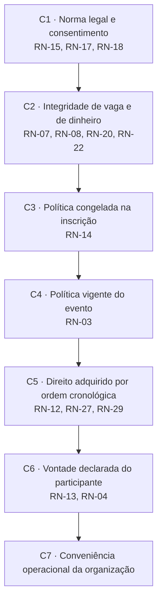

# Regras de Negócio — Eventus SGE

| Campo | Valor |
|---|---|
| Escopo | As 30 regras de negócio do registro canônico (RN-01 a RN-30) |
| Fonte | Documento de elicitação (P1–P5, O1–O5, F1–F3, L1, OB1–OB9) e derivações técnicas ou legais |
| Artefatos vizinhos | `requisitos-funcionais.md` (RF-01 a RF-34), `requisitos-nao-funcionais.md` (RNF-01 a RNF-24), `duvidas-e-lacunas.md` (AMB, INC, LAC) |
| Consumidores diretos | `06-tabelas-de-decisao.md` (TD-01 a TD-07), `05-ciclo-de-vida-da-inscricao.md` (E-01 a E-14), `08-matriz-de-rastreabilidade.md` |
| Fuso e moeda | Instantes em UTC, exibidos em `America/Sao_Paulo`; valores em reais (RNF-23) |

Toda cifra proposta por este trabalho (48 h, 30 min, 24 h, 6 h, 7 dias, 75 %, 10 %, 5 pessoas)
é **default recomendado**, não exigência do cliente, e aparece marcada com
`⚠️ DECISÃO PROPOSTA — requer homologação do stakeholder responsável`.

---

## 1. O que é regra de negócio neste projeto

Regra de negócio é uma **afirmação sobre o negócio da Eventus que continua verdadeira se o software
for trocado**. Requisito funcional é uma **obrigação de comportamento do Eventus SGE**, e morre com
ele. A separação não é estilística: os dois artefatos têm ciclos de vida, donos e formas de
verificação diferentes.

| Dimensão | Regra de negócio (RN) | Requisito funcional (RF) |
|---|---|---|
| Objeto | O negócio: o que é verdade, o que é proibido, como se calcula | O sistema: o que ele deve fazer |
| Dono | Área de negócio (organização, financeiro, jurídico) | Time de produto e engenharia |
| Sobrevive à troca de sistema | Sim — voltaria a valer em planilha, em outro fornecedor ou no balcão | Não — some junto com a implementação |
| Forma típica | "Nenhuma inscrição confirmada sem pagamento liquidado" | "O sistema deve converter a reserva em inscrição confirmada ao reconhecer a liquidação" |
| Verificação | Invariante e caso de teste sobre o estado do negócio | Caso de teste sobre o comportamento da interface ou da API |
| Efeito de violar | Prejuízo, litígio, sanção, retrabalho manual | Defeito funcional |

**Teste de sobrevivência aplicado a cada item deste documento:** se a Eventus abandonasse o Eventus
SGE amanhã e voltasse a operar com formulários e planilhas, a afirmação continuaria valendo? Se sim,
é RN. Se a resposta depende de tela, botão, endpoint ou prazo de processamento, é RF ou RNF.
Exemplo: "vagas disponíveis = capacidade − confirmadas − reservas − convites − bloqueadas" (RN-20)
sobrevive; "devolver a vaga em até 60 segundos após o vencimento" (RF-13, RNF-08) não sobrevive,
porque só faz sentido diante de um processo automatizado.

### 1.1 Classificação adotada

Cinco tipos, escolhidos porque cada um exige uma forma distinta de verificação e produz um artefato
de teste diferente.

| Tipo | Pergunta que responde | Forma canônica | Como se verifica | Qtde |
|---|---|---|---|---|
| **Fato** | O que existe e como as coisas se relacionam? | "X é composto por Y"; "X possui exatamente um Z" | Modelo de domínio: cardinalidade e obrigatoriedade (`04-modelo-de-dominio.md`) | 6 |
| **Restrição** | O que nunca pode acontecer? | "X não pode Y"; "X só é permitido se Z" | Tentativa de violação deve ser recusada, com mensagem e sem efeito colateral | 13 |
| **Cálculo** | Qual é o número? | "V = f(a, b, c)", com unidade e arredondamento | Tabela de valores de entrada e saída, incluindo bordas | 6 |
| **Derivação** | Qual é o valor deduzido de outros dados? | "R é derivado de A e B" | Comparação entre o valor exibido e o recomputado a partir da base | 3 |
| **Inferência** | O que o sistema conclui e dispara sozinho? | "Se ocorre G, então conclui-se C" | Gatilho simulado deve produzir a consequência, e só ela | 2 |

A diferença entre **cálculo** e **derivação** é intencional: cálculo produz um número com unidade e
regra de arredondamento (valor a restituir, percentual de presença); derivação produz um estado ou
rótulo qualitativo a partir de dados existentes (rótulo de disponibilidade, posição na fila, estado
vigente da inscrição). A diferença entre **derivação** e **inferência** é o gatilho: derivação é
consulta — recalcula quando alguém pergunta; inferência é reação — dispara ação sozinha quando um
evento ocorre, inclusive sem ninguém logado no sistema.

### 1.2 O que este documento não contém

- Metas numéricas de desempenho, disponibilidade e segurança: são RNF, não regra de negócio.
- Fluxos e telas: são casos de uso (`03-casos-de-uso.md`) e protótipo (`07-prototipo-lo-fi.md`).
- Combinações condicionais completas: viram tabelas de decisão TD-01 a TD-07, que **citam** estas
  regras em vez de reescrevê-las.

---

## 2. O núcleo do modelo: Perfil de Política do Evento

### 2.1 Por que parametrizar em vez de fixar

A Eventus opera três negócios diferentes sob a mesma marca e no mesmo portfólio: **congresso pago**,
**atividade gratuita aberta** e **evento corporativo fechado**. A elicitação registra as políticas desses
três negócios como se fossem uma só, e o resultado são afirmações que se contradizem quando lidas
em conjunto:

| Trecho da elicitação | O que impõe | Colisão |
|---|---|---|
| P3 — cancelar sem contato com a organização | Cancelamento é autosserviço | O3 diz que **nem todos** os eventos permitem cancelamento |
| O3 — nem todos os eventos permitem cancelamento | Cancelamento é privilégio por evento | Contradiz P3 se lido como regra global |
| F1 — alguns eventos são gratuitos, outros exigem pagamento | Existem dois fluxos de confirmação | Reserva de vaga, reembolso e comprovante mudam de sentido em cada um |
| F2 — em alguns casos há reembolso, em outros não | Reembolso é condicional | Sem dizer de que depende a condição |

Fixar qualquer um desses comportamentos no código significa escolher um dos três negócios e quebrar
os outros dois. Escrever "depende do evento" sem estrutura significa devolver a indefinição para o
time de desenvolvimento em tempo de implementação. A saída é tratar a política como **dado
configurado, não como código**: uma entidade `PoliticaEvento` com oito parâmetros, preenchida por
evento antes da abertura das inscrições (RN-03), copiada para dentro de cada inscrição no instante
da confirmação (RN-14) e editável por interface administrativa (RNF-24).

Esse desenho converte oito indefinições da elicitação (OB1 a OB8) em oito campos com domínio fechado
e valor padrão. A nona (OB9) é tratada nos requisitos não funcionais.

### 2.2 Os oito parâmetros

Cada linha abaixo é um campo de `PoliticaEvento`. A coluna **Default recomendado** é proposta deste
trabalho, não decisão homologada.

| # | Parâmetro | Resolve | Valores possíveis | Default recomendado | Situação |
|---|---|---|---|---|---|
| 1 | `janelaCancelamento` | OB1, LAC-01 | proibido · até N horas antes · até o início | **48 h antes do início da atividade** (0 h em item marcado como não cancelável) | ⚠️ DECISÃO PROPOSTA — Rafael Nunes |
| 2 | `politicaReembolso` | OB2, LAC-02 | não reembolsável · integral até N dias · escalonado por faixa | **Escalonado: 100 % até 7 dias antes; 50 % de 7 dias a 48 h; 0 % depois** | ⚠️ DECISÃO PROPOSTA — Cleide Barros |
| 3 | `modoListaEspera` | OB3, LAC-03 | desabilitada · FIFO automática · FIFO com aprovação | **FIFO automática, convite de aceite válido por 24 h ou até 6 h antes do início, o que ocorrer primeiro** | ⚠️ DECISÃO PROPOSTA — Rafael Nunes |
| 4 | `criterioCertificado` | OB4, LAC-04 | automático no encerramento · presença mínima X % · aprovação manual | **Presença por check-in com limiar de 75 %** em itens com carga horária; **automático** em evento corporativo de participação única; liberação em até 48 h após o encerramento | ⚠️ DECISÃO PROPOSTA — Rafael Nunes |
| 5 | `canaisNotificacao` | OB5, LAC-05 | e-mail (obrigatório) + canais opcionais | **E-mail como canal oficial obrigatório + central in-app**; WhatsApp e SMS fora do MVP (RF-28) | ⚠️ DECISÃO PROPOSTA — Rafael Nunes com Téo Miranda |
| 6 | `reservaDeVaga` | OB6, LAC-06 | reserva temporária com expiração · somente após confirmação | **Reserva temporária de 30 minutos** a partir do início do pagamento | ⚠️ DECISÃO PROPOSTA — Cleide Barros com Rafael Nunes |
| 7 | `politicaConflitoHorario` | OB7, LAC-07 | bloquear · alertar e permitir · permitir livremente | **Alertar e permitir**, com confirmação consciente registrada; **bloquear** quando a atividade exigir presença para certificado | ⚠️ DECISÃO PROPOSTA — Rafael Nunes |
| 8 | `visibilidadePalestrante` | OB8, LAC-08 | mínima · padrão · ampliada (com consentimento) | **Mínima**: nome social ou completo, organização e indicadores agregados; contato apenas com consentimento específico e vigente | ⚠️ DECISÃO PROPOSTA — Téo Miranda com Rafael Nunes e Dra. Helena Prado |

Regras estruturais do próprio perfil:

- **Completude antes da publicação** — parâmetro em branco impede publicar (RN-03, RF-05, HU-13).
- **Herança com sobrescrita** — a atividade herda os oito valores do evento e pode sobrescrever
  qualquer um individualmente; a sobrescrita fica sinalizada na interface (RF-19).
- **Congelamento na confirmação** — a inscrição guarda cópia imutável dos valores vigentes; toda
  avaliação posterior de cancelamento, reembolso e certificado usa essa cópia (RN-14, RF-20).
- **Efeito prospectivo** — alteração após a abertura vale para novas inscrições, nunca para as já
  confirmadas (RN-14, CT-17).

### 2.3 Quais regras cada parâmetro governa

| Parâmetro | Regras dependentes | Tabelas de decisão |
|---|---|---|
| `janelaCancelamento` | RN-09, RN-30 | TD-01 |
| `politicaReembolso` | RN-16, RN-22, RN-30 | TD-02 |
| `modoListaEspera` | RN-07, RN-12, RN-20, RN-21, RN-26, RN-27, RN-29 | TD-05, TD-06 |
| `criterioCertificado` | RN-06, RN-13, RN-19, RN-23, RN-24, RN-25, RN-28 | TD-03, TD-04 |
| `canaisNotificacao` | RN-04 | TD-07 |
| `reservaDeVaga` | RN-05, RN-07, RN-08, RN-11, RN-20, RN-28, RN-29 | TD-06 |
| `politicaConflitoHorario` | RN-13 | TD-04 |
| `visibilidadePalestrante` | RN-15 | TD-07 |
| Todos (perfil inteiro) | RN-03, RN-14 | TD-01, TD-02, TD-03 |

### 2.4 Ficha canônica do cenário de referência

**Esta ficha é normativa para todo o repositório.** Nome, data, capacidade, preço, gratuidade e os
oito parâmetros das instâncias abaixo valem em `requisitos-funcionais.md`,
`requisitos-nao-funcionais.md`, `duvidas-e-lacunas.md` e em todos os artefatos de
`especificacao/`. Nenhum artefato pode atribuir outro valor a estes campos; precisando de um caso
com política diferente, cria-se uma instância nova e nomeada, não se altera uma existente. Células
marcadas com `≠ padrão` indicam desvio deliberado do default, com justificativa.

| Parâmetro | Congresso Eventus de Tecnologia 2026 (pago, público) | Maratona Eventus de Dados 2026 (gratuita, pública, on-line) | Encontro Corporativo Nexa (fechado, faturado) |
|---|---|---|---|
| Realização | 12 a 14/05/2026 · 800 vagas no evento · R$ 480,00 | 05/06/2026, 09:00–17:00 · 300 vagas · 8 h · R$ 0,00 | 08/04/2026, 09:00–12:00 · 120 vagas · faturado à empresa contratante a R$ 480,00 por inscrição |
| `janelaCancelamento` | 48 h, com sobrescrita para **0 h — não cancelável** na Oficina de Observabilidade em Produção | Até o início `≠ padrão` — item gratuito com fila ativa, liberar a vaga vale mais que a estabilidade da lista | 0 h — não cancelável `≠ padrão` (contrato com a Nexa) |
| `politicaReembolso` | Escalonado 100/50/0 | Não reembolsável — valor pago igual a zero, faixa inaplicável | Não reembolsável `≠ padrão` — faturamento à empresa contratante |
| `modoListaEspera` | FIFO automática | FIFO automática | Desabilitada `≠ padrão` — lista nominal fechada definida pela Nexa |
| `criterioCertificado` | Presença 75 % sobre 8 sessões obrigatórias | Presença 75 % sobre 4 sessões obrigatórias | Automático no encerramento `≠ padrão` — participação única de 3 h |
| `canaisNotificacao` | E-mail + in-app | E-mail + in-app | E-mail + in-app |
| `reservaDeVaga` | Reserva de 30 min | Somente após confirmação — imposto por RN-08, item gratuito não cria reserva | Somente após confirmação `≠ padrão` — faturamento manual (RF-17) |
| `politicaConflitoHorario` | Alertar e permitir, com sobrescrita para **bloquear** na Oficina de Modelagem de Dados e no Workshop de Engenharia de Prompt | Alertar e permitir | Permitir livremente `≠ padrão` — participação única, sem certificado por presença |
| `visibilidadePalestrante` | Mínima | Mínima | Mínima |

Programação do Congresso usada nos exemplos. As oito sessões obrigatórias são a base de RN-23:
75 % equivalem a seis delas. As atividades com inscrição e capacidade próprias herdam o perfil do
evento e sobrescrevem o que estiver indicado.

| Atividade | Data e horário | Capacidade | Preço próprio | Obrigatória para o certificado | Exige presença |
|---|---|---|---|---|---|
| Painel de Abertura | 12/05, 09:00–10:30 | 800 | — | Sim | Sim |
| Mesa-redonda de IA Responsável | 12/05, 09:30–10:30 | 200 | — | Não | Não |
| Sessão de Pôsteres | 12/05, 09:30–11:00 | 200 | — | Não | Não |
| Oficina de Modelagem de Dados | 12/05, 14:00–18:00 | 40 | R$ 180,00 | Sim | Sim |
| Trilha de Arquitetura | 12/05, 16:00–18:00 | 120 | — | Não | Não |
| Sessão Técnica Plenária | 13/05, 09:00–11:00 | 800 | — | Sim | Sim |
| Fórum de Dados Abertos | 13/05, 11:15–12:30 | 200 | — | Sim | Sim |
| **Workshop de Engenharia de Prompt** | 13/05, 14:00–18:00 · 4 h | 40 | R$ 180,00 | Sim | Sim |
| Oficina de Observabilidade em Produção | 13/05, 16:00–19:00 | 40 | R$ 180,00 | Não | Sim |
| Painel de Casos de Uso | 14/05, 09:00–11:00 | 800 | — | Sim | Sim |
| Sessão Técnica de Resultados | 14/05, 14:00–15:30 | 800 | — | Sim | Sim |
| Mesa de Encerramento | 14/05, 16:00–18:00 | 800 | — | Sim | Sim |

O **Workshop de Engenharia de Prompt** é a instância usada em todo o repositório para demonstrar
reserva de 30 min, faixa escalonada de reembolso, fila com convite e bloqueio por exigência de
presença. Por isso ele é **pago (R$ 180,00), com 40 vagas**, e não pode ser tratado como item
gratuito em nenhum artefato: RN-08 impede reserva temporária em item de valor zero. O exemplo
gratuito do portfólio é a **Maratona Eventus de Dados 2026**.

---

## 3. Regras de negócio

Ordem: Fatos (RN-01 a RN-06), Restrições (RN-07 a RN-19), Cálculos (RN-20 a RN-25), Derivações
(RN-26 a RN-28), Inferências (RN-29 e RN-30).

### 3.1 Fatos

### RN-01 — Composição do evento e dependência entre os dois níveis de vaga

| Tipo | Origem | Parâmetro de política | Requisitos afetados |
|---|---|---|---|
| Fato | O5, P5, O1 | — (estrutural) | RF-04, RF-07, RF-12 |

**Enunciado.** Um evento é composto por uma ou mais atividades; cada atividade pertence a exatamente
um evento e possui data, hora de início, duração, capacidade e sala ou canal. Ocupar vaga em uma
atividade exige vaga válida — confirmada ou reservada — no evento correspondente.

**Exemplo.** Marina Alves conclui, em uma única operação (RF-08), a inscrição no Congresso Eventus de
Tecnologia 2026 e na Oficina de Modelagem de Dados. O sistema decrementa duas contagens
independentes: 1 vaga em 800 no evento e 1 vaga em 40 na oficina.

**Contraexemplo.** Marina acessa o vínculo direto da Oficina de Modelagem de Dados sem qualquer
inscrição no congresso e submete. O sistema deve recusar a operação **antes** de decrementar a
disponibilidade da oficina, informar que a atividade exige inscrição no evento e oferecer a inclusão
dos dois itens no mesmo fluxo, sem perder a seleção já feita.

---

### RN-02 — Unicidade do vínculo e do estado vigente da inscrição

| Tipo | Origem | Parâmetro de política | Requisitos afetados |
|---|---|---|---|
| Fato | Derivado, P5 | — (estrutural) | RF-08, RF-10 |

**Enunciado.** Uma inscrição vincula exatamente um participante a exatamente um item inscritível
(evento ou atividade) e possui, a cada instante, um único estado vigente entre E-01 e E-14.

**Exemplo.** Em 12/05, Marina possui duas inscrições distintas: a do congresso em E-04 (confirmada) e
a da Oficina de Modelagem de Dados em E-12 (presença registrada). Cada uma tem sua própria linha do
tempo em Minhas Inscrições (RF-10).

**Contraexemplo.** Uma rotina de conciliação (RF-17) tenta gravar E-04 em uma inscrição que a rotina
de expiração já levou a E-03 no mesmo segundo. O sistema deve serializar as duas escritas, aceitar
apenas uma transição a partir do estado lido e encaminhar a perdedora à fila de exceções — nunca
manter os dois estados nem sobrescrever silenciosamente.

---

### RN-03 — Perfil de Política único por evento, herdado pelas atividades

| Tipo | Origem | Parâmetro de política | Requisitos afetados |
|---|---|---|---|
| Fato | OB1, OB2, OB3, OB4, OB5, OB6, OB7, OB8 | todos | RF-19, RF-05 |

**Enunciado.** Todo evento possui exatamente um Perfil de Política vigente, com os oito parâmetros
preenchidos antes da abertura das inscrições; as atividades herdam esse perfil e podem sobrescrever
parâmetros individualmente.

**Exemplo.** Rafael Nunes configura o Congresso Eventus de Tecnologia 2026 com
`politicaConflitoHorario = alertar e permitir` e sobrescreve o parâmetro para `bloquear` apenas na
Oficina de Modelagem de Dados, que exige presença. A interface exibe a sobrescrita sinalizada, com o
valor herdado ao lado (RF-19).

**Contraexemplo.** Rafael tenta publicar o Congresso com o `criterioCertificado` sobrescrito e deixado
em branco no Workshop de Engenharia de Prompt. A verificação de prontidão deve barrar a publicação,
listar nominalmente o parâmetro e a atividade pendente e manter o evento em rascunho — sem publicar parcialmente e sem assumir um valor implícito.

---

### RN-04 — E-mail como canal oficial não desativável

| Tipo | Origem | Parâmetro de política | Requisitos afetados |
|---|---|---|---|
| Fato | OB5 | `canaisNotificacao` | RF-27, RF-03 |

**Enunciado.** O e-mail é o canal oficial de comunicação da Eventus e não pode ser desativado por
preferência do usuário; a central in-app é complemento obrigatório; apenas comunicações de
divulgação admitem recusa.

**Exemplo.** Na central de privacidade (RF-03), Marina revoga o consentimento para divulgação de
novos eventos. Continua recebendo por e-mail o comprovante de solicitação, a confirmação, o convite
da lista de espera e o aviso de mudança de sala, porque são comunicações transacionais decorrentes
da relação de inscrição.

**Contraexemplo.** Uma tela de preferências oferece a chave "desligar todos os e-mails". Se acionada,
o convite da lista de espera venceria sem que o participante soubesse (RN-21) e a Eventus não teria
como comprovar a comunicação. O sistema não deve oferecer essa opção; comunicações transacionais
aparecem na central de privacidade como base legal de execução de contrato, sem chave de recusa.

---

### RN-05 — Comprovante de solicitação e comprovante de confirmação são artefatos distintos

| Tipo | Origem | Parâmetro de política | Requisitos afetados |
|---|---|---|---|
| Fato | P2, F3 | `reservaDeVaga` | RF-26, RF-23 |

**Enunciado.** O comprovante de solicitação atesta o recebimento do pedido; o comprovante de
inscrição confirmada atesta a vaga garantida. São documentos diferentes, emitidos em instantes
diferentes, e apenas o segundo contém o código de check-in.

**Exemplo.** Às 10:00 de 20/04, Marina submete a inscrição no Congresso Eventus de Tecnologia 2026 e
recebe o comprovante de solicitação com protocolo, itens, R$ 480,00 e a frase destacada de que o
documento não garante vaga, com expiração às 10:30. Às 10:12 o prestador confirma a liquidação e ela
recebe o comprovante de inscrição confirmada, com o código de check-in.

**Contraexemplo.** No dia 12/05, Marina apresenta o comprovante de solicitação na porta da Oficina de
Modelagem de Dados. O operador de credenciamento lê o código e o sistema deve recusar o check-in
informando "inscrição não confirmada", com o estado vigente e a orientação de procurar o balcão —
nunca registrar presença a partir do documento de solicitação.

---

### RN-06 — Certificado com código de verificação único e permanente

| Tipo | Origem | Parâmetro de política | Requisitos afetados |
|---|---|---|---|
| Fato | P4 | `criterioCertificado` | RF-25 |

**Enunciado.** Todo certificado emitido possui um código de verificação único, público e permanente,
associado a exatamente um titular, um item e uma carga horária.

**Exemplo.** O certificado de Marina no Workshop de Engenharia de Prompt recebe o código
`EVT-2026-7QK4-9M2A`. O RH da empresa dela consulta a página pública, sem autenticação, e obtém
titular, atividade, 4 h, data e situação "válido".

**Contraexemplo.** Marina perde o PDF e pede segunda via; a rotina de reemissão gera um novo código.
O sistema deve reimprimir o **mesmo** código, porque um segundo código faria o mesmo aproveitamento
parecer dois. Revogação (por fraude ou erro de apuração) altera a situação exibida na página
pública, jamais o código.

---

### 3.2 Restrições

### RN-07 — Teto de ocupação e irredutibilidade da capacidade

| Tipo | Origem | Parâmetro de política | Requisitos afetados |
|---|---|---|---|
| Restrição | O1, O2, OB3, OB6 | `reservaDeVaga`, `modoListaEspera` | RF-12, RF-15 |

**Enunciado.** A soma de inscrições confirmadas, reservas temporárias ativas, convites pendentes e
vagas bloqueadas por cortesia nunca pode exceder a capacidade publicada do item; a capacidade não
pode ser reduzida a um número inferior ao de inscrições confirmadas.

**Exemplo.** Workshop de Engenharia de Prompt, capacidade 40: 30 confirmadas + 2 reservas ativas +
6 convites pendentes + 2 cortesias bloqueadas pela organização = 40. O item aparece como
esgotado e novas tentativas são encaminhadas à lista de espera (RN-26).

**Contraexemplo.** Rafael troca a sala do workshop por uma menor e tenta reduzir a capacidade de 40
para 28 com 30 confirmadas. O sistema deve recusar a redução, informar o piso vigente (30) e oferecer
o único caminho legítimo: cancelamento administrativo com motivo obrigatório e restituição integral
aos afetados (RN-30, RF-11).

---

### RN-08 — Liquidação como condição de confirmação do item oneroso

| Tipo | Origem | Parâmetro de política | Requisitos afetados |
|---|---|---|---|
| Restrição | F1, F3 | `reservaDeVaga` | RF-09, RF-16 |

**Enunciado.** Inscrição em item com valor devido maior que zero só transita para confirmada após a
liquidação do pagamento; inscrição em item gratuito é confirmada no ato da submissão, sem reserva
temporária.

**Exemplo.** Marina submete a inscrição na Maratona Eventus de Dados 2026 (R$ 0,00) às 09:14 e
recebe E-04 e o código de check-in na mesma resposta. Na mesma manhã, submete a inscrição no
Congresso Eventus de Tecnologia 2026 (R$ 480,00) e recebe E-02, com reserva ativa.

**Contraexemplo.** Um participante corporativo alega ter pago e pede confirmação por telefone; o
organizador tenta marcar a inscrição como confirmada na tela de gestão. O sistema deve recusar a
atribuição direta de estado (RN-28) e exigir o caminho de registro manual de liquidação (RF-17), com
anexo de comprovante, autor e justificativa gravados em trilha (RF-34).

---

### RN-09 — Janela de cancelamento autosserviço

| Tipo | Origem | Parâmetro de política | Requisitos afetados |
|---|---|---|---|
| Restrição | OB1, O3, P3 | `janelaCancelamento` | RF-21, RF-07 |

**Enunciado.** O cancelamento autosserviço é permitido enquanto o instante da solicitação for
anterior ao limite definido por `janelaCancelamento` na política congelada da inscrição, cujo valor
padrão é **48 horas antes do início do item**
(⚠️ DECISÃO PROPOSTA — requer homologação de Rafael Nunes). Item marcado como não cancelável tem
janela igual a zero, e essa condição deve constar da página de detalhe antes da inscrição.

**Exemplo.** A Oficina de Modelagem de Dados começa em 12/05 às 14:00. Marina cancela em 10/05 às
09:30, dentro da janela; o sistema executa o cancelamento, apura o valor a restituir (RN-22) e
libera a vaga, acionando a fila (RN-29).

**Contraexemplo.** Marina tenta cancelar em 10/05 às 20:00, com 42 h de antecedência. O sistema deve
recusar a ação, exibir o motivo, a data-limite esgotada (10/05, 14:00) e o canal alternativo de
tratamento excepcional, mantendo a inscrição em E-04 sem qualquer alteração de estado ou de vaga.

---

### RN-10 — Não duplicidade de inscrição e de posição na fila

| Tipo | Origem | Parâmetro de política | Requisitos afetados |
|---|---|---|---|
| Restrição | Derivado, OB3 | — (estrutural) | RF-09, RF-14 |

**Enunciado.** Um participante não pode manter duas inscrições ativas no mesmo item, ocupar mais de
uma posição na mesma fila, nem entrar na fila de item em que já possua inscrição ativa.

**Exemplo.** Marina está na posição 7 da fila da Oficina de Modelagem de Dados e clica novamente em
"entrar na lista de espera" por engano. O sistema trata a segunda submissão como idempotente,
devolve a mesma posição 7 e o mesmo instante de entrada, sem criar registro novo (RF-09).

**Contraexemplo.** Marina, já confirmada na oficina, tenta entrar na fila do mesmo item para "trocar
de horário". O sistema deve recusar, explicar que ela já tem vaga garantida e oferecer o caminho
correto: cancelar a inscrição atual, sujeita à janela e à faixa de restituição, ou escolher outra
atividade.

---

### RN-11 — Expiração e não recuperação da reserva temporária

| Tipo | Origem | Parâmetro de política | Requisitos afetados |
|---|---|---|---|
| Restrição | OB6 | `reservaDeVaga` | RF-13 |

**Enunciado.** A reserva temporária expira 30 minutos após o início do pagamento
(⚠️ DECISÃO PROPOSTA — requer homologação de Cleide Barros com Rafael Nunes), limitada ao instante
de início da atividade; expirada, a vaga retorna ao conjunto disponível e não pode ser recuperada
pelo mesmo protocolo.

**Exemplo.** Marina inicia o pagamento do congresso às 10:00 de 20/04. A reserva vence às 10:30, com
contador regressivo visível durante todo o período (RNF-22). Ela liquida às 10:12 e a reserva vira
confirmação.

**Contraexemplo.** O comprovante do PIX é gerado às 10:29 e a notificação do prestador chega às
10:47. O sistema não deve confirmar a inscrição: a vaga já retornou ao conjunto disponível e pode
estar com outro participante. O caso entra na fila de exceções da conciliação (RF-17) com desfecho
obrigatório — reinscrição com nova reserva, se houver vaga, ou devolução integral do valor.

---

### RN-12 — Exclusividade da vaga durante a vigência do convite

| Tipo | Origem | Parâmetro de política | Requisitos afetados |
|---|---|---|---|
| Restrição | OB3, O2 | `modoListaEspera` | RF-15 |

**Enunciado.** Durante a validade do convite da lista de espera, a vaga fica reservada com
exclusividade ao convidado, não retornando ao conjunto público nem sendo ofertada a outro
enfileirado.

**Exemplo.** Em 12/05 às 09:00, uma desistência libera vaga no Workshop de Engenharia de Prompt.
Marina, primeira da fila, recebe convite válido até 13/05 às 08:00 (RN-21). Nesse intervalo a vaga
não aparece no catálogo público e a posição 2 da fila permanece como posição 2.

**Contraexemplo.** O rótulo público passa a exibir "últimas vagas: 1" enquanto o convite de Marina
está vigente. Isso permitiria a um terceiro tomar a vaga já prometida. O cálculo de disponibilidade
deve subtrair convites pendentes (RN-20) e o rótulo deve continuar indicando "esgotado com lista de
espera".

---

### RN-13 — Sobreposição de horário e tratamento do conflito

| Tipo | Origem | Parâmetro de política | Requisitos afetados |
|---|---|---|---|
| Restrição | OB7, OB4, P5, O5 | `politicaConflitoHorario`, `criterioCertificado` | RF-22 |

**Enunciado.** Duas atividades conflitam quando seus intervalos, com início inclusivo e fim
exclusivo, apresentam qualquer interseção. A inscrição conflitante é **bloqueada** quando ao menos
uma das atividades exigir presença para certificado; nos demais casos, exige **confirmação
consciente registrada** na inscrição.

**Exemplo.** Marina está inscrita na Trilha de Arquitetura (12/05, 16:00–18:00) e seleciona uma mesa
redonda de 12/05, 18:00–19:30. Os intervalos `[16:00, 18:00)` e `[18:00, 19:30)` não se intersectam;
o sistema conclui a inscrição sem alerta.

**Contraexemplo.** Marina, inscrita na Oficina de Modelagem de Dados (12/05, 14:00–18:00, exige
presença), seleciona a Trilha de Arquitetura (16:00–18:00). Há interseção de 2 h e a oficina exige
presença: o sistema deve bloquear, nomear a atividade concorrente, explicar que a sobreposição
inviabilizaria o certificado da oficina e oferecer horários alternativos da mesma trilha.

---

### RN-14 — Irretroatividade das alterações de política

| Tipo | Origem | Parâmetro de política | Requisitos afetados |
|---|---|---|---|
| Restrição | OB1, OB2 | todos | RF-20, RF-21, RF-24 |

**Enunciado.** Alterações nos parâmetros de política não retroagem sobre inscrições já confirmadas;
toda avaliação posterior usa a versão copiada para a inscrição no instante da confirmação.

**Exemplo.** Marina confirma a inscrição no congresso em 02/03, sob reembolso escalonado 100/50/0.
Em 20/04, Rafael altera o parâmetro do evento para "não reembolsável". Marina cancela em 30/04, a 12
dias do início, e recebe 100 %, porque a apuração usa a cópia congelada.

**Contraexemplo.** A rotina de reembolso lê o parâmetro atual do evento e devolve R$ 0,00 a Marina.
Isso viola a regra e a expectativa formada no ato da contratação. A leitura deve partir da política
congelada da inscrição, e a interface de reembolso deve exibir qual versão está aplicando.

---

### RN-15 — Minimização dos dados do participante expostos ao palestrante e nas exportações

| Tipo | Origem | Parâmetro de política | Requisitos afetados |
|---|---|---|---|
| Restrição | OB8, OB9, L1 | `visibilidadePalestrante` | RF-31, RF-32, RF-30, RF-03 |

**Enunciado.** O palestrante não visualiza e-mail, telefone, documento, dados de pagamento nem
necessidades de acessibilidade ou alimentares. O contato só é exibido mediante consentimento
específico e vigente do titular, cuja revogação o remove das visões e das exportações. Toda
exportação com dados pessoais exige papel autorizado e finalidade declarada.

**Exemplo.** Dra. Helena Prado abre a lista da Oficina de Modelagem de Dados: 38 inscritos com nome
social ou completo, organização e situação da inscrição. Dos 38, seis consentiram em receber
material preparatório, e apenas esses seis exibem e-mail. O acesso fica registrado em trilha
(RF-34).

**Contraexemplo.** Helena solicita exportação da lista completa com telefone "para criar um grupo de
mensagens". O sistema deve recusar os campos de contato dos não consentidos, exportar apenas o perfil
mínimo, exigir finalidade declarada e registrar autor, filtros e volume (RF-30).

---

### RN-16 — Segregação de função na aprovação e na execução do reembolso

| Tipo | Origem | Parâmetro de política | Requisitos afetados |
|---|---|---|---|
| Restrição | F2, OB9 | `politicaReembolso` | RF-18 |

**Enunciado.** Acima do teto de aprovação automática, o usuário que aprova um caso de reembolso deve
ser distinto de quem o solicitou ou registrou e distinto de quem executa o estorno.

**Exemplo.** Marina cancela a 8 dias do início e gera caso de R$ 480,00, abaixo do teto configurado:
aprovação automática, sem intervenção humana, com registro do critério aplicado. Já a Nexa cancela 9
inscrições faturadas, gerando caso de R$ 4.320,00: Cleide Barros solicita, a coordenação financeira
aprova e um terceiro operador executa o estorno.

**Contraexemplo.** Cleide abre o caso de R$ 4.320,00 e clica em "aprovar" com o próprio perfil. O
sistema deve recusar a ação, exibir a exigência de aprovador distinto e registrar a tentativa em
trilha, com autor, papel e instante — a recusa é evidência de controle, não apenas bloqueio de tela.

---

### RN-17 — Imutabilidade dos registros de auditoria

| Tipo | Origem | Parâmetro de política | Requisitos afetados |
|---|---|---|---|
| Restrição | OB9 | — (estrutural) | RF-34 |

**Enunciado.** Registros de auditoria são imutáveis dentro do prazo de retenção de 5 anos e não podem
ser alterados nem excluídos por nenhum perfil, inclusive administrativo.

**Exemplo.** O operador registra por engano a presença de Marina na Sessão Técnica Plenária. A
correção (RF-23) não apaga o registro original: grava um segundo evento de estorno de presença, com
motivo, autor e identificador de correlação apontando para o primeiro.

**Contraexemplo.** Um participante exerce o direito de eliminação (RF-03) e a equipe de TI tenta
apagar as linhas de trilha associadas. O sistema deve recusar a exclusão: o atendimento se dá por
pseudonimização dos campos identificáveis ao fim do prazo de retenção da categoria (RNF-19),
preservando o encadeamento criptográfico e a contagem de eventos (RNF-16).

---

### RN-18 — Não retenção de dados de portador de cartão

| Tipo | Origem | Parâmetro de política | Requisitos afetados |
|---|---|---|---|
| Restrição | F3, OB9 | — (estrutural) | RF-16 |

**Enunciado.** Nenhum dado de portador de cartão é armazenado pelo sistema; persistem apenas o
identificador tokenizado do prestador, a bandeira, os quatro últimos dígitos e a situação da
transação.

**Exemplo.** Na conciliação do congresso, Cleide vê "Visa •••• 4417 — liquidado em 20/04 10:12 —
token `tk_9f3ac21`". É o suficiente para conciliar o extrato e para executar o estorno pelo mesmo
meio (RF-18).

**Contraexemplo.** Um participante anexa, na fila de exceções, a foto do cartão com o número
completo. O sistema deve recusar o anexo por detecção de padrão de PAN, ou mascará-lo antes da
persistência, registrando a rejeição — o dado não pode entrar em base, log ou cópia de segurança.

---

### RN-19 — Pré-condições da emissão do certificado

| Tipo | Origem | Parâmetro de política | Requisitos afetados |
|---|---|---|---|
| Restrição | P4, OB4 | `criterioCertificado` | RF-24, RF-25 |

**Enunciado.** O certificado só pode ser emitido após o encerramento do item e após a apuração da
presença exigida pelo critério da política congelada na inscrição.

**Exemplo.** O Workshop de Engenharia de Prompt encerra em 13/05 às 18:00. A apuração roda no
encerramento, confirma o check-in de Marina e libera a emissão autosserviço, dentro do prazo de
48 h (RN-25).

**Contraexemplo.** Marina precisa comprovar as horas em 12/05 e pede ao organizador a antecipação do
certificado. O sistema deve recusar mesmo para o perfil de organizador: antes do encerramento não
existe elegibilidade apurada, e um certificado sem apuração inviabiliza a verificação pública
(RN-06). O caminho legítimo é a declaração de inscrição confirmada (RF-26).

---

### 3.3 Cálculos

### RN-20 — Vagas disponíveis

| Tipo | Origem | Parâmetro de política | Requisitos afetados |
|---|---|---|---|
| Cálculo | O1, O4, OB3, OB6 | `reservaDeVaga`, `modoListaEspera` | RF-06, RF-12, RF-29 |

**Enunciado.** `disponíveis = capacidade publicada − confirmadas − reservas temporárias ativas −
convites pendentes − vagas bloqueadas por cortesia`. O resultado nunca é negativo; zero significa
esgotado.

**Exemplo.** Oficina de Modelagem de Dados, capacidade 40: 33 confirmadas, 2 reservas ativas, 1
convite pendente, 0 cortesias → `40 − 33 − 2 − 1 − 0 = 4` vagas disponíveis, ou seja, 10 % da
capacidade, o que produz o rótulo "últimas vagas" (RN-26).

**Contraexemplo.** O painel de Rafael subtrai apenas as confirmadas e exibe 7 vagas. Sete pessoas
podem iniciar pagamento para 4 vagas reais, e três receberão recusa depois de informar o meio de
pagamento. Os quatro subtraendos são obrigatórios em toda leitura, pública ou interna (RF-29).

---

### RN-21 — Prazo do convite da lista de espera

| Tipo | Origem | Parâmetro de política | Requisitos afetados |
|---|---|---|---|
| Cálculo | OB3, O2 | `modoListaEspera` | RF-15 |

**Enunciado.** `prazo do convite = menor valor entre (instante de emissão + 24 h) e (início da
atividade − 6 h)` (⚠️ DECISÃO PROPOSTA — requer homologação de Rafael Nunes). Convites cujo prazo
resultante seja anterior ao instante de emissão não são gerados.

**Exemplo.** Workshop de Engenharia de Prompt em 13/05 às 14:00. Vaga liberada em 12/05 às 09:00:
`min(13/05 09:00; 13/05 08:00) = 13/05 08:00`. O convite vale 23 h e o instante-limite aparece no
e-mail e na central in-app.

**Contraexemplo.** A vaga é liberada em 13/05 às 10:00, a 4 h do início. `13/05 08:00` já passou:
nenhum convite deve ser gerado. A vaga retorna ao conjunto público imediatamente, os enfileirados são
informados de que a fila não avança mais neste item e o painel registra o motivo do não envio.

---

### RN-22 — Valor reembolsável

| Tipo | Origem | Parâmetro de política | Requisitos afetados |
|---|---|---|---|
| Cálculo | OB2, F2 | `politicaReembolso` | RF-21, RF-18 |

**Enunciado.** `valor reembolsável = valor efetivamente pago × fator da faixa`, com fator 1,00 a 7
dias ou mais do início, 0,50 entre 7 dias e 48 h, e 0,00 abaixo de 48 h
(⚠️ DECISÃO PROPOSTA — requer homologação de Cleide Barros). O resultado nunca supera o líquido pago
e desconta estornos anteriores da mesma inscrição.

**Exemplo.** Congresso pago em R$ 480,00, início em 12/05 às 09:00. Cancelamento em 04/05 (8 dias):
`480,00 × 1,00 = R$ 480,00`. Cancelamento em 09/05 (3 dias): `480,00 × 0,50 = R$ 240,00`. A memória
de cálculo — valor pago, faixa aplicada, fator, prazo de crédito — é exibida antes da confirmação
(RNF-22).

**Contraexemplo.** Marina já obteve R$ 240,00 por cancelamento parcial de uma atividade e solicita
novo reembolso de R$ 480,00 sobre a mesma inscrição. O sistema deve limitar o cálculo ao saldo
remanescente e recusar o excedente, exibindo os estornos anteriores na memória de cálculo.

---

### RN-23 — Percentual de presença

| Tipo | Origem | Parâmetro de política | Requisitos afetados |
|---|---|---|---|
| Cálculo | OB4 | `criterioCertificado` | RF-24 |

**Enunciado.** `presença (%) = sessões obrigatórias com check-in registrado ÷ total de sessões
obrigatórias do item × 100`, arredondado para baixo. O limiar padrão de elegibilidade é **75 %**
(⚠️ DECISÃO PROPOSTA — requer homologação de Rafael Nunes).

**Exemplo.** O certificado do Congresso Eventus de Tecnologia 2026 tem 8 sessões obrigatórias (§2.4).
Marina registra check-in em seis delas — falta no Fórum de Dados Abertos e na Sessão Técnica de
Resultados: `6 ÷ 8 × 100 = 75 %` → elegível, no limite exato.

**Contraexemplo.** Em uma trilha com 7 sessões obrigatórias, o participante registra 5 check-ins:
`5 ÷ 7 × 100 = 71,43 %`, arredondado para 71 % → inelegível. O sistema deve recusar a emissão,
informar o critério não atendido (75 %), as sessões faltantes e o caminho de pedido de revisão de
presença — nunca arredondar para cima nem emitir "com ressalva".

---

### RN-24 — Carga horária declarada no certificado

| Tipo | Origem | Parâmetro de política | Requisitos afetados |
|---|---|---|---|
| Cálculo | P4, P5, O5 | `criterioCertificado` | RF-24 |

**Enunciado.** `carga horária do certificado = soma das durações das atividades com check-in
confirmado`, desconsideradas as atividades sobrepostas sem registro de presença.

**Exemplo.** Marina tem inscrição na Oficina de Modelagem de Dados (4 h, com check-in) e na Trilha de
Arquitetura (2 h, sobreposta, sem check-in). O certificado declara **4 h**.

**Contraexemplo.** A rotina soma as duas inscrições e declara 6 h em uma tarde de 4 h de relógio. O
certificado ficaria aritmeticamente impossível e derrubaria a confiança na verificação pública
(RN-06). A base do cálculo é o registro de presença, nunca a inscrição.

---

### RN-25 — Prazo de liberação do certificado

| Tipo | Origem | Parâmetro de política | Requisitos afetados |
|---|---|---|---|
| Cálculo | OB4, P4 | `criterioCertificado` | RF-24 |

**Enunciado.** `prazo de liberação = instante de encerramento do item + no máximo 48 h`
(⚠️ DECISÃO PROPOSTA — requer homologação de Rafael Nunes).

**Exemplo.** O Workshop de Engenharia de Prompt encerra em 13/05 às 18:00; a emissão autosserviço
está disponível, no mais tardar, em 15/05 às 18:00, sem qualquer solicitação à organização.

**Contraexemplo.** A apuração de presença fica pendente por atraso de sincronização dos check-ins
coletados sem conectividade e o certificado só aparece em 18/05. O sistema deve emitir alerta ao
organizador antes do vencimento do prazo (RF-29) e informar ao participante a situação da apuração,
com nova previsão — silêncio até 18/05 é violação da regra.

---

### 3.4 Derivações

### RN-26 — Rótulo de disponibilidade

| Tipo | Origem | Parâmetro de política | Requisitos afetados |
|---|---|---|---|
| Derivação | O1, O2, O4 | `modoListaEspera` | RF-06, RF-07 |

**Enunciado.** O rótulo exibido no catálogo é derivado da ocupação corrente, e não digitado pelo
organizador:

| Condição | Rótulo |
|---|---|
| Fora da janela de inscrição | Inscrições encerradas |
| `disponíveis > 10 %` da capacidade | Disponível |
| `0 < disponíveis ≤ 10 %` da capacidade | Últimas vagas |
| `disponíveis = 0` e `modoListaEspera ≠ desabilitada` | Esgotado com lista de espera |
| `disponíveis = 0` e `modoListaEspera = desabilitada` | Esgotado |

**Exemplo.** Oficina de Modelagem de Dados, capacidade 40 e 4 disponíveis (RN-20): `4 ÷ 40 = 10 %` →
"últimas vagas". Uma confirmação a mais leva a 3 disponíveis, mantendo o rótulo; a quarta leva a zero
e, como a política do congresso habilita a fila, o rótulo passa a "esgotado com lista de espera".

**Contraexemplo.** O Encontro Corporativo Nexa lota e a página exibe "esgotado com lista de espera",
com botão de entrar na fila. Como `modoListaEspera = desabilitada` nesse evento, o botão levaria a
uma expectativa impossível: o rótulo correto é "esgotado", sem oferta de fila.

---

### RN-27 — Posição na lista de espera

| Tipo | Origem | Parâmetro de política | Requisitos afetados |
|---|---|---|---|
| Derivação | OB3, O2 | `modoListaEspera` | RF-14, RF-15 |

**Enunciado.** A posição é derivada da ordem cronológica de entrada, com precisão de segundo, e
recalculada a cada saída, promoção ou expiração de convite. Empates no mesmo segundo são desempatados
pela ordem de gravação (⚠️ DECISÃO PROPOSTA — requer homologação de Téo Miranda).

**Exemplo.** Fila do Workshop de Engenharia de Prompt: Marina entra às 09:00:12 (posição 1), um
segundo participante às 09:00:40 (posição 2), um terceiro às 09:03:05 (posição 3). Marina desiste da
fila: o segundo passa a 1 e o terceiro a 2, com a posição atualizada na consulta seguinte.

**Contraexemplo.** A posição é gravada como número fixo no momento da entrada. Após a saída de
Marina, dois enfileirados aparecem na posição 2 e a promoção passa a depender de qual registro a
rotina ler primeiro. A posição precisa ser sempre recomputada a partir do instante de entrada.

---

### RN-28 — Estado da inscrição é derivado, não atribuído

| Tipo | Origem | Parâmetro de política | Requisitos afetados |
|---|---|---|---|
| Derivação | F1, F3, OB6, OB4 | `reservaDeVaga`, `criterioCertificado` | RF-10, RF-11 |

**Enunciado.** O estado vigente da inscrição é derivado da gratuidade do item, da situação da
cobrança, da existência de reserva vigente, da política congelada e dos registros de presença, e não
pode ser atribuído manualmente sem justificativa registrada.

**Exemplo.** A inscrição de Marina no congresso está em E-02. Ao reconhecer a notificação autenticada
de liquidação (RF-16), o sistema deriva E-04 — ninguém "marca" a inscrição como confirmada; o estado
é consequência do fato financeiro.

**Contraexemplo.** Um organizador arrasta a inscrição para "confirmada" numa lista de gestão porque
"o participante disse que pagou". O sistema deve recusar a atribuição direta e exigir o fato que a
sustenta: registro manual de liquidação com comprovante (RF-17) ou cortesia com valor zero, ambos com
motivo obrigatório e trilha (RF-34).

---

### 3.5 Inferências

### RN-29 — Promoção da fila em cascata a partir da liberação de vaga

| Tipo | Origem | Parâmetro de política | Requisitos afetados |
|---|---|---|---|
| Inferência | OB3, OB6, O2, O1 | `modoListaEspera`, `reservaDeVaga` | RF-15, RF-13, RF-21 |

**Enunciado.** A liberação de vaga por cancelamento, expiração de reserva, ampliação de capacidade ou
cancelamento administrativo, havendo fila ativa, infere a promoção do primeiro elegível e a emissão
de convite. Recusa ou expiração do convite infere a promoção em cascata até o aceite, o esgotamento
da fila ou o corte de 6 horas antes do início.

**Exemplo.** Marina cancela a inscrição na Oficina de Modelagem de Dados em 10/05 às 09:30. A fila
tem 5 pessoas. O sistema emite convite ao primeiro, que expira sem resposta; emite ao segundo, que
recusa; emite ao terceiro, que aceita e paga. A vaga nunca aparece publicamente durante a cascata
(RN-12).

**Contraexemplo.** A rotina devolve a vaga ao conjunto público entre a expiração do primeiro convite
e a emissão do segundo. Nessa janela, alguém de fora da fila toma a vaga, e cinco pessoas que
esperavam desde a abertura ficam para trás. A transição entre convites deve ser atômica, sem estado
intermediário público.

---

### RN-30 — Restituição integral quando a iniciativa é da organização

| Tipo | Origem | Parâmetro de política | Requisitos afetados |
|---|---|---|---|
| Inferência | F2, O3 | `politicaReembolso`, `janelaCancelamento` | RF-05, RF-18 |

**Enunciado.** Cancelamento ou adiamento por iniciativa da Eventus infere restituição integral do
valor pago, sem dedução de taxas, independentemente da janela de cancelamento e da faixa de reembolso
configuradas no evento.

**Exemplo.** A Eventus adia o Encontro Corporativo Nexa de 08/04 para 20/05 por indisponibilidade do
espaço. Embora o evento seja não cancelável e não reembolsável, todo participante que não puder
comparecer na nova data recebe 100 % do valor pago, e os casos são abertos automaticamente (RF-18).

**Contraexemplo.** A organização cancela a Oficina de Modelagem de Dados a 12 h do início e o sistema
aplica a faixa de 0 % porque faltavam menos de 48 h. Isso transferiria ao participante o custo de uma
decisão da empresa. A faixa (RN-22) só se aplica a cancelamento por iniciativa do participante; a
iniciativa da organização é condição de exceção, verificada em TD-02.

---

## 4. Invariantes do sistema

Afirmações que devem ser verdadeiras **a todo instante**, e não apenas ao fim de uma operação
bem-sucedida. Servem de critério de parada em testes de concorrência e de checagem periódica em
produção.

Notação: `n(...)` é a quantidade de elementos do conjunto; `∀` é "para todo"; `∃` é "existe";
`⇒` é "implica". Conjuntos de estados usados:

- `OCUPANTES = {E-02, E-04, E-06, E-12}` — estados que consomem vaga.
- `ATIVOS = OCUPANTES ∪ {E-05}` — estados que impedem nova inscrição ou nova posição no mesmo item
  (E-05 ocupa posição na fila, não vaga).
- Estados de restituição (E-10, E-11) não ocupam vaga: a vaga já foi liberada no cancelamento que os
  originou.

Esta é uma **lista numerada local**, não uma família de identificadores do projeto: o registro
canônico admite apenas os prefixos RF, RNF, RN, AMB, INC, LAC, HU, CA, UC, TD, E e CT. A referência
externa a qualquer linha abaixo se faz por "invariante n da seção 4 de `regras-de-negocio.md`". A
última coluna aponta a linha equivalente da seção 6 de `04-modelo-de-dominio.md`, onde a mesma
afirmação aparece como regra de integridade verificável por consulta.

| # | Invariante | Notação | Sustentado por | Verificação | Equivalente em `04` §6 |
|---|---|---|---|---|---|
| 1 | Nenhuma sobrevenda em qualquer item | `∀ item i: confirmadas(i) + reservasAtivas(i) + convitesPendentes(i) + bloqueadas(i) ≤ capacidade(i)` | RN-07, RN-20 | CT-06, RNF-06 | 9 |
| 2 | Capacidade nunca abaixo do já confirmado | `∀ item i: capacidade(i) ≥ confirmadas(i)` | RN-07 | CT-06 | 9 |
| 3 | Uma única inscrição ativa por participante por item | `∀ participante p, item i: n({ins : ins.participante = p ∧ ins.item = i ∧ ins.estado ∈ ATIVOS}) ≤ 1` | RN-02, RN-10 | CT-08 | 5 |
| 4 | Vaga de atividade exige vaga de evento | `∀ ins em atividade a com estado ∈ OCUPANTES ⇒ ∃ ins' do mesmo participante no evento de a com estado ∈ OCUPANTES` | RN-01 | CT-01, CT-02 | 3 |
| 5 | Certificado só existe com elegibilidade registrada | `∀ certificado c ⇒ ∃ apuração e: e.inscricao = c.inscricao ∧ e.criterio = politicaCongelada(c.inscricao).criterioCertificado ∧ e.resultado = elegível ∧ encerramento(c.item) ≤ c.emitidoEm` | RN-19, RN-23, RN-06 | CT-20, CT-21 | 14 e 27 |
| 6 | Carga horária certificada é fisicamente possível | `∀ certificado c: c.cargaHoraria = Σ duração(a) para a com check-in confirmado ∧ c.cargaHoraria ≤ duraçãoTotal(c.item)` | RN-24 | CT-21 | — (só aqui) |
| 7 | Reembolso nunca excede o valor pago | `∀ inscrição ins: Σ estornosExecutados(ins) ≤ valorLíquidoPago(ins)` e, por caso, `valorAprovado ≤ valorReembolsável(ins)` | RN-22, RN-30 | CT-13, CT-15 | — (só aqui) |
| 8 | Nenhuma transição de estado sem registro de auditoria | `∀ transição t de inscrição, cobrança, política, papel ou certificado ⇒ ∃! registro r na trilha com autor, papel, motivo, valor anterior, valor posterior e correlação; n(transições) = n(registros)` | RN-17, RN-28 | CT-17, RNF-16, HU-23 | 18 |
| 9 | Trilha somente de inclusão | `∄ operação de atualização ou exclusão sobre a trilha, para qualquer perfil, dentro dos 5 anos de retenção` | RN-17 | RNF-16 | 18 |
| 10 | Vaga sob convite fora do conjunto público | `∀ convite v vigente ⇒ a vaga associada não é contabilizada em disponíveis(i) nem ofertada a outro enfileirado` | RN-12, RN-20 | CT-10 | 25 |
| 11 | Fila é uma sequência contígua sem repetição | `∀ item i com fila: as posições formam 1..n(fila(i)), sem repetição e sem lacuna` | RN-27 | CT-08 | 6 |
| 12 | Toda inscrição fora de E-01 tem política congelada | `∀ inscrição ins com estado ≠ E-01 ⇒ ins.politicaCongelada existe, com versão e instante de congelamento` | RN-03, RN-14 | CT-17 | 4 |
| 13 | Presença pressupõe inscrição confirmada | `∀ check-in k ⇒ ∃ inscrição ins do mesmo participante e atividade, cujo estado alcançou E-04 antes de k.instante` | RN-05, RN-19 | CT-18 | — (só aqui; `04` cobre a janela em 26 e a pertinência em 11) |
| 14 | Contato exposto pressupõe consentimento vigente | `∀ leitura de contato por palestrante no instante t ⇒ consentimento(titular, finalidade, t) = vigente` | RN-15 | CT-23, RNF-17 | 17 |
| 15 | Nenhum dado de cartão persistido | `∄ campo contendo número completo, validade ou código de segurança em base, log ou cópia de segurança` | RN-18 | RNF-14 | 15 |

**Como usar.** As invariantes 1, 3, 10 e 11 devem ser avaliadas ao fim de cada rodada dos testes
de concorrência (CT-06) e por rotina periódica de verificação em produção; qualquer violação é
incidente de integridade, não defeito comum, e exige congelar as operações do item afetado até a
reconciliação.

---

## 5. Precedência entre regras

Quando duas regras produzem desfechos incompatíveis para o mesmo caso, vence a de **camada
superior**. Dentro da mesma camada, vence a que preserva a integridade quantitativa (não vender vaga
inexistente, não devolver mais do que se recebeu); persistindo o empate, vence a que preserva a
expectativa já criada no participante.

### 5.1 Colisões concretas e desfecho

| # | Colisão | Vence | Fundamento | Efeito prático |
|---|---|---|---|---|
| 1 | Política do evento (não cancelável) × pedido de cancelamento do participante | Política (C4 sobre C6) | RN-09, INC-02 | Recusa com motivo, data-limite esgotada e canal alternativo; estado inalterado |
| 2 | Política vigente do evento × política congelada na inscrição | Congelada (C3 sobre C4) | RN-14 | Inscrição confirmada é avaliada pela cópia; novas inscrições usam a versão vigente |
| 3 | Lista de espera × inscrição direta na vaga recém-liberada | Fila (C5) | RN-12, RN-29 | Enquanto houver fila ativa e antecedência maior que 6 h, a vaga não retorna ao público |
| 4 | Convite vigente × ampliação de capacidade pelo organizador | Convite permanece; vagas novas vão à fila | RN-12, RN-29, RF-15 | Promoção em lote a partir da posição 1; nenhum convite vigente é cancelado |
| 5 | Fila ativa × corte de 6 h antes do início | Corte (C2 sobre C5) | RN-21 | Sem convite possível, a vaga vai ao conjunto público e os enfileirados são avisados de que a fila não avança mais |
| 6 | Conflito de horário com exigência de presença × confirmação consciente do participante | Bloqueio (C2 e C4 sobre C6) | RN-13 | O participante não pode "aceitar o risco" quando o certificado de outro item ficaria inviável |
| 7 | Preferência de notificação do usuário × canal oficial | Canal oficial (C4 sobre C6) | RN-04 | Recusa só se aplica a comunicações de divulgação |
| 8 | Cancelamento por iniciativa da organização × janela e faixa configuradas | Restituição integral (C1 e C2) | RN-30 | 100 % do pago, sem dedução, mesmo em item não cancelável e não reembolsável |
| 9 | Aprovação automática até o teto × segregação de função | Segregação acima do teto (C1) | RN-16 | Abaixo do teto não há aprovador humano; acima, três identidades distintas |
| 10 | Direito de eliminação do titular × imutabilidade da trilha | Retenção legal enquanto vigente (C1 interna) | RN-17, RNF-19 | Eliminação por pseudonimização ao fim do prazo, preservando o encadeamento |
| 11 | Consentimento revogado × exportação já autorizada | Revogação, prospectivamente (C1) | RN-15, RNF-17 | Contato sai das visões em até 60 s; a exportação anterior permanece registrada em trilha, com obrigação de descarte pelo destinatário |
| 12 | Vaga disponível na atividade × ausência de vaga no evento | Nível de evento (C2) | RN-01 | A atividade não pode ser ocupada; o sistema oferece a fila do evento |
| 13 | Reserva expirada × liquidação recebida depois | Expiração (C2) | RN-11 | Não confirma; abre exceção na conciliação com desfecho obrigatório (reinscrição ou devolução integral) |
| 14 | Cortesia bloqueada pela organização × fila com pessoas esperando | Cortesia, se anterior ao esgotamento (C7 limitada por C2) | RN-07, RN-20 | Bloqueio de cortesia só é admitido enquanto houver vagas livres; nunca retira vaga de convite vigente |

### 5.2 Um caso de precedência que não é óbvio

Na configuração padrão, `janelaCancelamento = 48 h` e a faixa de 0 % de RN-22 começa **abaixo** de
48 h. Isso torna a faixa de 0 % inalcançável por cancelamento autosserviço: quem chega abaixo de 48 h
não consegue cancelar, e não há o que restituir. A faixa de 0 % só se materializa quando (a) o evento
configura `janelaCancelamento = até o início`, hipótese em que cancelar tarde é permitido e sem
restituição, ou (b) o cancelamento é administrativo com motivo que não gera direito a devolução. As
tabelas TD-01 e TD-02 devem ser lidas nessa ordem: primeiro a autorização do cancelamento, depois a
apuração do valor. Aplicar TD-02 isoladamente produz resultado sem sentido operacional.

---

## 6. Regras derivadas de decisão pendente

Toda linha abaixo é uma regra **em vigor provisório**: o sistema é construível hoje com o valor
proposto, e a homologação pode alterá-lo por configuração (RNF-24), sem reescrever código. Nenhuma
delas fica apenas "pendente".

| Regra provisória | Questão aberta | Decisão proposta (default) | Responsável | Impacto de não decidir |
|---|---|---|---|---|
| RN-09 — janela de 48 h | LAC-01 (OB1) | 48 h antes do início, 0 h em item não cancelável | Rafael Nunes | TD-01 fica indeterminada; o autosserviço de cancelamento não pode ser liberado, e P3 volta a depender de e-mail para a organização |
| RN-22 — faixas 100/50/0 | LAC-02 (OB2, F2) | 100 % até 7 dias, 50 % de 7 dias a 48 h, 0 % depois; devolução pelo mesmo meio | Cleide Barros | Sem faixas, todo cancelamento oneroso vira tratativa manual e a receita do evento fica imprevisível |
| RN-16 — teto de aprovação automática | LAC-02 (valor não fixado no registro canônico) | Teto de R$ 500,00 por caso ⚠️ DECISÃO PROPOSTA | Cleide Barros | Sem teto, ou tudo exige dupla aprovação (gargalo no fechamento) ou nada exige (perda da segregação de função) |
| RN-21, RN-27, RN-29 — fila FIFO com convite | LAC-03 (OB3, O2) | Convite de 24 h, corte de 6 h, promoção em cascata, posição consultável | Rafael Nunes | O2 não se realiza: lotação continua significando porta fechada, sem aproveitamento das desistências |
| RN-19, RN-23, RN-24, RN-25 — certificado por presença | LAC-04 (OB4) | Limiar de 75 %, liberação em até 48 h, pedido de revisão de presença | Rafael Nunes | O certificado perde valor probatório e P4 conflita com a exigência de presença; TD-03 fica sem critério |
| RN-04 — e-mail obrigatório + in-app | LAC-05 (OB5) | E-mail oficial não desativável, espelho in-app, PDF, retentativas; WhatsApp e SMS fora do MVP (RF-28) | Rafael Nunes com Téo Miranda | Convites de fila e comprovantes ficam sem canal com registro de entrega, e a Eventus não comprova comunicação |
| RN-07, RN-11, RN-20 — reserva de 30 min | LAC-06 e INC-04 (OB6) | Hold de 30 min a partir do início do pagamento, com devolução automática | Cleide Barros com Rafael Nunes | O controle de vagas de O1 fica indeterminável: não se sabe quando a vaga sai do conjunto disponível |
| RN-11 — reserva × meios de compensação lenta | INC-05 | Não oferecer boleto no MVP; se oferecido, gerar inscrição pendente **sem consumir vaga**, com aviso explícito | Cleide Barros | Reserva de 30 min com boleto de 3 dias produz expiração sistemática e reembolsos evitáveis |
| RN-13 — alertar e permitir, bloquear com presença | LAC-07 (OB7) | Alerta com confirmação consciente registrada; bloqueio quando houver exigência de presença | Rafael Nunes | P5 e O5 continuam em conflito aberto (INC-03) e a agenda pessoal não pode ser especificada |
| RN-15 — visibilidade mínima ao palestrante | LAC-08 (OB8) | Perfil mínimo, agregados com supressão abaixo de 5 pessoas, contato só com consentimento | Téo Miranda com Rafael Nunes e Dra. Helena Prado | L1 fica sem limite definido e a exposição de contatos sem base legal vira risco de sanção |
| RN-23 — presença em atividade remota | LAC-11 | Tempo mínimo de conexão equivalente a 75 % da duração da sessão | Rafael Nunes com Téo Miranda | O critério de certificado não se aplica a atividades on-line ou híbridas, caso existam |
| RN-02 — titularidade de menores (sem RN canônica; usar a mais próxima) | LAC-12 | Vedar inscrição autônoma abaixo de 16 anos; entre 16 e 18, exigir consentimento registrado do responsável | Téo Miranda | Tratamento de dados de adolescentes sem base legal específica, com risco direto de sanção |
| RN-26 — o que entra no catálogo público | AMB-02 | Publicado com inscrições abertas ou abertura anunciada; evento corporativo fechado fora da busca, por convite ou vínculo | Rafael Nunes | O rótulo de disponibilidade seria calculado para eventos que não deveriam aparecer, como o Encontro Corporativo Nexa |
| RN-01 e RN-13 — leitura de O5 | AMB-04 | Trilhas paralelas em salas distintas, com presença efetiva em apenas uma por faixa de horário ❓ confirmar antes de fechar TD-04 | Rafael Nunes | A frase original é circular; sem a leitura confirmada, TD-04 pode ser construída sobre premissa errada |
| Janela de check-in de 30 min antes e 30 min depois | Sem RN canônica; hoje só em RF-23 | Promover a restrição a regra de negócio na próxima revisão do registro canônico | Rafael Nunes com Téo Miranda | CT-18 verifica a janela citando RN-19, que não a enuncia: a regra existe no sistema e não no negócio |

Convenção de leitura: enquanto a decisão não for homologada, o valor proposto é o valor implementado,
e a interface administrativa (RNF-24) permite alterá-lo com autor e justificativa registrados, sem
efeito retroativo sobre inscrições confirmadas (RN-14).
