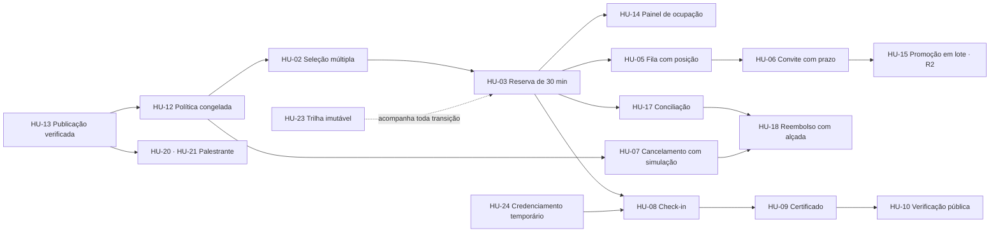

# 01 — Mapa de Histórias de Usuário (User Story Map)

Escopo do Eventus SGE organizado como jornada contínua, do instante em que o organizador publica um
evento até o instante em que um terceiro confere o certificado emitido. Posiciona as **24 histórias
canônicas** (`HU-01` a `HU-24`) sobre 8 etapas e 3 faixas de release.

**Fonte dos identificadores:** `canon.md`. Este artefato não cria, não renomeia e não renumera
nenhum ID — apenas os posiciona no tempo.

## 1. Por que este artefato vem antes da lista de histórias

Uma lista de histórias é um conjunto ordenado por prioridade; ela responde "o que fazer primeiro",
mas não responde "isto ainda é uma experiência inteira?". O mapa responde as duas perguntas ao mesmo
tempo, porque mantém o eixo horizontal da narrativa (a jornada) independente do eixo vertical do
corte (a release). Sem ele, o fatiamento tende a produzir releases verticais coerentes por módulo e
inúteis para o usuário — inscrição sem cancelamento, fila sem convite, certificado sem check-in.
Ele também expõe, por diferença, as capacidades do canon que ainda não têm história dedicada.

**Como ler as tabelas:** `HU-nn` = história canônica posicionada nesta faixa · `RF-nn (sem HU)` =
capacidade prevista no canon sem história dedicada, sinalizada aqui como lacuna de cobertura ·
`—` = nada nesta faixa.

### Parâmetros default usados neste mapa

Valores idênticos aos dos demais artefatos. ⚠️ **DECISÃO PROPOSTA — requer homologação do
stakeholder responsável** para todos os números desta tabela.

| Parâmetro | Valor adotado | Regra canônica |
|---|---|---|
| `reservaDeVaga` | reserva temporária de 30 minutos a partir do início do pagamento | RN-11, RN-20 |
| `janelaCancelamento` | autosserviço permitido até 48 horas antes do início | RN-09 |
| `politicaReembolso` | 100 % até 7 dias · 50 % de 7 dias a 48 h · 0 % depois | RN-22 |
| `modoListaEspera` | FIFO automática, convite válido por 24 h, corte 6 h antes do início | RN-21, RN-27 |
| `criterioCertificado` | presença de 75 % por check-in; liberação em até 48 h do encerramento | RN-23, RN-25 |
| `politicaConflitoHorario` | alertar e permitir; bloquear se houver exigência de presença | RN-13 |

## 2. Espinha dorsal — as 8 etapas da jornada

Ordem temporal do ciclo de vida de um evento. Cada etapa tem um objetivo único e verificável.

| # | Etapa | Objetivo da etapa (uma linha) | Persona dominante |
|---|---|---|---|
| E1 | **Publicar a oferta** | Nenhum item chega ao catálogo com política em branco, capacidade ausente ou lote inválido. | Rafael Nunes |
| E2 | **Descobrir** | O participante encontra, sem autenticação, tudo que está publicado e entende a situação de cada vaga. | Marina Alves |
| E3 | **Decidir** | O participante monta a grade do dia sabendo, antes de submeter, o que perde se desistir e com o que colide. | Marina Alves |
| E4 | **Garantir a vaga** | A vaga deixa de ser disputa e passa a ser posse: reserva, liquidação e confirmação, ou fila com convite nominal. | Marina Alves · Cleide Barros |
| E5 | **Preparar** | Entre a confirmação e o evento, todos os ajustes acontecem em autosserviço, com efeito financeiro explicado. | Marina · Rafael · Helena |
| E6 | **Participar** | A presença vira dado confiável no instante em que acontece, mesmo sem rede e com acesso temporário. | Marina Alves · Téo Miranda |
| E7 | **Encerrar** | O evento fecha por completo: certificado apurado, restituições encerradas, caixa conciliado. | Marina · Cleide |
| E8 | **Prestar contas e reaproveitar** | O que foi feito resiste a conferência externa e alimenta a decisão do próximo evento. | Todos |

**Eventos usados como exemplo neste artefato**, conforme a ficha canônica da seção 2.4 de
`analise/regras-de-negocio.md`: *Congresso Eventus de Tecnologia 2026* (pago, 12 a 14/05/2026, três
dias, trilhas paralelas, 8 sessões obrigatórias), *Workshop de Engenharia de Prompt* (atividade paga
do congresso, 13/05 das 14h00 às 18h00, 40 vagas, R$ 180,00, exige presença para certificado) e
*Encontro Corporativo Nexa* (fechado, faturado à empresa contratante, participação única,
certificado automático).

## 3. Mapa — atividades e distribuição por release

| Etapa | Atividade do usuário | MVP | Release 2 | Release 3 |
|---|---|---|---|---|
| E1 Publicar | Compor evento, atividades, salas, lotes e janela em rascunho | HU-13 *(RF-04)* | — | — |
| E1 Publicar | Definir os oito parâmetros do Perfil de Política com o efeito prático à vista | HU-12 | — | — |
| E1 Publicar | Ter a publicação recusada enquanto houver pendência de prontidão | HU-13 *(RF-05)* | — | — |
| E1 Publicar | Congelar a política vigente na inscrição no instante da confirmação | HU-12 *(RF-20)* | — | — |
| E1 Publicar | Alterar horário, sala ou data de programação já publicada | — | HU-16 | — |
| E2 Descobrir | Ver em um único lugar todos os eventos publicados, com busca e filtros combináveis | HU-01 *(RF-06)* | — | — |
| E2 Descobrir | Distinguir disponível, últimas vagas, esgotado com fila e inscrições encerradas | HU-01 *(RN-26)* | — | — |
| E2 Descobrir | Não encontrar na busca pública o evento corporativo fechado (Encontro Nexa) | HU-01 *(AMB-02)* | — | — |
| E3 Decidir | Ler cancelamento, reembolso, fila e critério de certificado antes de iniciar o fluxo | HU-01 *(RNF-22)* | — | — |
| E3 Decidir | Selecionar o evento e várias atividades do mesmo dia em uma única operação | HU-02 *(TD-06)* | — | — |
| E3 Decidir | Ser avisada da sobreposição com atividade já inscrita e trocar de horário | HU-04 *(TD-04)* | — | — |
| E3 Decidir | Entrar na fila do item esgotado vendo posição, total à frente e regras do convite | HU-05 *(TD-05)* | — | — |
| E4 Garantir a vaga | Criar conta e confirmar titularidade antes de concluir a inscrição | RF-01, RF-02 *(sem HU)* | — | — |
| E4 Garantir a vaga | Submeter a seleção e receber protocolo com prazo de pagamento | HU-02 *(RF-09)* | — | — |
| E4 Garantir a vaga | Pagar com a vaga reservada por 30 minutos e contador regressivo visível | HU-03 *(UC-01)* | — | — |
| E4 Garantir a vaga | Receber o comprovante de solicitação e, depois, o de inscrição confirmada | HU-11 *(INC-01)* | — | — |
| E4 Garantir a vaga | Aceitar o convite da fila com a vaga reservada em nome próprio | HU-06 *(UC-03)* | — | — |
| E4 Garantir a vaga | Registrar liquidação recebida fora do prestador e tratar a fila de exceções | HU-17 *(UC-05)* | — | — |
| E4 Garantir a vaga | Acompanhar ocupação, reservas ativas, convites pendentes e fila durante a abertura | HU-14 | — | — |
| E5 Preparar | Consultar as próprias inscrições, pendências com prazo e retomar fluxo interrompido | RF-10 *(sem HU)* | — | — |
| E5 Preparar | Reenviar comprovante e ver se a mensagem foi entregue ou falhou | HU-11 *(RF-27)* | — | — |
| E5 Preparar | Cancelar em autosserviço vendo antes valor a restituir, faixa aplicada e prazo | HU-07 *(UC-04, TD-01, TD-02)* | — | — |
| E5 Preparar | Aprovar e executar o estorno com teto, segregação e acompanhamento pelo titular | HU-18 | — | — |
| E5 Preparar | Ver a própria programação com data, sala, capacidade e alterações destacadas | HU-20 | — | — |
| E5 Preparar | Dimensionar material pela lista de inscritos em perfil mínimo | HU-21 *(TD-07)* | — | — |
| E5 Preparar | Consultar, inscrever, importar em lote e cancelar inscritos pela organização | — | RF-11 *(sem HU)* | — |
| E5 Preparar | Ampliar capacidade e converter a fila em vagas numa única ação | — | HU-15 | — |
| E5 Preparar | Notificar inscritos e enfileirados da mudança e apontar os conflitos criados | — | HU-16 | — |
| E5 Preparar | Calibrar o conteúdo por indicadores agregados e contato com consentimento | — | — | HU-22 |
| E6 Participar | Registrar presença por código ou QR de uso único na porta da sala | HU-08 *(UC-06)* | — | — |
| E6 Participar | Operar o credenciamento com papel limitado à atividade e ao dia | HU-24 | — | — |
| E6 Participar | Acompanhar comparecimento e no-show durante a realização | HU-14 *(RF-29)* | — | — |
| E7 Encerrar | Emitir sozinha o certificado somando só as atividades com check-in registrado | HU-09 *(TD-03)* | — | — |
| E7 Encerrar | Pedir revisão de presença quando o critério não for atingido | HU-09 *(RF-24)* | — | — |
| E7 Encerrar | Encerrar as restituições pendentes e comunicar cada transição ao titular | HU-18 *(E-11)* | — | — |
| E7 Encerrar | Conciliar o extrato do período e zerar a fila de exceções do evento | HU-17 | — | — |
| E7 Encerrar | Consolidar arrecadação, estornos e receita líquida por evento | — | HU-19 | — |
| E8 Prestar contas | Validar o certificado em página pública, sem acionar o titular | HU-10 *(RF-25)* | — | — |
| E8 Prestar contas | Reconstituir a linha do tempo completa de uma inscrição contestada | HU-23 *(RNF-16)* | — | — |
| E8 Prestar contas | Analisar funil de inscrição, desempenho da fila, presença e no-show | — | HU-19 *(RF-30)* | — |
| E8 Prestar contas | Ampliar os canais de notificação para além de e-mail e in-app | — | — | RF-28 *(sem HU)* |

**Cobertura:** 8 etapas · 41 atividades · 24 histórias posicionadas (20 MVP, 3 R2, 1 R3) ·
5 capacidades canônicas sem história dedicada (RF-01, RF-02, RF-10, RF-11, RF-28).

## 4. Espinha dorsal com os pontos de decisão do participante

```mermaid
flowchart LR
  E1["E1 Publicar · HU-12 HU-13"] --> E2["E2 Descobrir · HU-01"]
  E2 --> E3["E3 Decidir · HU-02"]
  E3 --> D1{"Há sobreposição de horário?"}
  D1 -->|"Sim, com exigência de presença"| BLK["Inscrição bloqueada · HU-04 · TD-04"]
  D1 -->|"Sim, sem exigência"| ALR["Alerta e confirmação consciente registrada · HU-04"]
  D1 -->|"Não"| D2{"Há vaga no item?"}
  BLK --> E3
  ALR --> D2
  D2 -->|"Não"| FILA["E-05 Enfileirada · posição visível · HU-05"]
  D2 -->|"Sim"| E4["E4 Garantir a vaga · HU-02"]
  FILA --> D3{"Convite aceito dentro do prazo?"}
  D3 -->|"Sim"| E4
  D3 -->|"Não"| FIM1["E-07 Convite encerrado · promoção em cascata · TD-05"]
  E4 --> D4{"Item oneroso?"}
  D4 -->|"Não"| CONF["E-04 Confirmada · comprovante com código de check-in · HU-11"]
  D4 -->|"Sim"| HOLD["E-02 Reserva de 30 min · HU-03 · HU-17"]
  HOLD --> D5{"Liquidação dentro do prazo?"}
  D5 -->|"Sim"| CONF
  D5 -->|"Não"| VENC["E-03 Reserva vencida · vaga devolvida"]
  VENC --> FILA
  CONF --> E5["E5 Preparar · HU-11 HU-20 HU-21"]
  E5 --> D6{"Cancelar com 48 h ou mais de antecedência?"}
  D6 -->|"Sim"| CANC["E-08 Cancelada · restituição por faixa · HU-07 HU-18"]
  D6 -->|"Não"| E6["E6 Participar · HU-08 HU-24"]
  CANC --> FILA
  E6 --> E7["E7 Encerrar · HU-17 HU-18"]
  E7 --> D7{"Presença apurada maior ou igual a 75 %?"}
  D7 -->|"Sim"| CERT["E-14 Certificado liberado em até 48 h · HU-09"]
  D7 -->|"Não"| REV["E-13 Ausência apurada · pedido de revisão"]
  CERT --> E8["E8 Prestar contas · HU-10 HU-23"]
  REV --> E8
```

Os três ciclos de realimentação do desenho não são enfeite: `VENC → FILA` e `CANC → FILA`
materializam RN-29 (toda liberação de vaga infere promoção) e `BLK → E3` materializa a oferta de
horário alternativo exigida por INC-03.

## 5. Fatiamento e justificativa

### 5.1 Critério de corte

Uma fatia só é entregável quando um participante consegue atravessar E2→E7 sem intervenção humana
da Eventus. Módulo pronto pela metade não é fatia: é estoque parado.

### 5.2 Fatia 0 — a menor versão que já resolve a dor da planilha

A elicitação nomeia quatro dores em uma frase: a planilha "dificulta o controle de vagas,
pagamentos, cancelamentos e emissão de certificados". A fatia mínima é a que apaga essas quatro
dores para **um** evento pago, com **uma** atividade que exige presença — nada além disso.

| Dor da planilha | Histórias que a apagam | Evidência de pronto |
|---|---|---|
| Controle de vagas | HU-02, HU-03 | CT-02, CT-04, CT-06 (zero sobrevenda em 200 concorrentes) |
| Pagamentos | HU-17 | CT-03, CT-05, CT-07 (liquidação, órfão, idempotência) |
| Cancelamentos | HU-07 | CT-13, CT-14 (100/50/0 % e recusa fundamentada) |
| Certificados | HU-08, HU-09 | CT-18, CT-20, CT-21 (janela, limiar de 75 %, carga horária) |
| Pré-condição das quatro | HU-12, HU-13 | CT-17 (política congelada não retroage) |
| Prova para o participante | HU-11 | CT-25 (solicitação × confirmação, situação de entrega) |

**Nove histórias.** Abaixo disso não há produto: sem HU-12/HU-13 as regras não existem; sem HU-11 o
participante volta a perguntar por e-mail se está inscrito — que é a planilha por outro nome.

### 5.3 Fatia 1 — completa o MVP (20 histórias)

Onze histórias que transformam a fatia 0, viável para um evento, em operação de portfólio.

| Histórias | O que acrescentam e por que ainda é MVP |
|---|---|
| HU-01 | Transparência no ponto de decisão (RNF-22); sem ela o cancelamento correto é percebido como injustiça e o custo migra para o atendimento. |
| HU-04 | Reconcilia P5 com O5; sem ela o participante compra sobreposição e cobra certificado impossível. |
| HU-05, HU-06 | O2 pede a fila explicitamente; "esgotado" sem fila devolve à organização a lista paralela que o projeto veio eliminar. |
| HU-10 | Certificado sem verificação pública é um PDF; o código permanente (RN-06) é o que lhe dá valor perante o RH. |
| HU-14 | O4 é interesse declarado do organizador e o painel é o instrumento de reação antes de lotar ou esvaziar. |
| HU-18 | F2 é regra de dinheiro com segregação de função (RN-16); postergar cria passivo de conformidade, não dívida técnica. |
| HU-20, HU-21 | L1 é o único pedido do palestrante; entregá-lo é barato e independe da cadeia de pagamento. |
| HU-23, HU-24 | Sem trilha desde a primeira transição e sem acesso temporário no credenciamento, a primeira operação com dados reais já nasce inauditável. |

### 5.4 O que foi adiado e o custo de adiar

| Adiado | Faixa | Quem paga a conta | Custo enquanto não existir | Contorno aceito |
|---|---|---|---|---|
| HU-15 Promoção em lote | R2 | Rafael | Troca de sala de 24 para 40 lugares vira 16 convites manuais; risco de furar a ordem FIFO (RN-27) e de ultrapassar quem esperou. | Convite individual pela administração da fila, com justificativa registrada. |
| HU-16 Mudança com impacto explícito | R2 | Rafael e Marina | Adiamento de uma palestra em 1 h não aponta os conflitos de agenda criados; o problema aparece na porta da sala. | Comunicado manual aos inscritos e conferência da grade em planilha — reintrodução parcial da dor. |
| HU-19 Fechamento e relatórios | R2 | Cleide | Fechamento por evento recomposto lançamento a lançamento; sem funil não se sabe onde a inscrição morre. | Exportação bruta conciliável, já prevista em RF-30 para o passo seguinte. |
| RF-11 Gestão em lote pelo organizador | R2 | Rafael | Inscrição de convidados do Encontro Corporativo Nexa feita um a um. | Inscrição individual em nome de terceiro. |
| HU-22 Perfil agregado e contato | R3 | Helena | Calibragem da oficina sem dados do público; contato só por intermediação da organização. | Perfil mínimo (HU-21) já resolve dimensionamento de material. |
| RF-28 WhatsApp e SMS | R3 | Marina | Dependência exclusiva de e-mail; convite de fila não entregue custa a vaga. | RNF-11 (três retentativas, SPF/DKIM/DMARC) e espelho in-app; canal abstraído desde o MVP. |

## 6. Jornadas por persona

Cada linha é um passo real de um dia de trabalho, com a etapa do mapa e a história que o sustenta.

### 6.1 Marina Alves — participante

| # | Momento | Ação | Etapa | História |
|---|---|---|---|---|
| 1 | 20/04, 09h05 | Filtra o catálogo por período e modalidade e abre o Congresso Eventus de Tecnologia 2026 | E2 | HU-01 |
| 2 | 09h08 | Lê que o cancelamento vai até 48 h antes, que o reembolso é escalonado e que o certificado exige 75 % de presença | E3 | HU-01 |
| 3 | 09h15 | Seleciona o congresso e três atividades, entre elas o Workshop de Engenharia de Prompt | E3 | HU-02 |
| 4 | 09h16 | Recebe alerta de sobreposição entre duas oficinas da tarde e troca uma pela sessão equivalente do dia seguinte | E3 | HU-04 |
| 5 | 09h18 | Paga em uma única transação com contador regressivo de 30 minutos visível | E4 | HU-03 |
| 6 | 09h21 | Recebe o comprovante de solicitação e, após a liquidação, o de inscrição confirmada com o código de check-in | E4 | HU-11 |
| 7 | 09h24 | Encontra a oficina de Observabilidade esgotada e entra na fila na posição 4 | E3 | HU-05 |
| 8 | 22/04, 14h02 | Aceita o convite recebido com a vaga reservada em seu nome e prazo explícito | E4 | HU-06 |
| 9 | 05/05 | Cancela uma atividade a 8 dias do início e vê 100 % de restituição antes de confirmar | E5 | HU-07 |
| 10 | 13/05, 08h51 | Registra presença por QR na porta da sala | E6 | HU-08 |
| 11 | 15/05, 10h00 | Emite o certificado com a carga horária das atividades efetivamente frequentadas | E7 | HU-09 |
| 12 | 20/05 | Envia ao RH apenas o código de verificação | E8 | HU-10 |

Cobre 11 das 11 histórias da persona participante.

### 6.2 Rafael Nunes — organizador

| # | Momento | Ação | Etapa | História |
|---|---|---|---|---|
| 1 | D-45 | Compõe o Congresso Eventus de Tecnologia 2026 em rascunho, com trilhas paralelas e salas sem sobreposição | E1 | HU-13 |
| 2 | D-44 | Preenche os oito parâmetros de política e sobrescreve `politicaConflitoHorario` para bloquear no Workshop de Engenharia de Prompt | E1 | HU-12 |
| 3 | D-43 | Tem a publicação recusada porque uma atividade paga está sem lote válido; corrige e publica | E1 | HU-13 |
| 4 | D-30, abertura | Acompanha capacidade, confirmadas, reservas ativas, convites pendentes e fila com o instante da última atualização | E4 | HU-14 |
| 5 | D-12 | Troca o workshop para sala de 60 lugares e converte 20 posições da fila em vagas numa única ação | E5 | HU-15 *(R2)* |
| 6 | D-5 | Adia uma palestra em uma hora e recebe a relação dos conflitos de agenda criados | E5 | HU-16 *(R2)* |
| 7 | D0 | Acompanha comparecimento por sessão e reage ao no-show da trilha da manhã | E6 | HU-14 |

Cobre as 5 histórias da persona organizador; 2 delas só a partir de R2.

### 6.3 Cleide Barros — analista financeira

| # | Momento | Ação | Etapa | História |
|---|---|---|---|---|
| 1 | 08h30 | Importa o extrato do prestador e concilia automaticamente o dia anterior | E4 | HU-17 |
| 2 | 09h10 | Trata três exceções: um pagamento órfão, uma divergência de valor e uma liquidação recebida após a expiração da reserva | E4 | HU-17 |
| 3 | 10h00 | Vê os reembolsos até o teto aprovados automaticamente e encaminha um caso acima do teto para segundo aprovador | E5 | HU-18 |
| 4 | 11h20 | Registra a liquidação por faturamento manual do Encontro Corporativo Nexa, com comprovante anexado | E4 | HU-17 |
| 5 | 16h00 | Confirma que os estornos executados encerraram as restituições em apuração | E7 | HU-18 |
| 6 | Fechamento do mês | Consolida arrecadação, estornos e receita líquida por evento | E7 | HU-19 *(R2)* |

Cobre as 3 histórias da persona; o fechamento consolidado só a partir de R2.

### 6.4 Dra. Helena Prado — palestrante

| # | Momento | Ação | Etapa | História |
|---|---|---|---|---|
| 1 | D-7 | Abre a própria programação e vê data, horário, sala e capacidade das oficinas que conduz | E5 | HU-20 |
| 2 | D-7 | Nota em destaque a mudança de sala do Workshop de Engenharia de Prompt | E5 | HU-20 |
| 3 | D-3 | Consulta os 32 inscritos com nome, organização e situação da inscrição, sem dados de contato | E5 | HU-21 |
| 4 | D-1 | Dimensiona o material impresso pelo número de inscrições confirmadas | E5 | HU-21 |
| 5 | D-1 | Consulta a distribuição do público por área e envia mensagem a quem consentiu | E5 | HU-22 *(R3)* |

Cobre as 3 histórias da persona; no MVP o passo 5 não existe e a intermediação fica com a
organização.

### 6.5 Téo Miranda — equipe de TI

Atravessa o mapa em vez de percorrê-lo: HU-24 provisiona o operador de credenciamento antes de E6 e
o revoga automaticamente ao fim do evento; HU-23 é acionada em E8, sempre a partir de registros
gravados nas etapas anteriores.

## 7. Riscos de sequenciamento

Dependências que, se ignoradas, produzem uma release tecnicamente entregue e operacionalmente
inútil.

| # | Sequência inválida | Por que a release fica inútil | Prova no canon | Ordem mínima correta |
|---|---|---|---|---|
| S1 | Fila (HU-05, HU-06) antes do controle transacional de vagas (HU-03) | Sem contagem serializada, "esgotado" não é determinável e nenhuma liberação de vaga gera gatilho: a fila vira formulário de interesse que nunca convida ninguém. | RN-20, RN-29 | HU-03 → HU-05 → HU-06 |
| S2 | Certificado (HU-09, HU-10) antes do check-in (HU-08) | O percentual de presença fica sem numerador; a única emissão possível é automática, o que contraria a decisão de LAC-04 e esvazia TD-03. Pior: o código de verificação é permanente, então certificado sem lastro não se recolhe. | RN-23, RN-06 | HU-08 → HU-09 → HU-10 |
| S3 | Cancelamento e reembolso (HU-07, HU-18) antes da política congelada (HU-12) | Sem cópia imutável dos parâmetros na inscrição não há faixa aplicável, e a restituição passa a ser decidida caso a caso — exatamente o comportamento da planilha. | RN-14, RN-22 | HU-12 → HU-07 → HU-18 |
| S4 | Reembolso (HU-18) antes da conciliação (HU-17) | O cálculo exige o valor líquido efetivamente pago e o desconto de estornos anteriores; sem conciliação esse valor é estimativa. | RN-22 | HU-17 → HU-18 |
| S5 | Qualquer história de inscrição antes da publicação verificada (HU-13) | Inscrições abrem sobre item com política em branco; toda avaliação posterior de cancelamento, fila e certificado fica indefinida. | RN-03 | HU-13 antes de E2 a E7 |
| S6 | Painel (HU-14) antes do controle de vagas (HU-03) | O painel exibiria números derivados de contagem não serializada, com aparência de confiabilidade — regressão em relação à planilha, que ao menos não finge precisão. | RNF-03, RNF-06 | HU-03 → HU-14 |
| S7 | Trilha de auditoria (HU-23) depois das transições de estado | Registro imutável não se produz retroativamente; o histórico do período anterior fica permanentemente irreconstituível. | RN-17, RNF-16 | HU-23 junto da primeira transição |
| S8 | Ampliação de capacidade (HU-15) antes do convite nominal (HU-06) | Vagas novas retornariam ao conjunto público e seriam tomadas por quem chegou depois, ultrapassando a fila. | RN-12, RN-27 | HU-06 → HU-15 |
| S9 | Exibição de contato ao palestrante (HU-22) antes da central de privacidade (RF-03) | Consentimento sem revogação de efeito imediato torna a exposição irreversível na prática. | RNF-17, RN-15 | RF-03 → HU-22 |
| S10 | Credenciamento (HU-24) depois do primeiro check-in (HU-08) | Sem papel temporário, a operação de porta ocorre com credencial compartilhada de organizador, com acesso a dados que a função não requer. | RN-15, RF-33 | HU-24 → HU-08 |

**Não-dependência verificada:** HU-20 e HU-21 dependem apenas de HU-13 e são independentes de toda
a cadeia de pagamento, fila e presença — podem ser construídas em paralelo à fatia 0 sem risco de
retrabalho, e é por isso que estão no MVP apesar de não atacarem nenhuma das quatro dores da
planilha.

## 8. Pendências que este mapa expõe

Consequências de posicionamento identificadas ao montar o mapa; nenhuma cria ID novo.

| ❓ Ponto | Efeito no fatiamento | Encaminhamento proposto | Responsável |
|---|---|---|---|
| RF-01, RF-02 e RF-10 são "Deve ter" sem história dedicada no canon | Conta, autenticação e a área Minhas Inscrições entram no MVP como capacidade implícita de HU-02, HU-03 e HU-11, sem critério de aceitação próprio | ⚠️ **DECISÃO PROPOSTA** — tratar como requisito verificado diretamente pelos RFs e por RNF-15, sem abrir história nova | Téo Miranda |
| RF-05 é "Deve ter", mas a parte de alteração pós-publicação só aparece em HU-16 (R2) | O MVP publica e barra publicação, porém não trata mudança de programação publicada | ⚠️ **DECISÃO PROPOSTA** — assumir entrega parcial de RF-05 no MVP, com comunicado manual como contorno declarado | Rafael Nunes |
| RF-15 é "Deve ter", mas a promoção em lote só aparece em HU-15 (R2) | Convite individual e cascata entram no MVP; ampliação de capacidade em lote não | ⚠️ **DECISÃO PROPOSTA** — assumir entrega parcial de RF-15 no MVP, mantendo a promoção fora de ordem com justificativa | Rafael Nunes |
| RF-03 é "Deve ter" e só é citado por HU-22 (R3) | Central de privacidade ficaria fora do MVP, embora RNF-18 exija resposta ao titular em 15 dias desde a primeira operação com dados reais | ⚠️ **DECISÃO PROPOSTA** — antecipar RF-03 ao MVP como capacidade sem história, junto de RF-01 e RF-02 | Téo Miranda |
| RF-11 é "Deveria ter" sem história dedicada | Gestão em lote pelo organizador fica sem critério de aceitação em R2 | ⚠️ **DECISÃO PROPOSTA** — verificar por caso de uso e regra, sem história própria | Rafael Nunes |
