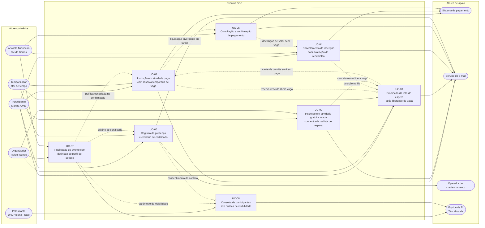

# 03 — Casos de Uso Expandidos

Detalha os **8 casos de uso** do registro canônico. Os IDs, nomes e atores vêm de `canon.md` e não
são renomeados aqui: este documento desenvolve o interior de cada caso — passos, ramos, falhas,
garantias e rastreio.

## 1. Por que apenas oito fluxos viraram caso de uso

Caso de uso expandido é artefato caro de escrever e caro de manter. Aplicá-lo a todo requisito
produz documentação redundante: o mesmo comportamento passa a existir em dois lugares que divergem
na primeira mudança. A regra adotada é objetiva e verificável.

### 1.1 Gatilhos de promoção

| Código | Gatilho | Pergunta objetiva respondida com sim ou não |
|---|---|---|
| C1 | Ramificação real | O fluxo tem dois ou mais desfechos legítimos, não apenas "sucesso" e "erro de validação"? |
| C2 | Concorrência | Duas execuções simultâneas disputam o mesmo recurso finito? |
| C3 | Dinheiro | Há valor a cobrar, restituir, conciliar ou estornar? |
| C4 | Prazo | Existe relógio correndo que altera o desfecho sem nenhuma ação humana? |
| C5 | Mudança de estado | O fluxo transita um objeto persistente entre estados com efeito sobre terceiros? |
| C6 | Mais de um ator | Participam papéis distintos ou atores não humanos (temporizador, prestador, serviço de e-mail)? |
| C7 | Exposição regulada | A resposta do sistema varia por consentimento, papel ou limite legal, com consequência jurídica se errar? |

**Regra de corte:** o fluxo vira caso de uso quando marca **três ou mais gatilhos**. Abaixo disso, a
história de usuário com critérios de aceitação em Gherkin descreve o comportamento com menos texto e
sem duplicar regra.

### 1.2 Fluxos promovidos

| UC | C1 | C2 | C3 | C4 | C5 | C6 | C7 | Total |
|---|---|---|---|---|---|---|---|---|
| UC-01 Inscrição em atividade paga com reserva temporária de vaga | sim | sim | sim | sim | sim | sim | não | 6 |
| UC-02 Inscrição em atividade gratuita lotada com entrada na lista de espera | sim | sim | não | não | sim | sim | não | 4 |
| UC-03 Promoção da lista de espera após liberação de vaga | sim | sim | não | sim | sim | sim | não | 5 |
| UC-04 Cancelamento de inscrição com avaliação de reembolso | sim | não | sim | sim | sim | sim | sim | 6 |
| UC-05 Conciliação e confirmação de pagamento | sim | sim | sim | não | sim | sim | não | 5 |
| UC-06 Registro de presença e emissão de certificado | sim | não | não | sim | sim | sim | sim | 5 |
| UC-07 Publicação de evento com definição do perfil de política | sim | sim | não | não | sim | sim | sim | 5 |
| UC-08 Consulta de participantes pelo palestrante sob política de visibilidade | sim | não | não | não | não | sim | sim | 3 |

UC-08 é o caso de fronteira: marca exatamente o mínimo. Foi promovido porque toda a sua
complexidade está na resposta variável por consentimento e no risco de vazamento — exatamente o que
uma história linear esconde.

### 1.3 Fluxos deliberadamente não promovidos

| Fluxo (requisito) | Gatilhos | Onde está especificado |
|---|---|---|
| Busca, filtro e rótulo de disponibilidade no catálogo (RF-06) | C1 | HU-01 |
| Página do evento com política em destaque (RF-07) | C1 | HU-01 |
| Minhas Inscrições com linha do tempo e retomada (RF-10) | C1, C5 | Passos de UC-01 e UC-04 |
| Gestão e importação em lote de inscritos (RF-11) | C1, C6 | Ramos de UC-05 e UC-07 |
| Reenvio autosserviço do comprovante com situação de entrega (RF-27, RF-26) | C1, C6 | HU-11 |
| Painel de ocupação com defasagem declarada (RF-29) | C1, C6 | HU-14 |
| Programação própria do palestrante (RF-31) | C1 | HU-20 |
| Fechamento financeiro por evento (RF-30) | C3, C6 | HU-19 |
| Concessão temporária do papel de credenciamento (RF-33) | C4, C6 | HU-24, com efeito em UC-06 |
| Trilha de auditoria e reconstituição de histórico (RF-34) | C6 | HU-23, transversal a todos os UCs |
| Conta, verificação de titularidade e autenticação (RF-01, RF-02) | C4 | Pré-condição de todos os UCs |
| Central de privacidade do titular (RF-03) | C1, C7 | HU-22 e ramos de UC-08 |

Nota para a matriz de rastreabilidade: RF-01, RF-02, RF-10 e RF-11 não possuem história dedicada no
registro canônico e aparecem apenas como pré-condição ou passo interno destes casos de uso. A
cobertura precisa ser fechada em `08-matriz-de-rastreabilidade.md` por caso de teste, não por
história.

## 2. Diagrama de casos de uso

Leitura do diagrama: as setas cheias ligam ator e caso de uso; as setas pontilhadas mostram o
encadeamento entre casos — é nelas que está o comportamento sistêmico que nenhuma história isolada
descreve. UC-07 é a montante de quase tudo, porque congela as regras que os demais aplicam.

## 3. Convenções destes casos de uso

| Convenção | Valor |
|---|---|
| Numeração de ramos | Alternativas do passo N em sequência alfabética a partir de `a` (`Na.`, `Nb.`, `Nc.`…); exceções do passo N em sequência alfabética a partir de `e` (`Ne.`, `Nf.`, `Ng.`…). O sufixo numérico é reservado, sem exceção, a sub-passos: `Na1`, `Ne1`, `Nf1`. Assim, `4e2` é sempre o segundo sub-passo da exceção `4e`, nunca uma segunda exceção do passo 4 |
| Instantes | armazenados em UTC, exibidos em `America/Sao_Paulo` com fuso explícito (RNF-23) |
| Valores monetários | reais, sempre o valor líquido efetivamente pago (RN-22) |
| Política aplicada | cópia congelada na inscrição, nunca a versão vigente do evento (RF-20, RN-14) |
| Eventos de exemplo | Congresso Eventus de Tecnologia 2026 · Workshop de Engenharia de Prompt · Encontro Corporativo Nexa |

Todos os prazos citados (30 min, 60 s, 24 h, 6 h, 48 h, 7 dias, 75 %) são
`⚠️ DECISÃO PROPOSTA — requer homologação do stakeholder responsável`, conforme o registro de
questões abertas.

---

## UC-01 — Inscrição em atividade paga com reserva temporária de vaga

| Campo | Valor |
|---|---|
| Ator principal | Participante (Marina Alves) |
| Atores secundários | Sistema de pagamento (prestador único), Temporizador de reservas, Serviço de e-mail |
| Partes interessadas e interesses | Participante: não perder a vaga durante a transação e saber exatamente quanto tempo tem. Organizador: nenhuma sobrevenda e nenhuma vaga travada além do necessário. Analista financeira: toda vaga ocupada com lastro financeiro conciliável. Eventus: ausência de contestação sobre vaga vendida duas vezes. |
| Pré-condições | Evento publicado por UC-07 com perfil de política completo (RN-03); conta com titularidade confirmada (RF-01) e sessão válida (RF-02); janela de inscrição aberta; item com valor devido maior que zero; disponibilidade maior que zero pela RN-20 no evento e na atividade. |
| Garantia mínima | Nenhuma vaga é consumida sem reserva registrada e auditável; em qualquer falha a inscrição permanece em E-02 ou termina em E-03 com a vaga devolvida em até 60 s; nenhum dado de portador de cartão é retido (RN-18); o protocolo e a trilha sobrevivem à falha. |
| Garantia de sucesso (pós-condição) | Inscrição em E-04 com cópia imutável da política gravada, disponibilidade decrementada em definitivo, comprovante de inscrição confirmada com código de check-in emitido e transição registrada na trilha. |
| Gatilho | Participante aciona a conclusão da inscrição com ao menos um item oneroso selecionado. |
| Frequência esperada | Pico de 500 tentativas por minuto sustentadas por 15 minutos na abertura (RNF-04); volume anual dentro das 200.000 inscrições de RNF-05. |
| Requisitos | RF-08, RF-09, RF-12, RF-13, RF-16, RF-20, RF-22, RF-26, RF-27, RF-34 |
| Regras | RN-01, RN-02, RN-07, RN-08, RN-10, RN-11, RN-13, RN-18, RN-20, RN-28 |
| Estados envolvidos | E-01 → E-02 → E-04; ramos para E-03 e E-05 |
| Decisões aplicáveis | TD-06 (desfecho da submissão), TD-04 (sobreposição de horário) |

**Fluxo principal**

1. Participante seleciona o Congresso Eventus de Tecnologia 2026 e a atividade Workshop de Engenharia de Prompt.
2. Sistema verifica disponibilidade nos dois níveis, ausência de inscrição ativa ou de posição na fila do mesmo item e sobreposição com a agenda pessoal, e apresenta o resumo com valor total, política vigente e prazo de pagamento.
3. Participante submete a solicitação com a chave de idempotência da sessão.
4. Sistema decrementa a disponibilidade de forma atômica e serializada por item, cria a reserva temporária com expiração em 30 minutos e coloca a inscrição em E-02.
5. Sistema emite o comprovante de solicitação com protocolo, itens, valor e instante-limite, declarando de forma destacada que ele não garante vaga, e notifica por e-mail com espelho in-app.
6. Sistema encaminha o participante ao Sistema de pagamento exibindo o contador regressivo e o instante exato de expiração com fuso declarado.
7. Participante conclui o pagamento junto ao prestador.
8. Sistema de pagamento envia notificação autenticada de liquidação.
9. Sistema valida assinatura e chave de idempotência, converte a reserva em confirmação, grava a cópia imutável dos oito parâmetros de política e transita a inscrição para E-04.
10. Sistema emite o comprovante de inscrição confirmada com o código de check-in e registra a transição na trilha imutável.
11. Participante visualiza a inscrição confirmada e a agenda atualizada.

**Fluxos alternativos**

- 1a. Seleção mista com itens gratuitos e onerosos: 1a1. Sistema confirma os gratuitos no ato da submissão, sem criar reserva. 1a2. Sistema mantém sob reserva apenas os onerosos. 1a3. Sistema emite comprovante de confirmação para os primeiros e comprovante de solicitação para os segundos, no mesmo envio.
- 2a. Sobreposição de horário sem exigência de presença para certificado: 2a1. Sistema alerta nomeando a atividade concorrente e o intervalo em choque. 2a2. Participante confirma conscientemente. 2a3. Sistema registra a confirmação consciente na inscrição, com autor e instante.
- 2b. Sobreposição em que qualquer das atividades exige presença: 2b1. Sistema bloqueia o item conflitante. 2b2. Sistema oferece horários alternativos da mesma atividade. 2b3. Participante prossegue com os demais itens, sem perder a seleção.
- 2c. Um item da seleção múltipla ficou indisponível entre a montagem e a submissão: 2c1. Sistema remove apenas o item indisponível, preservando os demais. 2c2. Sistema oferece a entrada na fila daquele item (UC-02). 2c3. Participante conclui o restante em um único pagamento.
- 3a. Submissão repetida por duplo clique ou retorno do navegador: 3a1. Sistema reconhece a mesma chave de idempotência. 3a2. Sistema devolve o protocolo já existente, sem criar segunda reserva nem segunda cobrança.
- 6a. Meio de pagamento com compensação em dias: 6a1. Sistema não oferece o meio quando a política do evento o veda. 6a2. Quando permitido, cria inscrição pendente sem consumir vaga, com aviso explícito de que a vaga não está reservada (INC-05).
- 7a. Participante abandona e retoma a sessão com a reserva ainda válida: 7a1. Sistema recupera a solicitação em E-02 com o contador remanescente. 7a2. Participante retoma o pagamento no ponto em que parou.
- 9a. Liquidação reconhecida com valor divergente do devido: 9a1. Sistema não confirma a inscrição. 9a2. Sistema encaminha o caso à fila de exceções da conciliação (UC-05), mantendo a reserva até o instante-limite.

**Fluxos de exceção**

- 4e. **Duas sessões disputam a última vaga simultaneamente.** 4e1. Sistema serializa por item as operações de decremento. 4e2. A primeira transação a obter o bloqueio cria a reserva e a inscrição segue o fluxo principal. 4e3. A segunda transação recebe recusa determinística com o motivo "vaga não mais disponível", sem cobrança iniciada, sem reserva criada e sem estado residual. 4e4. Sistema oferece imediatamente à sessão perdedora a entrada na fila do item, com a posição que ela obteria. 4e5. Sistema atualiza o rótulo público de disponibilidade em até 5 s e o painel do organizador em até 30 s. 4e6. Se a reserva da sessão vencedora expirar, a vaga não retorna ao conjunto público enquanto houver fila: ela vira convite exclusivo pelo UC-03, e a sessão perdedora recebe a vaga sem disputar de novo.

  | Instante | Sessão A — Marina Alves | Sessão B — segundo participante |
  |---|---|---|
  | T+0,000 s | Submete com 1 vaga restante | Submete com 1 vaga restante |
  | T+0,010 s | Obtém o bloqueio do item | Aguarda o bloqueio |
  | T+0,050 s | Reserva criada, disponibilidade passa a 0, inscrição em E-02 | Bloqueio liberado, releitura da disponibilidade |
  | T+0,060 s | Contador de 30 min iniciado | Recusa determinística com motivo e oferta de fila |
  | T+0,300 s | Comprovante de solicitação enviado | Entrada em E-05 na posição 1, se aceitar |
  | T+30 min | Sem liquidação: E-03, vaga devolvida em até 60 s | Recebe convite exclusivo por UC-03, prazo pela RN-21 |

  Invariante verificada ao fim de cada rodada: confirmadas + reservas ativas + convites pendentes + bloqueios nunca excede a capacidade (RN-07, RNF-06).
- 4f. Vaga disponível na atividade sem vaga no evento: 4f1. Sistema recusa a operação, porque ocupar vaga de atividade exige vaga válida no evento. 4f2. Sistema oferece a inclusão da vaga de evento na mesma seleção.
- 4g. Participante já possui inscrição ativa no item ou posição na mesma fila: 4g1. Sistema recusa com o motivo e o vínculo para a inscrição existente. 4g2. Nenhuma vaga é decrementada.
- 6e. Sistema de pagamento indisponível ou sem resposta: 6e1. Sistema mantém a reserva e o contador correndo, sem estender o prazo. 6e2. Sistema informa a indisponibilidade e oferece nova tentativa dentro do prazo remanescente. 6e3. Persistindo a indisponibilidade até o vencimento, aplica-se 8e.
- 8e. **Prazo da reserva expirado sem liquidação:** 8e1. Temporizador dispara no vencimento. 8e2. Sistema transita a inscrição para E-03 e devolve a vaga em até 60 s. 8e3. Sistema aciona UC-03 quando há fila ativa. 8e4. Sistema notifica o participante informando que o protocolo não pode ser reaproveitado (RN-11).
- 8f. Pagamento recusado pelo emissor: 8f1. Sistema mantém a reserva pelo prazo remanescente. 8f2. Participante pode repetir a tentativa com outro meio. 8f3. Esgotado o prazo, aplica-se 8e.
- 8g. Liquidação reconhecida depois da expiração: 8g1. Sistema não confirma a inscrição. 8g2. Caso entra na fila de exceções da conciliação com desfecho obrigatório (UC-05).
- 9e. Notificação do prestador com assinatura inválida ou origem não autenticada: 9e1. Sistema descarta a mensagem sem qualquer efeito. 9e2. Sistema registra o incidente de segurança com identificador de correlação.
- 5e. Falha de entrega do e-mail: 5e1. Sistema aplica três retentativas automáticas. 5e2. Central in-app mantém o comprovante disponível para download. 5e3. Situação de entrega fica visível por mensagem, com reenvio autosserviço. 5e4. O fluxo de inscrição não é bloqueado pela falha de entrega.

**Requisitos especiais.** p95 ≤ 2 s e p99 ≤ 4 s com 200 requisições concorrentes pelo mesmo item
(RNF-02); zero sobrevenda em 50 rodadas de 200 concorrentes (RNF-06); efeito único para 100
submissões com a mesma chave e 1.000 reenvios da notificação do prestador (RNF-07); nenhum número
completo, validade ou código de segurança de cartão em base, log ou cópia (RNF-14); contador
regressivo visível durante toda a reserva e política a no máximo 1 clique (RNF-22); contador
anunciável por leitor de tela e não dependente apenas de cor (RNF-20); instante-limite exibido com
fuso explícito, sem divergência na virada do horário de verão (RNF-23).

**Questões em aberto.** INC-04 e LAC-06 (instante em que a vaga passa a ser reservada), INC-05
(meios com compensação lenta contra a reserva de 30 minutos), LAC-10 (meios aceitos, prestador e
parcelamento), AMB-05 (quais inscrições exigem liquidação prévia), AMB-06 (unidade de inscrição),
LAC-07 (tratamento da sobreposição), LAC-12 (inscrição de menores de idade).

---

## UC-02 — Inscrição em atividade gratuita lotada com entrada na lista de espera

| Campo | Valor |
|---|---|
| Ator principal | Participante (Marina Alves) |
| Atores secundários | Serviço de e-mail, Organizador (no modo com aprovação) |
| Partes interessadas e interesses | Participante: saber se vale esperar, com posição e regra do convite à vista. Organizador: aproveitar cada desistência sem convidar pessoa por pessoa. Eventus: reduzir no-show e evitar fila informal por e-mail. |
| Pré-condições | Item publicado, gratuito e com disponibilidade igual a zero pela RN-20; política com modo de lista de espera definido; conta com titularidade confirmada. O corte de 6 horas de RN-21 restringe a emissão do convite, não a entrada na fila (RF-14, TD-06 R4). |
| Garantia mínima | Nenhuma posição duplicada na mesma fila e nenhuma vaga consumida pela fila; quando a fila não está habilitada, o participante recebe o motivo e a alternativa em vez de uma porta fechada sem explicação. |
| Garantia de sucesso (pós-condição) | Participante em E-05 com posição e total de pessoas à frente devolvidos na mesma resposta, regras do convite apresentadas antes da adesão e notificação registrada com situação de entrega. |
| Gatilho | Participante aciona a entrada na fila em item com rótulo "esgotado com lista de espera". |
| Frequência esperada | Concentrada nas primeiras horas após a abertura e nos dias seguintes a cada liberação de vaga; alta em workshops de trilha única. |
| Requisitos | RF-06, RF-07, RF-09, RF-14, RF-26, RF-27, RF-34 |
| Regras | RN-04, RN-08, RN-10, RN-20, RN-21, RN-26, RN-27 |
| Estados envolvidos | E-01 → E-05; ramos para E-06 (via UC-03) e saída voluntária |
| Decisões aplicáveis | TD-06 (desfecho da submissão), TD-05 (promoção e convite) |

**Fluxo principal**

1. Participante abre a página do Workshop de Engenharia de Prompt e encontra o rótulo derivado "esgotado com lista de espera".
2. Sistema apresenta, antes de qualquer ação, as regras do convite: prazo igual ao menor valor entre 24 horas e o corte de 6 horas antes do início, exclusividade da vaga durante o convite e consequência da não resposta.
3. Participante confirma a entrada na fila em uma única ação.
4. Sistema verifica ausência de inscrição ativa no item e de posição prévia na mesma fila, grava a entrada com precisão de segundo e transita a inscrição para E-05.
5. Sistema devolve na mesma resposta a posição obtida e o total de pessoas à frente.
6. Sistema envia a confirmação por e-mail com espelho in-app e registra a entrada na trilha.
7. Participante acompanha a posição, que é recalculada a cada saída, promoção ou expiração de convite.

**Fluxos alternativos**

- 1a. Política com lista de espera desabilitada: 1a1. Sistema exibe o rótulo "esgotado" sem ação de fila. 1a2. Sistema informa o motivo e sugere atividades equivalentes com vaga.
- 1b. Vaga liberada entre a exibição da página e a ação: 1b1. Sistema recusa a entrada na fila. 1b2. Sistema reapresenta o item como disponível e conduz à confirmação imediata do gratuito, sem reserva temporária.
- 2a. Modo FIFO com aprovação do organizador: 2a1. Entrada fica pendente de análise, sem posição definitiva. 2a2. Organizador aprova ou recusa com motivo registrado. 2a3. Sistema notifica o desfecho e, se aprovada, atribui a posição pela ordem cronológica da solicitação original.
- 2b. Menos de 6 horas para o início da atividade: 2b1. Sistema aceita a entrada, porque RN-21 e TD-06 R4 condicionam o convite, não a fila. 2b2. Antes da confirmação, o sistema avisa que nenhum convite novo será emitido abaixo do corte de 6 h e que a fila só volta a andar em outra edição ou por decisão do organizador. 2b3. O aviso fica registrado com a adesão, na mesma linha de CA-05.3.
- 3a. Fila nos dois níveis: 3a1. Sistema mantém filas independentes para evento e atividade. 3a2. Sistema explicita que a vaga de atividade só se materializa com vaga válida no evento.
- 7a. Participante desiste de esperar: 7a1. Participante sai da fila na mesma tela em que consulta a posição. 7a2. Sistema recalcula as posições dos demais e registra a saída.
- 7b. Evento não cancelável: 7b1. Sistema informa ao enfileirado que a fila só avança por expiração de reserva, ampliação de capacidade ou cancelamento administrativo. 7b2. A expectativa de avanço fica declarada antes da adesão.

**Fluxos de exceção**

- 4e. Participante já inscrito no item: 4e1. Sistema recusa a entrada com o motivo e o vínculo para a inscrição ativa. 4e2. Nenhuma posição é criada.
- 4f. Segunda tentativa de entrada na mesma fila: 4f1. Sistema recusa a operação por RN-10, sem criar posição adicional e sem alterar o tamanho da fila. 4f2. A recusa devolve a posição vigente e o total de pessoas à frente, de modo que duplo clique não penaliza o participante nem gera duplicidade (CA-05.2, CT-08).
- 3e. Duas entradas simultâneas na mesma fila: 3e1. Sistema ordena pelo instante de gravação com precisão de segundo. 3e2. Em empate no segundo, desempata pelo identificador da transação. 3e3. Ambas as entradas são aceitas, com posições distintas e estáveis — a fila não tem capacidade máxima.
- 4g. Janela de inscrição encerrada durante a operação: 4g1. Sistema recusa com motivo e data-limite. 4g2. Estado da inscrição permanece inalterado.
- 6e. E-mail de confirmação da entrada não entregue após três retentativas: 6e1. Sistema mantém a posição válida e visível na central in-app. 6e2. Sistema marca a fila como dependente de canal com falha. 6e3. Sistema alerta o organizador, porque o convite futuro depende de e-mail entregue.

**Requisitos especiais.** p95 ≤ 1,5 s na página do evento e no catálogo com 500 sessões simultâneas
(RNF-01); rótulo público de disponibilidade com defasagem máxima de 5 s e carimbo de última
atualização (RNF-03); posição e total de pessoas à frente anunciados por leitor de tela e não
apenas por indicador visual (RNF-20); entrega de 99 % das mensagens em até 5 min (RNF-11).

**Questões em aberto.** LAC-03 (funcionamento da fila e existência nos dois níveis), AMB-02 (o que
entra no catálogo público), AMB-06 (unidade de inscrição), LAC-05 (canais e tratamento de falha de
entrega).

---

## UC-03 — Promoção da lista de espera após liberação de vaga

| Campo | Valor |
|---|---|
| Ator principal | Temporizador de vagas (ator de tempo) |
| Atores secundários | Participante convidado, Organizador, Serviço de e-mail |
| Partes interessadas e interesses | Enfileirado: receber a vaga sem disputar de novo. Organizador: sala cheia sem trabalho manual. Participante que desistiu: certeza de que sua vaga foi aproveitada. Eventus: ocupação máxima sem sobrevenda. |
| Pré-condições | Item com lista de espera habilitada e fila ativa não vazia; ocorrência de um evento de liberação de vaga; mais de 6 horas para o início da atividade. |
| Garantia mínima | A vaga liberada nunca retorna ao conjunto público enquanto houver convite vigente; em qualquer falha do processamento, a vaga permanece contabilizada como convite pendente ou como disponível, jamais desaparece; a invariante de capacidade é reavaliada após cada transição. |
| Garantia de sucesso (pós-condição) | Um convite vigente em E-06 com instante-limite calculado, ou fila esgotada com a vaga devolvida ao conjunto público, ou corte de 6 horas atingido com os enfileirados informados de que a fila não avança mais. |
| Gatilho | Expiração de reserva temporária, cancelamento pelo participante, cancelamento administrativo, cancelamento pela organização ou ampliação de capacidade. |
| Frequência esperada | Vaga liberada em até 60 s do vencimento (p99) e convite emitido em até 2 min da liberação (p95), conforme RNF-08; dezenas de execuções por dia por evento em janela de pico. |
| Requisitos | RF-12, RF-13, RF-15, RF-27, RF-29, RF-34 |
| Regras | RN-07, RN-12, RN-20, RN-21, RN-27, RN-29 |
| Estados envolvidos | E-02 → E-03 (origem); E-05 → E-06 → E-04 ou E-07 (destino) |
| Decisões aplicáveis | TD-05 (promoção da fila e emissão do convite) |

**Fluxo principal**

1. Temporizador detecta o vencimento de uma reserva de 30 minutos no Workshop de Engenharia de Prompt.
2. Sistema encerra a inscrição de origem em E-03 e recompõe a disponibilidade em até 60 s.
3. Sistema verifica a existência de fila ativa e seleciona o primeiro elegível pela ordem cronológica de entrada.
4. Sistema calcula o instante-limite do convite: menor valor entre emissão mais 24 horas e início da atividade menos 6 horas.
5. Sistema reserva a vaga com exclusividade ao convidado, transita a inscrição para E-06 e retira a vaga do conjunto público.
6. Serviço de e-mail entrega o convite com espelho in-app; o painel do organizador passa a contabilizar o convite pendente.
7. Participante convidado aceita dentro do prazo.
8. Sistema confirma imediatamente quando o item é gratuito (E-04) ou, no item oneroso, abre reserva de 30 minutos e encaminha ao UC-01 a partir do passo 6.
9. Sistema registra na trilha a promoção, a origem da liberação, a posição de origem e o desfecho.

**Fluxos alternativos**

- 1a. Liberação por cancelamento do participante: 1a1. UC-04 conclui o cancelamento e libera a vaga. 1a2. Fluxo segue a partir do passo 3.
- 1b. Ampliação de capacidade pelo organizador: 1b1. Organizador amplia a capacidade em N vagas na troca de sala. 1b2. Sistema promove N enfileirados em lote, em uma única ação, respeitando a ordem. 1b3. Sistema emite N convites simultâneos com prazos individuais.
- 1c. Cancelamento administrativo em lote: 1c1. Organizador cancela com motivo obrigatório. 1c2. Sistema libera as vagas e promove a fila na mesma transação lógica.
- 3a. Promoção fora de ordem autorizada: 3a1. Organizador justifica a promoção fora da ordem cronológica. 3a2. Sistema registra autor, justificativa e posições afetadas na trilha. 3a3. Sistema recalcula as posições remanescentes.
- 7a. Recusa explícita do convidado: 7a1. Sistema transita a inscrição para E-07. 7a2. Participante deixa a fila. 7a3. Sistema promove o próximo elegível sem devolver a vaga ao público.
- 8a. Convidado aceita item oneroso e não liquida: 8a1. Reserva de 30 minutos vence. 8a2. Vaga retorna ao ciclo e o próximo elegível é convidado.

**Fluxos de exceção**

- 4e. Prazo do convite expirado sem resposta: 4e1. Sistema transita a inscrição para E-07. 4e2. Sistema promove o próximo elegível em cascata. 4e3. A cascata prossegue até o aceite, o esgotamento da fila ou o corte de 6 horas. 4e4. Em nenhum instante da transição a vaga retorna ao conjunto público.
- 3e. Fila vazia no momento da liberação: 3e1. Sistema devolve a vaga ao conjunto público. 3e2. Rótulo de disponibilidade é atualizado em até 5 s.
- 4f. Menos de 6 horas para o início: 4f1. Nenhum convite é gerado. 4f2. Vaga vai direto ao conjunto público. 4f3. Sistema informa aos enfileirados que a fila não avança mais neste item.
- 5e. Duas liberações concorrentes no mesmo item: 5e1. Sistema serializa as promoções por item. 5e2. Cada vaga liberada gera exatamente um convite. 5e3. O primeiro e o segundo da fila recebem convites distintos, sem colisão de posição. 5e4. A invariante de capacidade é reavaliada após cada emissão.
- 6e. E-mail do convite não entregue após três retentativas: 6e1. Sistema suspende o convite sem consumir prazo, que não corre contra o convidado. 6e2. Sistema devolve o convidado à sua posição original na fila, porque perder a vez por falha do canal oficial não é desistência (LAC-05). 6e3. Sistema promove automaticamente o próximo elegível, mantendo a vaga fora do conjunto público em todo o intervalo (TD-05, R6). 6e4. Sistema alerta o organizador com o motivo da suspensão, para tratamento do endereço, sem que a fila fique parada à espera dessa decisão.
- 2e. Indisponibilidade do processador de expirações: 2e1. Nenhuma reserva pode permanecer ativa por mais de 31 minutos. 2e2. Ao restabelecer, a varredura de recuperação reprocessa as expirações pendentes com idempotência por protocolo. 2e3. Nenhuma vaga é liberada duas vezes.
- 8e. Item cancelado pela organização com convite vigente: 8e1. Sistema encerra o convite sem prejuízo ao convidado. 8e2. Sistema notifica inscritos e enfileirados. 8e3. Havendo valor pago, aplica-se a restituição integral por iniciativa da organização.

**Requisitos especiais.** Vaga liberada em até 60 s do vencimento (p99), convite emitido em até
2 min da liberação (p95) e nenhuma reserva ativa por mais de 31 minutos (RNF-08); defasagem máxima
de 30 s no painel do organizador (RNF-03); 99 % das mensagens entregues em até 5 min com SPF, DKIM
e DMARC (RNF-11); trilha encadeada por resumo criptográfico para reconstituir a cascata completa
(RNF-16).

**Questões em aberto.** LAC-03 (regras da fila e comportamento em eventos não canceláveis), LAC-05
(suspensão de convite dependente de e-mail não entregue), LAC-06 (instante da reserva), AMB-01
(defasagem aceitável no acompanhamento).

---

## UC-04 — Cancelamento de inscrição com avaliação de reembolso

| Campo | Valor |
|---|---|
| Ator principal | Participante (Marina Alves) |
| Atores secundários | Analista financeira (Cleide Barros), Sistema de pagamento, Serviço de e-mail |
| Partes interessadas e interesses | Participante: cancelar sem depender de resposta por e-mail e saber quanto volta e quando. Analista financeira: estorno com lastro, alçada e segregação de função. Organizador: vaga liberada a tempo de ser reaproveitada. Enfileirado: beneficiar-se da desistência. |
| Pré-condições | Inscrição em E-04 pertencente ao solicitante autenticado; política congelada disponível na inscrição; item ainda não encerrado. |
| Garantia mínima | Nenhuma vaga é liberada sem cancelamento registrado e notificado; quando a ação é indisponível, o estado permanece inalterado e o participante recebe motivo, data-limite esgotada e canal alternativo; nenhum valor é estornado sem caso aberto com memória de cálculo. |
| Garantia de sucesso (pós-condição) | Inscrição em E-08 com vaga liberada e fila acionada; havendo valor devolvível, caso de reembolso percorre E-10 até E-11 com estorno executado pelo mesmo meio do pagamento e cada transição comunicada com prazo estimado. |
| Gatilho | Participante aciona o cancelamento em Minhas Inscrições, ou a organização cancela ou adia o item. |
| Frequência esperada | Concentrada nos 7 dias anteriores ao início, com pico na véspera do corte de 48 h; estimada em até 10 % das inscrições confirmadas `⚠️ DECISÃO PROPOSTA — requer homologação do stakeholder responsável`. |
| Requisitos | RF-10, RF-15, RF-18, RF-20, RF-21, RF-27, RF-34 |
| Regras | RN-09, RN-14, RN-16, RN-22, RN-28, RN-29, RN-30 |
| Estados envolvidos | E-04 → E-08 ou E-09; E-10 → E-11 |
| Decisões aplicáveis | TD-01 (autorização do cancelamento), TD-02 (valor a restituir) |

**Fluxo principal**

1. Participante abre a inscrição no Congresso Eventus de Tecnologia 2026 e aciona o cancelamento.
2. Sistema avalia a autorização pela política congelada: iniciativa, antecedência em relação ao início, marcação de item cancelável e estado vigente.
3. Sistema apresenta, antes da confirmação, a memória de cálculo com valor líquido pago, faixa aplicada, estornos anteriores da mesma inscrição, valor a restituir e prazo estimado do crédito.
4. Participante confirma o cancelamento, integral ou restrito a uma atividade.
5. Sistema transita a inscrição para E-08, libera a vaga e aciona UC-03.
6. Sistema abre o caso de reembolso em E-10 quando o valor devolvível é maior que zero.
7. Sistema aprova automaticamente até o teto configurado ou encaminha à analista financeira acima dele, exigindo aprovador distinto do solicitante e de quem executa o estorno.
8. Sistema de pagamento executa o estorno pelo mesmo meio do pagamento original.
9. Sistema transita o caso para E-11, notifica cada transição e registra tudo na trilha.

**Fluxos alternativos**

- 2a. Cancelamento parcial de uma atividade: 2a1. Sistema preserva as demais inscrições e a vaga de evento. 2a2. Sistema recalcula apenas a parcela da atividade cancelada. 2a3. Sistema libera a vaga da atividade e aciona a fila daquele item.
- 2b. Cancelamento ou adiamento por iniciativa da organização: 2b1. Sistema aplica restituição integral, sem dedução, independentemente da janela e da faixa. 2b2. Sistema transita a inscrição para E-09. 2b3. Sistema notifica inscritos e enfileirados e aponta os conflitos de agenda criados pelo adiamento.
- 3a. Valor devolvível igual a zero, por faixa esgotada ou item gratuito: 3a1. Sistema não abre caso de reembolso. 3a2. E-08 é terminal, com o motivo do valor zero explicitado na memória de cálculo.
- 4a. Inscrição ainda em E-02, com reserva ativa e sem liquidação: 4a1. Participante desiste da solicitação. 4a2. Sistema libera a vaga imediatamente e encerra o protocolo, sem caso de reembolso.
- 7a. Valor acima do teto de aprovação automática: 7a1. Caso entra na fila da analista financeira. 7a2. Participante recebe o prazo de análise declarado. 7a3. Aprovação e execução ficam com identidades distintas.
- 8a. Meio original indisponível para estorno: 8a1. Analista registra meio alternativo com comprovante anexado e justificativa. 8a2. Sistema mantém o vínculo com o pagamento original na conciliação.

**Fluxos de exceção**

- 2e. Fora da janela de 48 horas ou item não cancelável: 2e1. Sistema recusa a operação. 2e2. Sistema informa motivo, data-limite esgotada e canal alternativo de contato. 2e3. Estado da inscrição permanece inalterado.
- 2f. **Prazo expira durante a própria sessão:** 2f1. Participante abre a tela com 48 h 02 min de antecedência e confirma com 47 h 58 min. 2f2. Sistema reavalia a faixa no instante da confirmação, nunca no instante da exibição. 2f3. Sistema reapresenta o cálculo atualizado e exige nova confirmação explícita, sem aplicar a faixa mais favorável já exibida.
- 5e. Falha ao liberar a vaga ou indisponibilidade do serviço de fila: 5e1. Cancelamento é persistido. 5e2. Liberação é reprocessada por varredura idempotente. 5e3. Nenhuma dupla liberação ocorre e a invariante de capacidade permanece válida.
- 7e. Mesma identidade tenta solicitar e aprovar acima do teto: 7e1. Sistema bloqueia por segregação de função. 7e2. Sistema registra a tentativa com autor, papel e instante.
- 8e. Estorno recusado pelo prestador: 8e1. Caso permanece em E-10 com situação "estorno recusado". 8e2. Caso entra na fila de exceções da conciliação (UC-05). 8e3. Participante é informado do novo prazo e do motivo.
- 8f. Prestador sem resposta na execução do estorno: 8f1. Sistema repete a operação com a mesma chave de idempotência. 8f2. Nenhum estorno é executado duas vezes, mesmo com múltiplas retentativas.
- 9e. Falha de entrega da notificação do desfecho: 9e1. Três retentativas automáticas. 9e2. Situação de entrega visível por mensagem. 9e3. Participante pode reenviar o comprovante por autosserviço.
- 4e. Item encerrado entre a exibição e a confirmação: 4e1. Sistema recusa o cancelamento. 4e2. Sistema orienta o participante ao pedido de revisão de presença quando o certificado for a questão de fundo (UC-06).

**Requisitos especiais.** Memória de cálculo exibida antes de 100 % dos cancelamentos onerosos e
política a no máximo 1 clique (RNF-22); reconstituição completa do histórico da inscrição em
consulta de até 10 s (RNF-16); retenção de 5 anos para inscrição e pagamento (RNF-19); operação
completa por teclado nos fluxos de cancelamento (RNF-20); contagem das 48 horas em
`America/Sao_Paulo` sem divergência na virada do horário de verão (RNF-23).

**Questões em aberto.** LAC-01 (janela de cancelamento), LAC-02 (hipóteses, percentuais, meio e
prazo do reembolso, incluindo o valor do teto de aprovação automática ❓), INC-02 (autosserviço
contra eventos não canceláveis), LAC-10 (meios de pagamento e emissão fiscal do estorno).

---

## UC-05 — Conciliação e confirmação de pagamento

| Campo | Valor |
|---|---|
| Ator principal | Analista financeira (Cleide Barros) |
| Atores secundários | Sistema de pagamento, Participante, Organizador, Serviço de e-mail |
| Partes interessadas e interesses | Analista financeira: fechar o dia sem planilha paralela e sem lançamento órfão. Participante: não ficar com dinheiro preso nem com vaga presumida. Organizador: números de arrecadação confiáveis. Eventus: rastro auditável de cada real recebido. |
| Pré-condições | Extrato do prestador disponível ou comprovante recebido fora do prestador; usuário com papel financeiro autenticado com segundo fator; período de conciliação aberto. |
| Garantia mínima | Nenhuma inscrição é confirmada sem lastro registrado; toda exceção fica em fila com desfecho obrigatório e prazo visível; nenhum item é encerrado sem autor, motivo e anexo quando aplicável; nenhum dado de portador de cartão trafega ou persiste. |
| Garantia de sucesso (pós-condição) | Cada lançamento do extrato conciliado a exatamente uma inscrição ou classificado em uma exceção com desfecho registrado; inscrições liquidadas dentro do prazo confirmadas e notificadas; consolidado do dia fechado. |
| Gatilho | Importação do extrato diário, recebimento de comprovante fora do prestador ou entrada automática de exceção gerada pelo sistema. |
| Frequência esperada | Diária durante a janela de inscrições de cada evento; volume proporcional às 200.000 inscrições anuais de RNF-05. |
| Requisitos | RF-09, RF-16, RF-17, RF-11, RF-27, RF-30, RF-34 |
| Regras | RN-05, RN-08, RN-11, RN-18, RN-20, RN-28 |
| Estados envolvidos | E-02 → E-04; E-03 permanece terminal; abertura de E-10 quando o desfecho é devolução |
| Decisões aplicáveis | TD-06 (desfecho da submissão), TD-02 (valor a restituir, nos desfechos com devolução) |

**Fluxo principal**

1. Analista importa o extrato do prestador referente ao dia.
2. Sistema concilia automaticamente por identificador de transação, valor e protocolo, e apresenta totais de conciliados, exceções e pendentes.
3. Sistema confirma as inscrições cuja liquidação foi reconhecida dentro do prazo da reserva, transitando para E-04 e substituindo o comprovante de solicitação pelo de confirmação.
4. Sistema apresenta a fila de exceções classificada em pagamento órfão, divergência de valor, liquidação após a expiração da reserva, estorno recusado e cobrança duplicada.
5. Analista abre cada exceção, consulta a linha do tempo da inscrição e registra o desfecho com motivo.
6. Sistema aplica o desfecho, notifica o participante e grava autor, motivo, valores anterior e posterior e identificador de correlação na trilha.
7. Analista fecha o dia com o consolidado de arrecadação, estornos executados e pendências.

**Fluxos alternativos**

- 1a. Liquidação fora do prestador, típica do Encontro Corporativo Nexa faturado por empenho: 1a1. Analista registra a liquidação com anexo do comprovante. 1a2. Sistema confirma a inscrição e vincula o lançamento à conciliação do mês.
- 2a. Extrato com formato inválido ou linhas não interpretáveis: 2a1. Sistema rejeita a importação por inteiro. 2a2. Sistema devolve relatório das linhas rejeitadas, sem aplicar efeito parcial.
- 5a. Liquidação após a expiração da reserva com vaga ainda disponível: 5a1. Sistema não reaproveita o protocolo vencido. 5a2. Analista cria nova inscrição em nome do participante, consumindo vaga disponível e vinculando o pagamento existente. 5a3. Sistema notifica o participante com o novo protocolo.
- 5b. Liquidação após a expiração com item esgotado: 5b1. Desfecho é a devolução integral do valor, com caso de reembolso aberto. 5b2. Sistema oferece ao participante posição na fila do item.
- 5c. Divergência de valor a menor: 5c1. Analista escolhe entre cobrança complementar com novo prazo e cancelamento com devolução do pago. 5c2. Sistema registra a decisão e comunica o participante.
- 5d. Divergência de valor a maior: 5d1. Sistema abre caso de devolução da diferença. 5d2. Estado da inscrição não é afetado.
- 7a. Exportação do consolidado para o sistema contábil: 7a1. Sistema exige papel autorizado e finalidade declarada. 7a2. Sistema aplica mascaramento por padrão e registra autor, filtros e volume.

**Fluxos de exceção**

- 4e. Pagamento órfão sem protocolo correspondente: 4e1. Sistema mantém o lançamento na fila com prazo de tratamento visível. 4e2. Analista localiza o titular pelo identificador do prestador e cria a inscrição, ou devolve o valor. 4e3. Nenhum órfão pode ser arquivado sem um dos dois desfechos.
- 3e. Reenvio massivo da notificação do prestador: 3e1. Mil reenvios da mesma notificação produzem efeito único pela chave de idempotência. 3e2. A chave é retida por 24 h e o identificador de transação por 30 dias.
- 3f. Notificação com assinatura inválida: 3f1. Sistema descarta sem efeito. 3f2. Sistema registra incidente de segurança e não concilia o lançamento.
- 1e. Prestador indisponível na janela de fechamento: 1e1. Sistema adia a conciliação e alerta organizador e equipe de TI. 1e2. Nenhuma inscrição é confirmada por presunção de pagamento.
- 5e. Cobrança duplicada do mesmo protocolo: 5e1. Sistema mantém uma única confirmação. 5e2. A segunda liquidação é encaminhada a devolução automática, sem alterar o estado da inscrição.
- 6e. **Confirmação manual concorrente com a notificação automática do mesmo protocolo:** 6e1. Sistema serializa as duas operações. 6e2. A segunda a chegar é reconhecida como duplicata e registrada como tal. 6e3. Nenhuma segunda vaga é consumida e nenhuma segunda cobrança é gerada.
- 7e. Tentativa de exportação sem finalidade declarada: 7e1. Sistema bloqueia a operação. 7e2. Sistema registra a tentativa com autor e papel.

**Requisitos especiais.** Efeito único para 1.000 reenvios da notificação e 100 submissões com a
mesma chave (RNF-07); zero armazenamento de número, validade ou código de segurança de cartão
(RNF-14); segundo fator obrigatório e expiração por inatividade de 30 min no perfil financeiro
(RNF-15); trilha somente de inclusão com retenção de 5 anos e verificação diária de integridade
(RNF-16); valores em reais e instantes em UTC exibidos com fuso explícito (RNF-23).

**Questões em aberto.** LAC-10 (meios aceitos, prestador, parcelamento e documento fiscal), INC-05
(meios com compensação lenta), AMB-05 (quais inscrições exigem liquidação prévia), LAC-02 (prazo e
meio da devolução).

---

## UC-06 — Registro de presença e emissão de certificado

| Campo | Valor |
|---|---|
| Ator principal | Participante (Marina Alves) |
| Atores secundários | Operador de credenciamento, Organizador, Temporizador de liberação, Serviço de e-mail |
| Partes interessadas e interesses | Participante: horas complementares comprovadas sem pedir nada à organização. Organizador: contagem confiável de presença e de no-show. Palestrante: dimensionar a sala pela presença real. Terceiro verificador, como o RH da empresa da participante: conferir autenticidade sem acionar o titular. |
| Pré-condições | Inscrição em E-04 com comprovante de confirmação e código de check-in; atividade dentro da janela de check-in; papel de operador de credenciamento concedido com prazo e escopo. |
| Garantia mínima | Nenhum check-in é perdido por falta de conectividade, com armazenamento local cifrado por até 4 h e sincronização posterior sem duplicidade; nenhum código registra presença duas vezes; nenhum certificado é emitido sem apuração pela política congelada. |
| Garantia de sucesso (pós-condição) | Presença registrada em E-12, elegibilidade apurada pelo critério congelado e certificado liberado em até 48 h do encerramento em E-14, com código de verificação único, público e permanente e página de validação acessível sem autenticação. |
| Gatilho | Leitura do código ou QR na entrada da sessão; encerramento do item, para a apuração; solicitação de emissão pelo participante. |
| Frequência esperada | Um check-in por participante por sessão obrigatória, concentrado nos 30 minutos anteriores ao início de cada atividade. |
| Requisitos | RF-23, RF-24, RF-25, RF-26, RF-27, RF-33, RF-34 |
| Regras | RN-01, RN-05, RN-06, RN-19, RN-23, RN-24, RN-25 |
| Estados envolvidos | E-04 → E-12 → E-14; ramo para E-13 com pedido de revisão |
| Decisões aplicáveis | TD-03 (elegibilidade e liberação do certificado) |

**Fluxo principal**

1. Participante apresenta o código de uso único constante do comprovante de inscrição confirmada.
2. Operador de credenciamento lê o código pela câmera do navegador, sem instalar aplicativo.
3. Sistema valida inscrição, atividade e janela — aberta 30 minutos antes e fechada 30 minutos após o início — e registra a presença, transitando para E-12.
4. Sistema devolve ao operador o resultado da leitura com identificação do titular em perfil mínimo.
5. Sistema apura, ao encerrar o item, o percentual de presença sobre as sessões obrigatórias e a carga horária efetiva das atividades com check-in confirmado.
6. Sistema libera a emissão em até 48 horas do encerramento e notifica o participante.
7. Participante emite o certificado por autosserviço, sem solicitação à organização.
8. Sistema gera o documento com o código de verificação e publica a página de validação sem autenticação.
9. Terceiro consulta o código e obtém titular, atividade, carga horária, data e situação, sem qualquer outro dado pessoal e sem possibilidade de listagem.

**Fluxos alternativos**

- 1a. Evento corporativo de participação única, como o Encontro Corporativo Nexa: 1a1. Critério de certificado é automático no encerramento. 1a2. Não há check-in por sessão nem apuração de percentual.
- 2a. Operação sem conectividade: 2a1. Registro é gravado localmente com cifragem. 2a2. Sincronização ocorre em até 2 minutos do restabelecimento. 2a3. Deduplicação pelo par inscrição e sessão impede registro em dobro.
- 3a. Código já utilizado na mesma sessão: 3a1. Sistema recusa como duplicata. 3a2. Nenhum novo registro é criado e o operador vê o instante do check-in original.
- 3b. Correção manual de presença: 3b1. Organizador inclui ou remove o registro. 3b2. Justificativa é obrigatória e fica auditada com autor e instante.
- 5a. Atividade remota: 5a1. Presença é apurada por tempo mínimo de conexão equivalente ao limiar de 75 %. 5a2. O critério aplicado é o mesmo da política congelada.
- 6a. Participante inelegível: 6a1. Sistema informa o critério não atendido e o percentual apurado. 6a2. Sistema oferece o pedido de revisão de presença dentro do prazo.
- 8a. Certificado revogado: 8a1. Sistema mantém o código ativo na página pública. 8a2. A situação passa a "revogado", com data da revogação.

**Fluxos de exceção**

- 3e. Leitura fora da janela de check-in: 3e1. Sistema recusa informando o instante-limite. 3e2. Operador pode encaminhar ao organizador para correção manual com justificativa.
- 3f. Inscrição não confirmada apresentada no balcão: 3f1. Sistema recusa o check-in, porque apenas o comprovante de confirmação habilita a presença. 3f2. Sistema orienta o participante ao fluxo de inscrição quando ainda houver vaga.
- 3g. Duas leituras simultâneas do mesmo código em terminais distintos: 3g1. Apenas a primeira registra presença. 3g2. A segunda é rejeitada como duplicata, inclusive quando chega pela sincronização do modo degradado.
- 2e. Perda do dispositivo ou expiração do papel do operador: 2e1. O papel encerra automaticamente ao fim do evento. 2e2. Registros locais cifrados não são legíveis fora da sessão autorizada. 2e3. Acessos posteriores são negados e registrados.
- 5e. Apuração não concluída dentro das 48 horas: 5e1. Sistema alerta o organizador. 5e2. Participante vê o motivo e o novo prazo, em vez de um botão inerte.
- 6e. Pedido de revisão de presença em curso: 6e1. Item permanece em E-13 com a revisão pendente. 6e2. Deferido, a apuração é refeita e o certificado liberado. 6e3. Indeferido, a decisão é registrada com fundamento e comunicada.
- 9e. Código de verificação inexistente ou adulterado: 9e1. Página pública informa que o código não foi localizado. 9e2. A resposta não revela o formato válido nem permite enumeração de códigos.
- 5f. Atividades sobrepostas sem registro de presença: 5f1. Sistema desconsidera a carga horária das sobrepostas sem check-in. 5f2. A memória do cálculo da carga horária fica disponível ao participante.

**Requisitos especiais.** Operação sem conectividade por até 4 h com sincronização em até 2 min e
sem duplicidade (RNF-12); documento em PDF com texto selecionável, idioma declarado e conformidade
PDF/UA, jamais imagem rasterizada (RNF-21); WCAG 2.2 nível AA nos fluxos de check-in e de
certificado (RNF-20); leitura de QR pela câmera do navegador sem instalação (RNF-23); certificado e
código de verificação retidos por 10 anos (RNF-19); página pública sem exposição de qualquer outro
dado pessoal (RNF-17).

**Questões em aberto.** LAC-04 (critério, limiar e contestação do certificado), LAC-11 (modalidades
e apuração de presença em atividade remota), LAC-13 (papel do operador de credenciamento), LAC-05
(canal de aviso da liberação).

---

## UC-07 — Publicação de evento com definição do perfil de política

| Campo | Valor |
|---|---|
| Ator principal | Organizador (Rafael Nunes) |
| Atores secundários | Analista financeira, Equipe de TI (Téo Miranda) |
| Partes interessadas e interesses | Organizador: abrir inscrições sem regra indefinida. Participante: encontrar a política antes de decidir. Analista financeira: lotes e meio de pagamento coerentes com o que será cobrado. Equipe de TI: parâmetros configuráveis sem alteração de código. |
| Pré-condições | Evento em rascunho; organizador com escopo sobre o evento e segundo fator ativo; atividades com data, hora, sala, palestrante, carga horária e exigência de presença informadas. |
| Garantia mínima | Nenhum evento é publicado com qualquer dos oito parâmetros em branco, capacidade ausente, atividade sem horário ou lote inválido; a recusa lista todas as pendências de uma vez e nenhum estado parcial de publicação é criado. |
| Garantia de sucesso (pós-condição) | Evento publicado com versão da política registrada com autor e instante, catálogo público atualizado com rótulo de disponibilidade derivado e inscrições abertas conforme a janela definida. |
| Gatilho | Organizador aciona a publicação do evento em rascunho. |
| Frequência esperada | Baixa por evento e alta em criticidade; até 50 eventos ativos simultâneos e 500 atividades por evento (RNF-05). |
| Requisitos | RF-04, RF-05, RF-06, RF-19, RF-20, RF-29, RF-33, RF-34 |
| Regras | RN-01, RN-03, RN-07, RN-09, RN-14, RN-26, RN-30 |
| Estados envolvidos | Nenhum estado de inscrição é transitado; a publicação define a política que será congelada em E-04 |
| Decisões aplicáveis | TD-04 (conflito de horário), TD-01 e TD-02 (parametrização que passará a valer) |

**Fluxo principal**

1. Organizador compõe a ficha do Congresso Eventus de Tecnologia 2026 com período, modalidade e atividades, entre elas o Workshop de Engenharia de Prompt.
2. Sistema impede alocar a mesma sala ou o mesmo palestrante em horários sobrepostos.
3. Organizador abre o editor do Perfil de Política e define os oito parâmetros, com o valor padrão recomendado e o efeito prático sobre o participante à vista de cada escolha.
4. Organizador aceita a herança pelas atividades ou sobrescreve parâmetros pontuais, que ficam sinalizados como exceção.
5. Organizador define janela de inscrição, capacidade por nível e lotes de preço; a analista financeira valida lotes e meio de pagamento.
6. Organizador aciona a publicação.
7. Sistema executa a verificação de prontidão: política completa, capacidade definida, janela válida, atividade com horário e lote válido quando o item é pago.
8. Sistema publica, grava a versão da política com autor e instante e disponibiliza o evento no catálogo com o rótulo derivado da ocupação.
9. Sistema registra a publicação na trilha imutável.

**Fluxos alternativos**

- 3a. Organizador mantém todos os valores padrão recomendados: 3a1. Sistema publica com os defaults. 3a2. Sistema marca a política como pendente de homologação formal, sem bloquear a publicação.
- 4a. Atividade com exigência de presença para certificado: 4a1. Sistema força o parâmetro de conflito para bloquear naquela atividade. 4a2. A sobrescrita é sinalizada como decorrente de regra, não de escolha.
- 5a. Evento corporativo fechado, como o Encontro Corporativo Nexa: 5a1. Sistema mantém o evento fora da busca pública. 5a2. Acesso exige convite ou vínculo organizacional.
- 5b. Evento gratuito: 5b1. Verificação de prontidão dispensa lote de preço e meio de pagamento. 5b2. Inscrições são confirmadas na submissão, sem reserva temporária.
- 8a. Alteração da programação já publicada: 8a1. Sistema registra a alteração com autor e motivo. 8a2. Sistema notifica inscritos e enfileirados. 8a3. Sistema aponta os conflitos de agenda criados pela mudança e os participantes atingidos.

**Fluxos de exceção**

- 7e. Verificação de prontidão reprovada: 7e1. Sistema recusa a publicação. 7e2. Sistema devolve a lista completa de pendências, cada uma vinculada ao campo e à regra violada. 7e3. Nenhum estado parcial de publicação é gravado.
- 3e. Parâmetro de política em branco: 3e1. Editor impede marcar a política como pronta. 3e2. A publicação permanece bloqueada até o preenchimento.
- 8e. Alteração de política após a abertura das inscrições: 8e1. Sistema admite a alteração apenas por exceção, com justificativa registrada. 8e2. Inscrições já confirmadas continuam avaliadas pela cópia congelada. 8e3. Novas inscrições passam a usar a versão vigente, com efeito em até 1 minuto.
- 8f. Redução de capacidade abaixo do número de confirmadas: 8f1. Sistema recusa a operação. 8f2. Sistema informa o número de confirmadas como piso.
- 2e. Conflito de sala ou de palestrante: 2e1. Sistema recusa a alocação. 2e2. Sistema identifica a atividade concorrente e o intervalo em choque.
- 6e. **Publicação concorrente por dois organizadores do mesmo evento:** 6e1. A primeira operação publica e grava a versão da política. 6e2. A segunda encontra o evento já publicado e é recusada, com o instante e o autor da primeira. 6e3. Nenhuma segunda versão de política é criada para o mesmo instante.
- 5e. Usuário sem escopo sobre o evento: 5e1. Sistema nega a operação pelo par papel e escopo. 5e2. Sistema registra a tentativa na trilha.
- 9e. Cancelamento do evento após a publicação: 9e1. Sistema notifica inscritos e enfileirados. 9e2. Sistema infere restituição integral do valor pago, independentemente da janela e da faixa configuradas.

**Requisitos especiais.** Os oito parâmetros e os limiares de alerta alteráveis por interface
administrativa com efeito em até 1 min, sem indisponibilidade e sem retroagir (RNF-24); política a
no máximo 1 clique da página de inscrição em 100 % dos eventos publicados (RNF-22); 99,9 % de
disponibilidade na janela crítica de 24 h antes a 48 h depois da abertura (RNF-09); segundo fator
obrigatório para o papel de organizador (RNF-15); trilha com valores anterior e posterior de cada
parâmetro (RNF-16).

**Questões em aberto.** LAC-01 a LAC-08 convergem neste caso: a publicação é o ponto em que cada
valor padrão recomendado é homologado ou substituído pelo responsável. Somam-se LAC-10 (meios de
pagamento), LAC-11 (modalidades), AMB-02 (o que entra no catálogo público), AMB-04 (leitura da
simultaneidade de workshops) e AMB-06 (unidade de inscrição por evento).

---

## UC-08 — Consulta de participantes pelo palestrante sob política de visibilidade

| Campo | Valor |
|---|---|
| Ator principal | Palestrante (Dra. Helena Prado) |
| Atores secundários | Participante titular do consentimento, trilha de auditoria, Equipe de TI |
| Partes interessadas e interesses | Palestrante: dimensionar material e dinâmica da oficina. Participante: não ter contato exposto sem ter autorizado. Equipe de TI: demonstrar minimização e registro de acesso perante auditoria. Eventus: evitar incidente de dados pessoais com terceiro. |
| Pré-condições | Palestrante designado à atividade e autenticado com segundo fator; evento com parâmetro de visibilidade definido na política; existência de ao menos uma inscrição no item. |
| Garantia mínima | Nenhum campo de contato é devolvido sem consentimento específico e vigente; nenhum recorte com menos de cinco pessoas é exibido; todo acesso é registrado, inclusive quando a consulta não retorna nada; falha em componente de consentimento resulta em resposta restritiva, nunca ampliada. |
| Garantia de sucesso (pós-condição) | Lista em perfil mínimo e indicadores agregados entregues ao palestrante, contatos exibidos apenas dos titulares com consentimento vigente e registro de acesso gravado com autor, papel, finalidade e volume. |
| Gatilho | Palestrante abre a lista de inscritos de uma atividade que conduz. |
| Frequência esperada | Alta na semana anterior ao evento e no dia da atividade; baixa nos demais períodos. |
| Requisitos | RF-03, RF-30, RF-31, RF-32, RF-33, RF-34 |
| Regras | RN-03, RN-15, RN-17 |
| Estados envolvidos | Nenhum estado de inscrição é transitado; a consulta lê a situação vigente |
| Decisões aplicáveis | TD-07 (campos visíveis do participante por papel) |

**Fluxo principal**

1. Palestrante abre o Workshop de Engenharia de Prompt na sua área.
2. Sistema avalia o par papel e escopo e confirma a designação na atividade.
3. Sistema monta a lista limitada a nome social ou completo, organização e situação da inscrição.
4. Sistema apresenta indicadores agregados do público com supressão de recortes com menos de cinco pessoas.
5. Sistema exibe contato apenas dos titulares com consentimento específico e vigente.
6. Sistema registra o acesso na trilha com autor, papel, finalidade declarada e volume de registros retornados.
7. Palestrante usa a lista para dimensionar material e dinâmica da oficina.

**Fluxos alternativos**

- 3a. Participante com nome social declarado: 3a1. Sistema exibe o nome social. 3a2. Nenhuma indicação do nome civil é apresentada ao palestrante.
- 4a. Turma com menos de cinco inscritos: 4a1. Sistema suprime integralmente os indicadores agregados. 4a2. Sistema informa o motivo da supressão. 4a3. A lista nominal em perfil mínimo permanece disponível.
- 5a. Nenhum titular com consentimento vigente: 5a1. Sistema não apresenta coluna de contato. 5a2. A ausência da coluna evita sugerir que existe dado oculto a ser solicitado.
- 7a. Exportação da lista: 7a1. Sistema permite apenas o perfil mínimo. 7a2. Sistema exige finalidade declarada. 7a3. Sistema registra autor, filtros aplicados e volume exportado.
- 2a. Consulta em nível de evento: 2a1. Sistema recusa, porque o escopo do palestrante é a atividade em que está designado. 2a2. Sistema orienta a solicitar o dado ao organizador responsável.

**Fluxos de exceção**

- 5e. Consentimento revogado durante a sessão: 5e1. Sistema propaga a revogação às visões de terceiros em até 60 s. 5e2. O contato desaparece da lista e das exportações subsequentes.
- 5f. Exportação já baixada antes da revogação: 5f1. Sistema não tem meio técnico de recolher o arquivo. 5f2. A trilha identifica autor, instante e volume. 5f3. Sistema notifica o titular e registra a instrução formal de descarte ao palestrante ❓ tratamento a homologar em LAC-08.
- 2e. Palestrante removido da atividade: 2e1. Acesso encerra imediatamente. 2e2. Consultas posteriores são negadas e registradas.
- 7e. Tentativa de obter campos além do perfil mínimo por manipulação da requisição: 7e1. Sistema nega no servidor, não apenas na interface. 7e2. Sistema registra a tentativa como incidente.
- 4e. Filtro que reduz o recorte abaixo de cinco pessoas: 4e1. Sistema suprime o resultado. 4e2. Sistema impede a reconstituição do dado individual por combinação sucessiva de filtros.
- 1e. Serviço de consentimento indisponível: 1e1. Consulta prossegue apenas em perfil mínimo. 1e2. Nenhum contato é exibido — a falha é fechada, nunca aberta.
- 6e. Falha ao gravar o registro de auditoria: 6e1. Sistema recusa a consulta. 6e2. Não há leitura de dado pessoal por terceiro sem trilha correspondente.

**Requisitos especiais.** Zero campo de contato retornado sem consentimento vigente, verificado por
teste automatizado a cada versão, com revogação propagada em até 60 s e 100 % dos acessos
registrados (RNF-17); trilha somente de inclusão encadeada por resumo criptográfico (RNF-16);
segundo fator obrigatório para o papel de palestrante e expiração por inatividade de 30 min
(RNF-15); WCAG 2.2 nível AA na listagem e nos indicadores (RNF-20); eliminação de necessidades de
acessibilidade e alimentares em até 30 dias após o encerramento, campos que nunca chegam ao
palestrante (RNF-19).

**Questões em aberto.** LAC-08 (quais dados o palestrante vê, com que finalidade e se há
exportação), AMB-03 (alcance da expressão "gerenciar participantes"), LAC-13 (papéis e escopo de
acesso), LAC-09 (homologação da linha de base de segurança e privacidade).

---

## 4. Rastreio caso de uso → histórias

Os dois artefatos são complementares e não concorrentes: a **história** fixa o valor entregue e o
critério de aceitação verificável; o **caso de uso** descreve o encadeamento entre atores, os ramos
que a história não comporta sem virar um texto longo e as falhas que precisam de comportamento
definido. Nenhuma regra é enunciada duas vezes — o caso de uso cita `RN-nn`, não a reescreve.

| UC | Histórias detalhadas no núcleo do fluxo | Histórias tocadas nos ramos | O que o UC acrescenta à história |
|---|---|---|---|
| UC-01 | HU-02, HU-03 | HU-01, HU-04, HU-11 | Corrida pela última vaga, comportamento das duas sessões, falha e indisponibilidade do prestador, idempotência da submissão |
| UC-02 | HU-05 | HU-01, HU-11 | Fila desabilitada, modo com aprovação, corte de 6 horas, empate de entradas simultâneas |
| UC-03 | HU-06 | HU-14, HU-15 | Gatilho não humano, cascata de promoções, convite suspenso por falha de entrega, dupla liberação concorrente |
| UC-04 | HU-07 | HU-18, HU-11 | Faixa reavaliada no instante da confirmação, cancelamento parcial, estorno recusado, segregação de função |
| UC-05 | HU-17 | HU-18, HU-19 | Órfão, divergência de valor, liquidação após a expiração, colisão entre confirmação manual e notificação automática |
| UC-06 | HU-08, HU-09, HU-10 | HU-24 | Janela de check-in, modo degradado, dupla leitura simultânea, pedido de revisão de presença, revogação de certificado |
| UC-07 | HU-12, HU-13 | HU-16, HU-14 | Verificação de prontidão com pendências agregadas, exceção autorizada sem retroatividade, publicação concorrente |
| UC-08 | HU-21, HU-22 | HU-20 | Falha fechada do serviço de consentimento, supressão por recorte pequeno, ataque por combinação de filtros, recusa sem trilha |

**Cobertura.** As 24 histórias do registro canônico aparecem acima, com uma exceção deliberada:
**HU-23** (reconstituição do histórico de uma inscrição a partir da trilha imutável) é transversal —
todo caso de uso deste documento grava na trilha nos passos finais e é justamente a soma desses
registros que HU-23 consome. Detalhá-la como caso de uso próprio duplicaria oito fluxos já escritos.

**Contagem deste artefato:** 8 casos de uso · 51 fluxos alternativos · 59 fluxos de exceção ·
33 dos 34 RF referenciados (RF-28 está marcado como "não terá agora") · 30 RN · 7 TD · 24 HU ·
os 14 estados do ciclo de vida · 4 pontos de concorrência com comportamento especificado
(UC-01 4e, UC-03 5e, UC-05 6e, UC-07 6e).
