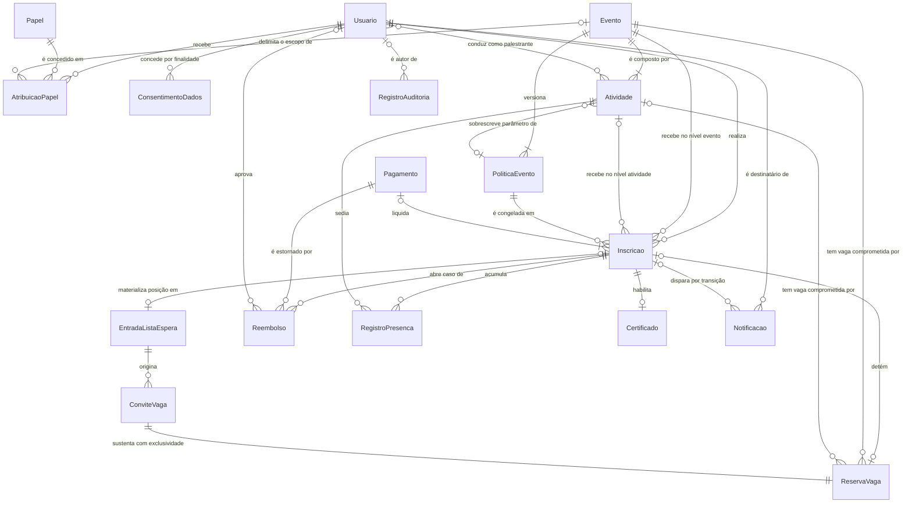

# 04 — Modelo de Domínio e Glossário

Vocabulário normativo do Eventus SGE. Todo termo usado em `analise/` e em `especificacao/` tem aqui
uma única definição; entidade, atributo e invariante descritos neste arquivo são a referência para
implementação e para escrita de teste.

> Todo valor numérico citado (48 h, 30 min, 24 h, 6 h, 75 %, 7 dias, 60 s) é default recomendado por
> este trabalho — ⚠️ **DECISÃO PROPOSTA — requer homologação do stakeholder responsável**. Os
> responsáveis constam de `analise/duvidas-e-lacunas.md`.

---

## 1. Por que este artefato existe

A elicitação usa **evento**, **workshop**, **atividade** e **programação** como se fossem a mesma
coisa, e as falas estão em níveis diferentes de granularidade. Sem um vocabulário único, cada
artefato resolve a ambiguidade por conta própria — e requisito, teste e código passam a descrever
sistemas distintos.

### 1.1 O caso concreto: P5 contra O5

Considere o **Congresso Eventus de Tecnologia 2026**, com o **Workshop de Engenharia de Prompt**
(14h–17h, sala 3, 40 vagas) e a oficina **Dados Abertos na Prática** (15h–18h, sala 7, 25 vagas) no
mesmo dia.

| Fala da elicitação | Do que a pessoa está falando | Termo canônico correto |
|---|---|---|
| P5 — "me inscrever em vários workshops que acontecerão no mesmo dia" | da **unidade de inscrição**: Marina quer duas vagas nominais, uma em cada oficina | **Atividade** (item inscritível de 2º nível) |
| O5 — "os workshops que acontecem no mesmo horário devem ocorrer simultaneamente" | do **arranjo temporal do evento**: duas salas rodando em paralelo | **Programação** / **trilha paralela** (visão, não item inscritível) |
| P1 — "visualizar todos os eventos disponíveis em um único lugar" | do **catálogo**: a ficha comercial publicada | **Evento** (item inscritível de 1º nível) |
| O2 — "quando um evento lotar" | da **contagem contra a capacidade**, que existe nos dois níveis | **Ocupação** de um **item inscritível** |
| F3 — "confirmar os pagamentos antes de liberar determinadas inscrições" | do **estado**, não do cadastro | **Inscrição confirmada** ≠ solicitação protocolada |
| P2 — "comprovante logo após a inscrição" | do **artefato entregue**, que aqui são dois | **Comprovante de solicitação** ≠ **comprovante de inscrição confirmada** |

O mesmo substantivo — "workshop" — designa em P5 **aquilo em que se ocupa uma vaga** e em O5 **uma
propriedade da grade horária**. São coisas de tipos diferentes: a primeira tem capacidade, fila e
estado; a segunda é uma consulta sobre intervalos.

### 1.2 O custo de não fixar o vocabulário

| Se "workshop" for lido como… | Efeito no requisito | Efeito no teste | Efeito no código |
|---|---|---|---|
| **Evento** (leitura de P1) | RF-12 controla vaga em um nível só; a fila do Workshop de Engenharia de Prompt (RF-14) deixa de existir | CT-06 mede concorrência pela vaga do congresso inteiro, não pela sala de 40 lugares | Uma tabela de eventos com capacidade 40; a grade do congresso vira texto livre |
| **Atividade** (leitura de P5) | RF-08 exige dois níveis de capacidade e RN-01 amarra vaga de atividade a vaga de evento | CT-06 e CT-11 testam a sala certa | Duas contagens de ocupação, com invariante por item |
| **Programação** (leitura de O5) | O conflito de horário (RN-13) vira atributo do evento, e não do par de inscrições de uma pessoa | CT-11 e CT-12 perdem o sujeito: sobreposição de quem? | Detector de conflito global, que bloqueia a própria grade paralela do congresso |

A leitura homologada é a da linha do meio, registrada em AMB-04, AMB-06 e INC-03: **atividade é a
unidade de realização e de inscrição; programação é a projeção das atividades sobre o tempo;
simultaneidade é fato do evento, conflito é fato do participante.**

### 1.3 Regras de uso do vocabulário

1. Termo que não estiver na tabela da seção 2 não pode aparecer em RF, RNF, RN, HU, UC ou TD.
2. "Oficina", "palestra", "minicurso", "mesa-redonda" e "sessão" são rótulos comerciais de
   **Atividade**, não classes distintas de domínio.
3. Regra que vale nos dois níveis usa **item inscritível**; regra que vale em um só nomeia o nível.
4. "Comprovante" nunca aparece sozinho: é sempre *de solicitação* ou *de inscrição confirmada*
   (INC-01, RN-05).

---

## 2. Glossário

49 termos: os 24 exigidos pelo escopo deste artefato e mais 25 que sustentam regras do canon,
agrupados por área.

### 2.1 Catálogo, programação e tempo

| Termo | Definição | Não confundir com | Onde aparece (IDs) |
|---|---|---|---|
| **Evento** | Unidade organizacional e comercial publicada no catálogo, com período, tipo, modalidade, capacidade própria, janela de inscrição e exatamente um Perfil de Política vigente. É item inscritível de 1º nível. Ex.: *Congresso Eventus de Tecnologia 2026*. | Atividade (a sessão dentro dele) e Programação (o arranjo temporal das atividades). | RN-01, RN-03, RF-04, RF-06, RF-07 |
| **Atividade (sessão)** | Unidade de realização com data, início, duração, sala ou canal, palestrante designado, carga horária, capacidade própria e indicador de exigência de presença. Pertence a exatamente um evento. É item inscritível de 2º nível. Ex.: *Workshop de Engenharia de Prompt*. | Evento; e trilha paralela (que é faixa da grade, não objeto de inscrição). | RN-01, RF-04, RF-08, RF-12, RF-23 |
| **Programação** | Conjunto das atividades de um evento projetado sobre a linha do tempo, exibido em grade por dia com marcação de simultaneidade. É visão derivada: ninguém se inscreve "na programação". | Agenda pessoal (recorte de um participante) e Catálogo (recorte de eventos). | RF-04, RF-07, RF-05, AMB-04 |
| **Trilha paralela** | Faixa da programação em que duas ou mais atividades ocorrem no mesmo intervalo, em salas ou canais distintos. Leitura homologada de O5. | Conflito de horário, que é propriedade de um par de inscrições de uma mesma pessoa. | AMB-04, RN-13, RF-07 |
| **Item inscritível** | Qualquer objeto sobre o qual podem existir inscrição, vaga, capacidade, fila e política: evento ou atividade. Usado sempre que a regra vale nos dois níveis. | "Evento" empregado como genérico. | RN-02, RN-07, RN-10, RN-20, RF-12 |
| **Agenda pessoal** | Projeção temporal das inscrições ativas de um participante, com marcação das sobreposições, montada antes e durante o fluxo de inscrição. | Programação do evento. | RF-22, HU-04, INC-03 |
| **Janela de inscrição** | Intervalo em que a submissão é aceita para um item. Fora dela o rótulo público é "inscrições encerradas". | Janela de cancelamento e janela de check-in. | RN-26, RF-04, RF-05 |
| **Lote de preço** | Faixa de valor vigente por intervalo de datas ou por quantidade; sem lote válido não há publicação de item pago. | Faixa de reembolso, que é fator de restituição. | RF-04, RF-05, HU-13 |
| **Modalidade** | Presencial, on-line ou híbrida. Determina como a presença é apurada (check-in no local ou tempo mínimo de conexão). | Tipo do evento (congresso, workshop, corporativo). | RF-04, RF-06, LAC-11 |

### 2.2 Inscrição, vagas e fila

| Termo | Definição | Não confundir com | Onde aparece (IDs) |
|---|---|---|---|
| **Inscrição** | Vínculo entre exatamente um participante e exatamente um item inscritível, com um único estado vigente a cada instante e uma cópia congelada da política a partir da confirmação. | Solicitação protocolada (o pedido) e Pagamento (a liquidação). | RN-02, RN-28, RF-08, RF-10, E-01 a E-14 |
| **Estado da inscrição** | Valor vigente entre E-01 e E-14, derivado da gratuidade, da cobrança, da reserva, da política congelada e da presença; não atribuível manualmente sem justificativa registrada. | Situação do pagamento e situação de entrega da notificação. | RN-02, RN-28, RF-10, RF-34 |
| **Vaga** | Direito unitário de ocupação de um item, contado contra a capacidade. Existe nos dois níveis, e ocupar vaga de atividade exige vaga válida no evento correspondente. | Inscrição (que ocupa a vaga, mas não é a vaga) e Capacidade (o total). | RN-01, RN-07, RN-20, RF-12 |
| **Capacidade** | Número máximo publicado de ocupações simultâneas de um item. Não pode ser reduzida abaixo do número de confirmadas. | Ocupação (o quanto já está comprometido) e vagas disponíveis (a diferença). | RN-07, RN-20, RF-04, RF-29 |
| **Ocupação** | Vagas comprometidas em um instante: confirmadas + reservas temporárias ativas + convites pendentes + vagas bloqueadas por cortesia. Base do rótulo público de disponibilidade. | Número de inscritos confirmados, que é apenas uma das quatro parcelas. | RN-20, RN-26, RF-29, RNF-03 |
| **Vagas disponíveis** | Capacidade publicada menos ocupação. Nunca negativa; se chegar a zero, o item está esgotado. | Lugares físicos livres na sala. | RN-20, RF-06, RF-12 |
| **Reserva temporária de vaga (hold)** | Comprometimento exclusivo de uma vaga por 30 minutos a partir do início do pagamento, com contador regressivo visível, limitado ao instante de início da atividade; expirada, a vaga volta ao conjunto disponível em até 60 s e a fila é acionada. | Inscrição confirmada e Convite de vaga (que nasce da fila, não do pagamento). | RN-11, RF-13, E-02, E-03, RNF-08 |
| **Vaga bloqueada por cortesia** | Vaga retirada do conjunto público por decisão do organizador, sem inscrição associada, mas contada na ocupação. | Reserva temporária (que tem inscrição e prazo curto). | RN-07, RN-20, RF-29 |
| **Lista de espera** | Fila ordenada e independente por item inscritível, formada quando o item está esgotado e a política a habilita. Posição derivada da ordem cronológica de entrada com precisão de segundo, consultável e recalculada a cada saída, promoção ou expiração. Não consome vaga. | Lista de interessados sem ordem e Convite de vaga (a oferta emitida a partir dela). | RN-27, RF-14, E-05, LAC-03 |
| **Convite de vaga** | Oferta nominal e exclusiva emitida ao primeiro elegível da fila quando uma vaga é liberada, com instante-limite igual ao menor valor entre emissão + 24 h e início − 6 h. Durante a validade, a vaga não retorna ao conjunto público. | Reserva temporária (origem e prazo distintos) e convite de acesso a evento corporativo fechado. | RN-12, RN-21, RF-15, E-06, E-07 |
| **Promoção em cascata** | Encadeamento automático de convites ao próximo elegível a cada recusa ou expiração, até o aceite, o esgotamento da fila ou o corte de 6 h antes do início. | Promoção fora de ordem, que é ação manual do organizador com justificativa. | RN-29, UC-03, CT-10 |
| **Protocolo de solicitação** | Identificador emitido na submissão de item oneroso, com itens, valor e prazo de pagamento; inutilizado quando a reserva vence. | Código de check-in e código de verificação do certificado. | RF-09, RN-11, E-03 |
| **Chave de idempotência** | Identificador enviado pelo cliente ou pelo prestador que garante efeito único a submissões e retornos repetidos; retida por 24 h. | Protocolo de solicitação. | RNF-07, RF-09, RF-16 |

### 2.3 Política, cancelamento e dinheiro

| Termo | Definição | Não confundir com | Onde aparece (IDs) |
|---|---|---|---|
| **Perfil de política do evento** | Conjunto dos oito parâmetros (cancelamento, reembolso, lista de espera, certificado, notificação, reserva, conflito de horário e visibilidade) configurado por evento antes da abertura das inscrições, herdado pelas atividades com sobrescrita pontual sinalizada. Sem os oito preenchidos não há publicação. | Termos de uso, configuração global do sistema e preferências do usuário. | RN-03, RF-19, RF-05, HU-12 |
| **Política congelada** | Cópia imutável dos parâmetros vigentes gravada na inscrição no instante da confirmação e usada em toda avaliação posterior de cancelamento, reembolso e certificado. | Perfil vigente do evento, que pode ter mudado depois da confirmação. | RN-14, RF-20, CT-17 |
| **Janela de cancelamento** | Antecedência mínima para cancelamento autosserviço, em horas, contada até o início do item. Default 48 h; zero em item marcado como não cancelável, condição que deve constar da página antes da inscrição. | Janela de inscrição, janela de check-in e faixa de reembolso — a janela **autoriza** o ato, a faixa **precifica** a devolução. | RN-09, RF-21, LAC-01, TD-01 |
| **Reembolso** | Direito de devolução de parte ou da totalidade do valor líquido pago, apurado por faixa: 1,00 com 7 dias ou mais, 0,50 entre 7 dias e 48 h, 0,00 abaixo disso; sempre 1,00 quando a iniciativa do cancelamento é da organização. | Cancelamento (o ato que o origina) e estorno (a execução financeira). | RN-22, RN-30, RF-18, TD-02 |
| **Estorno** | Operação financeira que devolve o valor pelo mesmo meio do pagamento, executada por identidade distinta da que aprovou, acima do teto de aprovação automática. | Reembolso (o direito apurado) e recusa de cobrança pelo prestador. | RN-16, RF-18, E-11 |
| **Conciliação** | Cruzamento do extrato importado do prestador com as cobranças do sistema, com fila de exceções — pagamento órfão, divergência de valor e liquidação após a expiração da reserva — de desfecho obrigatório. | Fechamento financeiro do evento, que é relatório. | RF-17, UC-05, CT-05 |

### 2.4 Presença e certificado

| Termo | Definição | Não confundir com | Onde aparece (IDs) |
|---|---|---|---|
| **Check-in** | Ato de registrar presença em uma sessão por código ou QR de uso único, dentro da janela que abre 30 minutos antes e fecha 30 minutos após o início, com operação sem conectividade e sincronização posterior. | Presença (o registro resultante) e entrada física no local do evento. | RF-23, RNF-12, CT-18 |
| **Presença** | Registro por sessão resultante de check-in válido ou de correção manual justificada. Percentual = sessões obrigatórias com check-in ÷ total de sessões obrigatórias × 100, arredondado para baixo; limiar padrão 75 %. | Inscrição confirmada (que atesta vaga, não comparecimento) e booleano de "compareceu ao evento". | RN-23, RF-23, RF-24, E-12 |
| **No-show** | Inscrição confirmada sem nenhum check-in em sessão obrigatória do item até o encerramento. | Cancelamento (que libera vaga) e ausência parcial. | RF-30, E-13 |
| **Certificado** | Documento nominal emitido após o encerramento do item e a apuração da elegibilidade pelo critério da política congelada, declarando a carga horária das atividades efetivamente frequentadas. Liberação em até 48 h do encerramento. | Comprovante de inscrição confirmada (que atesta vaga, não participação). | RN-19, RN-24, RN-25, RF-24, E-14 |
| **Código de verificação** | Identificador único e permanente do certificado, consultável em página pública sem autenticação, que confirma titular, atividade, carga horária, data e situação (válido ou revogado), sem expor outro dado pessoal e sem permitir listagem. | Código de check-in (uso único, por sessão) e protocolo de solicitação. | RN-06, RF-25, CT-22 |
| **Carga horária** | Soma das durações das atividades com check-in confirmado, desconsideradas as sobrepostas sem registro de presença. | Duração programada do evento. | RN-24, RF-24, CT-21 |

### 2.5 Pessoas, papéis e escopo

| Termo | Definição | Não confundir com | Onde aparece (IDs) |
|---|---|---|---|
| **Participante** | Pessoa natural titular de inscrições, dos próprios dados pessoais e dos consentimentos concedidos. Persona: Marina Alves. | Usuário (a conta, que pode ter outros papéis) e inscrito, que é o participante em relação a um item específico. | RF-01, RF-03, RF-10 |
| **Organizador** | Papel responsável pelos eventos do seu escopo: compõe programação, define o perfil de política, publica, gere inscrições e administra a fila. Persona: Rafael Nunes. | Equipe de TI (que opera e não acessa dado pessoal em produção sem registro) e analista financeira. | RF-04, RF-11, RF-19, RF-33 |
| **Palestrante** | Papel designado a atividades; consulta a própria programação e a lista de inscritos em perfil mínimo. Persona: Dra. Helena Prado. | Organizador e autor de conteúdo. | RF-31, RF-32, RN-15 |
| **Analista financeira** | Papel com visão transversal apenas de cobrança, conciliação e reembolso, sem competência sobre programação. Persona: Cleide Barros. | Organizador e aprovador de reembolso, que é atribuição condicionada à segregação de função. | RF-17, RF-18, RN-16 |
| **Operador de credenciamento** | Papel temporário limitado a uma atividade e a um dia, encerrado automaticamente ao fim do evento, cuja única competência é registrar check-in. | Organizador e equipe de TI. | RF-33, RF-23, HU-24, LAC-13 |
| **Escopo** | Delimitação do alcance de um papel — evento ou atividade — avaliada em conjunto com ele em toda autorização. | Papel isolado, que sem escopo não autoriza nada além do próprio perfil. | RF-33, TD-07, LAC-13 |

### 2.6 Comunicação, evidência e privacidade

| Termo | Definição | Não confundir com | Onde aparece (IDs) |
|---|---|---|---|
| **Comprovante de solicitação** | Artefato emitido imediatamente após a submissão, com protocolo, itens, valor e prazo, declarando de forma destacada que **não garante vaga**. | Comprovante de inscrição confirmada. | RN-05, RF-26, INC-01 |
| **Comprovante de inscrição (confirmada)** | Artefato emitido na confirmação, único que atesta vaga garantida e que contém o código de check-in. | Comprovante de solicitação e certificado. | RN-05, RF-26, E-04 |
| **Notificação** | Mensagem transacional disparada por transição relevante de estado, enviada por e-mail — canal oficial não desativável — com espelho na central in-app e situação de entrega registrada por mensagem. | Comprovante (o documento anexo) e comunicação de divulgação, única que admite recusa. | RN-04, RF-27, RNF-11 |
| **Situação de entrega** | Estado da mensagem: enviada, entregue, falhou ou reenviada, com até três retentativas automáticas. Convite de fila dependente de e-mail não entregue fica suspenso. | Estado da inscrição. | RF-27, RNF-11, LAC-05, CT-25 |
| **Trilha de auditoria** | Registro somente de inclusão, encadeado por resumo criptográfico, de toda transição de inscrição, cobrança, política, papel e certificado e de todo acesso de terceiros a dados pessoais, com retenção de 5 anos e nenhuma operação de alteração ou exclusão disponível a qualquer perfil. | Log de aplicação (volátil, técnico) e linha do tempo exibida em Minhas Inscrições, que é visão derivada dela. | RN-17, RF-34, RNF-16 |
| **Consentimento** | Manifestação específica por finalidade, revogável com efeito imediato, que condiciona a exposição de dado pessoal a terceiro. Revogação propagada às visões em até 60 s. | Aceite dos termos de uso e aviso de privacidade, que não autorizam exposição a terceiros. | RF-03, RN-15, RF-32, RNF-17 |
| **Perfil mínimo de visibilidade** | Conjunto de campos devolvidos ao palestrante por padrão: nome social ou completo, organização e situação da inscrição — sem qualquer dado de contato. | Indicadores agregados, que são totais com supressão de recortes menores que cinco pessoas. | RN-15, RF-31, TD-07 |
| **Conflito de horário** | Interseção não vazia entre os intervalos de duas atividades, com início inclusivo e fim exclusivo, em que o mesmo participante tem ou pretende ter inscrição ativa. Bloqueia a inscrição quando ao menos uma delas exigir presença para certificado; nos demais casos, alerta e exige confirmação consciente. | Simultaneidade da programação (trilha paralela), que é fato do evento e não do participante. | RN-13, RF-22, TD-04, INC-03 |
| **Confirmação consciente** | Registro do aceite do participante que, avisado da sobreposição, decide manter as duas inscrições; fica gravado na inscrição e na trilha. | Aceite de termos e leitura da política. | RN-13, RF-22, CT-12 |

---

## 3. Modelo conceitual

Modelo de domínio, não de banco: não há chave estrangeira física, índice nem tabela de junção
técnica. Nomes de entidade em `PascalCase` para casar com o dicionário da seção 4.

### 3.1 Leitura das cardinalidades que não são óbvias

| Relacionamento | Leitura | Por quê |
|---|---|---|
| `Evento ||--o{ Inscricao` e `Atividade |o--o{ Inscricao` | Toda inscrição aponta para um evento; `atividadeId` preenchido define o nível atividade. | RN-01: ocupar vaga de atividade exige vaga válida no evento. Ver decisão 1. |
| `Pagamento |o--|{ Inscricao` | Uma cobrança liquida de 1 a N inscrições; uma inscrição tem no máximo uma cobrança. | RF-08: várias atividades concluídas em um único pagamento. |
| `Inscricao |o--o| ReservaVaga` | Reserva é opcional: item gratuito confirma sem reserva (RN-08) e meio de pagamento sem hold gera inscrição pendente sem consumir vaga (INC-05). | Evita reserva órfã e reserva fictícia de valor zero. |
| `ConviteVaga ||--|| ReservaVaga` | Todo convite tem reserva própria, de origem `convite`, com prazo de RN-21. | RN-12: durante o convite a vaga não retorna ao conjunto público. |
| `Inscricao |o--o| EntradaListaEspera` | A inscrição em E-05 é o sujeito da fila; a entrada carrega a ordem. | Mantém E-05 e E-06 como estados da inscrição, conforme o canon. |
| `Inscricao ||--o| Certificado` | No máximo um certificado válido por inscrição, emitido sobre a inscrição de nível evento quando ela existir. | RN-06 e RN-24: um titular, um item, uma carga horária consolidada. |
| `Usuario }o--o{ Atividade` | Designação de palestrante; resolve-se em tabela associativa na modelagem física, sem atributo de domínio relevante além do próprio vínculo. | RF-04, RF-31. |
| `Usuario |o--o{ RegistroAuditoria` | Só o autor é relacionado; o objeto auditado é referência polimórfica (`entidadeAlvo` + `idAlvo`). | RF-34 audita cinco famílias de objeto; chave estrangeira por família criaria cinco colunas nulas. |

`EntradaListaEspera` replica `eventoId` e `atividadeId` vindos da inscrição para permitir ordem única
por item; a replicação é deliberada e está coberta pela invariante 6 da seção 6.

---

## 4. Dicionário de entidades

### 4.1 Usuario

Responde: *quem é a pessoa e o que ela já provou sobre si — titularidade, idade, segundo fator —
antes de ocupar uma vaga?*

| Atributo | Tipo | Obrigatório | Observação/regra |
|---|---|---|---|
| id | Identificador | Sim | Imutável; não reutilizado após eliminação (RNF-19). |
| nomeCompleto | Texto (120) | Sim | — |
| nomeSocial | Texto (120) | Não | Prevalece sobre `nomeCompleto` em toda exibição a terceiros (RN-15, RF-31). |
| email | Texto (254) | Sim | Único; canal oficial não desativável (RN-04); alteração exige nova verificação de titularidade. |
| situacaoTitularidade | Enum {pendente, verificada} | Sim | Verificação por vínculo de uso único válido por 24 h; sem `verificada` não conclui inscrição (RF-01). |
| dataNascimento | Data | Sim | Veda autocadastro abaixo de 16 anos; entre 16 e 18 exige consentimento de responsável (LAC-12). |
| organizacao | Texto (120) | Não | Único campo institucional exposto no perfil mínimo (RN-15). |
| segundoFatorAtivo | Booleano | Sim | Obrigatório para organizador, financeiro, palestrante e TI (RNF-15). |
| situacaoConta | Enum {ativa, bloqueada, eliminada} | Sim | Bloqueio progressivo após 5 falhas em 15 min (RNF-15). |

### 4.2 Papel

Responde: *que classe de autoridade existe no sistema e o que ela exige de prova e de escopo?*

| Atributo | Tipo | Obrigatório | Observação/regra |
|---|---|---|---|
| codigo | Enum {participante, organizador, financeiro, palestrante, ti, operadorCredenciamento} | Sim | Conjunto fechado (LAC-13); novo papel é mudança de especificação, não de dado. |
| exigeSegundoFator | Booleano | Sim | Verdadeiro para todos exceto participante (RNF-15). |
| exigeEscopo | Booleano | Sim | Verdadeiro para organizador, palestrante e operador de credenciamento (RF-33). |
| acessaDadoPessoalDeTerceiro | Booleano | Sim | Verdadeiro obriga registro de acesso na trilha (RF-34, RNF-17). |
| prazoMaximoConcessaoHoras | Inteiro | Não | Preenchido para operador de credenciamento; força revogação automática ao fim do evento. |

### 4.3 AtribuicaoPapel

Responde: *quem pode fazer o quê, sobre qual evento e até quando?*

| Atributo | Tipo | Obrigatório | Observação/regra |
|---|---|---|---|
| id | Identificador | Sim | — |
| usuarioId | Identificador | Sim | — |
| papelCodigo | Enum (Papel) | Sim | — |
| escopoEventoId | Identificador | Não | Obrigatório quando `Papel.exigeEscopo`; restringe o organizador aos seus eventos (RF-33). |
| escopoAtividadeId | Identificador | Não | Usado por palestrante e operador de credenciamento. |
| inicioVigencia | Instante (UTC) | Sim | — |
| fimVigencia | Instante (UTC) | Não | Obrigatório para operador de credenciamento; expiração automática, sem ação humana (HU-24). |
| concedidoPor | Identificador | Sim | Autor da concessão; toda concessão e revogação vai à trilha (RF-34). |
| justificativa | Texto (500) | Sim | — |

### 4.4 Evento

Responde: *o que está sendo oferecido, para quem é visível, dentro de que janela e sob qual versão de
política?*

| Atributo | Tipo | Obrigatório | Observação/regra |
|---|---|---|---|
| id | Identificador | Sim | — |
| titulo | Texto (160) | Sim | Ex.: *Congresso Eventus de Tecnologia 2026*, *Encontro Corporativo Nexa*. |
| tipo | Enum {congresso, workshop, corporativo} | Sim | — |
| modalidade | Enum {presencial, online, hibrido} | Sim | Determina a apuração de presença (LAC-11). |
| visibilidade | Enum {publico, fechado} | Sim | `fechado` fica fora da busca pública e exige convite ou vínculo organizacional (AMB-02). |
| periodoInicio / periodoFim | Instante (UTC) | Sim | Exibidos em America/Sao_Paulo com fuso explícito (RNF-23). |
| janelaInscricaoInicio / Fim | Instante (UTC) | Sim | Fora dela o rótulo é "inscrições encerradas" (RN-26). |
| capacidade | Inteiro ≥ 0 | Sim | Não redutível abaixo do total de confirmadas (RN-07). |
| inscricaoEmAtividade | Enum {obrigatoria, opcional, inexistente} | Sim | Resolve AMB-06 por evento, sem alterar o modelo. |
| situacao | Enum {rascunho, publicado, adiado, cancelado, encerrado} | Sim | Transição para `publicado` exige verificação de prontidão (RF-05). |
| politicaVigenteId | Identificador | Sim a partir de `publicado` | Aponta a versão vigente do perfil de política (RN-03). |

### 4.5 Atividade

Responde: *onde, quando, com que capacidade e sob que exigência de presença a participação
acontece?*

| Atributo | Tipo | Obrigatório | Observação/regra |
|---|---|---|---|
| id | Identificador | Sim | — |
| eventoId | Identificador | Sim | Exatamente um evento (RN-01). |
| titulo | Texto (160) | Sim | Ex.: *Workshop de Engenharia de Prompt*. |
| inicio | Instante (UTC) | Sim | Dentro do período do evento. |
| duracaoMinutos | Inteiro > 0 | Sim | Fim = início + duração, com fim exclusivo para efeito de conflito (RN-13). |
| salaOuCanal | Texto (80) | Sim | Sala não pode ter duas atividades com interseção de intervalos (RF-04). |
| cargaHorariaMinutos | Inteiro ≥ 0 | Sim | Entra na soma do certificado apenas com presença registrada (RN-24). |
| capacidade | Inteiro ≥ 0 | Sim | Independente da capacidade do evento (RF-12). |
| exigePresencaParaCertificado | Booleano | Sim | Verdadeiro força bloqueio da inscrição conflitante (RN-13, TD-04). |
| obrigatoriaParaCertificado | Booleano | Sim | Compõe o denominador do percentual de presença (RN-23). |
| politicaSobrescritaId | Identificador | Não | Preenchido apenas quando a atividade sobrescreve parâmetro herdado (RN-03). |

### 4.6 PoliticaEvento

Responde: *qual era a regra do jogo deste evento, nesta versão, e desde quando?*

| Atributo | Tipo | Obrigatório | Observação/regra |
|---|---|---|---|
| id | Identificador | Sim | — |
| eventoId | Identificador | Sim | — |
| versao | Inteiro ≥ 1 | Sim | Incremental; versão nunca é sobrescrita. |
| escopo | Enum {evento, atividade} | Sim | `atividade` só existe com `atividadeId` preenchido. |
| atividadeId | Identificador | Não | Obrigatório quando `escopo = atividade`. |
| janelaCancelamentoHoras | Inteiro ≥ 0 | Sim | ⚠️ Default 48; zero significa não cancelável (RN-09, LAC-01). |
| politicaReembolso | Enum {naoReembolsavel, integralAteNDias, escalonado} + faixas | Sim | ⚠️ Default escalonado 100 % / 50 % / 0 % (RN-22, LAC-02). |
| modoListaEspera | Enum {desabilitada, fifoAutomatica, fifoComAprovacao} | Sim | ⚠️ Default `fifoAutomatica` (LAC-03). |
| criterioCertificado | Enum {automatico, presencaMinima, aprovacaoManual} | Sim | ⚠️ Default `presencaMinima` em atividade com carga horária; `automatico` em evento corporativo de participação única (LAC-04). |
| limiarPresencaPercentual | Inteiro 0–100 | Sim quando `presencaMinima` | ⚠️ Default 75 (RN-23). |
| canaisNotificacao | Conjunto {email, inApp, whatsapp, sms} | Sim | `email` sempre presente e não removível (RN-04); WhatsApp e SMS fora do MVP (RF-28). |
| reservaDeVaga | Enum {holdTemporario, somenteAposConfirmacao} | Sim | ⚠️ Default `holdTemporario` (LAC-06). |
| duracaoHoldMinutos | Inteiro > 0 | Sim quando `holdTemporario` | ⚠️ Default 30 (RN-11). |
| politicaConflitoHorario | Enum {bloquear, alertarEPermitir, permitir} | Sim | ⚠️ Default `alertarEPermitir` (RN-13, LAC-07). |
| visibilidadePalestrante | Enum {minima, padrao, ampliada} | Sim | ⚠️ Default `minima` (RN-15, LAC-08). |
| vigenciaInicio / vigenciaFim | Instante (UTC) | Sim / Não | `vigenciaFim` nulo indica versão vigente. |
| autorId | Identificador | Sim | — |
| justificativaAlteracao | Texto (500) | Sim quando `versao > 1` após a abertura | Alteração pós-abertura é exceção autorizada e não retroage (RN-14, RF-20). |

### 4.7 Inscricao

Responde: *quem tem — ou disputa — qual vaga, em que estado, sob qual versão de política e por qual
valor?*

| Atributo | Tipo | Obrigatório | Observação/regra |
|---|---|---|---|
| id | Identificador | Sim | — |
| protocolo | Texto (20) | Sim | Único e legível; inutilizado após reserva vencida (E-03, RN-11). |
| usuarioId | Identificador | Sim | Exatamente um participante (RN-02). |
| eventoId | Identificador | Sim | Preenchido também na inscrição de nível atividade (RN-01). |
| atividadeId | Identificador | Não | Preenchido define `nivel = atividade`. |
| nivel | Enum {evento, atividade} | Sim | Derivado de `atividadeId`; nunca informado manualmente. |
| estado | Enum E-01 a E-14 | Sim | Único vigente por instante; derivado (RN-02, RN-28). |
| politicaCongeladaId | Identificador | Sim a partir de E-04 | Cópia usada em toda avaliação posterior (RN-14, RF-20). |
| valorDevido | Decimal (BRL) ≥ 0 | Sim | Maior que zero implica liquidação para confirmar (RN-08, AMB-05). |
| origem | Enum {autosservico, terceiro, importacao, conviteFila} | Sim | `terceiro` e `importacao` são ações do organizador (RF-11). |
| confirmacaoConscienteConflito | Instante (UTC) | Não | Obrigatório quando concluída com sobreposição permitida (RN-13, CT-12). |
| chaveIdempotencia | Texto (64) | Sim | Efeito único em envios concorrentes; retida por 24 h (RNF-07). |
| instanteSubmissao / instanteConfirmacao | Instante (UTC) | Sim / Não | `instanteConfirmacao` define qual versão de política é congelada. |

### 4.8 ReservaVaga

Responde: *quantas vagas estão comprometidas sem estarem confirmadas, por qual motivo e até que
instante?*

| Atributo | Tipo | Obrigatório | Observação/regra |
|---|---|---|---|
| id | Identificador | Sim | — |
| origem | Enum {pagamento, convite, cortesia} | Sim | As três parcelas não confirmadas de RN-20, contadas separadamente no painel (RF-29). |
| eventoId | Identificador | Sim | — |
| atividadeId | Identificador | Não | Preenchido reserva vaga de 2º nível. |
| inscricaoId | Identificador | Não | Nulo apenas em `origem = cortesia` (bloqueio administrativo sem titular). |
| instanteInicio | Instante (UTC) | Sim | Em `origem = pagamento`, é o início do pagamento (LAC-06). |
| instanteExpiracao | Instante (UTC) | Sim | Nunca nulo. Pagamento: menor entre início + 30 min e início da atividade (RN-11). Convite: RN-21. Cortesia: encerramento do item. |
| situacao | Enum {ativa, convertida, expirada, liberada} | Sim | `convertida` ao confirmar; `expirada` devolve a vaga em até 60 s (RNF-08). |
| instanteLiberacao | Instante (UTC) | Não | Preenchido ao devolver a vaga; dispara avaliação da fila (RN-29). |

### 4.9 EntradaListaEspera

Responde: *quem espera, em que ordem verificável, por qual item e desde quando?*

| Atributo | Tipo | Obrigatório | Observação/regra |
|---|---|---|---|
| id | Identificador | Sim | — |
| inscricaoId | Identificador | Sim | Inscrição em E-05; a entrada não substitui a inscrição, ordena-a. |
| eventoId / atividadeId | Identificador | Sim / Não | Replicados da inscrição para índice único de ordem por item. |
| ordem | Inteiro ≥ 1 | Sim | Sequência densa por item; recalculada a cada saída, promoção ou expiração (RN-27). |
| instanteEntrada | Instante (UTC), precisão de segundo | Sim | Critério de desempate da ordem (RN-27). |
| situacao | Enum {aguardando, convidada, promovida, removida, desistente} | Sim | `removida` é ação do organizador, com motivo (RF-15). |
| promocaoForaDeOrdem | Booleano | Sim | Verdadeiro exige `justificativa`; vai à trilha (RF-15, RF-34). |
| justificativa | Texto (500) | Não | Obrigatória em promoção fora de ordem e em remoção administrativa. |
| motivoSaida | Enum {aceite, recusa, expiracaoConvite, desistencia, remocao, corte6h} | Não | `corte6h` registra fila encerrada por proximidade do início (RN-21). |

### 4.10 ConviteVaga

Responde: *a vaga liberada foi ofertada a quem, com que prazo, e o que aconteceu com a oferta?*

| Atributo | Tipo | Obrigatório | Observação/regra |
|---|---|---|---|
| id | Identificador | Sim | — |
| entradaListaEsperaId | Identificador | Sim | — |
| reservaVagaId | Identificador | Sim | Reserva de `origem = convite`, exclusiva do convidado (RN-12). |
| instanteEmissao | Instante (UTC) | Sim | Até 2 min da liberação da vaga (RNF-08). |
| instanteLimite | Instante (UTC) | Sim | Menor entre emissão + 24 h e início − 6 h (RN-21). |
| situacao | Enum {vigente, aceito, recusado, expirado, suspenso} | Sim | `expirado` e `recusado` disparam promoção em cascata (RN-29). |
| ordemCascata | Inteiro ≥ 1 | Sim | Posição do convite na cadeia originada por uma mesma liberação; base de auditoria de UC-03. |
| notificacaoId | Identificador | Sim | — |
| motivoSuspensao | Enum {emailNaoEntregue, decisaoOrganizador} | Não | Convite dependente de e-mail com falha de entrega não corre prazo (LAC-05). |

### 4.11 Pagamento

Responde: *o dinheiro entrou, quanto, por qual meio e a que inscrições ele corresponde?*

| Atributo | Tipo | Obrigatório | Observação/regra |
|---|---|---|---|
| id | Identificador | Sim | — |
| meio | Enum {cartao, pix, faturamentoManual} | Sim | `faturamentoManual` para evento corporativo (LAC-10); boleto não ofertado enquanto vigorar o hold de 30 min (INC-05). |
| valorBruto / valorLiquido | Decimal (BRL) | Sim | `valorLiquido` é a base do cálculo de restituição (RN-22). |
| situacao | Enum {iniciado, liquidado, recusado, expirado, estornadoParcial, estornadoTotal} | Sim | `liquidado` converte reservas ativas em confirmadas (RF-16). |
| instanteInicio / instanteLiquidacao | Instante (UTC) | Sim / Não | Liquidação após `instanteExpiracao` da reserva vai à fila de exceções (CT-05). |
| prestadorTransacaoId | Texto (64) | Sim | Retido por 30 dias para deduplicação (RNF-07). |
| tokenMeio | Texto (64) | Não | Único identificador do instrumento retido. |
| bandeira | Texto (20) | Não | — |
| quatroUltimosDigitos | Texto (4) | Não | Nenhum outro dado de cartão existe em base, log ou cópia de segurança (RN-18, RNF-14). |
| chaveIdempotenciaRetorno | Texto (64) | Sim | Reenvios do prestador produzem efeito único (RNF-07). |
| comprovanteAnexoId | Identificador | Não | Obrigatório em liquidação registrada manualmente (RF-17). |

Uma cobrança pode liquidar de 1 a N inscrições, conforme RF-08.

### 4.12 Reembolso

Responde: *quanto se deve devolver, com que fundamento de cálculo, aprovado por quem, e já foi
executado?*

| Atributo | Tipo | Obrigatório | Observação/regra |
|---|---|---|---|
| id | Identificador | Sim | — |
| inscricaoId / pagamentoId | Identificador | Sim | — |
| iniciativa | Enum {participante, organizacao} | Sim | `organizacao` força fator 1,00 independentemente da janela (RN-30). |
| fatorFaixa | Decimal {1,00; 0,50; 0,00} | Sim | Apurado pela política congelada, não pela vigente (RN-14, RN-22). |
| valorSolicitado / valorAprovado | Decimal (BRL) | Sim / Não | Nunca superior ao líquido pago, descontados estornos anteriores da mesma inscrição. |
| solicitanteId | Identificador | Sim | — |
| aprovadorId | Identificador | Não | Obrigatório acima do teto e distinto do solicitante (RN-16). |
| executorId | Identificador | Não | Distinto do aprovador (RN-16). |
| situacao | Enum {aberto, aprovado, indeferido, executado} | Sim | `indeferido` exige fundamento registrado e comunicado (E-11). |
| memoriaCalculo | JSON imutável | Sim | Exibida ao participante antes da confirmação do cancelamento (RNF-22, CT-13). |
| instantePrevistoCredito | Instante (UTC) | Sim | Prazo declarado no ato da solicitação (LAC-02). |

### 4.13 RegistroPresenca

Responde: *esta pessoa esteve nesta sessão, comprovado como, por quem e quando?*

| Atributo | Tipo | Obrigatório | Observação/regra |
|---|---|---|---|
| id | Identificador | Sim | — |
| inscricaoId | Identificador | Sim | — |
| atividadeId | Identificador | Sim | Deve pertencer ao evento da inscrição. |
| instanteRegistro | Instante (UTC) | Sim | Dentro de [início − 30 min, início + 30 min] (RF-23). |
| origem | Enum {qrCode, codigoNumerico, correcaoManual, tempoConexao} | Sim | `tempoConexao` apura presença em atividade remota (LAC-11). |
| codigoUsoUnicoHash | Texto (64) | Não | Nulo em `correcaoManual`; o mesmo código não registra presença duas vezes (CT-18). |
| operadorId | Identificador | Sim | Operador de credenciamento ou organizador do escopo (RF-33). |
| justificativaCorrecao | Texto (500) | Não | Obrigatória em `correcaoManual`; auditada (RF-23, RF-34). |
| sincronizadoEm | Instante (UTC) | Não | Preenchido em registro criado sem conectividade (RNF-12). |
| situacao | Enum {valido, anulado} | Sim | Par (`inscricaoId`, `atividadeId`) com `valido` é único (CT-19). |

### 4.14 Certificado

Responde: *o que exatamente esta pessoa cursou, sob qual critério, e o documento continua válido?*

| Atributo | Tipo | Obrigatório | Observação/regra |
|---|---|---|---|
| id | Identificador | Sim | — |
| inscricaoId | Identificador | Sim | Um certificado válido por inscrição (RN-06). |
| codigoVerificacao | Texto (24) | Sim | Único, público e permanente; retido por 10 anos (RNF-19). |
| criterioAplicado | Enum {automatico, presencaMinima, aprovacaoManual} | Sim | Copiado da política congelada, não da vigente (RN-14). |
| percentualPresencaApurado | Inteiro 0–100 | Sim quando `presencaMinima` | Arredondado para baixo (RN-23). |
| cargaHorariaMinutos | Inteiro > 0 | Sim | Soma apenas de atividades com presença válida (RN-24). |
| atividadesConsolidadas | Lista de identificadores | Sim | Derivada de `RegistroPresenca` válidos; sobreposições sem presença ficam de fora (RN-24). |
| instanteLiberacao | Instante (UTC) | Sim | Instante em que a emissão autosserviço passou a estar disponível: entre o encerramento do item e encerramento + 48 h (RN-25, RF-24). |
| instanteEmissao | Instante (UTC) | Sim | Instante em que o titular efetivamente emitiu o documento; posterior a `instanteLiberacao`, sem limite superior — autosserviço não tem prazo de validade, e o caminho de revisão de presença deferida (transição 34) corre por dias. |
| situacao | Enum {valido, revogado} | Sim | Revogação reflete na página pública em tempo de consulta (CT-22). |
| motivoRevogacao | Texto (500) | Não | Obrigatório quando `revogado`. |
| arquivoPdfUa | Referência de documento | Sim | Texto selecionável, idioma declarado, PDF/UA (RNF-21). |

### 4.15 Notificacao

Responde: *a pessoa foi efetivamente avisada desta transição, por qual canal, e a mensagem chegou?*

| Atributo | Tipo | Obrigatório | Observação/regra |
|---|---|---|---|
| id | Identificador | Sim | — |
| destinatarioUsuarioId | Identificador | Sim | — |
| inscricaoId | Identificador | Não | Nulo em avisos de programação dirigidos a enfileirados (RF-05). |
| tipo | Enum {comprovanteSolicitacao, comprovanteConfirmacao, conviteVaga, alteracaoProgramacao, cancelamento, reembolso, certificado} | Sim | Comprovante de solicitação e de confirmação são artefatos distintos (RN-05, INC-01). |
| canal | Enum {email, inApp} | Sim | E-mail obrigatório; in-app é espelho (RN-04); demais canais fora do MVP (RF-28). |
| transicaoOrigem | Texto (13) | Não | Par de estados no formato `E-02→E-04` (RF-27). |
| instanteEnvio | Instante (UTC) | Sim | — |
| situacaoEntrega | Enum {enviada, entregue, falhou, reenviada} | Sim | Visível ao participante (HU-11). |
| tentativas | Inteiro 0–3 | Sim | Três retentativas automáticas (RNF-11). |
| documentoPdfId | Identificador | Não | Comprovantes e certificado em PDF/UA (RNF-21). |
| motivoFalha | Texto (200) | Não | Alimenta a suspensão de convite dependente de e-mail (LAC-05). |

### 4.16 RegistroAuditoria

Responde: *quem mudou o quê, quando, por quê — e o registro pode ser provado íntegro?*

| Atributo | Tipo | Obrigatório | Observação/regra |
|---|---|---|---|
| id | Identificador | Sim | Somente inclusão; sem UPDATE nem DELETE para qualquer perfil (RN-17). |
| instante | Instante (UTC) | Sim | — |
| autorUsuarioId | Identificador | Não | Nulo quando o autor é temporizador do sistema (UC-03). |
| papelAutor | Enum (Papel) | Não | — |
| entidadeAlvo | Enum {Inscricao, Pagamento, Reembolso, PoliticaEvento, AtribuicaoPapel, Certificado, RegistroPresenca, ConsentimentoDados} | Sim | Referência polimórfica com `idAlvo`. |
| idAlvo | Identificador | Sim | — |
| acao | Texto (60) | Sim | Verbo normalizado, ex.: `transicaoEstado`, `acessoDadoPessoal`. |
| valorAnterior / valorPosterior | JSON | Não | Obrigatórios em transição de estado (RF-34). |
| motivo | Texto (500) | Não | Obrigatório em ação administrativa e em acesso a dado pessoal de terceiro. |
| identificadorCorrelacao | Texto (36) | Sim | Reconstitui a linha do tempo de uma inscrição em até 10 s (RNF-16). |
| resumoAnterior / resumo | Texto (64) | Sim | Encadeamento criptográfico com verificação diária de integridade (RNF-16). |

### 4.17 ConsentimentoDados

Responde: *esta exposição de dado a um terceiro está autorizada, por qual finalidade, agora?*

| Atributo | Tipo | Obrigatório | Observação/regra |
|---|---|---|---|
| id | Identificador | Sim | — |
| usuarioId | Identificador | Sim | Titular; só ele concede e revoga (RF-03). |
| finalidade | Enum {exibicaoContatoPalestrante, divulgacao, pesquisaPosEvento, necessidadesEspecificas} | Sim | Consentimento é por finalidade, nunca genérico (RN-15). |
| escopoEventoId | Identificador | Não | Nulo significa consentimento geral da conta. |
| situacao | Enum {vigente, revogado} | Sim | Revogação propagada às visões de terceiros em até 60 s (RNF-17). |
| instanteConcessao / instanteRevogacao | Instante (UTC) | Sim / Não | — |
| textoVersionado | Texto (2000) | Sim | Versão exata do aviso apresentado no ato; prova do que foi consentido. |
| origem | Enum {cadastro, fluxoInscricao, centralPrivacidade} | Sim | — |

---

## 5. Decisões de modelagem

### 5.1 Inscrição referencia a atividade, com o evento sempre preenchido

| | |
|---|---|
| **Decisão** | `Inscricao` guarda `eventoId` obrigatório e `atividadeId` opcional; o preenchimento do segundo define o nível. |
| **Alternativa descartada** | Inscrição única no evento, com as atividades escolhidas como relacionamento N:N sem estado próprio ("lista de preferências"). |
| **Por que foi descartada** | Um vínculo sem estado não comporta E-01 a E-14, política congelada, protocolo, reserva nem trilha por item. Com ele, cancelar o *Workshop de Engenharia de Prompt* preservando as demais atividades (RF-21) exigiria apagar uma linha de junção — operação sem estado intermediário, sem valor a restituir e sem auditoria. |
| **Sustenta** | RN-01, RN-02, RF-08, RF-12, RF-21, AMB-06 |
| **Verificação** | CT-06 (concorrência pela última vaga da atividade) e CT-11 só têm sujeito se a vaga de atividade existir como objeto próprio. |

Manter `eventoId` também na inscrição de nível atividade é redundância deliberada: é ela que torna a
invariante "vaga de atividade exige vaga válida no evento" (RN-01) verificável em uma única
comparação, sem percorrer a hierarquia a cada requisição sob concorrência (RNF-02).

### 5.2 ReservaVaga é entidade própria, com origem, e não um campo em Inscricao

| | |
|---|---|
| **Decisão** | Entidade `ReservaVaga` com `origem ∈ {pagamento, convite, cortesia}`, `instanteExpiracao` obrigatório e situação própria. |
| **Alternativa descartada** | Campos `reservadaAte` e `reservada` na própria `Inscricao`. |
| **Por que foi descartada** | Três razões concretas: (a) a vaga bloqueada por cortesia não tem inscrição e ainda assim conta na ocupação (RN-20); (b) o convite da fila reserva vaga por prazo e regra distintos do hold de pagamento (RN-12 contra RN-11) e os dois precisam coexistir no mesmo item; (c) o histórico de reservas expiradas precisa sobreviver à inscrição para a fila de exceções da conciliação (CT-05) — em campo sobrescrito, essa evidência desaparece. |
| **Sustenta** | RN-07, RN-11, RN-12, RN-20, RF-13, RF-15 |
| **Verificação** | RN-20 vira soma de `ReservaVaga` ativas agrupadas por `origem`, e RNF-06 vira invariante testável ao fim de cada rodada. |

### 5.3 A lista de espera tem ordem explícita, e não é consulta ordenada por data

| | |
|---|---|
| **Decisão** | `EntradaListaEspera` com `ordem` materializada, `instanteEntrada` com precisão de segundo e situação própria. |
| **Alternativa descartada** | Derivar a posição em tempo de consulta com `ORDER BY instanteEntrada` sobre as inscrições em E-05. |
| **Por que foi descartada** | A posição é informação contratual mostrada ao participante (HU-05) e não pode oscilar entre duas leituras. A consulta ordenada não representa: promoção fora de ordem com justificativa (RF-15), suspensão de convite por e-mail não entregue (LAC-05), saída por corte de 6 h (RN-21) nem empate em entradas do mesmo segundo. Também torna a promoção em cascata (RN-29) dependente de releitura da tabela inteira a cada convite. |
| **Sustenta** | RN-21, RN-27, RN-29, RF-14, RF-15 |
| **Verificação** | CT-08 exige devolver posição e total de pessoas à frente; CT-10 exige provar que a vaga nunca voltou ao conjunto público durante a cascata. |

### 5.4 PoliticaEvento é versionada e a inscrição guarda a versão congelada

| | |
|---|---|
| **Decisão** | Cada alteração cria nova `versao` com vigência própria; `Inscricao.politicaCongeladaId` aponta a versão do instante da confirmação. |
| **Alternativa descartada** | Parâmetros mutáveis como colunas do `Evento`, lidos no momento da avaliação. |
| **Por que foi descartada** | Regra do jogo alterada depois da compra é abuso e é inauditável. Se o *Congresso Eventus de Tecnologia 2026* abre com reembolso escalonado e o organizador muda para "não reembolsável" na véspera, a leitura em tempo de avaliação recalcula para zero o direito de quem já pagou. A cópia congelada torna a garantia verificável sem depender de disciplina de processo. |
| **Sustenta** | RN-03, RN-14, RF-19, RF-20, RNF-24 |
| **Verificação** | CT-17: inscrição confirmada segue avaliada pela cópia; inscrição nova usa a versão vigente — o mesmo evento passa a ter dois resultados corretos e simultâneos, o que só é representável com versão. |

### 5.5 Presença é registro por sessão, não booleano na inscrição

| | |
|---|---|
| **Decisão** | `RegistroPresenca` por par (inscrição, atividade), com origem, operador, código de uso único e situação. |
| **Alternativa descartada** | Campo `compareceu` na `Inscricao`, marcado no credenciamento de entrada do evento. |
| **Por que foi descartada** | O booleano não produz o denominador de RN-23 (sessões obrigatórias), não permite a soma de carga horária de RN-24, não distingue check-in por QR de correção manual justificada, não sobrevive ao pedido de revisão de presença (RF-24) e não representa sincronização posterior sem duplicidade (RNF-12). Em evento com trilhas paralelas, "compareceu ao congresso" não diz em qual sala a pessoa esteve — exatamente a informação que o certificado declara. |
| **Sustenta** | RN-19, RN-23, RN-24, RF-23, RF-24 |
| **Verificação** | CT-20 (75 % contra 74 %) e CT-21 (carga horária apenas das frequentadas) são inexprimíveis sobre um booleano. |

### 5.6 Pagamento é entidade separada que pode liquidar várias inscrições

| | |
|---|---|
| **Decisão** | `Pagamento` independente, ligado a 1..N inscrições; a inscrição tem no máximo uma cobrança. |
| **Alternativa descartada** | Campos de cobrança dentro da `Inscricao` (situação, valor, identificador do prestador). |
| **Por que foi descartada** | RF-08 exige concluir várias atividades em um único pagamento; com campos embutidos, a mesma liquidação teria de ser replicada em cada inscrição, e um estorno parcial deixaria as réplicas divergentes. Além disso, a conciliação (RF-17) trabalha com pagamento órfão — um registro financeiro que, por definição, ainda não tem inscrição correspondente e não teria onde existir. |
| **Sustenta** | RN-08, RN-18, RF-08, RF-16, RF-17 |
| **Verificação** | CT-05 (liquidação após a expiração da reserva) e CT-07 (mil reenvios idempotentes) operam sobre o pagamento, não sobre a inscrição. |

### 5.7 A trilha é somente de inclusão e polimórfica, não colunas de "última alteração"

| | |
|---|---|
| **Decisão** | `RegistroAuditoria` com `entidadeAlvo` + `idAlvo`, valores anterior e posterior, encadeamento por resumo criptográfico. |
| **Alternativa descartada** | Colunas `alteradoPor` e `alteradoEm` em cada entidade, com log de aplicação para o resto. |
| **Por que foi descartada** | Colunas de última alteração guardam o presente e apagam o passado — não reconstituem a linha do tempo exigida por HU-23 nem provam integridade. Log de aplicação é rotacionado, mutável e não cobre leitura, enquanto RF-34 exige registrar também **acesso** de terceiros a dado pessoal, que não altera nenhuma coluna. |
| **Sustenta** | RN-17, RF-34, RNF-16, RNF-17 |
| **Verificação** | RNF-16: reconstituir o histórico completo de uma inscrição em consulta de até 10 s, com verificação diária de integridade da cadeia. |

---

## 6. Regras de integridade referencial e temporal

Cada linha descreve um estado que o modelo **nunca** pode apresentar. São invariantes de domínio:
valem em qualquer implementação e devem ser verificáveis por consulta, não por revisão de código.
A numeração 1 a 32 é local deste artefato — a seção 4 de `analise/regras-de-negocio.md` enuncia as
mesmas afirmações em notação lógica e traz, em cada linha, o número correspondente desta seção.

### 6.1 Integridade referencial e estrutural

| # | O que nunca pode existir | Regra/ID | Ponto de verificação |
|---|---|---|---|
| 1 | Atividade sem evento, ou com `inicio` fora do período do evento. | RN-01, RF-04 | Consulta de órfãos e de extravasamento de período. |
| 2 | Inscrição de nível atividade cujo `eventoId` seja diferente do `eventoId` da atividade. | RN-01 | Comparação direta de colunas (decisão 5.1). |
| 3 | Inscrição de nível atividade sem inscrição ativa do mesmo participante no evento correspondente. | RN-01, RF-12 | Verificado na confirmação e por varredura diária. |
| 4 | Inscrição em E-04 ou posterior sem `politicaCongeladaId`. | RN-14, RF-20 | CT-17. |
| 5 | Duas inscrições ativas do mesmo par (participante, item inscritível). | RN-10 | Índice único sobre (`usuarioId`, `eventoId`, `atividadeId`) entre estados ativos. |
| 6 | Duas entradas `aguardando` do mesmo participante na mesma fila, ou entrada em fila de item onde ele já tem inscrição ativa. | RN-10, RN-27 | CT-08. |
| 7 | Convite de vaga sem reserva de `origem = convite` associada, ou com reserva compartilhada com outro convidado. | RN-12 | CT-10. |
| 8 | Reserva de `origem = pagamento` sem `inscricaoId`, ou de `origem = cortesia` com `inscricaoId`. | RN-07, RN-20 | Restrição condicional por origem. |
| 9 | Ocupação maior que a capacidade publicada, ou capacidade reduzida abaixo do total de confirmadas. | RN-07, RN-20 | RNF-06: invariante ao fim de cada rodada de concorrência. |
| 10 | Inscrição em E-05 (enfileirada) contando na ocupação do item. | RN-20, E-05 | Conferência da fórmula de RN-20 contra a soma de reservas ativas. |
| 11 | Registro de presença cuja atividade não pertença ao evento da inscrição. | RN-01, RF-23 | CT-18. |
| 12 | Dois registros de presença `validos` para o mesmo par (inscrição, atividade). | RF-23, RNF-12 | CT-19, inclusive após sincronização do modo degradado. |
| 13 | Certificado sem inscrição, dois certificados válidos para a mesma inscrição, ou código de verificação repetido. | RN-06 | Índice único e CT-22. |
| 14 | Certificado emitido sob `criterioCertificado = presencaMinima` com percentual apurado abaixo do limiar — certificado sem presença quando a política exige presença. | RN-19, RN-23 | CT-20. |
| 15 | Qualquer dado de portador de cartão além de token, bandeira e quatro últimos dígitos, em base, log ou cópia de segurança. | RN-18, RNF-14 | Varredura automatizada por versão. |
| 16 | Reembolso acima do teto com `aprovadorId = solicitanteId`, ou com `executorId = aprovadorId`. | RN-16 | CT-16. |
| 17 | Campo de contato devolvido a palestrante sem consentimento vigente de finalidade `exibicaoContatoPalestrante`, ou indicador agregado com recorte menor que cinco pessoas. | RN-15, RNF-17 | CT-23, teste automatizado por versão. |
| 18 | Registro de auditoria alterado, removido, ou com cadeia de resumo quebrada dentro dos 5 anos de retenção. | RN-17, RNF-16 | Verificação diária de integridade. |
| 19 | Evento publicado com parâmetro de política em branco, capacidade ausente, atividade sem horário ou item pago sem lote válido. | RN-03, RF-05, RF-19 | Porta de qualidade da publicação (UC-07). |
| 20 | Notificação de transição sem `situacaoEntrega`, ou convite `vigente` cuja notificação esteja com `situacaoEntrega = falhou`. | RN-04, RNF-11, LAC-05 | CT-25. |

### 6.2 Integridade temporal

| # | O que nunca pode existir | Regra/ID | Ponto de verificação |
|---|---|---|---|
| 21 | Reserva com `instanteExpiracao` nulo — nenhuma reserva é perpétua, qualquer que seja a origem. | RN-11, RN-12 | Restrição de obrigatoriedade. |
| 22 | Reserva de pagamento com expiração posterior a `instanteInicio + 30 min` ou ao início da atividade, o que ocorrer primeiro. | RN-11 | CT-02, CT-04. |
| 23 | Reserva em situação `ativa` há mais de 31 minutos. | RNF-08 | Varredura contínua; vaga devolvida em até 60 s do vencimento. |
| 24 | Convite com `instanteLimite` maior que o menor valor entre emissão + 24 h e início − 6 h, ou convite emitido a menos de 6 h do início. | RN-21 | CT-09. |
| 25 | Vaga liberada retornando ao conjunto público enquanto houver convite vigente sobre ela. | RN-12, RN-29 | CT-10. |
| 26 | Registro de presença fora de [início − 30 min, início + 30 min], salvo `origem = correcaoManual` com justificativa. | RF-23 | CT-18. |
| 27 | Certificado com liberação anterior ao encerramento do item ou posterior a encerramento + 48 h, ou com emissão anterior à própria liberação. | RN-19, RN-25 | CT-21. |
| 28 | Inscrição confirmada apontando versão de política cuja `vigenciaInicio` seja posterior ao `instanteConfirmacao`. | RN-14 | CT-17. |
| 29 | Duas atividades com interseção de intervalos na mesma sala ou com o mesmo palestrante designado. | RF-04 | Verificação na composição e na alteração da programação (RF-05). |
| 30 | Inscrição concluída com sobreposição permitida sem `confirmacaoConscienteConflito`, ou concluída com sobreposição em atividade que exige presença para certificado. | RN-13, TD-04 | CT-11, CT-12. |
| 31 | Cancelamento autosserviço concluído a menos de 48 h do início, ou em item com janela igual a zero. | RN-09 | CT-14. |
| 32 | Consentimento revogado ainda produzindo exposição de contato após 60 s da revogação. | RN-15, RNF-17 | CT-23. |

Instantes são armazenados em UTC e exibidos em America/Sao_Paulo com fuso explícito; toda
comparação temporal destas invariantes ocorre em UTC, inclusive na virada do horário de verão
(RNF-23).
