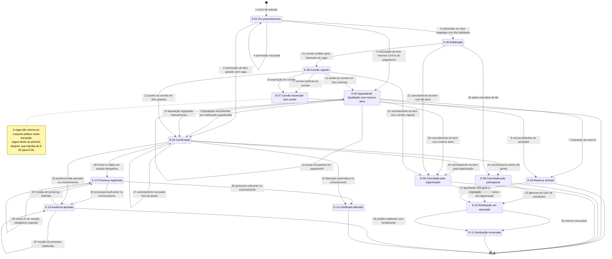

# 05 — Ciclo de Vida da Inscrição (Máquina de Estados)

A inscrição é o objeto de negócio central do Eventus SGE: vaga, dinheiro, prazo, presença e
certificado são todos atributos de uma única linha do tempo. Relendo as observações da elicitação,
quatro delas não são dúvidas independentes — são a mesma pergunta feita em pontos distintos dessa
linha do tempo. OB6 pergunta em que transição a vaga passa a ser consumida; OB1 pergunta até que
instante a transição de cancelamento continua permitida; OB3 pergunta qual transição a liberação de
uma vaga provoca em terceiros; OB4 pergunta qual condição de presença habilita a transição final.
Especificar a máquina de estados, portanto, não é documentar um detalhe de implementação: é o
formato mínimo em que essas quatro indefinições podem ser respondidas de maneira verificável e sem
contradição entre si. Este artefato fixa os 14 estados canônicos (E-01 a E-14), as 35 transições
admitidas, as guardas que as autorizam e o que cada uma produz de efeito, notificação e auditoria.

**Escopo e rastreabilidade.** Estado vigente é único por inscrição (RN-02), derivado e não
atribuível manualmente sem justificativa registrada (RN-28). Toda transição alimenta a trilha
imutável (RF-34) e a notificação por transição de estado (RF-27), e é avaliada contra a cópia
congelada da política (RF-20, RN-14). Requisitos diretamente materializados aqui: RF-09, RF-10,
RF-12, RF-13, RF-15, RF-16, RF-18, RF-21, RF-23, RF-24, RF-27, RF-34.

> ⚠️ **DECISÃO PROPOSTA — requer homologação do stakeholder responsável.** Todo valor numérico deste
> documento (30 min, 60 s, 2 min, 24 h, 6 h, 48 h, 7 dias, 75 %) é default recomendado por
> este trabalho, não valor informado pelos stakeholders. Os responsáveis por parâmetro estão na
> tabela da seção 6.

---

## 1. Estados

| ID | Estado | Significado de negócio | Visível ao participante? | Ocupa vaga? | Terminal? |
|---|---|---|---|---|---|
| E-01 | Em preenchimento | Seleção iniciada e ainda não submetida; existe rascunho com itens escolhidos, sem protocolo definitivo. | Sim — como rascunho retomável em Minhas Inscrições (RF-10). | **Não** | Não |
| E-02 | Aguardando liquidação com reserva ativa | Item oneroso submetido; vaga presa em nome do participante enquanto o pagamento corre. | Sim — com contador regressivo e instante-limite (RNF-22). | **Sim** — reserva temporária (RN-20). | Não |
| E-03 | Reserva vencida | Prazo esgotado sem liquidação, ou recusa definitiva do prestador; protocolo inutilizado. | Sim — no histórico, com convite a nova tentativa. | **Não** — vaga devolvida em ≤ 60 s. | Sim, ressalvada a reabertura por liquidação órfã (transição 27). |
| E-04 | Confirmada | Vaga garantida: item gratuito submetido ou item oneroso liquidado. Habilita comprovante de confirmação e código de check-in (RN-05). | Sim — estado principal em Minhas Inscrições. | **Sim** — ocupação firme. | Não |
| E-05 | Enfileirada | Participante aguarda em lista de espera do item esgotado, com posição consultável (RN-27). | Sim — posição e total de pessoas à frente. | **Não** | Não |
| E-06 | Convite vigente | Vaga reservada com exclusividade ao convidado até o instante-limite de aceite; fora do conjunto público (RN-12). | Sim — convite com prazo explícito. | **Sim** — convite pendente (RN-20). | Não |
| E-07 | Convite encerrado sem aceite | Convite recusado ou vencido; o participante deixa a fila e a vaga segue ao próximo elegível. | Sim — com o motivo do encerramento. | **Não** | Sim |
| E-08 | Cancelada pelo participante | Cancelamento autosserviço dentro da janela da política congelada, ou saída voluntária da fila. | Sim | **Não** — vaga liberada e fila acionada. | Sim, quando não há valor a restituir. |
| E-09 | Cancelada pela organização | Cancelamento ou adiamento por iniciativa da Eventus; restituição integral independente de janela e faixa (RN-30). | Sim — com o motivo registrado pelo organizador. | **Não** | Sim, quando o item era gratuito. |
| E-10 | Restituição em apuração | Caso de reembolso aberto: valor calculado, alçada definida, aprovação ou estorno em curso. | Sim — com valor, faixa aplicada e prazo estimado. | **Não** | Não |
| E-11 | Restituição encerrada | Estorno executado pelo mesmo meio do pagamento, ou pedido indeferido com fundamento comunicado. | Sim — com comprovante ou fundamento. | **Não** | Sim |
| E-12 | Presença registrada | Check-in válido em ao menos uma sessão obrigatória; base da apuração de elegibilidade. | Sim — presença por sessão e percentual corrente. | **Sim** — mantém a ocupação firme de E-04. | Não |
| E-13 | Ausência apurada | Item encerrado sem atingir o critério de presença da política congelada; certificado indisponível. | Sim — com o critério não atendido e o prazo de revisão. | **Não** — item encerrado; a ocupação passa a histórico. | Sim, ressalvado pedido de revisão de presença. |
| E-14 | Certificado liberado | Elegibilidade apurada e certificado emitido com código de verificação público e permanente (RN-06). | Sim — download e código verificável. | **Não** — item encerrado. | Sim |

**A coluna "Ocupa vaga?" é a definição operacional de RN-20.** Vagas disponíveis = capacidade
publicada − inscrições nos estados marcados **Sim** (E-02, E-04, E-06, E-12) − vagas bloqueadas por
cortesia. Nenhum outro estado entra na contagem, e nenhuma consulta de disponibilidade pode usar
critério diverso deste — é o invariante verificado por RNF-06 e exposto por RF-29.

---

## 2. Diagrama de estados

---

## 3. Transições

Guarda é a condição que autoriza a transição; falsa a guarda, a transição não ocorre e a tentativa é
registrada na trilha (seção 7). Notificação: todo envio usa e-mail como canal oficial não desativável
mais espelho in-app (RN-04, RF-27).

| # | De | Para | Gatilho | Guarda (condição) | Efeitos colaterais | Notificação disparada | Ator |
|---|---|---|---|---|---|---|---|
| 1 | — | E-01 | Participante seleciona evento e atividades no catálogo | Conta com titularidade confirmada (RF-01) e janela de inscrição aberta | Cria rascunho com itens e valores estimados; nenhuma vaga tocada | Nenhuma | Marina Alves (participante) |
| 2 | E-01 | E-04 | Submissão de item com valor devido igual a zero | Disponível > 0 no evento e na atividade (RN-20); sem inscrição ativa no mesmo item (RN-10); conflito de horário resolvido (RN-13) | Decremento atômico e serializado (RF-12); congela a política na inscrição (RF-20); gera código de check-in | Comprovante de inscrição confirmada com código de check-in (RF-26) | Marina Alves |
| 3 | E-01 | E-05 | Submissão em item esgotado, gratuito ou oneroso, com `modoListaEspera` habilitado | Disponível = 0; participante sem inscrição ativa nem posição na mesma fila (RN-10) | Carimba entrada com precisão de segundo e deriva a posição (RN-27) | Confirmação de entrada na fila com posição, total à frente e regras do convite | Marina Alves |
| 4 | E-01 | E-01 | Submissão recusada | Guarda de 2, 3 ou 5 falsa: esgotado sem fila, duplicidade (RN-10), sobreposição bloqueante (RN-13) ou lote de preço vencido | Nenhum; rascunho preservado para correção; tentativa registrada na trilha | Mensagem em tela com motivo e alternativa; sem e-mail | Marina Alves |
| 5 | E-01 | E-02 | Submissão de item com valor devido maior que zero e início do pagamento | Disponível > 0; e (a) `reservaDeVaga` = reserva temporária com meio de liquidação imediata (cartão ou PIX), ou (b) faturamento manual em evento fechado, caso em que a vaga é bloqueada por cortesia no lugar da reserva (RN-07) | Reserva de 30 min com decremento imediato (RF-13); protocolo idempotente (RF-09); contador regressivo visível. No caminho (b) não há contador: a fatura corre no prazo contratual (RF-17) ⚠️ B-9 | Comprovante de solicitação com protocolo, prazo e declaração destacada de que não garante vaga (RF-26, INC-01) | Marina Alves |
| 6 | E-02 | E-02 | Prestador recusa a tentativa de forma recuperável (saldo, dados incorretos) | Prazo remanescente da reserva > 0 | Mantém a reserva; libera nova tentativa sob a mesma chave de idempotência | Aviso de tentativa não aprovada com o tempo restante | Prestador de pagamento |
| 7 | E-02 | E-03 | Vencimento do temporizador da reserva | Instante atual ≥ limite da reserva e sem liquidação reconhecida | Devolve a vaga em ≤ 60 s (RNF-08); inutiliza o protocolo (RN-11); aciona a fila do item | Aviso de reserva expirada com caminho para nova submissão | Temporizador de reservas |
| 8 | E-02 | E-03 | Prestador informa desfecho terminal (antifraude, cobrança cancelada) | Recusa marcada como definitiva na notificação autenticada | Devolve a vaga imediatamente, sem aguardar o resto do prazo; aciona a fila | Aviso de pagamento não autorizado com orientação de novo pedido | Prestador de pagamento |
| 9 | E-02 | E-04 | Notificação de liquidação recebida do prestador | Assinatura válida; valor igual ao devido; chave de idempotência inédita (RNF-07); dentro do prazo da reserva | Converte reserva em ocupação firme; congela a política (RF-20); gera código de check-in; baixa a cobrança | Comprovante de inscrição confirmada, substituindo o de solicitação (RN-05) | Prestador de pagamento (sistema) |
| 10 | E-02 | E-04 | Registro manual de liquidação recebida fora do prestador | Comprovante anexado; papel financeiro autenticado com segundo fator (RNF-15); dentro do prazo | Idem 9, mais registro do autor, do anexo e do motivo | Comprovante de inscrição confirmada | Cleide Barros (analista financeira) |
| 11 | E-05 | E-06 | Liberação de vaga com fila ativa (RN-29) | Primeiro elegível da fila; início da atividade − agora > 6 h; e-mail do convite entregue | Reserva exclusiva da vaga (RN-12); prazo = menor valor entre agora + 24 h e início − 6 h (RN-21) | Convite com instante-limite de aceite e vaga já em nome do convidado | Temporizador de vagas |
| 12 | E-06 | E-04 | Aceite do convite em item com valor devido igual a zero | Instante atual < limite do convite | Converte reserva exclusiva em ocupação firme; congela a política | Comprovante de inscrição confirmada | Marina Alves |
| 13 | E-06 | E-02 | Aceite do convite em item oneroso | Instante atual < limite do convite | Abre reserva de pagamento de 30 min, truncada pelo limite do convite; a vaga nunca volta ao conjunto público entre os dois estados | Comprovante de solicitação com o novo prazo | Marina Alves |
| 14 | E-06 | E-07 | Recusa explícita do convite | — | Participante sai da fila; vaga ofertada ao próximo elegível | Confirmação de recusa e saída da fila | Marina Alves |
| 15 | E-06 | E-07 | Vencimento do prazo do convite | Instante atual ≥ limite e sem aceite | Promoção em cascata sem devolver a vaga ao conjunto público (RN-29) | Aviso de convite expirado com a posição perdida | Temporizador de convites |
| 16 | E-04 | E-08 | Cancelamento autosserviço solicitado | Início − agora ≥ `janelaCancelamento` (48 h); item cancelável; simulação de valor exibida e aceita (RNF-22) | Libera a vaga e aciona a fila; calcula o valor restituível pela faixa (RN-22); cancela em cascata as atividades dependentes do evento | Confirmação de cancelamento com faixa aplicada, valor e prazo | Marina Alves |
| 17 | E-04 | E-04 | Cancelamento solicitado fora da janela ou em item não cancelável | Guarda de 16 falsa | Nenhuma alteração de estado; tentativa registrada na trilha | Motivo, data-limite já esgotada e canal alternativo de atendimento (INC-02) | Marina Alves |
| 18 | E-05 | E-08 | Saída voluntária da fila | — | Recalcula a posição dos demais enfileirados (RN-27); nenhuma vaga movimentada | Confirmação de saída da lista de espera | Marina Alves |
| 19 | E-04 | E-09 | Cancelamento ou adiamento do item pela organização | Motivo obrigatório registrado; autor com escopo sobre o evento (RF-33) | Libera todas as vagas do item; marca restituição integral (RN-30); aponta os conflitos de agenda desfeitos | Comunicado de cancelamento do item com o direito à restituição integral | Rafael Nunes (organizador) |
| 20 | E-02 | E-09 | Cancelamento do item enquanto havia reserva ativa | Idem 19 | Encerra a reserva sem cobrar; se já houve captura, segue para 24 | Comunicado de cancelamento e de não cobrança | Rafael Nunes |
| 21 | E-05 | E-09 | Cancelamento do item com fila ativa | Idem 19 | Dissolve a fila; nenhuma promoção é gerada | Comunicado ao enfileirado, com o mesmo texto dos confirmados (RF-05) | Rafael Nunes |
| 22 | E-06 | E-09 | Cancelamento do item com convite vigente | Idem 19 | Anula o convite e libera a reserva exclusiva | Comunicado de cancelamento e de convite sem efeito | Rafael Nunes |
| 23 | E-08 | E-10 | Cancelamento gerou valor devolvível | Valor restituível calculado > 0 (RN-22) | Congela valor e faixa; define alçada e exigência de segregação (RN-16) | Abertura do caso com valor, faixa e prazo estimado de crédito | Sistema (derivado de 16) |
| 24 | E-09 | E-10 | Cancelamento por iniciativa da organização com valor pago | Valor líquido pago > 0 | Fator 1,00 sem dedução de taxas, independentemente da janela (RN-30) | Abertura do caso com restituição integral | Sistema (derivado de 19, 20, 22) |
| 25 | E-10 | E-11 | Estorno executado e confirmado pelo prestador | Aprovação concluída — automática até o teto, ou aprovador distinto do solicitante e do executor acima dele (RN-16) | Baixa financeira pelo mesmo meio do pagamento; encerra o caso | Comprovante de estorno com valor, meio e data | Cleide Barros com o prestador |
| 26 | E-10 | E-11 | Pedido indeferido | Faixa aplicável de 0 %, ou divergência comprovada na conciliação | Encerra o caso sem estorno; mantém a memória de cálculo | Comunicação do indeferimento com fundamento e canal de contestação | Cleide Barros |
| 27 | E-03 | E-10 | Liquidação órfã identificada após a expiração da reserva (INC-05) | Pagamento conciliado a protocolo já vencido; vaga não recuperável | Abre caso de restituição integral; **não** reconfirma a inscrição; item permanece com a vaga já redistribuída | Aviso de pagamento recebido fora do prazo e devolução em curso | Cleide Barros |
| 28 | E-04 | E-12 | Check-in por código ou QR de uso único | Dentro da janela que abre 30 min antes e fecha 30 min após o início; código não consumido (RF-23) | Grava presença na sessão; soma carga horária (RN-24); atualiza o percentual (RN-23) | Confirmação de presença na central in-app | Marina Alves com operador de credenciamento |
| 29 | E-12 | E-12 | Check-in em sessão obrigatória subsequente | Idem 28 | Recalcula o percentual de presença; sincroniza registros feitos sem conectividade sem duplicidade (RNF-12) | Confirmação in-app | Marina Alves com operador de credenciamento |
| 30 | E-12 | E-14 | Encerramento do item com presença suficiente | Percentual ≥ 75 %; sem pedido de revisão em curso; até 48 h do encerramento (RN-25) | Emite o PDF acessível (RNF-21); atribui código de verificação único e permanente (RN-06) | Aviso de certificado disponível com o código de verificação | Temporizador de liberação |
| 31 | E-04 | E-14 | Encerramento do item com `criterioCertificado` automático | Evento corporativo de participação única, sem exigência de presença; até 48 h do encerramento | Idem 30, com carga horária declarada pela programação | Aviso de certificado disponível | Temporizador de liberação |
| 32 | E-12 | E-13 | Encerramento do item com presença insuficiente | Percentual < 75 % e política exige presença | Bloqueia a emissão; abre o prazo de pedido de revisão | Comunicação do critério não atendido, do percentual apurado e do prazo de revisão | Temporizador de liberação |
| 33 | E-04 | E-13 | Encerramento do item sem nenhum check-in | Política exige presença e não há registro em nenhuma sessão obrigatória | Idem 32; alimenta o indicador de no-show (RF-30) | Idem 32 | Temporizador de liberação |
| 34 | E-13 | E-12 | Pedido de revisão de presença deferido | Pedido dentro do prazo; correção manual com justificativa auditada (RF-23) | Reapura o percentual; reabre a avaliação de 30 | Aviso de deferimento com o novo percentual | Rafael Nunes com operador de credenciamento |
| 35 | E-13 | E-13 | Pedido de revisão de presença indeferido | Ausência de evidência de comparecimento | Torna E-13 definitivo ao fim do prazo | Aviso de indeferimento com fundamento | Rafael Nunes |

**Fora da máquina de estados.** Rascunho em E-01 sem submissão é descartado por rotina de higiene
24 h após a última interação: o registro sai da visão do participante sem transição, porque E-01 não
consome vaga nem gera obrigação. O recálculo de posição na fila (RN-27) também não é transição — é
atributo derivado de E-05. Cancelamento parcial (RF-21) não é transição nova: como cada inscrição
vincula exatamente um item (RN-02), cancelar uma atividade é a transição 16 aplicada àquela
inscrição, preservando as demais.

### Trilhas exemplificadas

| Cenário | Sequência de estados | Transições |
|---|---|---|
| Marina entra na fila do **Workshop de Engenharia de Prompt** (pago, esgotado), é convidada, paga e conclui com certificado | E-01 → E-05 → E-06 → E-02 → E-04 → E-12 → E-14 | 1, 3, 11, 13, 9, 28, 30 |
| **Encontro Corporativo Nexa** (fechado, faturado à empresa contratante, participação única, certificado automático) | E-01 → E-02 → E-04 → E-14 | 1, 5, 10, 31 |
| **Congresso Eventus de Tecnologia 2026** adiado pela organização após pagamento | E-01 → E-02 → E-04 → E-09 → E-10 → E-11 | 1, 5, 9, 19, 24, 25 |
| Marina inicia pagamento do Workshop de Engenharia de Prompt e não conclui; paga por PIX 40 min depois | E-01 → E-02 → E-03 → E-10 → E-11 | 1, 5, 7, 27, 25 |

---

## 4. Temporizadores e prazos

> ⚠️ **DECISÃO PROPOSTA — requer homologação do stakeholder responsável.** Toda a tabela desta seção.
> Nenhum destes prazos consta da elicitação: OB1, OB3, OB4 e OB6 são exatamente a ausência deles.
> O impacto de não decidir é que a máquina de estados fica indeterminável e o controle automático de
> vagas prometido em O1 não pode ser construído.

| Temporizador | Início | Duração proposta | Ação ao expirar | Quem pode alterar |
|---|---|---|---|---|
| Reserva temporária de vaga | Início do pagamento (transição 5 ou 13) | 30 min, truncados pelo instante de início da atividade | Transição 7: devolve a vaga e aciona a fila | Rafael Nunes, por evento, dentro do teto acordado com Cleide Barros |
| Devolução efetiva da vaga | Vencimento da reserva ou do convite | ≤ 60 s (p99, RNF-08) | Recontabiliza a disponibilidade e o rótulo público (RN-26) | Téo Miranda (parâmetro operacional) |
| Emissão do convite após liberação | Liberação da vaga (16, 7, 8, 19 ou ampliação de capacidade) | ≤ 2 min (p95, RNF-08) | Transição 11 ao primeiro elegível | Téo Miranda |
| Prazo de aceite do convite | Emissão do convite | Menor valor entre 24 h e início − 6 h (RN-21) | Transição 15 e promoção em cascata | Rafael Nunes |
| Corte de emissão de convites | — | 6 h antes do início da atividade | Nenhum convite novo é gerado; a vaga volta ao conjunto público | Rafael Nunes |
| Janela de cancelamento autosserviço | Publicação do evento | Até 48 h antes do início; 0 h em item não cancelável | Transição 16 deixa de ser autorizada; passa a valer a 17 | Rafael Nunes (LAC-01) |
| Faixa de reembolso integral | — | Até 7 dias antes do início | Fator cai de 1,00 para 0,50 | Cleide Barros (LAC-02) |
| Faixa de reembolso parcial | — | De 7 dias a 48 h antes do início | Fator cai de 0,50 para 0,00 | Cleide Barros |
| Janela de check-in da sessão | 30 min antes do início | 60 min, fechando 30 min após o início | Código de uso único deixa de ser aceito; só correção manual justificada | Rafael Nunes (LAC-04) |
| Liberação do certificado | Encerramento do item | Até 48 h (RN-25) | Transições 30, 31, 32 ou 33 | Rafael Nunes |
| Pedido de revisão de presença | Encerramento do item (comunicado em E-13) | 7 dias corridos após o encerramento do item ⚠️ DECISÃO PROPOSTA — requer homologação de Rafael Nunes (LAC-04) | E-13 torna-se definitivo; transição 34 deixa de ser possível | Rafael Nunes |
| Descarte do rascunho | Última interação em E-01 | 24 h | Registro removido da visão do participante, retido apenas em auditoria | Téo Miranda |
| Validade da chave de idempotência | Recebimento da primeira requisição | 24 h (RNF-07) | Reenvios posteriores deixam de ser reconhecidos como duplicata | Téo Miranda |
| Confirmação de titularidade da conta | Envio do vínculo de uso único | 24 h (RF-01) | Conta não conclui inscrições até novo vínculo; rascunho em E-01 é preservado | Téo Miranda |

**Regra de composição dos prazos.** Quando dois temporizadores incidem sobre a mesma inscrição, vale
sempre o menor limite. É o caso da transição 13: o aceite de convite em item oneroso abre reserva de
30 min, mas nunca além do instante-limite do convite. Sem essa regra, um convite emitido a 6 h e 10
min do início poderia manter vaga presa depois do corte de 6 h, quebrando RN-21.

---

## 5. Matriz de transições proibidas

Número = transição permitida (seção 3). `x` = combinação inválida: o motor de estados recusa, nada é
alterado, e a tentativa é registrada na trilha com autor e motivo.

| De \ Para | E-01 | E-02 | E-03 | E-04 | E-05 | E-06 | E-07 | E-08 | E-09 | E-10 | E-11 | E-12 | E-13 | E-14 |
|---|---|---|---|---|---|---|---|---|---|---|---|---|---|---|
| **E-01** | 4 | 5 | x | 2 | 3 | x | x | x | x | x | x | x | x | x |
| **E-02** | x | 6 | 7, 8 | 9, 10 | x | x | x | x | 20 | x | x | x | x | x |
| **E-03** | x | x | x | x | x | x | x | x | x | 27 | x | x | x | x |
| **E-04** | x | x | x | 17 | x | x | x | 16 | 19 | x | x | 28 | 33 | 31 |
| **E-05** | x | x | x | x | x | 11 | x | 18 | 21 | x | x | x | x | x |
| **E-06** | x | 13 | x | 12 | x | x | 14, 15 | x | 22 | x | x | x | x | x |
| **E-07** | x | x | x | x | x | x | x | x | x | x | x | x | x | x |
| **E-08** | x | x | x | x | x | x | x | x | x | 23 | x | x | x | x |
| **E-09** | x | x | x | x | x | x | x | x | x | 24 | x | x | x | x |
| **E-10** | x | x | x | x | x | x | x | x | x | x | 25, 26 | x | x | x |
| **E-11** | x | x | x | x | x | x | x | x | x | x | x | x | x | x |
| **E-12** | x | x | x | x | x | x | x | x | x | x | x | 29 | 32 | 30 |
| **E-13** | x | x | x | x | x | x | x | x | x | x | x | 34 | 35 | x |
| **E-14** | x | x | x | x | x | x | x | x | x | x | x | x | x | x |

As três proibições de maior consequência:

1. **E-08 e E-09 não alcançam E-14** — certificado não se emite a partir de inscrição cancelada,
   porque a vaga foi liberada, redistribuída à fila e a elegibilidade depende de presença em item que
   o participante deixou de ocupar (RN-19); permitir o contrário criaria certificado sem lastro de
   comparecimento e destruiria o valor do código de verificação público perante o RH que o consulta.
2. **E-03 e E-07 não alcançam E-04** — nem reserva vencida nem convite encerrado voltam a confirmar
   sem nova submissão, porque a vaga já foi devolvida ao conjunto ou ofertada ao próximo da fila
   (RN-11, RN-12); reabrir esses estados permitiria confirmar duas pessoas para a mesma vaga e
   quebraria o invariante de não sobrevenda verificado por RNF-06.
3. **E-05 não alcança E-04 diretamente** — ninguém sai da fila para confirmada sem passar pelo
   convite em E-06, porque é o convite que materializa a reserva exclusiva, o prazo e o registro de
   aceite (RN-12, RN-21); o atalho tornaria a ordem FIFO indefensável em contestação e confirmaria
   participantes que já não têm interesse na vaga.

---

## 6. Efeito em cascata

### 6.1 O que a liberação de uma vaga dispara

| Gatilho da liberação | Transição de origem | Efeito imediato | Efeito na fila |
|---|---|---|---|
| Cancelamento pelo participante | 16 | Vaga devolvida no ato do commit | Convite ao primeiro elegível em ≤ 2 min |
| Expiração da reserva | 7 | Vaga devolvida em ≤ 60 s | Idem |
| Recusa definitiva do pagamento | 8 | Vaga devolvida no ato | Idem |
| Cancelamento administrativo individual | 19 | Vaga devolvida no ato | Idem |
| Ampliação de capacidade da sala (HU-15) | — | N vagas criadas | N convites simultâneos, em ordem, limitados por RN-07 |
| Cancelamento do item inteiro | 19, 20, 21, 22 | Todas as vagas encerradas | **Nenhum convite**: a fila é dissolvida, não promovida |

Sequência canônica de uma liberação, com os relógios de RNF-08: em t0 a transição de origem é
gravada e, **no mesmo commit**, havendo fila ativa no item e mais de 6 h para o início, a vaga é
marcada como reservada para a fila; até t0 + 2 min a transição 11 emite o convite ao primeiro
elegível e a reserva passa a ser exclusiva dele (RN-12, RN-29, RNF-08). **Em nenhum instante dessa
sequência a vaga é ofertada ao conjunto público** — a atomicidade é exigência de RN-29 e é o que
TD-05 decide nas colunas R4 e R5.

A vaga só retorna ao conjunto público em duas hipóteses, ambas com desfecho próprio em TD-05: fila
vazia no instante da liberação (R2) ou corte de 6 h atingido, quando nenhum convite novo pode ser
gerado (R3, RN-21). Nessas duas hipóteses a disponibilidade é recontabilizada e o rótulo público
atualizado em ≤ 60 s (RN-26, RNF-08). Se a emissão do convite não se concluir — falha do canal
oficial após as três retentativas de RNF-11, por exemplo — a vaga **permanece retida fora do
conjunto público** e segue ao próximo elegível (TD-05, R6), enquanto o enfileirado cujo e-mail
falhou conserva a posição original, porque perder a vez por falha de infraestrutura não é
desistência (LAC-05); a tentativa recusada e o alerta ao organizador entram na trilha (seção 7).

**Cancelamento em cascata entre níveis.** A inscrição em atividade exige vaga válida no evento
(RN-01). Marina cancela sua inscrição no **Congresso Eventus de Tecnologia 2026** faltando 10 dias:
a transição 16 no nível do evento propaga transições 16 para as três atividades em que ela estava
confirmada, liberando quatro vagas em quatro filas distintas e disparando até quatro convites em
≤ 2 min. O caso de reembolso, porém, é **um só** (transição 23), consolidando o valor pago em
pagamento único (RF-08).

### 6.2 Quando vários convites expiram em sequência

Cenário: **Workshop de Engenharia de Prompt**, 40 vagas, fila com 5 pessoas, uma vaga liberada a 8
dias do início. Convites de 24 h. Se todos ignorarem o convite, a cascata consome 5 × 24 h = 120 h
antes de a vaga voltar ao conjunto público — quase o dobro do prazo em que o organizador esperaria
ver a vaga preenchida, e com a vaga invisível ao catálogo o tempo todo (RN-12).

Três mecanismos contêm o problema, e todos já estão nas regras:

1. **A cascata acelera sozinha perto do evento.** O prazo é `min(24 h, início − 6 h)` (RN-21): a 20 h
   do início, o convite dura 14 h; a 8 h, dura 2 h. Os convites encurtam à medida que a urgência
   cresce.
2. **O corte de 6 h encerra a cascata.** Abaixo dele nenhum convite é gerado (transição 11 não
   ocorre) e a vaga volta ao conjunto público, onde qualquer pessoa pode ocupá-la de imediato.
3. **Convite que não chega não consome prazo.** Se o e-mail do convite falhar após as três
   retentativas de RNF-11, o convite é anulado, a vaga segue ao próximo e o enfileirado **mantém sua
   posição original** para a próxima liberação — porque perder a vez por falha do canal oficial não é
   desistência (LAC-05). ⚠️ DECISÃO PROPOSTA — requer homologação de Rafael Nunes com Téo Miranda.

Salvaguarda operacional adicional: o painel de RF-29 alerta o organizador quando três convites
consecutivos do mesmo item expiram sem aceite, hipótese em que a fila provavelmente está fria e cabe
promoção em lote ou reabertura pública antecipada. ⚠️ DECISÃO PROPOSTA — limiar de três convites.

---

## 7. Auditoria

Nenhuma transição das seções 3 e 5 é gravada sem o registro correspondente: a trilha é a fonte da
linha do tempo exibida em RF-10 e da reconstituição exigida por HU-23. O registro é somente de
inclusão, encadeado por resumo criptográfico, sem operação de alteração ou exclusão disponível a
qualquer perfil, inclusive administrativo (RN-17, RNF-16).

| Campo registrado | Conteúdo | Obrigatório em |
|---|---|---|
| Número e sentido da transição | Identificador da linha da seção 3, estado de origem e estado de destino | Todas |
| Instante | UTC com precisão de milissegundo; exibição em America/Sao_Paulo com fuso explícito (RNF-23) | Todas |
| Objeto | Inscrição, item inscritível, nível (evento ou atividade) e participante | Todas |
| Autor | Identidade, papel e escopo; ou identificador do ator de sistema (temporizador de reservas, temporizador de convites, prestador de pagamento) | Todas |
| Motivo ou justificativa | Texto obrigatório | 10, 17, 19 a 22, 26, 27, 34, 35 e toda promoção fora de ordem |
| Valores anterior e posterior | Campos efetivamente alterados, incluindo instante-limite de reserva ou convite | Todas |
| Fotografia da ocupação | Capacidade, confirmadas, reservas ativas, convites pendentes e disponível, antes e depois | 2, 5, 7, 8, 9 a 13, 15, 16, 18 a 22 |
| Versão da política | Resumo criptográfico da cópia congelada usada na avaliação da guarda (RF-20) | 9, 10, 12, 16, 17, 23 a 26, 30 a 33 |
| Valores financeiros | Valor devido, valor pago, faixa aplicada, fator, valor restituível e identificador tokenizado da transação — nunca dado de portador de cartão (RN-18) | 5, 9, 10, 20, 23 a 27 |
| Identificador de correlação | Protocolo da inscrição, chave de idempotência e identificador da requisição | Todas |
| Notificação vinculada | Mensagem disparada, canal e situação de entrega (enviada, entregue, falhou, reenviada) | Todas as que notificam |
| Origem da requisição | Endereço IP e agente de usuário | Transições iniciadas por pessoa |
| Encadeamento | Resumo criptográfico do registro anterior, verificado diariamente (RNF-16) | Todas |
| Tentativa recusada | Guarda que falhou e valor que a reprovou | 4, 17 e toda combinação marcada `x` na seção 5 |

**Retenção por conjunto de dados**

| Conjunto | Prazo | Base |
|---|---|---|
| Transições de inscrição, cobrança, política, papel e certificado | 5 anos | RNF-16, RNF-19, RN-17 |
| Certificado emitido e respectivo código de verificação | 10 anos | RNF-19, RN-06 |
| Registros de notificação com situação de entrega | 24 meses | RNF-19, RNF-11 |
| Endereço IP e agente de usuário anexados às transições | 6 meses, após os quais os dois campos são truncados e o restante do registro permanece íntegro | RNF-19 |
| Chave de idempotência | 24 h | RNF-07 |
| Identificador da transação do prestador | 30 dias no cache de conciliação; permanente na trilha financeira | RNF-07, RNF-19 |
| Necessidades de acessibilidade e alimentares | 30 dias após o encerramento do evento; nunca integram a trilha de transições | RNF-19, RN-15 |

Consequência de projeto: o truncamento seletivo de campos de rede exige que a trilha seja encadeada
por resumo do **conteúdo funcional** da transição, não do registro bruto completo, sob pena de a
eliminação exigida por RNF-19 quebrar a verificação de integridade diária. Consulta de reconstituição
completa do histórico de uma inscrição responde em até 10 s (RNF-16).
