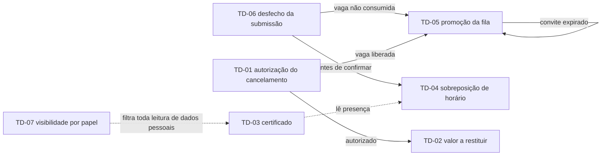

# 06 — Tabelas de Decisão das Políticas

## Por que tabela de decisão, e não texto corrido

As regras da Eventus não são sentenças isoladas: são **combinações**. Cancelar depende de quem
pediu, de quanto falta para o início, de o item ser cancelável e do estado vigente da inscrição —
quatro perguntas cujo produto cartesiano tem dezenas de resultados. Prosa não tem como provar que
todas foram consideradas; tabela tem, e por três motivos operacionais:

| Propriedade | O que a tabela entrega | O que o texto corrido não entrega |
|---|---|---|
| Visibilidade da lacuna | A combinação não coberta aparece como coluna ausente na conta de cobertura | A omissão fica indistinguível de uma decisão implícita |
| Verificabilidade | Cada coluna de regra é diretamente um caso de teste, com entradas e saída esperada | O revisor precisa inferir os casos a partir de conjunções em linguagem natural |
| Detecção de conflito | Duas colunas com as mesmas condições e ações distintas são um choque de regras visível | Contradições sobrevivem em parágrafos distantes um do outro |

Há um ganho adicional específico deste projeto. A tese da especificação é que as indefinições
OB1–OB8 não são pendências soltas, e sim **parâmetros do Perfil de Política do Evento**
(`PoliticaEvento`, RF-19, RN-03). Uma tabela de decisão parametrizada torna isso literal: a tabela
é a função, o perfil de política é o argumento. A mesma TD-01 autoriza o cancelamento no
Congresso Eventus de Tecnologia 2026 e o recusa no Encontro Corporativo Nexa sem que uma única
linha de regra mude — muda o parâmetro configurado por Rafael Nunes.

### Notação usada em todas as tabelas

| Símbolo | Significado |
|---|---|
| `C1`, `C2`, … | Condição de entrada, na metade superior da tabela |
| `A1`, `A2`, … | Ação resultante, na metade inferior, após a linha **Ações** |
| `R1`, `R2`, … | Uma coluna, ou seja, **uma regra** — a conjunção das condições da coluna |
| `S` / `N` | A condição é verdadeira / é falsa naquela regra |
| texto em itálico ou palavra curta | Valor de condição enumerada, por exemplo `org`, `part`, `<48h`, `ampliada` |
| `-` | Indiferente: a regra vale para qualquer valor da condição |
| `X` | A ação é executada quando a regra se aplica |

### Convenções de leitura

1. **As regras de uma tabela são mutuamente exclusivas e exaustivas** sobre o conjunto de
   combinações realizáveis. Nenhuma entrada pode casar com duas colunas, e nenhuma pode ficar sem
   coluna. A seção **Cobertura** de cada tabela demonstra isso por contagem.
2. **A avaliação usa sempre a política congelada na inscrição** (RF-20, RN-14), não a política
   vigente no evento no momento da avaliação. Onde este documento escreve "parâmetro do evento",
   leia "cópia do parâmetro gravada na inscrição no instante da confirmação".
3. **Combinação logicamente impossível não vira coluna.** Ela é declarada e justificada na seção
   Cobertura. Impossível aqui significa inexistente no domínio (por exemplo, avaliar a
   elegibilidade do primeiro da fila quando não há fila), não apenas improvável.
4. **Ações invariantes não viram linha de todos os `X`.** Quando uma ação ocorre em todas as
   regras — tipicamente o registro na trilha imutável (RF-34) — ela é declarada uma vez abaixo da
   tabela.
5. **Instantes em `America/Sao_Paulo` com fuso explícito** (RNF-23); antecedência é sempre medida
   até o **início do item**, com início inclusivo e fim exclusivo (RN-13).

### Índice das sete tabelas

| ID | Nome | Condições | Regras | Combinações realizáveis | RNs implementadas | Casos de uso que a invocam | Casos de teste derivados |
|---|---|---|---|---|---|---|---|
| TD-01 | Autorização do cancelamento da inscrição | 5 | 6 | 24 | RN-09, RN-14, RN-28, RN-30 | UC-04 | CT-14, CT-15, CT-17 |
| TD-02 | Apuração do valor a restituir | 4 | 8 | 17 | RN-22, RN-30, RN-16 | UC-04, UC-05 | CT-13, CT-15, CT-16 |
| TD-03 | Elegibilidade e liberação do certificado | 5 | 7 | 24 | RN-19, RN-23, RN-24, RN-25, RN-06 | UC-06 | CT-20, CT-21 |
| TD-04 | Tratamento da sobreposição de horário | 4 | 6 | 13 | RN-13, RN-01, RN-03 | UC-01, UC-02 | CT-11, CT-12 |
| TD-05 | Promoção da lista de espera e emissão do convite | 6 | 6 | 22 | RN-29, RN-21, RN-27, RN-12, RN-07 | UC-03, UC-02 | CT-09, CT-10 |
| TD-06 | Desfecho da submissão da inscrição por tipo de item e forma de pagamento | 7 | 9 | 80 | RN-08, RN-11, RN-10, RN-20, RN-26 | UC-01, UC-02 | CT-01, CT-02, CT-05, CT-08 |
| TD-07 | Campos visíveis do participante por papel | 7 | 10 | 288 | RN-15, RN-17, RN-04 | UC-08 | CT-22, CT-23 |

Total: **52 colunas de regra**, todas com desfecho definido.

### Encadeamento entre as tabelas

### Cenário de referência usado nos exemplos

Todos os exemplos deste documento usam três eventos fictícios da Eventus, com perfis de política
distintos e configurados por Rafael Nunes antes da abertura das inscrições (RN-03).

| Parâmetro | Congresso Eventus de Tecnologia 2026 | Workshop de Engenharia de Prompt (atividade do congresso, com inscrição própria) | Encontro Corporativo Nexa |
|---|---|---|---|
| Realização | 12 a 14/05/2026 · 800 vagas · R$ 480,00 (evento) | 13/05/2026, 14h00–18h00 · 40 vagas · R$ 180,00 | 08/04/2026, 09h00–12h00 · 120 vagas · fechado por convite, faturado à empresa contratante a R$ 480,00 por inscrição |
| `janelaCancelamento` | 48 h antes | 48 h antes (herdado) | não cancelável |
| `politicaReembolso` | escalonado 100 / 50 / 0 | escalonado 100 / 50 / 0 | não reembolsável |
| `modoListaEspera` | FIFO automática | FIFO automática | desabilitada |
| `criterioCertificado` | presença ≥ 75 % | presença ≥ 75 %, exige presença | automático no encerramento |
| `canaisNotificacao` | e-mail + in-app | e-mail + in-app | e-mail + in-app |
| `reservaDeVaga` | hold de 30 min | hold de 30 min (herdado) | somente após confirmação — liquidação por faturamento manual (RF-17) |
| `politicaConflitoHorario` | alertar e permitir | bloquear | permitir livremente |
| `visibilidadePalestrante` | mínima | mínima | mínima |

Demais atividades do congresso citadas nos exemplos: Painel de Abertura (12/05, 09h00–10h30, 800
vagas, exige presença), Oficina de Modelagem de Dados (12/05, 14h00–18h00, 40 vagas, R$ 180,00,
exige presença, `politicaConflitoHorario` sobrescrito para bloquear), Trilha de Arquitetura (12/05,
16h00–18h00, 120 vagas, R$ 120,00, não exige presença), Sessão Técnica Plenária (13/05,
09h00–11h00, 800 vagas), Fórum de Dados Abertos (13/05, 11h15–12h30, 200 vagas), Oficina de
Observabilidade em Produção (13/05, 16h00–19h00, 40 vagas, R$ 180,00, não cancelável), Painel de
Casos de Uso (14/05, 09h00–11h00, 800 vagas), Sessão Técnica de Resultados (14/05, 14h00–15h30, 800
vagas) e Mesa de Encerramento (14/05, 16h00–18h00, 800 vagas). A ficha completa, com as oito sessões
obrigatórias do congresso, está na seção 2.4 de `analise/regras-de-negocio.md`.

---

## TD-01 — Autorização do cancelamento da inscrição

**Pergunta que a tabela responde.** Este pedido de cancelamento pode ser executado agora, por quem
o pediu, e com qual transição de estado?

**Regras de negócio implementadas.** RN-09, RN-14, RN-28, RN-30.

| Condições | R1 | R2 | R3 | R4 | R5 | R6 |
|---|---|---|---|---|---|---|
| C1 Iniciativa do pedido (`org` = Eventus, `part` = participante) | org | org | part | part | part | - |
| C2 Alcance do ato da organização (`item` = item inteiro, `insc` = inscrição individual) | item | insc | - | - | - | - |
| C3 Estado vigente admite cancelamento (E-02 ou E-04) | S | S | S | S | S | N |
| C4 Item cancelável na política congelada | - | - | S | S | N | - |
| C5 Antecedência ≥ janela congelada (default 48 h) | - | - | S | N | - | - |
| **Ações** | | | | | | |
| A1 Autorizar e transitar para E-09 (cancelada pela organização) | X | X | | | | |
| A2 Autorizar e transitar para E-08 (cancelada pelo participante) | | | X | | | |
| A3 Recusar informando a data-limite esgotada e o canal alternativo | | | | X | | |
| A4 Recusar informando que o item é não cancelável desde a publicação | | | | | X | |
| A5 Recusar informando o estado vigente e as ações realmente disponíveis | | | | | | X |
| A6 Liberar a vaga e submeter o item a TD-05 | | X | X | | | |
| A7 Notificar inscritos e enfileirados da extinção ou do adiamento do item | X | | | | | |
| A8 Encaminhar a TD-02 com fator forçado em 1,00 (RN-30) | X | X | | | | |
| A9 Encaminhar a TD-02 pela faixa da política congelada | | | X | | | |

**Ações invariantes.** Toda avaliação — inclusive as recusadas — grava na trilha imutável autor,
papel, motivo, versão da política congelada e identificador de correlação (RF-34, RNF-16). Toda
transição efetivada dispara notificação por e-mail com espelho in-app (RF-27, RN-04).

**Cobertura.** 5 condições binárias produzem 2⁵ = **32 combinações formais**. São
**8 impossíveis**: a condição C2 só existe quando a iniciativa é da organização, logo o par
(`part`, alcance de item inteiro) não pertence ao domínio — 1 × 1 × 2 × 2 × 2 = 8 combinações.
Restam **24 realizáveis**, distribuídas sem sobreposição entre as 6 regras: R1 cobre 4, R2 cobre 4,
R3 cobre 1, R4 cobre 1, R5 cobre 2 e R6 cobre 12 (4 + 4 + 1 + 1 + 2 + 12 = 24). A regra R6 é
propositalmente ampla: qualquer estado fora de E-02 e E-04 — reserva vencida (E-03), convite
encerrado (E-07), inscrição já cancelada (E-08, E-09) ou certificado liberado (E-14) — recebe a
mesma recusa explicada, e não um erro genérico.

Uma degeneração merece registro: quando o item é não cancelável, a janela vale zero e a condição
C5 perde poder discriminante antes do início do item, razão pela qual R5 a marca `-`.

**Exemplo aplicado.** Marina Alves pede o cancelamento do Workshop de Engenharia de Prompt a
**30 horas** do início, com a inscrição em E-04. A leitura percorre C1 = `part`, C3 = S,
C4 = S (janela de 48 h configurada, item cancelável) e C5 = N, porque 30 h < 48 h. Aplica-se
**R4**: o sistema recusa o autosserviço, exibe a data-limite esgotada — 11/05/2026 14h00
(America/Sao_Paulo) — e oferece o canal alternativo de atendimento, sem alterar o estado da
inscrição (CT-14). Se o mesmo pedido tivesse sido feito a **72 horas** do início, a coluna seria a
R3, com transição para E-08, liberação da vaga para TD-05 e encaminhamento a TD-02.

---

## TD-02 — Apuração do valor a restituir

**Pergunta que a tabela responde.** Autorizado o cancelamento, quanto volta para o participante,
por qual fator, e quem precisa aprovar antes do estorno?

**Regras de negócio implementadas.** RN-22, RN-30, RN-16.

| Condições | R1 | R2 | R3 | R4 | R5 | R6 | R7 | R8 |
|---|---|---|---|---|---|---|---|---|
| C1 Valor líquido pago, descontados estornos anteriores, maior que zero | N | S | S | S | S | S | S | S |
| C2 Iniciativa da organização (RN-30) | - | S | S | N | N | N | N | N |
| C3 Faixa de antecedência do pedido | - | - | - | ≥7d | ≥7d | 7d–48h | 7d–48h | <48h |
| C4 Valor calculado ≤ teto de aprovação automática | - | S | N | S | N | S | N | - |
| **Ações** | | | | | | | | |
| A1 Aplicar fator 1,00 | | X | X | X | X | | | |
| A2 Aplicar fator 0,50 | | | | | | X | X | |
| A3 Aplicar fator 0,00 | X | | | | | | | X |
| A4 Abrir caso de reembolso e transitar a inscrição para E-10 | | X | X | X | X | X | X | |
| A5 Aprovar automaticamente, dentro do teto | | X | | X | | X | | |
| A6 Exigir aprovador distinto do solicitante e executor distinto do aprovador | | | X | | X | | X | |
| A7 Executar o estorno pelo mesmo meio do pagamento e transitar para E-11 | | X | X | X | X | X | X | |
| A8 Encerrar sem abrir caso, informando a faixa aplicada e o motivo | X | | | | | | | X |

**Ações invariantes.** A memória de cálculo — valor pago, estornos anteriores, faixa aplicada,
fator, valor a restituir e prazo estimado — é exibida antes da confirmação em 100 % dos
cancelamentos (RNF-22) e replicada no comprovante enviado (RF-27). Todo caso registra solicitante,
aprovador e executor na trilha (RF-34).

**Cobertura.** 2 × 2 × 3 × 2 = **24 combinações formais**. São **7 impossíveis**: (a) sem valor
líquido a restituir o valor calculado é zero e portanto sempre menor que o teto, o que elimina
C1 = N combinado com C4 = N — 2 × 3 = 6 combinações; (b) na faixa `<48h` sem iniciativa da
organização o fator é 0,00 e o valor calculado também é zero, o que elimina mais 1 combinação.
Restam **17 realizáveis**: R1 cobre 6, R2 cobre 3, R3 cobre 3, R4 a R8 cobrem 1 cada
(6 + 3 + 3 + 1 + 1 + 1 + 1 + 1 = 17).

Duas observações de projeto. Primeira: **R8 é alcançável** apesar de TD-01 recusar cancelamentos a
menos de 48 h no perfil de referência, porque `janelaCancelamento` e `politicaReembolso` são
parâmetros independentes — em um evento com janela "até o início" e reembolso escalonado, cancelar
a 10 h do início é autorizado e restitui zero. Segunda: a linha C2 domina C3, e é isso que RN-30
determina — cancelamento ou adiamento por iniciativa da Eventus restitui integralmente, sem
dedução e sem consultar a faixa.

**Exemplo aplicado.** Marina cancela o Workshop de Engenharia de Prompt a **3 dias** do início,
com R$ 180,00 líquidos pagos e nenhum estorno anterior. A leitura dá C1 = S, C2 = N,
C3 = `7d–48h`, e o valor calculado é 180,00 × 0,50 = **R$ 90,00**, abaixo do teto de aprovação
automática, logo C4 = S. Aplica-se **R6**: caso aberto (E-10), aprovação automática, estorno de
R$ 90,00 no mesmo cartão usado no pagamento e transição para E-11 (CT-13). Se o valor pago fosse
R$ 1.020,00 — inscrição do Congresso somada às três oficinas pagas — o valor calculado seria R$ 510,00,
acima do teto de R$ 500,00, e a coluna passaria a ser a **R7**: Cleide Barros pode instruir o caso,
mas a aprovação exige um segundo usuário e a execução do estorno, um terceiro (CT-16).

---

## TD-03 — Elegibilidade e liberação do certificado

**Pergunta que a tabela responde.** Este participante pode emitir o certificado deste item agora,
com qual carga horária, e se não pode, por qual critério exatamente?

**Regras de negócio implementadas.** RN-19, RN-23, RN-24, RN-25, RN-06.

| Condições | R1 | R2 | R3 | R4 | R5 | R6 | R7 |
|---|---|---|---|---|---|---|---|
| C1 Item encerrado | N | S | S | S | S | S | S |
| C2 `criterioCertificado` da política congelada | - | auto | presença | presença | presença | manual | manual |
| C3 Percentual de presença apurado ≥ limiar (default 75 %) | - | - | S | N | N | - | - |
| C4 Pedido de revisão de presença em curso | - | - | - | N | S | - | - |
| C5 Aprovação manual do organizador registrada | - | - | - | - | - | S | N |
| **Ações** | | | | | | | |
| A1 Manter indisponível, informando a data prevista de liberação | X | | | | | | |
| A2 Liberar a emissão autosserviço e transitar para E-14 | | X | X | | | X | |
| A3 Recusar informando o critério não atendido, o percentual apurado e a opção de revisão (E-13) | | | | X | | | |
| A4 Suspender a apuração até o desfecho da revisão, sem tornar E-13 definitivo | | | | | X | | |
| A5 Exibir situação "em análise pelo organizador" com prazo de resposta | | | | | | | X |
| A6 Consolidar a carga horária somente das atividades com check-in confirmado | | | X | | | X | |
| A7 Declarar a carga horária pela duração das atividades confirmadas na inscrição | | X | | | | | |
| A8 Gerar código de verificação único, público e permanente (RN-06) | | X | X | | | X | |

**Ações invariantes.** A liberação ocorre em até 48 h do encerramento do item (RN-25) e não exige
solicitação à organização (RF-24). Toda emissão e toda revogação alimentam a página pública de
verificação (RF-25) e a trilha (RF-34).

**Cobertura.** 2 × 3 × 2 × 2 × 2 = **48 combinações formais**. São **24 impossíveis**, por dois
motivos que se sobrepõem parcialmente: (a) a aprovação manual registrada (C5 = S) só existe quando
o critério é `manual` — 16 combinações; (b) o pedido de revisão de presença (C4 = S) pressupõe item
encerrado e apuração já realizada, o que elimina C1 = N com C4 = S — 12 combinações, das quais 4 já
estavam contadas em (a). Total 16 + 12 − 4 = 24. Restam **24 realizáveis**: R1 cobre 8, R2 cobre 4,
R3 cobre 2, R4 cobre 1, R5 cobre 1, R6 cobre 4 e R7 cobre 4 (8 + 4 + 2 + 1 + 1 + 4 + 4 = 24).

A assimetria entre A6 e A7 é deliberada e precisa de homologação: RN-24 define carga horária pela
soma das atividades com check-in confirmado, o que não se aplica ao critério `auto`, usado em
eventos corporativos de participação única, onde não há check-in por sessão.

**Exemplo aplicado.** Marina cursa 5 das 8 sessões obrigatórias do Congresso Eventus de
Tecnologia 2026. O percentual apurado é 5 ÷ 8 × 100 = 62,5, arredondado para baixo para **62 %**
(RN-23), abaixo do limiar de 75 %. Com o item encerrado e sem pedido de revisão, a coluna é a
**R4**: certificado indisponível, com a mensagem nomeando o critério — "presença mínima de 75 %,
apurado 62 %, 5 de 8 sessões obrigatórias" — e o botão de pedido de revisão (CT-20). Marina abre a
revisão alegando falha de leitura do QR no Painel de Abertura; enquanto o pedido corre, a coluna
passa a ser a **R5** e a inscrição não fecha em E-13. Aceita a correção manual pelo operador de
credenciamento com justificativa auditada (RF-23), o percentual vai a 75 %, a coluna passa a R3 e o
certificado é liberado declarando apenas as 6 atividades com check-in confirmado (CT-21).

---

## TD-04 — Tratamento da sobreposição de horário

**Pergunta que a tabela responde.** Esta nova inscrição colide com algo que já está na agenda do
participante e, se colide, o sistema bloqueia, alerta ou apenas registra?

**Regras de negócio implementadas.** RN-13, RN-01, RN-03.

| Condições | R1 | R2 | R3 | R4 | R5 | R6 |
|---|---|---|---|---|---|---|
| C1 Há interseção de intervalos com atividade ativa na agenda (início inclusivo, fim exclusivo) | N | S | S | S | S | S |
| C2 `politicaConflitoHorario` do evento | - | - | bloquear | alertar | alertar | livre |
| C3 Alguma das atividades envolvidas exige presença para certificado | - | S | N | N | N | N |
| C4 Participante confirmou ciência da sobreposição | - | - | - | N | S | - |
| **Ações** | | | | | | |
| A1 Prosseguir sem qualquer aviso de conflito | X | | | | | |
| A2 Exibir alerta nomeando a atividade concorrente e ofertar horários alternativos | | X | X | X | | |
| A3 Bloquear a inclusão e preservar a inscrição já existente | | X | X | | | |
| A4 Manter a operação pendente até a decisão explícita do participante | | | | X | | |
| A5 Concluir a inscrição registrando a confirmação consciente na inscrição e na trilha | | | | | X | |
| A6 Concluir a inscrição e marcar a sobreposição na agenda pessoal | | | | | X | X |

**Ações invariantes.** A agenda pessoal exibe a marcação de sobreposição de forma permanente,
independentemente do desfecho da inscrição (RF-22).

**Cobertura.** 2 × 3 × 2 × 2 = **24 combinações formais**. São **11 impossíveis**, todas
decorrentes de C4: a confirmação consciente só é solicitada quando existe alerta a confirmar.
Isso elimina (a) C4 = S sem interseção — 6 combinações; (b) C4 = S com parâmetro `bloquear` ou
`livre`, que não pedem confirmação — 4 combinações; (c) C4 = S com `alertar` e exigência de
presença, hipótese em que o bloqueio de RN-13 prevalece e o alerta não é confirmável — 1
combinação. Restam **13 realizáveis**: R1 cobre 6, R2 cobre 3, R3 a R6 cobrem 1 cada
(6 + 3 + 1 + 1 + 1 + 1 = 13).

A coluna R2 é a mais importante da tabela: ela marca C2 como `-`, ou seja, **a exigência de
presença para certificado vence o parâmetro do evento**. Um evento configurado como "permitir
livremente" ainda assim bloqueia a sobreposição entre duas atividades certificáveis, porque a
alternativa seria emitir certificado de carga horária fisicamente impossível.

**Exemplo aplicado.** Marina já está inscrita no Workshop de Engenharia de Prompt, das 14h00 às
18h00 de 13/05/2026, e tenta incluir a Oficina de Observabilidade em Produção, das 16h00 às 19h00
do mesmo dia. Há interseção de 2 horas, logo C1 = S. As duas exigem presença para certificado,
logo C3 = S. Aplica-se **R2**: a inclusão é bloqueada, a mensagem nomeia a atividade concorrente e
oferta as atividades com vaga em faixa livre da mesma grade, e o parâmetro do congresso
(`alertar e permitir`) não é consultado (CT-11). Se a tentativa fosse somar, em 12/05, a
Mesa-redonda de IA Responsável (09h30–10h30) à Sessão de Pôsteres (09h30–11h00) — nenhuma delas com
exigência de presença —, a coluna seria a **R4**, com alerta e operação pendente, e só após a
confirmação consciente a coluna R5 concluiria a inscrição, deixando o registro do aceite disponível
para eventual contestação futura (CT-12).

---

## TD-05 — Promoção da lista de espera e emissão do convite

**Pergunta que a tabela responde.** Liberou-se uma vaga: ela volta ao público, vira convite para
alguém da fila, ou nada acontece?

**Regras de negócio implementadas.** RN-29, RN-21, RN-27, RN-12, RN-07.

| Condições | R1 | R2 | R3 | R4 | R5 | R6 |
|---|---|---|---|---|---|---|
| C1 Motivo preserva o item (cancelamento, expiração de reserva, ampliação de capacidade, cancelamento administrativo) | N | S | S | S | S | S |
| C2 Fila ativa no item com ao menos um enfileirado | - | N | S | S | S | S |
| C3 Primeiro enfileirado elegível (RN-10, conta apta) | - | - | - | N | S | S |
| C4 Faltam mais de 6 h para o início da atividade (RN-21) | - | - | N | S | S | S |
| C5 Desfecho do convite anterior foi recusa ou expiração (cascata em curso) | - | - | - | - | - | - |
| C6 E-mail do convite com entrega confirmada (RNF-11) | - | - | - | - | S | N |
| **Ações** | | | | | | |
| A1 Devolver a vaga ao conjunto disponível e recalcular o rótulo de disponibilidade (RN-26) | | X | X | | | |
| A2 Emitir convite ao primeiro elegível em até 2 min, com reserva exclusiva (E-06) | | | | | X | X |
| A3 Calcular o prazo do convite como menor valor entre emissão + 24 h e início − 6 h | | | | | X | X |
| A4 Pular o enfileirado inelegível e reavaliar a tabela para o próximo | | | | X | | |
| A5 Encerrar a fila e informar aos enfileirados que não haverá novos convites | X | | X | | | |
| A6 Suspender o convite não entregue sem consumir prazo, preservar a posição original do enfileirado e alertar o organizador (RF-29) | | | | | | X |
| A7 Recalcular as posições da fila e publicá-las aos enfileirados (RN-27) | | X | X | X | X | X |

**Ações invariantes.** Nenhuma regra devolve ao conjunto público uma vaga com convite vigente
(RN-12), e a soma de confirmadas, reservas, convites e bloqueios permanece menor ou igual à
capacidade em toda avaliação (RN-07).

**Cobertura.** 2⁶ = **64 combinações formais**, com três restrições estruturais: sem fila não há
primeiro enfileirado a julgar nem convite anterior (C2 = N implica C3 = N e C5 = N); e a entrega
do e-mail só é observável quando houve emissão, isto é, quando C1, C2, C3 e C4 são todos
verdadeiros. Isso torna **42 combinações impossíveis** e deixa **22 realizáveis**: R1 cobre 10,
R2 cobre 2, R3 cobre 4, R4 cobre 2, R5 cobre 2 e R6 cobre 2 (10 + 2 + 4 + 2 + 2 + 2 = 22).

A condição C5 aparece marcada `-` em todas as regras, e isso é um resultado da análise, não um
descuido: **a cascata não é um ramo distinto**, é a reaplicação da mesma tabela ao próximo da fila.
Documentá-la como linha não discriminante é o que impede que alguém a implemente como fluxo
paralelo em UC-03.

R6 merece leitura atenta, porque é o único ramo em que a fila avança sem que o convidado tenha
decidido nada. Esgotadas as três retentativas de RNF-11 sem entrega confirmada, o convite é
suspenso **sem consumir prazo**, a vaga permanece fora do conjunto público (A1 não é marcada) e
segue ao próximo elegível (A2, A3), enquanto o enfileirado cujo e-mail falhou **conserva a posição
original** para a próxima liberação — perder a vez por falha do canal oficial não é desistência
(LAC-05). A6 é alerta ao organizador, não bloqueio: reter a vaga à espera de decisão humana faria a
fila parar por um problema de infraestrutura, contrariando a promoção automática de RN-29.

**Exemplo aplicado.** Faltando **três dias** para o Workshop de Engenharia de Prompt, a reserva de
outro participante expira sem liquidação e devolve uma vaga (C1 = S). A fila tem 7 pessoas
(C2 = S). O primeiro é Téo Miranda, que já possui inscrição confirmada no mesmo workshop feita por
outro caminho, logo é inelegível por RN-10 (C3 = N): aplica-se **R4**, ele é pulado e a tabela é
reavaliada para o segundo. O segundo é elegível, faltam mais de 6 h (C4 = S) e o e-mail é entregue
(C6 = S): aplica-se **R5**, com convite emitido às 09h12 e prazo de aceite até 09h12 do dia
seguinte, porque emissão + 24 h é anterior a início − 6 h (RN-21, CT-09). Caso o e-mail retorne
falha definitiva após três retentativas, a coluna seria a **R6**: o convite é suspenso sem consumir
prazo, o segundo volta à sua posição original, a vaga — que não volta ao público em momento algum —
segue ao terceiro da fila, e o painel de Rafael acusa o alerta de falha de notificação (RF-29).

---

## TD-06 — Desfecho da submissão da inscrição por tipo de item e forma de pagamento

**Pergunta que a tabela responde.** Submetida a solicitação, o participante sai confirmado, com
reserva, pendente, enfileirado ou recusado?

**Regras de negócio implementadas.** RN-08, RN-11, RN-10, RN-20, RN-26.

| Condições | R1 | R2 | R3 | R4 | R5 | R6 | R7 | R8 | R9 |
|---|---|---|---|---|---|---|---|---|---|
| C1 Participante já possui inscrição ativa ou posição na fila do mesmo item (RN-10) | S | N | N | N | N | N | N | N | N |
| C2 Item gratuito, com valor devido igual a zero | - | - | - | - | - | S | N | N | N |
| C3 Vaga válida no evento, confirmada ou obtida na mesma submissão (RN-01) | - | N | N | S | S | S | S | S | S |
| C4 Vaga disponível na atividade solicitada (RN-20) | - | - | - | N | N | S | S | S | S |
| C5 Meio de pagamento escolhido | - | - | - | - | - | - | cartão ou PIX | cartão ou PIX | boleto ou faturamento |
| C6 `modoListaEspera` habilitado no item | - | S | N | S | N | - | - | - | - |
| C7 `reservaDeVaga` da política congelada é hold temporário | - | - | - | - | - | N | S | N | - |
| **Ações** | | | | | | | | | |
| A1 Recusar a submissão informando a inscrição ou a posição já existente | X | | | | | | | | |
| A2 Confirmar no ato (E-04) e emitir o comprovante de inscrição confirmada com código de check-in | | | | | | X | | | |
| A3 Criar reserva de 30 min (E-02) com contador regressivo e instante de expiração visíveis | | | | | | | X | | |
| A4 Criar solicitação pendente sem consumir vaga, com aviso destacado de que a vaga não está garantida | | | | | | | | X | X |
| A5 Oferecer entrada na fila (E-05), devolvendo posição e regras do convite | | X | | X | | | | | |
| A6 Recusar por esgotamento sem fila, exibindo o rótulo "esgotado" (RN-26) | | | X | | X | | | | |
| A7 Bloquear apenas o item indisponível e preservar os demais itens da mesma submissão (RF-08) | | X | X | X | X | | | | |
| A8 Emitir comprovante de solicitação com protocolo, prazo e declaração de que não garante vaga | | | | | | | X | X | X |

**Ações invariantes.** Toda submissão é idempotente por chave de requisição, de modo que reenvios
concorrentes produzem efeito único (RF-09, RNF-07), e o decremento de disponibilidade é atômico e
serializado por item (RF-12, RNF-06).

**Cobertura.** 2⁷ = **128 combinações formais**. São **48 impossíveis**, por duas restrições que se
sobrepõem: (a) em item gratuito não existe meio de pagamento, logo um dos dois valores de C5 é
espúrio sempre que C2 = S — 32 combinações; (b) RN-08 proíbe reserva temporária em item gratuito,
logo C2 = S com C7 = S não pertence ao domínio — outras 32, das quais 16 já contadas em (a). Total
32 + 32 − 16 = 48. Restam **80 realizáveis**: R1 cobre 40, R2 cobre 10, R3 cobre 10, R4 cobre 5,
R5 cobre 5, R6 cobre 2, R7 cobre 2, R8 cobre 2 e R9 cobre 4
(40 + 10 + 10 + 5 + 5 + 2 + 2 + 2 + 4 = 80).

R8 e R9 são as duas colunas em que o participante sai da submissão sem vaga e sem fila, por motivos
distintos. R9 existe por causa de INC-05: um meio de compensação em dias é incompatível com uma
reserva de 30 minutos, e em vez de escolher entre furar a reserva e proibir o boleto a tabela cria
um desfecho próprio — solicitação pendente que **não consome vaga**, com aviso explícito na tela e
no comprovante. R8 existe por causa de OB6: é o item oneroso de evento configurado como
`somenteAposConfirmacao`, caso do Encontro Corporativo Nexa, faturado à empresa contratante. Sem a
condição C7, o parâmetro que resolve OB6 não teria coluna alguma na tabela que deveria consumi-lo,
e um item oneroso sem hold cairia em R7, criando reserva onde a política a proíbe.

**Exemplo aplicado.** Marina seleciona, em uma única operação, a inscrição no Congresso Eventus de
Tecnologia 2026 e três atividades. Há vaga no evento (C3 = S) e nas duas primeiras — Oficina de
Modelagem de Dados e Oficina de Observabilidade em Produção, R$ 180,00 cada —, que, com
`reservaDeVaga` em hold temporário (C7 = S),
seguem por **R7**: reserva de 30 minutos e um único pagamento de R$ 840,00 por cartão, com
comprovante de solicitação e contador visível até 10h47 (CT-02). A terceira atividade, o Workshop
de Engenharia de Prompt, está esgotada com fila habilitada e segue por **R4**: Marina recebe a
posição 12 na fila sem que isso desfaça as demais (CT-08). Se ela tentar entrar na fila uma segunda
vez, a submissão cai em **R1** e é recusada por RN-10.

---

## TD-07 — Campos visíveis do participante por papel

**Pergunta que a tabela responde.** Quando um papel pede um dado de um participante, esse campo é
devolvido, devolvido apenas em contagem, suprimido ou negado — e por qual fundamento?

**Regras de negócio implementadas.** RN-15, RN-17, RN-04. Esta é a tabela que fecha **OB8**, e o
critério de composição não é hierarquia de cargo: é **minimização** (LGPD, art. 6º, III). Um campo
só aparece para um papel se for necessário para uma tarefa que aquele papel de fato executa no
sistema.

### Marcação usada nesta seção

| Marcação | Significado operacional |
|---|---|
| `sempre` | Campo retornado sem condição adicional, desde que o papel tenha escopo válido sobre o item |
| `consentido` | Campo retornado apenas enquanto houver consentimento específico e vigente daquele titular; a revogação o remove das visões e das exportações em até 60 s (RNF-17) |
| `agregado` | Campo não retornado de forma nominal; entra apenas em contagem, com supressão de recortes com menos de 5 pessoas |
| `parametrizado` | Campo retornado somente quando `visibilidadePalestrante` do evento é `padrão` ou `ampliada`; sob `mínima` ele não compõe a resposta |
| `excepcional` | Campo acessível apenas em operação de suporte com motivo declarado, aprovação registrada e identificação nominal do autor na trilha (RF-34) |
| `nunca` | Campo não retornado a esse papel em nenhuma composição de resposta, tela, relatório ou exportação |

### Matriz de visibilidade por papel

Escopo pressuposto em todas as colunas: organizador restrito aos eventos sob sua responsabilidade,
palestrante restrito às atividades em que está designado, operador de credenciamento restrito à
atividade e ao dia (RF-33, LAC-13).

| Campo do participante | Titular (Marina) | Organizador no escopo (Rafael) | Palestrante designado (Dra. Helena) | Operador de credenciamento | Financeiro (Cleide) | TI em produção (Téo) | Verificação pública do certificado |
|---|---|---|---|---|---|---|---|
| Nome social ou completo | sempre | sempre | sempre | sempre | sempre | excepcional | sempre |
| Organização declarada | sempre | sempre | sempre | nunca | sempre | excepcional | nunca |
| Situação da inscrição | sempre | sempre | sempre | sempre | sempre | excepcional | nunca |
| Campos declarados pelo participante para a atividade | sempre | sempre | parametrizado | nunca | nunca | excepcional | nunca |
| E-mail | sempre | sempre | consentido | nunca | sempre | excepcional | nunca |
| Telefone | sempre | sempre | nunca | nunca | nunca | excepcional | nunca |
| Documento de identificação | sempre | excepcional | nunca | nunca | sempre | excepcional | nunca |
| Meio de pagamento (token, bandeira, 4 últimos dígitos) | sempre | nunca | nunca | nunca | sempre | excepcional | nunca |
| Valor pago e situação da cobrança | sempre | agregado | nunca | nunca | sempre | excepcional | nunca |
| Necessidades de acessibilidade | sempre | sempre | nunca | nunca | nunca | excepcional | nunca |
| Restrições alimentares | sempre | agregado | nunca | nunca | nunca | excepcional | nunca |
| Registros de check-in | sempre | sempre | agregado | sempre | nunca | excepcional | nunca |
| Certificado emitido e código de verificação | sempre | agregado | nunca | nunca | nunca | excepcional | sempre |
| Demais atividades do participante no mesmo evento | sempre | sempre | nunca | nunca | nunca | excepcional | nunca |
| Distribuição agregada do público | nunca | agregado | agregado | nunca | agregado | excepcional | nunca |

Três leituras que essa matriz torna explícitas: a coluna do palestrante contém exatamente cinco
campos além do agregado, e nenhum deles é de contato sem consentimento (RN-15, RF-31); a coluna
da verificação pública devolve apenas o registro do código consultado, sem listagem e sem qualquer
outro dado pessoal (RF-25); e a coluna de TI não tem nenhum `sempre`, o que operacionaliza a
diretriz de que a equipe técnica não possui acesso corrente a dados pessoais em produção
(LAC-13). Restrição alimentar aparece como `agregado` para o organizador porque a tarefa real —
dimensionar o serviço de alimentação — é satisfeita por contagem; a lista nominal só é liberada ao
fornecedor mediante finalidade declarada e registro.

### Tabela de decisão da resolução de um campo

| Condições | R1 | R2 | R3 | R4 | R5 | R6 | R7 | R8 | R9 | R10 |
|---|---|---|---|---|---|---|---|---|---|---|
| C1 Solicitante é o próprio titular | S | N | N | N | N | N | N | N | N | N |
| C2 Papel do solicitante tem escopo válido sobre o item | - | N | S | S | S | S | S | S | S | S |
| C3 Classe do campo pedido | - | - | - | mínima | mínima | contato | contato | especial | agregado | agregado |
| C4 `visibilidadePalestrante` do evento | - | - | - | mínima | padrão ou ampliada | - | - | - | - | - |
| C5 Consentimento específico e vigente do titular | - | - | - | - | - | S | N | - | - | - |
| C6 Operação é exportação sem finalidade declarada | - | - | S | N | N | N | N | N | N | N |
| C7 Recorte do indicador agregado tem 5 pessoas ou mais | - | - | - | - | - | - | - | - | S | N |
| **Ações** | | | | | | | | | | |
| A1 Retornar o valor do campo | X | | | X | X | X | | | | |
| A2 Retornar o campo suprimido, com o motivo "não consentido" no lugar do valor | | | | | | | X | | | |
| A3 Retornar o indicador agregado | | | | | | | | | X | |
| A4 Suprimir o recorte e devolver "amostra insuficiente" | | | | | | | | | | X |
| A5 Negar a operação informando o fundamento: escopo ausente (R2) ou classe vedada a terceiros (R8) | | X | | | | | | X | | |
| A6 Bloquear a exportação até a declaração de finalidade | | | X | | | | | | | |
| A7 Registrar o acesso na trilha com autor, papel, finalidade e correlação | | X | X | X | X | X | X | X | X | X |
| A8 Acrescentar à resposta os campos que o próprio participante declarou para a atividade | | | | | X | | | | | |

Classes de campo usadas em C3: `mínima` = nome social ou completo, organização e situação da
inscrição, mais os campos declarados pelo participante quando o parâmetro os habilita (A8);
`contato` = e-mail e telefone; `especial` = documento, meio de pagamento, necessidades
de acessibilidade e restrições alimentares; `agregado` = indicadores de distribuição do público.

**Ações invariantes.** O acesso do próprio titular é atendido pela central de privacidade (RF-03) e
não constitui acesso de terceiro; todas as demais regras registram na trilha, inclusive as negadas
— tentativa negada também é evidência (RF-34, RNF-17).

**Cobertura.** 2 × 2 × 4 × 3 × 2 × 2 × 2 = **384 combinações formais**. São **96 impossíveis**: o
titular sempre tem escopo sobre os próprios dados, logo C1 = S com C2 = N não pertence ao domínio
— 4 × 3 × 2 × 2 × 2 = 96. Restam **288 realizáveis**: R1 cobre 96, R2 cobre 96, R3 cobre 48,
R4 cobre 4, R5 cobre 8, R6 cobre 6, R7 cobre 6, R8 cobre 12, R9 cobre 6 e R10 cobre 6
(96 + 96 + 48 + 4 + 8 + 6 + 6 + 12 + 6 + 6 = 288).

A coluna R8 não tem exceção parametrizável: nenhum valor de `visibilidadePalestrante` e nenhum
consentimento tornam campo especial visível a terceiro dentro do produto (RN-15). Já o
consentimento opera exclusivamente sobre a classe `contato`, e ali é **trava única e suficiente**:
sob qualquer valor do parâmetro — inclusive o default `mínima` — o consentimento específico e
vigente devolve o contato (R6), e a revogação o suprime das visões e exportações em até 60 s (R7,
RNF-17). O parâmetro do evento não gradua o contato; ele gradua a classe `mínima`, decidindo se os
campos declarados pelo participante para a atividade acompanham nome, organização e situação — é a
única diferença entre R4 e R5.

**Exemplo aplicado.** Dra. Helena Prado abre a lista da Oficina de Modelagem de Dados, com 38
inscritos. Ela está designada na atividade, logo C2 = S, e a consulta é em tela, logo C6 = N. Para
nome, organização e situação, com o congresso configurado em `mínima`, a coluna é a **R4** e os
valores são devolvidos (CT-23). Para e-mail, o parâmetro não é consultado: dos 38 inscritos, seis
concederam consentimento específico e vigente e caem na **R6**, com o endereço à vista; os 32
restantes caem na **R7**, e no lugar do valor aparece a marca "não consentido", não um erro de
permissão. Se um dos seis revogar o consentimento na central de privacidade (RF-03), aquela linha
migra de R6 para R7 em até 60 s, sem ação de Helena nem da organização (RNF-17, CT-23). Ao abrir os
indicadores, a distribuição por área de atuação devolve "Dados: 14, Engenharia: 11, Produto: 6"
pela **R9**, mas o recorte "Setor público: 3" cai na **R10** e retorna "amostra insuficiente"
(RF-32). Se Rafael reconfigurasse o evento para `padrão`, a classe mínima passaria de R4 para
**R5** e a lista exibiria também a área de atuação e o nível de experiência que cada participante
declarou na própria inscrição — os contatos, esses, continuariam governados apenas pelo
consentimento.

---

## Parametrização: a mesma tabela, resultados diferentes

Nenhuma das sete tabelas contém um número de política em suas colunas. Os números vivem no Perfil
de Política do Evento (RF-19), são copiados para a inscrição na confirmação (RF-20, RN-14) e são
lidos pela tabela na avaliação. A consequência prática é que **alterar o comportamento do sistema
para um novo evento é configuração, não desenvolvimento** (RNF-24).

| Parâmetro | Tabelas que o consomem | Célula concretamente afetada |
|---|---|---|
| `janelaCancelamento` | TD-01 | C4 (item cancelável) e C5 (corte de antecedência) |
| `politicaReembolso` | TD-02 | C3 (número e limites das faixas) e o fator de A1 a A3 |
| `modoListaEspera` | TD-05, TD-06 | C2 e C4 de TD-05, C6 de TD-06, e o rótulo de disponibilidade de RN-26 |
| `criterioCertificado` | TD-03, TD-04 | C2, C3 e C5 de TD-03, e C3 de TD-04, que pode forçar o bloqueio |
| `canaisNotificacao` | TD-05 | C6, que suspende o convite dependente de e-mail não entregue |
| `reservaDeVaga` | TD-06, TD-05 | C7 de TD-06, que decide entre A3 (reserva de 30 min) e A4 (solicitação pendente sem consumir vaga); nunca alcança A2, porque a confirmação no ato depende só da gratuidade (RN-08). Em TD-05, o motivo de liberação em C1 |
| `politicaConflitoHorario` | TD-04 | C2, exceto quando R2 o torna irrelevante |
| `visibilidadePalestrante` | TD-07 | C4, que decide se a classe `mínima` incorpora os campos declarados pelo participante (R4 contra R5); a classe `contato` responde apenas ao consentimento de C5 |

### Demonstração: um mesmo pedido, três perfis

Entrada fixa: Marina pede o cancelamento a **30 horas** do início, com R$ 180,00 líquidos pagos.

| Perfil de política | TD-01 | TD-02 | Desfecho para Marina |
|---|---|---|---|
| Congresso Eventus de Tecnologia 2026 (janela 48 h, escalonado) | R4 | não avaliada | Cancelamento recusado, data-limite esgotada e canal alternativo informados; inscrição permanece em E-04 |
| Edição avulsa do Workshop de Engenharia de Prompt (janela "até o início", escalonado) | R3 | R8 | Cancelamento efetivado em E-08, restituição de R$ 0,00 com memória de cálculo exibida antes da confirmação; vaga liberada aciona TD-05 |
| Encontro Corporativo Nexa (não cancelável, faturado à empresa contratante) | R5 | não avaliada | Cancelamento recusado por item não cancelável, condição que já constava da página de detalhe antes da inscrição |

Entrada fixa: Marina tenta se inscrever em duas atividades com 60 minutos de sobreposição.

| Perfil de política | TD-04 | Desfecho |
|---|---|---|
| Congresso Eventus de Tecnologia 2026, nenhuma das duas exige presença | R4, depois R5 | Alerta com a atividade concorrente nomeada; conclui após confirmação consciente registrada |
| Workshop de Engenharia de Prompt, que exige presença para certificado | R2 | Bloqueio, independentemente de o congresso estar configurado como "alertar e permitir" |
| Encontro Corporativo Nexa, `permitir livremente`, certificado automático | R6 | Conclui sem alerta, com a sobreposição apenas marcada na agenda pessoal |

### Precedências que a parametrização não pode inverter

Três resultados atravessam qualquer configuração e existem para impedir que uma escolha de
política produza estado inconsistente ou ilegal:

| Precedência | Tabela e coluna | Fundamento |
|---|---|---|
| Cancelamento por iniciativa da Eventus restitui 100 % | TD-02, R2 e R3 | RN-30 |
| Sobreposição entre atividades certificáveis é bloqueada | TD-04, R2 | RN-13 |
| Campo especial nunca é exposto a terceiro | TD-07, R8 | RN-15, RNF-17 |
| Vaga sob convite vigente não retorna ao conjunto público | TD-05, R5 e R6 | RN-12, RN-07 |
| Valor devido maior que zero nunca confirma sem liquidação | TD-06, R7, R8 e R9 | RN-08 |

---

## Decisões ainda abertas nestas tabelas

Todas as células abaixo estão **preenchidas com o valor padrão recomendado por este trabalho**, e
não em branco: a tabela é executável hoje. O que muda com a homologação é o valor, não a estrutura
da tabela — e, na maioria dos casos, nem o número de colunas.

| # | Célula ou parâmetro | Valor padrão adotado nas tabelas | Questão | Responsável | O que muda se a homologação divergir |
|---|---|---|---|---|---|
| 1 | TD-01, C5 — corte de antecedência | ⚠️ 48 h antes do início | LAC-01, OB1 | Rafael Nunes | Só o limiar de R3 e R4; nenhuma coluna nasce ou morre |
| 2 | TD-01, C4 — representação de "não cancelável" | ⚠️ Sinalizador próprio, distinto de janela igual a zero | ❓ RN-09 trata os dois casos como janela zero, o que impede expressar "cancelável até o início" | Rafael Nunes | Se a leitura de RN-09 prevalecer, R5 absorve o caso "até o início" e o perfil correspondente deixa de ser configurável |
| 3 | TD-02, C3 — faixas e cortes | ⚠️ 100 % até 7 dias, 50 % de 7 dias a 48 h, 0 % depois | LAC-02, OB2 | Cleide Barros | Cada faixa adicional acrescenta duas colunas, uma dentro e outra acima do teto |
| 4 | TD-02, C4 — teto de aprovação automática | ⚠️ R$ 500,00 por caso | RN-16, F2; valor não fixado no registro canônico | Cleide Barros | Só o ponto de corte entre aprovação automática e segunda alçada |
| 5 | TD-02, C1 — base de cálculo | ⚠️ Valor líquido pago, sem dedução da taxa do prestador | LAC-10 | Cleide Barros | Se a taxa for deduzida, A7 muda e a memória de cálculo ganha uma linha |
| 6 | TD-03, C3 — limiar de presença | ⚠️ 75 % das sessões obrigatórias, arredondado para baixo | LAC-04, RN-23 | Rafael Nunes | Só o limiar; limiares por atividade exigiriam tornar C3 parametrizável por item |
| 7 | TD-03, A7 — carga horária no critério automático | ⚠️ Duração das atividades confirmadas, sem check-in | ❓ RN-24 define carga apenas por check-in confirmado | Rafael Nunes | Se RN-24 for absoluta, o critério `auto` deixa de poder declarar carga horária e passa a emitir certificado de participação sem horas |
| 8 | TD-03, C4 — prazo do pedido de revisão | ⚠️ 7 dias corridos após o encerramento do item | LAC-04 | Rafael Nunes | Só o prazo; a coluna R5 permanece |
| 9 | TD-03, C1 — presença em atividade remota | ⚠️ Tempo de conexão equivalente a 75 % da duração | LAC-11 | Rafael Nunes com Téo Miranda | Pode acrescentar uma condição de modalidade e desdobrar R3 e R4 |
| 10 | TD-04, C2 — valor padrão do parâmetro | ⚠️ Alertar e permitir | LAC-07, OB7 | Rafael Nunes | Muda o perfil recomendado, não as colunas, que já cobrem os três valores |
| 11 | TD-04, C1 — leitura de O5 | ⚠️ Simultaneidade lida como fato da programação, com presença efetiva em uma atividade por faixa de horário | ❓ AMB-04, cuja confirmação foi condicionada ao fechamento destas tabelas | Rafael Nunes | Se a leitura for outra, TD-04 perde objeto e a sobreposição vira restrição de modelagem em TD-06 |
| 12 | TD-05, C4 e A3 — prazo do convite | ⚠️ 24 h de validade e corte de 6 h antes do início | LAC-03, RN-21 | Rafael Nunes | Só os dois números; R3 continua sendo o ramo do corte |
| 13 | TD-05, C6 — convite dependente de e-mail | ⚠️ Após três retentativas sem entrega, suspender o convite sem consumir prazo, preservar a posição original e promover o próximo elegível, com alerta ao organizador | LAC-05, OB5 | Rafael Nunes com Téo Miranda | Se a decisão for reter a vaga até intervenção humana, A2 e A3 saem de R6 e a fila passa a depender do organizador |
| 14 | TD-06, C5 e R9 — meio com compensação em dias | ⚠️ Solicitação pendente sem consumir vaga, com aviso destacado | INC-05, LAC-10 | Cleide Barros | Se o boleto for descartado, R9 desaparece e C5 vira condição binária degenerada |
| 15 | TD-06, C3 e C6 — nível da fila quando falta vaga no evento | ⚠️ Fila própria por item, oferecida no nível em que faltou a vaga | AMB-06, LAC-03 | Rafael Nunes | Uma fila única por evento fundiria R2 com R4 e R3 com R5 |
| 18 | TD-06, C7 e R8 — item oneroso sem hold | ⚠️ Solicitação pendente sem consumir vaga enquanto a fatura não é liquidada, com aviso destacado | OB6, LAC-06, B-9 | Cleide Barros com Rafael Nunes | Se o faturado passar a bloquear vaga por cortesia, R8 troca A4 por reserva longa e RN-07 ganha um novo termo |
| 16 | TD-07, C4 — conteúdo dos três valores de visibilidade | ⚠️ `mínima` = nome, organização, situação e agregados; `padrão` acrescenta os campos que o participante declarou para a atividade; `ampliada` acrescenta a esses o pedido de consentimento de contato partido da área do palestrante. O contato em si depende só do consentimento, sob qualquer valor (RN-15) | LAC-08, OB8 | Téo Miranda com Rafael Nunes e Dra. Helena Prado | Se `padrão` for o valor recomendado, muda o perfil sugerido; se `padrão` for suprimido, C4 vira binária e R4 absorve R5 |
| 17 | TD-07, C7 — limiar de supressão | ⚠️ Recortes com menos de 5 pessoas | RF-32, LAC-08 | Téo Miranda | Só o limiar de R9 e R10 |

Enquanto os itens 2, 7 e 11 não forem homologados, as tabelas seguem executáveis com o padrão
adotado, e a divergência posterior custa reconfiguração — nunca reescrita das regras.
