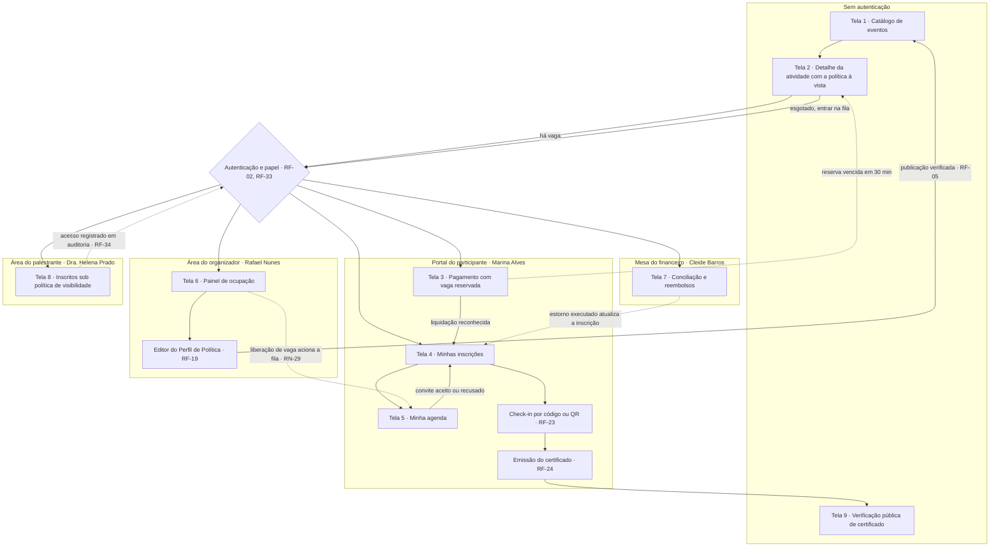

# 07 — Protótipo de Baixa Fidelidade

Nove telas em papel, desenhadas para serem lidas em voz alta numa sala com Rafael Nunes, Cleide
Barros, Dra. Helena Prado e Téo Miranda, e rasgadas sem dó se estiverem erradas. O protótipo existe
por duas razões operacionais: **(a)** transformar as decisões de política em algo que um stakeholder
não técnico consiga contestar — ninguém homologa `RN-22`, mas todo mundo tem opinião sobre a frase
"volta 50 % se você desistir depois de 06/05"; e **(b)** forçar a aparição das regras que a
especificação textual não pediu, porque a tela precisa decidir onde cada informação fica, o que
acontece quando ela não existe e o que o usuário lê quando o sistema diz não.

**Não há compromisso visual aqui.** Não há paleta, tipografia, espaçamento, componente ou
identidade. Cada quadro é um esqueleto de conteúdo e comportamento: quais informações aparecem, em
que ordem, quais ações existem, quais ações somem, e qual frase o sistema devolve. Layout, marca e
interação fina são responsabilidade de outro artefato e de outra rodada. Qualquer discussão sobre
cor, ícone ou posição de botão nesta sessão é ruído e deve ser adiada pelo facilitador.

## 1. O que este protótipo é e o que ele não é

| É | Não é |
|---|---|
| Instrumento de validação de entendimento com quem decide a regra | Especificação de interface para implementação direta |
| Verificação de que cada estado da inscrição tem uma frase legível | Definição de layout, identidade visual ou biblioteca de componentes |
| Gatilho de perguntas objetivas para homologação dos defaults | Substituto dos critérios de aceitação em Gherkin |
| Prova de que a política cabe na tela antes do início do fluxo (RNF-22) | Compromisso com quantidade de cliques ou navegação definitiva |

### 1.1 Convenções dos quadros

| Símbolo | Significado |
|---|---|
| `[ Texto ]` | Ação disponível ao usuário |
| `( )` / `(o)` | Opção não selecionada / selecionada |
| `(!)` | Aviso ou alerta exibido pelo sistema |
| `(x)` / `(v)` / `(-)` | Bloqueio ou negativa / confirmação / indisponível por prazo |
| `(?)` | Ponto que a tela não resolve e vai para homologação |
| `*texto*` | Aba ou item selecionado |

**Cenário único usado em todas as telas.** Hoje é **05/05/2026**. Marina Alves monta sua grade do
*Congresso Eventus de Tecnologia 2026* (12 a 14/05, pago, trilhas paralelas). O *Workshop de
Engenharia de Prompt* (13/05, 14h–18h, 40 vagas, exige presença) está esgotado com fila. O *Encontro
Corporativo Nexa* (fechado, faturado à empresa contratante, participação única) não aceita
cancelamento pelo site.
Os instantes se encadeiam: 14h37 início do pagamento de Marina · 14h46 ela confere as inscrições ·
14h58 Rafael olha o painel · 15h07 vence a reserva de outro participante no workshop · 15h09 o
convite da fila chega a Marina · 15h22 o pagamento vencido cai na conta · 15h40 Cleide trata a
exceção · 16h55 o RH confere um certificado antigo de Marina.

### 1.2 Parâmetros default representados nas telas

Idênticos aos dos demais artefatos. ⚠️ **DECISÃO PROPOSTA — requer homologação do stakeholder
responsável** para todos os valores desta tabela.

| Parâmetro | Valor desenhado | Regra | Tela onde aparece |
|---|---|---|---|
| `reservaDeVaga` | 30 minutos a partir do início do pagamento; vaga devolvida em até 60 s | RN-11, RN-20 | 3, 4, 6, 7 |
| `janelaCancelamento` | autosserviço até 48 h antes; zero para item não cancelável | RN-09 | 2, 4 |
| `politicaReembolso` | 100 % até 7 dias · 50 % de 7 dias a 48 h · 0 % depois · 100 % se a iniciativa for da Eventus | RN-22, RN-30 | 2, 4, 7 |
| `modoListaEspera` | FIFO automática, convite de 24 h, corte 6 h antes do início | RN-21, RN-27 | 1, 2, 4, 5, 6 |
| `criterioCertificado` | presença de 75 % por check-in; liberação em até 48 h do encerramento | RN-23, RN-25 | 2, 4, 9 |
| `politicaConflitoHorario` | alertar e permitir; bloquear se houver exigência de presença | RN-13 | 5 |
| `visibilidadePalestrante` | perfil mínimo; agregados com supressão abaixo de 5; contato só com consentimento | RN-15 | 8 |
| `canaisNotificacao` | e-mail obrigatório com situação de entrega visível + espelho in-app | RN-04 | 4, 6 |

### 1.3 Seis regras que só apareceram quando as telas foram desenhadas

Este é o rendimento concreto do protótipo: nenhum dos pontos abaixo estava em disputa na análise
textual, e todos travariam a implementação.

| # | Onde apareceu | O que falta na regra escrita | Encaminhamento proposto | Responsável |
|---|---|---|---|---|
| 1 | Tela 1 | RN-26 define cinco rótulos de disponibilidade, mas AMB-02 admite no catálogo o evento com abertura apenas anunciada — situação sem rótulo previsto | ⚠️ Exibir "inscrições abrem em `<data>`" como sexta situação derivada, sem criar regra nova: é leitura de janela, não de ocupação | Rafael Nunes |
| 2 | Tela 2 | Com 2 sessões obrigatórias, o limiar de 75 % com arredondamento para baixo (RN-23) equivale a exigir 100 % de presença | ⚠️ Manter o limiar e obrigar o editor de política a mostrar o efeito prático em número de sessões antes de publicar | Rafael Nunes |
| 3 | Tela 3 | RF-13 fixa 30 min para toda reserva, enquanto INC-05 manda diferenciar por meio de pagamento; o checkout precisa exibir o meio que não reserva vaga | ⚠️ Meio sem liquidação imediata fica indisponível na atividade com fila ativa, com explicação em `[ por quê? ]` | Cleide Barros |
| 4 | Tela 3 | O contador regressivo não tem fonte de tempo definida; relógio do dispositivo diverge do servidor e RNF-23 exige fuso explícito | ⚠️ Contador derivado do instante-limite do servidor, com data e hora absolutas sempre visíveis ao lado | Téo Miranda |
| 5 | Tela 7 | RN-16 exige aprovador distinto do solicitante **e** de quem executa o estorno, mas só há uma persona no financeiro | ❓ Definir o terceiro papel antes do MVP; sem ele, RN-16 é inaplicável na prática | Cleide Barros com Téo Miranda |
| 6 | Tela 8 | A supressão de recortes com menos de 5 pessoas (RF-32) não impede a dedução por diferença quando o total é exibido | ⚠️ Suprimir também o segundo menor recorte sempre que a subtração reconstituir o recorte protegido | Téo Miranda |

## 2. Mapa de navegação

Quatro áreas autenticadas e uma superfície pública. A separação não é estética: cada fronteira do
diagrama é uma fronteira de autorização avaliada por papel e escopo (RF-33), e a única superfície
que atravessa a fronteira sem autenticação é a verificação de certificado (RF-25).



**Duas travessias merecem atenção na validação.** A primeira é `T3 -.-> T2`: a expiração da reserva
devolve a participante à página do item, agora possivelmente esgotado — o protótipo assume que ela
não volta a um carrinho preservado, porque RN-11 proíbe reaproveitar o protocolo. A segunda é
`T6 -.-> T5`: uma ação do organizador altera a agenda de terceiros sem que ninguém navegue, e é o
único caminho do mapa cujo gatilho é temporal, não humano (UC-03).

## 3. As nove telas

### Tela 1 — Catálogo de eventos com sinalização de lotação (Marina Alves, participante)

```text
+--------------------------------------------------------------------------+
| EVENTUS · Catálogo de eventos                [ Entrar ]  [ Criar conta ] |
+==========================================================================+
| Busca  [ dados_______________________ ]  [ Buscar ]                      |
| Período [ mai-jul 2026 v ]  Tipo [ Todos v ]  Modalidade [ Todas v ]     |
| Cidade [ Todas v ]  Gratuidade [ Todas v ]  Disponibilidade [ Todas v ]  |
| 5 eventos encontrados                                  atualizado há 4 s |
+--------------------------------------------------------------------------+
| Congresso Eventus de Tecnologia 2026                                     |
|   12 a 14/05/2026 · Goiânia · presencial · a partir de R$ 180,00         |
|   (!) ÚLTIMAS VAGAS - 21 de 800                           [ Ver evento ] |
+--------------------------------------------------------------------------+
| Maratona Eventus de Dados 2026                                           |
|   05/06/2026 · on-line · gratuito                                        |
|   (o) DISPONÍVEL - 152 de 300                             [ Ver evento ] |
+--------------------------------------------------------------------------+
| Seminário Eventus de Arquitetura de Software                             |
|   22/05/2026 · Goiânia · presencial · R$ 90,00                           |
|   (x) ESGOTADO - lista de espera aberta, 14 na fila       [ Ver evento ] |
+--------------------------------------------------------------------------+
| Ciclo de Palestras Eventus                                               |
|   03/06/2026 · inscrições encerradas em 20/04/2026 às 18h00              |
|   (-) INSCRIÇÕES ENCERRADAS                               [ Ver evento ] |
+--------------------------------------------------------------------------+
| Fórum Eventus de Acessibilidade Digital                                  |
|   10/07/2026 · inscrições abrem em 15/05/2026 às 10h00                   |
|   (?) RÓTULO NÃO PREVISTO EM RN-26                        [ Ver evento ] |
+--------------------------------------------------------------------------+
| O Encontro Corporativo Nexa não aparece nesta lista: evento              |
| corporativo fechado, fora da busca pública (AMB-02).                     |
+--------------------------------------------------------------------------+
```

| Campo | Valor |
|---|---|
| Objetivo | Permitir que qualquer pessoa, sem conta, encontre tudo que está publicado e entenda em uma linha se ainda dá para entrar, se resta fila ou se o prazo acabou. |
| Histórias cobertas | HU-01 |
| Requisitos | RF-06 · RN-26, RN-20 · RNF-01, RNF-03 · AMB-02 |
| Estados da tela | **vazio:** busca sem resultado mostra os filtros aplicados e oferece remoção individual, nunca uma lista em branco · **carregando:** esqueleto das fichas com o carimbo de atualização congelado e a busca desabilitada · **erro:** falha do serviço de busca exibe o catálogo em cache com aviso "esta lista pode estar desatualizada" e o instante do último dado bom · **sem permissão:** não se aplica, superfície pública; evento corporativo fechado é ausência silenciosa, não negativa explícita. |
| O que esta tela revela sobre a regra | O rótulo de disponibilidade é derivado, não digitado: ele é consequência aritmética de RN-20 e da faixa de 10 % de RN-26, e por isso muda sozinho enquanto a página está aberta. Também revela que "esgotado" e "esgotado com fila" são situações diferentes para o usuário, e que a ausência do Encontro Nexa é uma decisão de política de catálogo, não um defeito de busca. |

**Perguntas que esta tela leva para a homologação.**
1. ❓ O rótulo público deve exibir o número absoluto de vagas restantes ("21 de 800") ou apenas a faixa? O número expõe ocupação a concorrentes e cria pressão de compra; a faixa reduz transparência.
2. ❓ Evento com abertura apenas anunciada entra no catálogo com qual rótulo, já que RN-26 não prevê essa situação?
3. ❓ O tamanho da fila ("14 na fila") pode ser público, ou é informação que desestimula a entrada e deve ficar restrita ao organizador?

### Tela 2 — Detalhe da atividade com a política à vista (Marina Alves, participante)

```text
+--------------------------------------------------------------------------+
| < Congresso Eventus de Tecnologia 2026 / Programação / 13 mai            |
+==========================================================================+
| Workshop de Engenharia de Prompt                                         |
| 13/05/2026 · 14h00 às 18h00 (horário de Brasília) · Sala B2 · 4 h        |
| Dra. Helena Prado · 40 vagas · R$ 180,00 (Lote 2, até 08/05)             |
+--------------------------------------------------------------------------+
| ANTES DE VOCÊ SE INSCREVER - o que vale nesta atividade                  |
|                                                                          |
|   Cancelar      até 11/05/2026 14h00, 48 h antes do início.              |
|                 Depois disso não há cancelamento pelo site.              |
|   Dinheiro      volta 100% até 06/05 14h00 · 50% entre 06/05 14h00       |
|                 e 11/05 14h00 · nada depois de 11/05 14h00.              |
|   Se lotar      fila por ordem de chegada. Quem for convidado tem        |
|                 24 h para aceitar, nunca depois de 13/05 08h00.          |
|   Certificado   exige presença registrada em 75% das sessões             |
|                 obrigatórias; sai em até 48 h do encerramento.           |
|   Sua vaga      fica guardada por 30 min assim que o pagamento           |
|                 começar.                                                 |
|                                           [ Ver a política por extenso ] |
+--------------------------------------------------------------------------+
| (!) Esta atividade EXIGE PRESENÇA. Inscrição em outra atividade no       |
|     mesmo horário será bloqueada - não é apenas um aviso.                |
+--------------------------------------------------------------------------+
| Sessões que contam presença                                              |
|   S1  13/05  14h00-15h45   obrigatória                                   |
|   S2  13/05  16h00-18h00   obrigatória                                   |
+--------------------------------------------------------------------------+
| (x) ESGOTADO - 8 pessoas na fila                                         |
|     [ Entrar na lista de espera ]   [ Ver horários alternativos ]        |
+--------------------------------------------------------------------------+
```

| Campo | Valor |
|---|---|
| Objetivo | Entregar cancelamento, reembolso, fila e critério de certificado **antes** de qualquer botão de inscrição, em linguagem de consequência e com datas absolutas calculadas para aquela atividade. |
| Histórias cobertas | HU-01, HU-05 |
| Requisitos | RF-07, RF-14 · RN-03, RN-09, RN-13, RN-21, RN-23, RN-26 · RNF-22 · OB1, OB2, OB3, OB4 |
| Estados da tela | **vazio:** atividade sem política completa não pode estar publicada (RF-05), logo este estado é impossível por construção e, se ocorrer, a página exibe erro de integridade e bloqueia a inscrição · **carregando:** ficha e política aparecem juntas; nunca exibir a ação de inscrição antes do bloco de regras · **erro:** falha ao calcular as datas da política mostra o enunciado por extenso ("48 h antes do início") em vez de omitir a regra · **sem permissão:** atividade de evento corporativo fechado devolve página inexistente para quem não tem vínculo, sem revelar que o evento existe. |
| O que esta tela revela sobre a regra | Converter a política em datas absolutas expõe o que o texto normativo esconde: em 05/05 a faixa de 100 % ainda vale, mas expira em 06/05 14h00, e um dia de hesitação custa metade do valor. Revela também que "exige presença" muda a natureza do conflito de horário de aviso para bloqueio, e que a versão exibida aqui é a que será congelada na inscrição (RF-20). |

**Perguntas que esta tela leva para a homologação.**
1. ❓ A política deve ser exibida em datas absolutas calculadas ("até 11/05 14h00") ou em regra relativa ("até 48 h antes")? A data absoluta é mais clara e mais cara de manter correta em caso de adiamento.
2. ❓ Com 2 sessões obrigatórias, o limiar de 75 % arredondado para baixo (RN-23) exige presença nas duas. Isso é o pretendido, ou o limiar deveria ser expresso em sessões e não em percentual?
3. ❓ Quando a atividade sobrescreve um parâmetro herdado do evento (RN-03), a diferença precisa aparecer explicitamente para o participante, ou basta exibir o valor final vigente?

### Tela 3 — Pagamento com vaga reservada e contador regressivo (Marina Alves, participante)

```text
+--------------------------------------------------------------------------+
| Pagamento da solicitação 2026-08-0417             Marina Alves  [ sair ] |
+==========================================================================+
|   TEMPO PARA CONCLUIR O PAGAMENTO          27:41                         |
|   Sua vaga está guardada até 05/05/2026 15h07 (horário de Brasília)      |
+==========================================================================+
| O que está sendo pago                                                    |
|   Congresso Eventus de Tecnologia 2026 - evento .......  R$ 180,00       |
|   Workshop de Governança de Dados - 13/05 09h-12h .....   incluído       |
|   Oficina de Métricas de Produto - 13/05 15h-18h ......  R$  90,00       |
|   ---------------------------------------------------------------        |
|   Total ...............................................  R$ 270,00       |
+--------------------------------------------------------------------------+
| (!) O Workshop de Engenharia de Prompt (13/05 14h-18h) esgotou           |
|     enquanto você preenchia e saiu desta solicitação. Os outros          |
|     itens continuam guardados.                        [ Entrar na fila ] |
+--------------------------------------------------------------------------+
| Como você quer pagar                                                     |
|   (o) PIX - vaga guardada por 30 min                                     |
|   ( ) Cartão - vaga guardada por 30 min                                  |
|   ( ) Boleto - indisponível nesta atividade                 [ por quê? ] |
+--------------------------------------------------------------------------+
| Ao pagar, valem as regras de hoje: cancelar até 11/05 14h00 ·            |
| devolução de 100% até 06/05 14h00 · certificado por presença.            |
|                                                 [ Ver regras completas ] |
+--------------------------------------------------------------------------+
| Se o tempo acabar, a vaga vai para quem está na fila. Se não houver      |
| fila, ela volta ao público. Nada é cobrado.                              |
|                                         [ Voltar ]   [ Pagar R$ 270,00 ] |
+--------------------------------------------------------------------------+
```

| Campo | Valor |
|---|---|
| Objetivo | Tornar visível que a vaga já está presa, por quanto tempo, e o que acontece exatamente quando o prazo vencer — sem que a participante precise entender o que é reserva temporária. |
| Histórias cobertas | HU-02, HU-03 |
| Requisitos | RF-08, RF-09, RF-13, RF-16 · RN-08, RN-11, RN-20 · RNF-02, RNF-07, RNF-22, RNF-23 · E-02, E-03 · INC-05, OB6 |
| Estados da tela | **vazio:** solicitação sem itens redireciona para a programação com aviso, em vez de exibir total zerado · **carregando:** durante a chamada ao prestador o botão de pagar é desabilitado e o contador continua correndo, com aviso de que a vaga segue guardada · **erro:** recusa do prestador mantém a reserva e o contador, oferece nova tentativa e não altera o estado da inscrição; falha de rede exibe o instante-limite absoluto para que a participante saiba o prazo mesmo offline · **sem permissão:** protocolo de outro titular devolve página inexistente, sem confirmar que o número existe. |
| O que esta tela revela sobre a regra | A reserva não é um detalhe de implementação: ela é a promessa central da tela e precisa de três elementos simultâneos — contador, instante absoluto e consequência da expiração. Revela também que RF-08 exige tratar item que esgotou durante o preenchimento sem derrubar os demais, o que só fica visível quando se desenha a linha do item removido. |

**Perguntas que esta tela leva para a homologação.**
1. ❓ Faltando menos de 5 minutos, o sistema deve avisar de forma ativa (mudança de destaque, aviso na tela) ou apenas continuar contando?
2. ❓ Meio de pagamento sem liquidação imediata fica indisponível na atividade com fila (proposta) ou gera inscrição pendente que não consome vaga, conforme INC-05?
3. ❓ Se o item removido por esgotamento for o principal motivo da inscrição, o sistema deve oferecer cancelar a solicitação inteira em uma ação, sem passar por Minhas Inscrições?

### Tela 4 — Minhas inscrições com ações por estado (Marina Alves, participante)

```text
+--------------------------------------------------------------------------+
| Minhas inscrições                                 Marina Alves  [ sair ] |
| [ *Em andamento 3* ]  [ Na fila 1 ]  [ Encerradas 6 ]                    |
+==========================================================================+
| Congresso Eventus de Tecnologia 2026 - 12 a 14/05/2026                   |
|   Aguardando seu pagamento - faltam 21 min, até 05/05 15h07              |
|   Inclui Governança de Dados e Métricas de Produto                       |
|   [ Concluir pagamento ]  [ Comprovante do pedido ]  [ Histórico ]       |
+--------------------------------------------------------------------------+
| Workshop de Engenharia de Prompt - 13/05/2026 14h00                      |
|   Você está na fila: 1ª posição, 11 pessoas no total                     |
|   Se abrir vaga você terá 24 h para aceitar, nunca após 13/05 08h00      |
|   [ Sair da fila ]  [ Como funciona a fila ]                             |
+--------------------------------------------------------------------------+
| Encontro Corporativo Nexa - 28/05/2026                                   |
|   Vaga garantida desde 14/04/2026                                        |
|   Cancelamento pelo site: não disponível neste evento       [ por quê? ] |
|   [ Comprovante ]  [ Código de check-in ]  [ Falar com a organização ]   |
+--------------------------------------------------------------------------+
| Seminário Eventus de Arquitetura de Software - 22/05/2026                |
|   Cancelado por você em 28/04 · devolução de R$ 90,00 em andamento       |
|   Crédito estimado até 11/05/2026                         [ Acompanhar ] |
+--------------------------------------------------------------------------+
| Workshop Eventus de Dados Abertos - 06/03/2026 (encerrado)               |
|   Presença em 3 de 3 sessões · certificado disponível                    |
|   [ Emitir certificado ]  [ Ver presença ]  [ Histórico ]                |
+--------------------------------------------------------------------------+
```

| Campo | Valor |
|---|---|
| Objetivo | Dar a cada inscrição uma frase de situação em linguagem comum e exatamente o conjunto de ações que a política congelada permite naquele estado, incluindo a explicação de por que uma ação esperada não está lá. |
| Histórias cobertas | HU-07, HU-09, HU-11 |
| Requisitos | RF-10, RF-21, RF-24, RF-26, RF-27 · RN-02, RN-05, RN-09, RN-28 · E-02, E-04, E-05, E-08, E-10, E-14 · INC-02 |
| Estados da tela | **vazio:** participante sem inscrição vê convite para o catálogo, não uma lista vazia com filtros · **carregando:** cartões em esqueleto, com os contadores de prazo suspensos até o dado chegar, nunca exibindo tempo estimado · **erro:** falha parcial mostra as inscrições recuperadas e marca explicitamente quantas não puderam ser carregadas, sem inventar estado · **sem permissão:** sessão expirada leva à autenticação preservando o retorno; acesso a inscrição de terceiro devolve página inexistente e gera registro de auditoria. |
| O que esta tela revela sobre a regra | Esta é a tela que prova que os 14 estados canônicos precisam de tradução: nenhum código `E-nn` aparece, e mesmo assim cada linha comunica ocupação de vaga, prazo em curso e ação disponível. Revela ainda que a ação indisponível precisa permanecer visível com motivo (INC-02) — esconder o botão de cancelar geraria exatamente o contato com a organização que P3 quer eliminar. |

**Perguntas que esta tela leva para a homologação.**
1. ❓ A ação indisponível fica visível e desabilitada com o motivo ao lado, ou é retirada da tela e explicada apenas em uma página de ajuda?
2. ❓ O histórico completo de transições (RF-10) fica acessível à participante em todos os estados, inclusive nas transições operadas pela organização, ou apenas a partir de contestação?
3. ❓ Inscrição aguardando pagamento conta como "em andamento" na contagem das abas, ou merece uma aba própria de pendências com prazo?

### Tela 5 — Minha agenda com sobreposição de horário destacada (Marina Alves, participante)

```text
+--------------------------------------------------------------------------+
| Minha agenda · Congresso Eventus de Tecnologia 2026                      |
| [ 12 mai ]  [ *13 mai* ]  [ 14 mai ]                   [ Grade | Lista ] |
+==========================================================================+
|  09h  +-----------------------------+                                    |
|  10h  | Governança de Dados         |                                    |
|  11h  | Sala A1 · vaga garantida    |                                    |
|  12h  +-----------------------------+                                    |
|  13h                                                                     |
|  14h  +-----------------------------+                                    |
|  15h  | Engenharia de Prompt        | +-----------------------------+    |
|  16h  | Sala B2 · exige presença    | | Métricas de Produto         |    |
|  17h  | CONVITE ATÉ 06/05 15h09     | | Sala A3 · vaga garantida    |    |
|  18h  +-----------------------------+ +-----------------------------+    |
+==========================================================================+
| (!) CHOQUE DE HORÁRIO em 13/05, das 15h00 às 18h00                       |
|     Engenharia de Prompt exige presença para o certificado, então        |
|     não dá para ficar com as duas.                                       |
|     [ Cancelar Métricas de Produto e aceitar o convite ]                 |
|     [ Recusar o convite ]  [ Ver horários alternativos ]                 |
+--------------------------------------------------------------------------+
| (!) Em 12/05, das 09h30 às 10h30, Mesa-redonda de IA e Sessão de         |
|     Pôsteres se cruzam. Nenhuma exige presença: você pode ficar          |
|     com as duas.                        [ Estou ciente e quero as duas ] |
+--------------------------------------------------------------------------+
```

| Campo | Valor |
|---|---|
| Objetivo | Mostrar a grade real do dia e resolver, no ponto da decisão, os dois desfechos possíveis do conflito: bloqueio quando há exigência de presença e alerta com ciência registrada quando não há. |
| Histórias cobertas | HU-04, HU-06 |
| Requisitos | RF-22, RF-15 · RN-01, RN-12, RN-13, RN-21 · TD-04, TD-05 · E-06 · INC-03, LAC-07, OB7 |
| Estados da tela | **vazio:** dia sem atividade exibe a grade horária com a faixa livre visível e atalho para a programação daquele dia · **carregando:** grade renderizada antes das marcações de conflito, com aviso de verificação em curso e ações de aceite bloqueadas até a checagem terminar · **erro:** falha na detecção de sobreposição impede o aceite do convite e informa que a verificação não pôde ser feita, em vez de permitir por omissão · **sem permissão:** agenda é sempre do próprio titular; não há visão de agenda de terceiro em nenhum papel. |
| O que esta tela revela sobre a regra | O conflito não é um erro de formulário, é uma escolha com custo: a tela precisa oferecer a troca ("cancelar Métricas e aceitar") como caminho de primeira classe, senão a regra vira apenas um bloqueio. Revela também que o convite da fila (E-06) ocupa espaço na agenda antes do aceite, porque a vaga já está reservada em nome dela (RN-12), e que o prazo do convite aqui é 06/05 15h09 — os 24 h de RN-21, e não o corte de 6 h antes do início. |

**Perguntas que esta tela leva para a homologação.**
1. ❓ Aceitar o convite cancelando a atividade concorrente deve ser uma única ação encadeada, sabendo que o cancelamento pode gerar reembolso parcial (RN-22) e exige confirmação de valor?
2. ❓ A ciência registrada na sobreposição permitida vale por par de atividades, ou uma vez marcada vale para todo o evento?
3. ❓ Quando uma mudança de programação (RF-05) criar conflito em inscrição já confirmada, quem decide o desfecho: a participante escolhe qual manter, ou a organização cancela a mais recente com reembolso integral?

### Tela 6 — Painel de ocupação do organizador (Rafael Nunes, organizador)

```text
+--------------------------------------------------------------------------+
| Painel do organizador · Congresso Eventus de Tecnologia 2026             |
| Atualizado em 05/05/2026 14h58m12s (há 8 s)                [ Atualizar ] |
+==========================================================================+
| EVENTO            Cap  Conf  Res  Conv  Fila  Disp  Rótulo público       |
| Congresso 2026    800   768    9     2     0    21  últimas vagas        |
+--------------------------------------------------------------------------+
| ATIVIDADE              Cap  Conf  Res  Conv  Fila  Disp  Situação        |
| Engenharia de Prompt    40    39    1     0     8     0  esgotado+fila   |
| Governança de Dados     40    31    2     0     0     7  disponível      |
| Métricas de Produto     30    27    2     0     0     1  últimas vagas   |
| Mesa-redonda de IA     120    44    0     0     0    76  disponível      |
|                                                                          |
| Disp = Cap - Conf - Res - Conv - cortesias bloqueadas (RN-20)            |
+--------------------------------------------------------------------------+
| ALERTAS                                    [ Editar limiares ]           |
| (!) 1 reserva de Engenharia de Prompt vence em 9 min, 8 na fila          |
| (!) Fila de Engenharia de Prompt sem movimento há mais de 24 h           |
| (!) 1 convite de fila com e-mail não entregue               [ reenviar ] |
| (!) 2 pagamentos aguardando a conciliação do financeiro                  |
+--------------------------------------------------------------------------+
| [ Ver inscritos ]  [ Editar o perfil de política ]  [ Exportar ]         |
| [ Ampliar capacidade e promover a fila em lote ]  (previsto para R2)     |
+--------------------------------------------------------------------------+
```

| Campo | Valor |
|---|---|
| Objetivo | Dar ao organizador o número que ele hoje mantém na planilha, com a defasagem declarada e a decomposição da disponibilidade, para agir antes de lotar ou de esvaziar. |
| Histórias cobertas | HU-14, HU-15 |
| Requisitos | RF-29, RF-12, RF-15 · RN-07, RN-20, RN-26, RN-29 · RNF-03 · AMB-01 |
| Estados da tela | **vazio:** evento publicado sem nenhuma inscrição mostra capacidade e zeros explícitos, com o instante de abertura da janela · **carregando:** números anteriores permanecem com o carimbo do último dado bom, nunca substituídos por zero ou traço · **erro:** falha na atualização mantém os números e destaca o carimbo desatualizado, com aviso de que decisões de capacidade devem esperar · **sem permissão:** organizador só acessa eventos sob sua responsabilidade (RF-33); tentativa fora do escopo devolve página inexistente e gera registro. |
| O que esta tela revela sobre a regra | A tela obriga a decompor a disponibilidade em cinco parcelas, o que torna RN-20 verificável a olho nu e explica ao organizador por que "sobram 21" não é igual a "faltam 32 para lotar". Revela também que os alertas são o produto real do painel: a expiração de reserva, a fila parada e o e-mail de convite não entregue são as três situações em que a inação custa vaga. |

**Perguntas que esta tela leva para a homologação.**
1. ❓ A defasagem de 30 s (AMB-01) é aceitável no dia da abertura das inscrições, ou o painel precisa de um modo de acompanhamento com atualização mais frequente e custo maior?
2. ❓ Quais limiares disparam alerta por padrão: ocupação acima de 90 %, fila com mais de N pessoas, reserva a menos de 10 minutos do vencimento?
3. ❓ Ampliar capacidade e promover a fila em lote é HU-15, prevista para R2. Sem isso no MVP, qual é o procedimento manual aceito quando o evento troca de sala na véspera?

### Tela 7 — Mesa de conciliação do financeiro com reembolsos (Cleide Barros, analista financeira)

```text
+--------------------------------------------------------------------------+
| Mesa do financeiro · 05/05/2026 15h40             Cleide Barros  [ 2FA ] |
| [ *Exceções 3* ]  [ Reembolsos 2 ]  [ Fechamento do evento ]             |
+==========================================================================+
| EXCEÇÕES DA CONCILIAÇÃO - toda linha exige um desfecho registrado        |
| Tipo               Protocolo      Valor      Recebido      Ação          |
| Pagamento órfão    (nenhum)       R$  180,00 05/05 09h12  [ Vincular ]   |
| Valor divergente   2026-08-0392   R$  170,00 05/05 11h03  [ Tratar ]     |
| Após a expiração   2026-05-0388   R$  270,00 05/05 15h22  [ Decidir ]    |
+--------------------------------------------------------------------------+
| 2026-05-0388 · Workshop de Engenharia de Prompt                          |
| A reserva venceu às 15h07 e a vaga já foi ofertada à fila.               |
|   (o) Devolver 100% pelo mesmo meio do pagamento                         |
|   ( ) Abrir NOVA solicitação, se houver vaga - o protocolo antigo        |
|       não pode ser reaproveitado (RN-11)                                 |
|   Justificativa [ ____________________________ ]   [ Registrar ]         |
+--------------------------------------------------------------------------+
| REEMBOLSOS                                                               |
| Caso     Inscrição      Motivo             Pago         A devolver       |
| RB-118   2026-07-0031   cancelou 28/04     R$    90,00  R$    90,00 100% |
| RB-119   2026-07-0114   evento adiado      R$ 1.200,00  R$ 1.200,00 100% |
+--------------------------------------------------------------------------+
| RB-119 · acima do teto de R$ 500,00 - exige quatro olhos                 |
|   Memória de cálculo: adiamento por iniciativa da Eventus, RN-30         |
|   impõe 100% independentemente da janela e da faixa do evento.           |
|   Solicitou: Cleide Barros     Aprovador: [ selecionar v ]               |
|   (!) Você não pode aprovar um caso que você mesma registrou.            |
|   (?) Quem executa o estorno também precisa ser um terceiro?             |
|                                               [ Aprovar ]  [ Indeferir ] |
+--------------------------------------------------------------------------+
```

| Campo | Valor |
|---|---|
| Objetivo | Concentrar as três exceções que hoje viram planilha paralela — pagamento órfão, valor divergente e liquidação após a expiração — e conduzir o reembolso com memória de cálculo e segregação de função. |
| Histórias cobertas | HU-17, HU-18 |
| Requisitos | RF-17, RF-18, RF-16 · RN-11, RN-16, RN-18, RN-22, RN-30 · TD-02 · E-10, E-11 · INC-05, LAC-02, LAC-10 |
| Estados da tela | **vazio:** dia sem exceção mostra o fechamento conciliado com o instante da última importação, e não uma lista vazia · **carregando:** fila de exceções bloqueia ações de desfecho até o extrato terminar de ser processado, evitando decisão sobre dado parcial · **erro:** falha na importação preserva os itens já conciliados, isola os não processados e proíbe fechamento do dia · **sem permissão:** perfil sem alçada vê o caso em leitura, com a ação de aprovar visível e desabilitada, e o motivo declarado. |
| O que esta tela revela sobre a regra | A tela mostra que RN-11 e a conciliação se encontram: dinheiro que chega depois do prazo não pode ressuscitar o protocolo, então o desfecho só pode ser devolução ou nova solicitação. Revela também que RN-16 pressupõe três pessoas distintas — solicitante, aprovador e executor — e que a estrutura descrita na elicitação tem uma. |

**Perguntas que esta tela leva para a homologação.**
1. ❓ Qual é o teto de aprovação automática? ⚠️ **DECISÃO PROPOSTA:** R$ 500,00 por caso, acima disso exige aprovador distinto.
2. ❓ Quem executa o estorno quando RN-16 exige que o executor seja distinto do aprovador e do solicitante, se a Eventus tem uma única analista financeira?
3. ❓ O prazo de crédito informado ao participante é declarado pelo prestador por meio de pagamento, ou a Eventus assume um prazo único e o comunica como compromisso próprio?

### Tela 8 — Área do palestrante sob política de visibilidade (Dra. Helena Prado, palestrante)

```text
+--------------------------------------------------------------------------+
| Área do palestrante · Dra. Helena Prado                [ 2FA ]  [ sair ] |
| [ *Minhas atividades* ]  [ Inscritos ]  [ Perfil da turma ]              |
+==========================================================================+
| Workshop de Engenharia de Prompt                                         |
| 13/05/2026 · 14h00 às 18h00 · Sala B2 · 4 h                              |
| (!) MUDANÇA EM 03/05: a sala passou de B1 para B2, mesmo horário.        |
| Capacidade 24 · confirmados 23 · 1 vaga em oferta                        |
+--------------------------------------------------------------------------+
| INSCRITOS (23)                                [ Exportar perfil mínimo ] |
| Nome                     Organização              Situação               |
| Marina Alves             Nexa Tecnologia          confirmada             |
| João P. Ferreira         Universidade do Vale     confirmada             |
| A. R. Lopes              (não informado)          confirmada             |
| ... mais 20 pessoas                                                      |
| Esta lista não traz e-mail, telefone, documento, dados de pagamento      |
| nem necessidades de acessibilidade ou alimentares (RN-15).               |
+--------------------------------------------------------------------------+
| PERFIL DA TURMA (agregado)                                               |
| Atuação        dados 10 · produto 6 · engenharia 7                       |
| Experiência    iniciante 9 · intermediário 11 · avançada: recorte        |
|                suprimido por ter menos de 5 pessoas                      |
| (!) 23 - 9 - 11 = 3: o total exibido deixa deduzir o recorte que         |
|     foi suprimido. Ver a pergunta 2 desta tela.                          |
+--------------------------------------------------------------------------+
| CONTATO - 2 de 23 autorizaram              (previsto para R3)            |
| Marina Alves · marina.alves@exemplo.com    consentimento vigente         |
| Toda consulta a esta área fica registrada em auditoria (RF-34).          |
+--------------------------------------------------------------------------+
```

| Campo | Valor |
|---|---|
| Objetivo | Entregar o que a palestrante precisa para preparar a oficina — quantas pessoas, de onde vêm, que nível declaram — com o mínimo de dado pessoal que satisfaz essa finalidade. |
| Histórias cobertas | HU-20, HU-21, HU-22 |
| Requisitos | RF-31, RF-32, RF-05, RF-34 · RN-15, RN-17 · TD-07 · RNF-17 · OB8, LAC-08 |
| Estados da tela | **vazio:** atividade sem inscritos mostra capacidade, janela de inscrição e nenhuma tabela, sem sugerir falha · **carregando:** lista e agregados carregam juntos; nunca exibir agregados antes da aplicação da supressão · **erro:** falha ao apurar consentimentos suprime todo o bloco de contato em vez de exibi-lo em versão parcial · **sem permissão:** atividade que a palestrante não conduz devolve página inexistente, sem confirmar a existência da atividade, e o acesso negado também é registrado. |
| O que esta tela revela sobre a regra | Desenhar a lista mostra que a minimização não é subtração de colunas, é escolha de finalidade: nome, organização e situação bastam para dimensionar material. Revela também o limite prático da supressão de recortes: com o total à vista, a subtração devolve o número protegido, o que transforma RF-32 em regra incompleta. |

**Perguntas que esta tela leva para a homologação.**
1. ❓ Suprimir também o segundo menor recorte quando a subtração reconstituir o recorte protegido, ou ocultar o total sempre que houver supressão?
2. ❓ O palestrante deve ver o tamanho da fila e as reservas em curso, ou apenas confirmados e capacidade, como está desenhado?
3. ❓ A exportação do perfil mínimo exige finalidade declarada em texto livre a cada uso, ou uma finalidade pré-aprovada por evento é suficiente?

### Tela 9 — Verificação pública de certificado (terceiro verificador, sem login)

```text
+--------------------------------------------------------------------------+
| eventus.com.br/verificar                       página pública, sem login |
+==========================================================================+
| Verificação de certificado                                               |
| Digite o código que aparece no rodapé do documento.                      |
|   [ EVT-2026-8F3K-92QD ]                                   [ Verificar ] |
+==========================================================================+
| (v) CERTIFICADO VÁLIDO                                                   |
|   Titular .............. Marina Alves                                    |
|   Atividade ............ Workshop Eventus de Dados Abertos               |
|   Evento ............... Programa Eventus de Formação Aberta             |
|   Carga horária ........ 3 h                                             |
|   Realizado em ......... 06/03/2026                                      |
|   Emitido em ........... 08/03/2026                                      |
|   Situação ............. válido                                          |
|   Consulta feita em .... 05/05/2026 às 16h55                             |
+--------------------------------------------------------------------------+
| Esta página não mostra e-mail, documento nem qualquer outro dado do      |
| titular, e não permite pesquisar por nome nem listar certificados.       |
+==========================================================================+
| Outros desfechos da mesma tela                                           |
| (x) NÃO ENCONTRAMOS ESSE CÓDIGO. Confira o código do documento.          |
| (!) CERTIFICADO REVOGADO EM 12/03/2026. Procure a organização do         |
|     evento para saber o motivo.                                          |
+--------------------------------------------------------------------------+
```

| Campo | Valor |
|---|---|
| Objetivo | Permitir que um terceiro — RH, banca, órgão — confirme a autenticidade do certificado sem acionar a titular e sem que a página se torne uma fonte de dados pessoais. |
| Histórias cobertas | HU-10, HU-09 |
| Requisitos | RF-25, RF-24 · RN-06, RN-19 · RNF-17, RNF-20, RNF-21 · CT-22 |
| Estados da tela | **vazio:** formulário com o código de exemplo e a explicação de onde encontrá-lo no documento · **carregando:** botão desabilitado com aviso de consulta em andamento, sem revelar se o código existe antes da resposta final · **erro:** falha do serviço devolve mensagem neutra e orienta a nova tentativa, sem sugerir que o certificado seja inválido · **sem permissão:** não se aplica — a página é pública por definição; a proteção é a ausência de listagem, a limitação de tentativas e a resposta uniforme para código inexistente. |
| O que esta tela revela sobre a regra | A prova de autenticidade e a proteção de dados puxam em sentidos opostos: quanto mais campos a página confirma, mais útil ela é para o verificador e mais ela vaza sobre a titular. A tela materializa o corte de RF-25 — confirma o que está impresso no documento e nada além — e mostra que a revogação precisa de superfície pública, senão não tem efeito prático. |

**Perguntas que esta tela leva para a homologação.**
1. ❓ Qual limite de tentativas por origem em qual intervalo, para impedir varredura de códigos? ⚠️ **DECISÃO PROPOSTA:** 10 consultas por minuto e 100 por hora por endereço de origem.
2. ❓ O nome do titular aparece por extenso, ou parcialmente mascarado com confirmação apenas quando o verificador digitar o nome que consta do documento?
3. ❓ O certificado revogado informa o motivo da revogação, ou apenas a situação e a data, remetendo à organização?

## 4. Microcopy crítico

O texto exibido ao usuário nunca nomeia estado interno, código de regra, entidade do modelo ou
jargão de implementação. Palavras como "reserva expirada", "enfileirado", "hold", "FIFO",
"idempotente", "política congelada", "E-03" e "RN-22" são vocabulário desta especificação e do time,
não da interface. A regra prática: a frase diz **o que aconteceu**, **o que isso custa** e **o que
fazer agora**, nessa ordem.

| Situação | Mensagem proposta ao usuário | Regra por trás |
|---|---|---|
| Vaga expirada durante o pagamento | "O tempo para concluir o pagamento terminou e sua vaga voltou para quem está esperando. Nada foi cobrado. Se ainda houver lugar, você pode fazer um novo pedido." | RN-11, RF-13, RNF-08 · E-02 → E-03; devolução em até 60 s e protocolo não reaproveitável |
| Sobreposição de horário com bloqueio | "Não dá para ficar com as duas: o Workshop de Engenharia de Prompt vai das 14h às 18h e a Oficina de Métricas de Produto, das 15h às 18h. Como o workshop exige presença para o certificado, escolha uma delas." | RN-13, TD-04 · bloqueio por exigência de presença |
| Sobreposição de horário permitida | "A Mesa-redonda de IA e a Sessão de Pôsteres se cruzam das 09h30 às 10h30 em 12/05. Nenhuma das duas exige presença, então você pode ficar com as duas — só confirme que sabe que não vai conseguir assistir a tudo." | RN-13, LAC-07 · alerta com ciência registrada na inscrição |
| Cancelamento fora da janela | "O prazo para cancelar pelo site terminou em 11/05/2026 às 14h00, 48 horas antes do início. Sua inscrição continua valendo. Se você não puder participar, fale com a organização por atendimento@eventus.com.br." | RN-09, RF-21, INC-02 · motivo, data-limite esgotada e canal alternativo |
| Evento não cancelável | "O Encontro Corporativo Nexa não aceita cancelamento pelo site, condição informada na página do evento desde antes da inscrição. Se você não puder ir, avise a organização por atendimento@eventus.com.br." | RN-09, RF-07 · janela igual a zero, com transparência prévia obrigatória |
| Convite da fila recebido | "Abriu uma vaga no Workshop de Engenharia de Prompt e ela está guardada no seu nome até 06/05/2026 às 15h09. Se você não responder até lá, ela vai para a próxima pessoa da fila." | RN-12, RN-21, RF-15 · reserva exclusiva e prazo pelo menor valor entre 24 h e o corte de 6 h |
| Certificado indisponível por falta de presença | "Ainda não é possível emitir seu certificado do Congresso Eventus de Tecnologia 2026: foram registradas 5 das 8 sessões obrigatórias, e o mínimo é 75 %. Se você esteve presente e o registro falhou, peça revisão até 20/05/2026." | RN-19, RN-23, TD-03, RF-24 · critério não atendido, número apurado e caminho de revisão |
| Comprovante logo após a inscrição | "Recebemos seu pedido 2026-08-0417. Este documento confirma o pedido, não a vaga: ela fica garantida quando o pagamento for reconhecido, até 05/05 às 15h07." | RN-05, INC-01, RF-26 · distinção entre comprovante de solicitação e de confirmação |
| Pagamento recebido após a expiração | "Seu pagamento chegou depois que o tempo da reserva terminou e a vaga já foi para outra pessoa. Vamos devolver o valor integralmente pelo mesmo meio, em até 10 dias úteis." | RN-11, INC-05, RF-17 · fila de exceções com desfecho obrigatório |
| Falha na entrega do e-mail | "Não conseguimos entregar a mensagem em marina.alves@exemplo.com. Confira o endereço ou reenvie — enquanto isso, o documento está disponível aqui mesmo." | RNF-11, RF-27, RN-04 · situação de entrega por mensagem e espelho in-app |

### 4.1 Vocabulário: termo interno e termo ao usuário

| Termo interno (proibido na interface) | Termo exibido ao usuário |
|---|---|
| E-02 Aguardando liquidação com reserva ativa | "Aguardando seu pagamento — vaga guardada até 15h07" |
| E-03 Reserva vencida | "O tempo do pagamento acabou" |
| E-05 Enfileirada | "Você está na fila, 1ª posição" |
| E-06 Convite vigente | "Temos uma vaga guardada no seu nome até 06/05 às 15h09" |
| E-10 Restituição em apuração | "Devolução de R$ 90,00 em andamento, crédito até 11/05" |
| E-13 Ausência apurada | "A presença registrada não alcançou o mínimo" |
| Política congelada na inscrição | "As regras que valiam quando você se inscreveu" |
| Faixa de reembolso / fator da faixa | "Quanto volta e até quando" |
| Lista de espera FIFO com promoção em cascata | "Fila por ordem de chegada" |
| Reserva temporária de vaga (hold) | "Vaga guardada" |

## 5. Roteiro de validação com stakeholders

**Formato.** Sessão única de 45 minutos, presencial ou remota, com as nove telas impressas ou
compartilhadas em tela e um cronômetro visível. Facilitação pela engenharia de requisitos; ninguém
do time de desenvolvimento responde perguntas de negócio durante a sessão.

**Pré-requisitos.** Participantes recebem com 24 h de antecedência apenas a tabela de defaults
(seção 1.2) e o cenário de 05/05/2026 — nunca as telas, para que a primeira leitura aconteça na
sessão. Cada decisão é registrada na hora, com responsável nomeado; o que não for decidido volta
como questão aberta com data-limite, jamais como "pendente".

| Bloco | Duração | Telas | Quem participa | Decisão que precisa sair |
|---|---|---|---|---|
| B0 · Enquadramento | 3 min | — | Todos | Acordo explícito de que não se discute layout, cor ou nome de botão, e de que a sessão produz decisões de regra, não de design. |
| B1 · Descoberta e transparência | 7 min | 1 e 2 | Rafael Nunes (decide) · Téo Miranda (observa) | Formato do rótulo de disponibilidade, situação do evento com abertura anunciada e forma de exibir a política — datas absolutas ou regra relativa. |
| B2 · Compra sob relógio | 7 min | 3 | Cleide Barros (decide) · Rafael Nunes · Téo Miranda | Confirmação dos 30 minutos de reserva, tratamento do meio de pagamento sem liquidação imediata e autoridade do relógio do contador. |
| B3 · Depois da inscrição | 7 min | 4 e 5 | Rafael Nunes (decide) · Cleide Barros | Ação indisponível visível com motivo ou oculta; encadeamento de "cancelar e aceitar" no conflito; escopo da ciência registrada na sobreposição permitida. |
| B4 · Operação do evento | 6 min | 6 | Rafael Nunes (decide) · Téo Miranda | Homologação da defasagem de 30 s, limiares padrão dos quatro alertas e procedimento manual aceito no MVP para troca de sala. |
| B5 · Dinheiro | 7 min | 7 | Cleide Barros (decide) · Téo Miranda | Teto de aprovação automática, identificação do terceiro papel exigido por RN-16 e desfecho padrão da liquidação recebida após a expiração. |
| B6 · Terceiros e prova | 5 min | 8 e 9 | Dra. Helena Prado · Téo Miranda (decide em conjunto) | Regra de supressão que resista à dedução por diferença, escopo do que o palestrante vê e nível de mascaramento do nome na página pública. |
| B7 · Fechamento | 3 min | — | Todos | Leitura em voz alta das decisões tomadas, atribuição de responsável e data para as que ficaram abertas. |

**Total: 45 minutos.**

### 5.1 Decisão exigida por tela

Cada tela sai da sessão com um desfecho registrado. A coluna de origem aponta a questão aberta
canônica que a decisão fecha ou reduz.

| Tela | Decisão que precisa sair | Responsável | Questão canônica |
|---|---|---|---|
| 1 | Conteúdo do rótulo público e situação do evento ainda não aberto | Rafael Nunes | AMB-02, RN-26 |
| 2 | Formato da política no ponto de decisão e leitura do limiar de presença | Rafael Nunes | LAC-01, LAC-04, RNF-22 |
| 3 | Duração da reserva por meio de pagamento e comportamento do contador | Cleide Barros | LAC-06, INC-05 |
| 4 | Tratamento visual e textual da ação indisponível | Rafael Nunes com Cleide Barros | INC-02 |
| 5 | Desfecho do conflito quando o convite da fila colide com inscrição ativa | Rafael Nunes | LAC-07, INC-03 |
| 6 | Defasagem aceitável e limiares de alerta | Rafael Nunes com Téo Miranda | AMB-01 |
| 7 | Teto de alçada e terceiro papel da segregação de função | Cleide Barros | LAC-02, LAC-10 |
| 8 | Regra de supressão de agregados e escopo do perfil mínimo | Téo Miranda com Dra. Helena Prado | LAC-08, OB8 |
| 9 | Grau de exposição do titular na página pública e limite de consultas | Téo Miranda | LAC-09, RNF-17 |

### 5.2 Condução

- Cada tela é lida em voz alta pelo stakeholder que decide, não pelo facilitador. Se a pessoa
  precisar de explicação para entender a tela, a tela está errada e isso é o achado.
- Três tarefas são executadas em voz alta sobre o papel, sem ajuda: "cancele sua inscrição no
  Encontro Nexa", "descubra até quando você pode desistir sem perder dinheiro" e "explique por que
  você não consegue ficar com os dois workshops de 13/05".
- Discordância entre stakeholders não é resolvida na sessão: vira questão aberta com responsável
  único e data-limite. O facilitador registra a divergência com as duas posições.
- A sessão é considerada válida apenas se as nove decisões da seção 5.1 tiverem desfecho registrado
  — homologado, alterado ou adiado com data. Sessão que produz apenas comentários é repetida.

## 6. Cobertura e o que ficou de fora deste ciclo

As nove telas cobrem 17 das 24 histórias canônicas; as 7 restantes estão na tabela "Fora deste
ciclo", e 17 mais 7 fecham as 24. A seleção priorizou os fluxos com concorrência, dinheiro, prazo ou
dado pessoal — exatamente onde o entendimento errado custa mais caro que o retrabalho de tela — e
deixou de fora apenas o que um quadro em papel não esclareceria melhor do que o critério de
aceitação já escrito.

| Histórias cobertas | Telas |
|---|---|
| HU-01, HU-02, HU-03, HU-04, HU-05, HU-06, HU-07, HU-09, HU-10, HU-11 | 1 a 5, 9 |
| HU-14, HU-15 | 6 |
| HU-17, HU-18 | 7 |
| HU-20, HU-21, HU-22 | 8 |

| Fora deste ciclo | Por quê | Quando |
|---|---|---|
| Check-in por código ou QR (HU-08, RF-23) | Superfície móvel operada em pé, na porta da sala, com rede instável; exige protótipo próprio em dimensão de celular e ensaio em campo | Segunda rodada, antes do MVP |
| Editor do Perfil de Política (HU-12, HU-13, RF-19) | Tela de configuração densa, com oito parâmetros e herança por atividade; validar junto com o organizador em sessão dedicada, não em 7 minutos | Segunda rodada, antes do MVP |
| Trilha de auditoria e credenciamento temporário (HU-23, HU-24) | Público é a equipe de TI, que valida por consulta e por teste, não por wireframe | Não requer protótipo |
| Fechamento financeiro por evento (HU-19) | Relatório de R2, dependente do fechamento das regras de reembolso decididas no bloco B5 | Após o MVP |
| Mudança de programação publicada (HU-16) | R2; o efeito sobre a agenda de terceiros já aparece como pergunta 3 da Tela 5 | Após o MVP |
