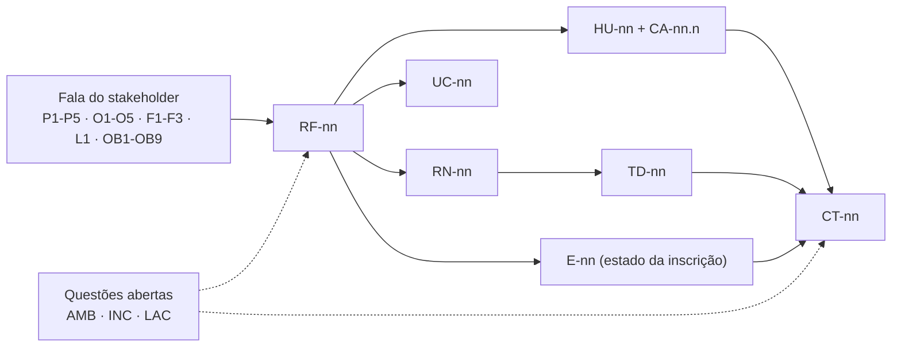

# 08 — Matriz de Rastreabilidade e Cobertura

## Por que este artefato existe

A elicitação da Eventus produziu 23 falas de stakeholders (P1–P5, O1–O5, F1–F3, L1, OB1–OB9) e a
especificação produziu 34 requisitos funcionais, 24 não funcionais, 30 regras de negócio, 24
histórias, 8 casos de uso, 7 tabelas de decisão, 14 estados e 26 casos de teste. Sem um vínculo
explícito entre esses conjuntos, duas patologias passam despercebidas: **fala perdida** (alguém
falou e ninguém especificou) e **requisito órfão** (alguém especificou e ninguém pediu). Esta
matriz existe para tornar as duas detectáveis por leitura, não por memória.

A rastreabilidade é usada aqui nos dois sentidos:

- **Para frente** — fala → RF → (RN, HU, UC, TD, estado) → CT. Responde: *o que foi construído a
  partir do que Marina Alves disse na entrevista, e como se prova que funciona?*
- **Para trás** — CT → RF → fala → pessoa. Responde: *este teste falhou; qual requisito ele protege,
  qual pedido de negócio esse requisito realiza e quem decide se o comportamento pode mudar?*

Exemplo de uma volta completa, com o **Workshop de Engenharia de Prompt** (atividade paga do
Congresso Eventus de Tecnologia 2026):

- **Para frente:** P3 (*"cancelar sem precisar entrar em contato com a organização"*) → RF-21 →
  RN-09 e RN-22 → HU-07 → UC-04 → TD-01 e TD-02 → E-08 e E-10 → CT-13 e CT-14. Marina cancela a 3
  dias do início e o sistema exibe, antes da confirmação, os 50 % de restituição e a faixa aplicada.
- **Para trás:** CT-14 falhou → verifica RF-21 → RF-21 nasce de P3 em conflito com O3, conflito
  registrado como INC-02 → mudar o comportamento exige Rafael Nunes e Cleide Barros, não o time de
  desenvolvimento.

Convenções desta matriz:

- `—` significa **não se aplica ou nada registrado no canon**. Toda ocorrência de `—` nas colunas
  HU, UC e CT é tratada como buraco e reaparece na seção 5.
- Um RF aparece em uma coluna quando o artefato **o exercita**, seja no fluxo principal, seja em
  fluxo alternativo ou de exceção (critério usado, por exemplo, para ligar RF-10 a UC-01: a retomada
  de inscrição interrompida é fluxo alternativo do caso de uso).
- Nenhum identificador foi criado aqui. Onde falta cobertura, falta porque o registro canônico não
  tem o item — e isso é declarado, não maquiado.

---

## 1. Matriz principal — uma linha por requisito funcional

| RF | Origem (fala) | RN | HU | UC | TD | Estado afetado | CT |
|---|---|---|---|---|---|---|---|
| RF-01 Conta com verificação de titularidade | Derivado, OB9 | — | — | — | — | E-01 | — |
| RF-02 Autenticação, segundo fator e sessão | OB9 | — | — | — | — | — | — |
| RF-03 Central de privacidade do titular | OB8, OB9 | RN-04, RN-15 | HU-22 | UC-08 | TD-07 | — | — |
| RF-04 Composição do evento em rascunho | O5, P5, L1, F1, Derivado | RN-01 | HU-13 | UC-07 | TD-04 | — | — |
| RF-05 Publicação verificada e mudanças | Derivado, O1, O3, O5, F2 | RN-03, RN-30 | HU-13, HU-16, HU-20 | UC-07 | TD-01, TD-02 | E-09, E-10 | CT-15 |
| RF-06 Catálogo público com filtros e rótulo | P1, O1, O4 | RN-20, RN-26 | HU-01 | UC-02, UC-07 | TD-06 | — | — |
| RF-07 Página do evento com política em destaque | P1, P5, O5, O3, OB1, OB2, OB3, OB4 | RN-01, RN-09, RN-26 | HU-01 | UC-02 | TD-01, TD-06 | — | — |
| RF-08 Inscrição em dois níveis | P5, O5 | RN-02 | HU-02 | UC-01, UC-02 | TD-04, TD-06 | E-01, E-02, E-04 | — |
| RF-09 Confirmação imediata × solicitação protocolada | F1, F3, P2, Derivado | RN-08, RN-10 | HU-02 | UC-01, UC-02 | TD-06 | E-01, E-02, E-04 | CT-01, CT-07 |
| RF-10 Minhas Inscrições com linha do tempo | P2, P3, P4, OB6 | RN-02, RN-28 | — | UC-01, UC-04 | TD-01 | E-01 a E-14 | — |
| RF-11 Gestão de inscrições pelo organizador | O1, O3, O4, Derivado | RN-28 | — | UC-05 | TD-01 | E-04, E-09 | — |
| RF-12 Controle transacional de vagas | O1, O5, OB6 | RN-01, RN-07, RN-20 | HU-03, HU-15 | UC-01, UC-02, UC-03 | TD-05, TD-06 | E-02, E-04, E-06 | CT-02, CT-06 |
| RF-13 Reserva temporária com expiração | OB6, F3 | RN-11, RN-29 | HU-03 | UC-01, UC-03 | TD-05, TD-06 | E-02, E-03 | CT-02, CT-04 |
| RF-14 Lista de espera autosserviço | O2, OB3 | RN-10, RN-27 | HU-05 | UC-02 | TD-05, TD-06 | E-05 | CT-08 |
| RF-15 Convite, cascata e administração da fila | OB3, O2, O1 | RN-07, RN-12, RN-21, RN-27, RN-29 | HU-06, HU-15 | UC-03, UC-04 | TD-05 | E-04, E-05, E-06, E-07 | CT-09, CT-10 |
| RF-16 Cobrança e confirmação na liquidação | F1, F3, OB9 | RN-08, RN-18 | HU-17 | UC-01, UC-05 | TD-06 | E-02, E-04 | CT-03, CT-07 |
| RF-17 Confirmação manual e conciliação | F3, F1, Derivado | — | HU-17 | UC-05 | TD-06 | E-02, E-03, E-04 | CT-05 |
| RF-18 Caso de reembolso com alçada | F2, OB2, O3 | RN-16, RN-22, RN-30 | HU-07, HU-18 | UC-04 | TD-02 | E-10, E-11 | CT-15, CT-16 |
| RF-19 Editor do Perfil de Política | OB1 a OB8 | RN-03 | HU-12 | UC-07 | TD-01 a TD-07 | — | — |
| RF-20 Congelamento e versionamento da política | OB1, OB2, Derivado | RN-14 | HU-12 | UC-04, UC-07 | TD-01, TD-02, TD-03 | E-04 | CT-17 |
| RF-21 Cancelamento autosserviço com simulação | P3, O3, OB1, OB2, F2 | RN-09, RN-14, RN-22, RN-29 | HU-07 | UC-04 | TD-01, TD-02, TD-05 | E-08, E-10 | CT-13, CT-14 |
| RF-22 Agenda pessoal e política de conflito | P5, O5, OB7, OB4 | RN-13 | HU-04, HU-16 | UC-01 | TD-04 | E-01, E-04 | CT-11, CT-12 |
| RF-23 Check-in por sessão com modo degradado | OB4, Derivado | RN-05 | HU-08 | UC-06 | TD-03 | E-12, E-13 | CT-18, CT-19 |
| RF-24 Elegibilidade e emissão do certificado | P4, OB4 | RN-14, RN-19, RN-23, RN-24, RN-25 | HU-09 | UC-06 | TD-03 | E-12, E-13, E-14 | CT-20, CT-21 |
| RF-25 Código de verificação e revogação | P4, OB9 | RN-06, RN-19 | HU-10 | UC-06 | TD-03 | E-14 | CT-22 |
| RF-26 Comprovante de solicitação × de confirmação | P2, F3, OB6 | RN-05 | HU-11 | UC-01, UC-02 | TD-06 | E-02, E-04 | CT-01, CT-25 |
| RF-27 Notificação por transição com ciclo de entrega | OB5, P2 | RN-04 | HU-11 | UC-01 a UC-06 | TD-05, TD-07 | E-01 a E-14 | CT-25 |
| RF-28 Canais por WhatsApp e SMS | OB5 | — | — | — | — | — | — |
| RF-29 Painel de ocupação com defasagem declarada | O4, O1, O2 | RN-20 | HU-14 | UC-03, UC-07 | TD-06 | E-02, E-04, E-05, E-06 | CT-24 |
| RF-30 Relatórios e fechamento financeiro | O4, O2, F1, F2, F3, OB4, OB8, OB9 | RN-15 | HU-19 | UC-05 | TD-07 | E-04, E-08, E-11, E-14 | — |
| RF-31 Programação e inscritos em perfil mínimo | L1, OB8 | RN-15 | HU-20, HU-21 | UC-08 | TD-07 | E-04 | CT-23 |
| RF-32 Indicadores agregados e contato consentido | L1, OB8 | RN-15 | HU-22 | UC-08 | TD-07 | E-04 | CT-23 |
| RF-33 Autorização por papel, escopo e prazo | L1, O1, OB8, OB9, Derivado | — | HU-24 | UC-06, UC-08 | TD-07 | — | — |
| RF-34 Trilha de auditoria imutável | OB9, OB8 | RN-17 | HU-23 | UC-05, UC-08 | TD-07 | E-01 a E-14 | — |

**Notas de leitura da matriz principal**

1. **RF-01 e RF-02 são pré-condições transversais** de UC-01 a UC-08 (nenhum fluxo começa sem conta
   verificada e sessão válida). Optou-se por *não* replicar os oito casos de uso nessas duas linhas:
   inflaria a cobertura aparente sem acrescentar verificação. A consequência — dois requisitos
   "Deve ter" sem HU e sem CT — está declarada na seção 5, buraco B-1.
2. A coluna **Estado afetado** registra os estados que o RF cria, transiciona ou consulta. `E-01 a
   E-14` aparece apenas em RF-10, RF-27 e RF-34, que são, por definição, transversais ao ciclo de
   vida (tela do participante, notificação por transição e trilha imutável).
3. **RF-19 é o único requisito ligado às sete tabelas de decisão**, porque é ele que grava os
   parâmetros que todas elas leem. É o ponto de maior impacto de regressão do sistema: alterar o
   editor de política afeta cancelamento, reembolso, certificado, conflito, fila, submissão e
   visibilidade ao mesmo tempo.
4. **RF-28 é a única linha inteiramente vazia** — e corretamente vazia: é "Não terá agora". Ele
   permanece na matriz porque sustenta uma decisão de arquitetura já tomada (a central de
   notificações nasce com abstração de canal), e porque OB5 precisa de destino rastreável.

---

## 2. Matriz reversa — cobertura das falas da elicitação

Critério de classificação, aplicado uniformemente:

- **Atendida** — existe requisito construível que realiza a fala por inteiro. As decisões propostas
  associadas parametrizam o comportamento; a homologação confirma um valor, não destrava a
  construção.
- **Parcial** — existe requisito, mas um sub-comportamento fica sem valor definido, fora do MVP, ou
  depende de escolha que só o stakeholder pode fazer.
- **Bloqueada por decisão** — nada construível antes da homologação.

| Código | Texto resumido | Requisitos que a atendem | Situação | O que falta fechar (responsável) |
|---|---|---|---|---|
| P1 | Ver todos os eventos disponíveis em um único lugar | RF-06, RF-07, RNF-01 | Atendida | AMB-02 apenas parametriza o que entra no catálogo; o Encontro Corporativo Nexa fica fora da busca pública por padrão (Rafael Nunes) |
| P2 | Receber comprovante logo após a inscrição | RF-26, RF-09, RF-27, RN-05, RNF-11 | Atendida | Nada a construir. INC-01 já separou os dois artefatos; homologação confirma o texto do aviso "não garante vaga" (Cleide Barros e Rafael Nunes) |
| P3 | Cancelar sem precisar contatar a organização | RF-21, RF-10, RN-09, RN-22, RNF-22 | Parcial | Em item não cancelável a fala **não** é honrada, por decisão de negócio (O3 + INC-02). Falta homologar a janela de 48 h (LAC-01) e a lista de itens marcados como não canceláveis do Congresso Eventus de Tecnologia 2026 (Rafael Nunes) |
| P4 | Emitir o certificado depois do evento | RF-24, RF-25, RF-23, RN-23, RN-25, RNF-21 | Parcial | LAC-04 recomenda ⚠️ **7 dias corridos após o encerramento do item** para o pedido de revisão de presença — valor construível, pendente de homologação de Rafael Nunes; LAC-11 não define apuração em atividade remota ou híbrida (Rafael Nunes com Téo Miranda) |
| P5 | Inscrever-se em vários workshops no mesmo dia | RF-08, RF-22, RF-04, RN-13, RN-01 | Atendida | Nada a construir. A fala é sobre o mesmo **dia**; a sobreposição de **horário** é tratada por TD-04 e pertence a O5 |
| O1 | Controlar automaticamente o número de vagas | RF-12, RF-13, RF-15, RF-29, RF-05, RF-11, RF-33, RN-07, RN-20, RNF-06 | Atendida | INC-04 resolvida pela reserva temporária; homologar o valor de 30 min (LAC-06, Cleide Barros com Rafael Nunes) |
| O2 | Criar lista de espera quando o evento lotar | RF-14, RF-15, RF-29, RF-30, RN-21, RN-27, RN-29 | Atendida | Homologar prazo de 24 h e corte de 6 h do convite (LAC-03, Rafael Nunes) |
| O3 | Nem todos os eventos permitem cancelamento | RF-19, RF-07, RF-21, RF-18, RF-05, RF-11, RN-09 | Atendida | Nada a construir; o parâmetro `janelaCancelamento = 0` já expressa a fala |
| O4 | Acompanhar a quantidade de inscritos em tempo real | RF-29, RF-30, RF-06, RF-11, RNF-03 | Atendida | AMB-01 já quantificou (30 s no painel, 5 s no rótulo público) e CT-24 verifica; falta o aceite formal de que 30 s atende a operação de sala (Rafael Nunes com Téo Miranda) |
| O5 | Workshops do mesmo horário ocorrem simultaneamente | RF-04, RF-07, RF-08, RF-22, RF-12, RF-05, RN-01, RN-13 | Parcial | AMB-04 carrega ❓ explícito: a leitura como "trilhas paralelas em salas distintas" precisa ser confirmada **antes** de fechar TD-04. Enquanto isso, a regra de conflito está construída sobre uma interpretação (Rafael Nunes) |
| F1 | Alguns eventos são gratuitos, outros exigem pagamento | RF-09, RF-16, RF-04, RF-17, RF-30, RN-08 | Atendida | Homologar lotes e meios aceitos (LAC-10, Cleide Barros) |
| F2 | Em alguns casos há direito a reembolso, em outros não | RF-18, RF-21, RF-05, RF-30, RN-22, RN-30 | Atendida | Homologar as faixas 100 / 50 / 0 % e o teto de aprovação automática (LAC-02, Cleide Barros) |
| F3 | Confirmar pagamentos antes de liberar determinadas inscrições | RF-16, RF-09, RF-13, RF-17, RF-26, RN-08 | Parcial | AMB-05 resolvida (valor devido > 0). Restam: (a) INC-05 é a única recomendação **bifurcada** do registro — não oferecer boleto *ou* gerar inscrição pendente sem consumir vaga; (b) o faturamento manual do Encontro Corporativo Nexa (LAC-10) não define se consome vaga enquanto a fatura não é liquidada (Cleide Barros) |
| L1 | Consultar a lista de participantes das minhas atividades | RF-31, RF-32, RF-33, RF-04, RN-15, RNF-17 | Parcial | O perfil mínimo está no MVP (RF-31); o contato mediante consentimento é RF-32, "Poderia ter" e release R3. Falta homologar LAC-08 (Téo Miranda com Rafael Nunes e Dra. Helena Prado) |
| OB1 | Até quando o participante pode cancelar | RF-19, RF-21, RF-07, RF-20, RN-09, RN-14 | Atendida | Parâmetro `janelaCancelamento`, default 48 h; decisão LAC-01 (Rafael Nunes) |
| OB2 | Em quais situações haverá reembolso | RF-19, RF-18, RF-21, RF-20, RF-07, RN-22, RN-30 | Atendida | Parâmetro `politicaReembolso`, default escalonado; decisão LAC-02 (Cleide Barros) |
| OB3 | Como funcionará a lista de espera | RF-19, RF-14, RF-15, RF-07, RN-12, RN-21, RN-27, RN-29 | Atendida | Parâmetro `modoListaEspera`, default FIFO com convite de 24 h; decisão LAC-03 (Rafael Nunes) |
| OB4 | Certificado automático ou dependente de presença | RF-19, RF-23, RF-24, RF-22, RF-07, RF-30, RN-19, RN-23 | Parcial | Parâmetro `criterioCertificado` existe e TD-03 está fechada para o presencial. Falta homologar o **prazo do pedido de revisão** — LAC-04 recomenda ⚠️ 7 dias corridos após o encerramento do item, já adotado em TD-03 e na seção 4 de `05-ciclo-de-vida-da-inscricao.md` — e a apuração de presença em atividade on-line (LAC-11), sem a qual o Workshop de Engenharia de Prompt em formato remoto não tem regra de presença construível |
| OB5 | Como serão enviados comprovantes e notificações | RF-19, RF-27, RF-26, RF-28, RN-04, RNF-11 | Parcial | E-mail e central in-app estão no MVP; WhatsApp e SMS são RF-28, "Não terá agora". A fala só se fecha quando houver decisão de release para os canais complementares (Rafael Nunes com Téo Miranda) |
| OB6 | Vaga reservada no início ou após a confirmação do pagamento | RF-19, RF-13, RF-12, RF-10, RF-26, RN-11, RN-20 | Atendida | Parâmetro `reservaDeVaga`, default hold de 30 min; decisão LAC-06 (Cleide Barros com Rafael Nunes) |
| OB7 | Tratamento de inscrição em horários conflitantes | RF-19, RF-22, RN-13, TD-04 | Atendida | Parâmetro `politicaConflitoHorario`, default alertar e permitir, bloquear quando houver exigência de presença; decisão LAC-07 (Rafael Nunes) |
| OB8 | Quais dados o palestrante pode visualizar | RF-19, RF-31, RF-32, RF-03, RF-30, RF-33, RF-34, RN-15, RNF-17 | Parcial | O perfil mínimo é MVP; a exposição de contato mediante consentimento é R3 e depende de LAC-08 com três decisores. Até lá, a Dra. Helena Prado recebe nome, organização e situação — nada de contato |
| OB9 | Segurança, desempenho, disponibilidade, acessibilidade e privacidade | RF-01, RF-02, RF-03, RF-16, RF-25, RF-30, RF-33, RF-34, RNF-01 a RNF-24 | Parcial | A linha de base existe e é numérica, mas: (a) LAC-09 exige homologação formal antes da primeira abertura com dados reais (Téo Miranda); (b) **LAC-12 (idade mínima e dados de menores) não tem nenhum RF que a implemente** — RF-01 não menciona idade |

**Resultado da varredura reversa:** nenhuma das 23 falas ficou sem requisito. Nenhuma foi
classificada como *Bloqueada por decisão*, e isso não é acaso: é o efeito direto do Perfil de
Política do Evento, que converteu indefinições em parâmetros com valor padrão. O rótulo permanece na
legenda porque uma homologação negativa o torna necessário — se Rafael Nunes rejeitar o default de
48 h sem indicar outro valor, LAC-01 deixa de ter recomendação e P3 migra imediatamente de *Parcial*
para *Bloqueada por decisão*.

---

## 3. Matriz de permissões por papel

**Marcação** (própria deste documento; combinável na mesma célula):

| Marca | Significado |
|---|---|
| `P` | Apenas sobre os **próprios** dados do titular autenticado |
| `E` | Dentro do **escopo atribuído** — evento sob responsabilidade do organizador, atividade em que o palestrante está designado, dia e sala do operador de credenciamento (RF-33) |
| `T` | Sobre **qualquer registro** da operação, sem recorte de escopo |
| `C` | **Condicionado** — depende de parâmetro do Perfil de Política, de consentimento vigente do titular, de segregação de função ou de justificativa registrada |
| `—` | **Negado**, inclusive por caminho administrativo |

Combinações se leem como conjunção: `P C` = sobre os próprios dados **e** ainda sujeito a condição
(exemplo: Marina só cancela a própria inscrição **e** dentro da janela da política congelada).
Qualquer pessoa, independentemente do papel administrativo que exerça, opera como participante sobre
os próprios dados — por isso a coluna Participante descreve o titular, e as demais colunas descrevem
poder sobre dados de terceiros.

| # | Operação (requisito de origem) | Participante | Organizador | Analista financeira | Palestrante | Administração de TI |
|---|---|---|---|---|---|---|
| 01 | M2 · Consultar catálogo público e página do evento (RF-06, RF-07) | `T` | `T` | `T` | `T` | `T` |
| 02 | M2 · Compor evento e programação em rascunho (RF-04) | `—` | `E` | `—` | `—` | `—` |
| 03 | M2 · Publicar evento após verificação de prontidão (RF-05) | `—` | `E` | `—` | `—` | `—` |
| 04 | M2 · Alterar, adiar ou cancelar programação publicada (RF-05) | `—` | `E` | `—` | `—` | `—` |
| 05 | M6 · Editar o Perfil de Política antes da abertura (RF-19) | `—` | `E` | `C` | `—` | `—` |
| 06 | M6 · Alterar parâmetro de política após a abertura (RF-20) | `—` | `E C` | `C` | `—` | `—` |
| 07 | M3 · Submeter inscrição em nome próprio (RF-08, RF-09) | `P C` | `—` | `—` | `—` | `—` |
| 08 | M3 · Consultar as próprias inscrições, pendências e linha do tempo (RF-10) | `P` | `—` | `—` | `—` | `—` |
| 09 | M3 · Consultar inscritos com dados de contato (RF-11) | `—` | `E` | `E` | `—` | `—` |
| 10 | M3 · Inscrever terceiro e importar em lote (RF-11) | `—` | `E` | `—` | `—` | `—` |
| 11 | M3 · Cancelar inscrição de terceiro com motivo obrigatório (RF-11) | `—` | `E` | `—` | `—` | `—` |
| 12 | M6 · Cancelar a própria inscrição (RF-21) | `P C` | `—` | `—` | `—` | `—` |
| 13 | M4 · Entrar e sair da lista de espera (RF-14) | `P C` | `—` | `—` | `—` | `—` |
| 14 | M4 · Aceitar ou recusar convite da fila (RF-15) | `P C` | `—` | `—` | `—` | `—` |
| 15 | M4 · Ampliar capacidade, promover em lote ou fora de ordem, remover enfileirado (RF-15) | `—` | `E C` | `—` | `—` | `—` |
| 16 | M5 · Iniciar pagamento e ocupar reserva temporária (RF-13, RF-16) | `P C` | `—` | `—` | `—` | `—` |
| 17 | M5 · Registrar liquidação manual com anexo de comprovante (RF-17) | `—` | `—` | `T` | `—` | `—` |
| 18 | M5 · Conciliar extrato e dar desfecho à fila de exceções (RF-17) | `—` | `—` | `T` | `—` | `—` |
| 19 | M5 · Abrir caso de reembolso (RF-18) | `P C` | `E` | `T` | `—` | `—` |
| 20 | M5 · Aprovar reembolso acima do teto (RF-18, RN-16) | `—` | `—` | `T C` | `—` | `—` |
| 21 | M5 · Executar o estorno junto ao prestador (RF-18, RN-16) | `—` | `—` | `T C` | `—` | `—` |
| 22 | M7 · Registrar presença por código ou QR (RF-23) | `P` | `E` | `—` | `—` | `—` |
| 23 | M7 · Corrigir presença manualmente com justificativa (RF-23) | `—` | `E C` | `—` | `—` | `—` |
| 24 | M7 · Emitir o próprio certificado (RF-24, RF-25) | `P C` | `—` | `—` | `—` | `—` |
| 25 | M7 · Verificar autenticidade de certificado em página pública (RF-25) | `T` | `T` | `T` | `T` | `T` |
| 26 | M7 · Revogar certificado emitido (RF-25) | `—` | `E C` | `—` | `—` | `—` |
| 27 | M10 · Consultar programação própria e inscritos em perfil mínimo (RF-31) | `—` | `E` | `—` | `E` | `—` |
| 28 | M10 · Ver contato do participante (RF-32, RN-15) | `P` | `E` | `E` | `C` | `—` |
| 29 | M1 · Consultar necessidades de acessibilidade e alimentares (RN-15, RNF-19) | `P` | `E` | `—` | `—` | `—` |
| 30 | M5 · Consultar dados de cobrança e situação de pagamento (RF-16, RN-18) | `P` | `E C` | `T` | `—` | `—` |
| 31 | M9 · Consultar painel de ocupação e indicadores (RF-29) | `—` | `E` | `E C` | `E C` | `—` |
| 32 | M9 · Exportar relatório com dados pessoais e finalidade declarada (RF-30, RN-15) | `—` | `E C` | `E C` | `C` | `—` |
| 33 | M1 · Gerir consentimentos, exportar e pedir eliminação dos próprios dados (RF-03) | `P` | `—` | `—` | `—` | `C` |
| 34 | M11 · Conceder e revogar papel com prazo, inclusive credenciamento (RF-33) | `—` | `E C` | `—` | `—` | `T` |
| 35 | M11 · Consultar a trilha de auditoria (RF-34) | `P` | `E` | `E` | `—` | `T` |
| 36 | M11 · Acessar dado pessoal em produção para suporte (RNF-16, LAC-13) | `—` | `—` | `—` | `—` | `C` |
| 37 | M11 · Alterar ou excluir registro da trilha de auditoria (RN-17) | `—` | `—` | `—` | `—` | `—` |

**Leitura das células condicionadas** (`C`), linha a linha, para não deixar a marca ambígua:

| # | Condição exata |
|---|---|
| 05, 06 | O parâmetro `politicaReembolso` e o teto de aprovação automática exigem parecer registrado da analista financeira (UC-07 a coloca como ator secundário); depois da abertura, qualquer alteração é exceção com justificativa e sem efeito retroativo (RN-14) |
| 07, 12, 13, 14, 16, 24 | Condicionado ao Perfil de Política **congelado na inscrição**: janela de cancelamento, modo de fila, reserva de vaga e critério de certificado |
| 15, 23, 26 | Exige motivo ou justificativa obrigatória gravada na trilha (RF-34) |
| 20, 21 | Segregação de função: aprovador distinto do solicitante e de quem executa o estorno (RN-16, verificado por CT-16) |
| 28, 32 | Só com consentimento específico e vigente do titular; a revogação remove o campo das visões e das exportações em até 60 s (RNF-17) |
| 30, 31 | O organizador vê **situação** de pagamento, nunca dado de portador de cartão (RN-18); o palestrante vê apenas agregados com supressão de recortes menores que cinco pessoas |
| 33 | A equipe de TI executa a eliminação mediante protocolo aberto pelo titular, com prazo de RNF-18 — nunca por iniciativa própria |
| 34 | O organizador concede o papel de operador de credenciamento apenas dentro do próprio evento e com prazo que expira ao fim dele |
| 36 | Acesso excepcional, vinculado a chamado, com registro de autor, motivo e correlação (RNF-16); TI não tem acesso rotineiro a dado pessoal em produção (LAC-13) |

**Menor privilégio e auditabilidade.** Três propriedades sustentam a matriz e devem ser tratadas
como requisitos, não como boas intenções:

1. **A coluna do palestrante é a mais estreita de propósito.** A Dra. Helena Prado precisa dimensionar
   material do Workshop de Engenharia de Prompt, não precisa de e-mail, telefone, documento, dado de
   pagamento nem necessidade alimentar de ninguém (RN-15). Onde a necessidade existe — calibrar
   conteúdo — a resposta é agregado com supressão, não linha individual.
2. **A linha 37 é `—` em todas as colunas, inclusive TI.** Não existe caminho administrativo para
   alterar a trilha; é a única linha da matriz sem nenhuma marca positiva, e é essa ausência que dá
   valor probatório a todas as outras (RN-17, RNF-16).
3. **Permissão concedida é permissão registrada.** Todo acesso de terceiro a dado pessoal — linhas
   09, 27, 28, 31, 32, 35, 36 — gera entrada na trilha com autor, papel, motivo e identificador de
   correlação (RF-34, RNF-17: 100 % dos acessos registrados). A matriz define o que *pode*; a trilha
   comprova o que *foi feito*. Auditoria e contestação de participante se respondem pela segunda,
   nunca pela primeira.

---

## 4. Indicadores de cobertura

Todos os números foram contados diretamente no registro canônico, item a item, na data desta versão.
A coluna *Como foi contado* existe para que o leitor possa refazer a contagem e discordar.

| Indicador | Valor | Como foi contado |
|---|---|---|
| Requisitos funcionais especificados | 34 | RF-01 a RF-34 |
| RFs por prioridade | 29 Deve ter · 3 Deveria ter (RF-11, RF-17, RF-30) · 1 Poderia ter (RF-32) · 1 Não terá agora (RF-28) | Coluna Prioridade do canon |
| RFs com ao menos uma regra de negócio | 29 de 34 — **85 %** | Sem RN: RF-01, RF-02, RF-17, RF-28, RF-33 |
| RFs com ao menos uma história de usuário | 29 de 34 — **85 %** | Sem HU: RF-01, RF-02, RF-10, RF-11, RF-28 |
| RFs com ao menos um caso de uso | 31 de 34 — **91 %** | Sem UC: RF-01, RF-02, RF-28 |
| RFs com ao menos uma tabela de decisão | 31 de 34 — **91 %** | Sem TD: RF-01, RF-02, RF-28 |
| RFs com ao menos um estado da inscrição | 26 de 34 — **76 %** | Sem estado: RF-02, RF-03, RF-04, RF-06, RF-07, RF-19, RF-28, RF-33 |
| **RFs com ao menos um caso de teste** | **20 de 34 — 59 %** | Sem CT: RF-01, RF-02, RF-03, RF-04, RF-06, RF-07, RF-08, RF-10, RF-11, RF-19, RF-28, RF-30, RF-33, RF-34 |
| RFs "Deve ter" no MVP sem caso de teste | 11 de 29 — 38 % | Lista acima menos RF-11, RF-28 e RF-30 (não são "Deve ter") |
| RFs com ramo bloqueado por decisão não homologada | 5 de 34 — 15 % | Integralmente: RF-28 (OB5) e RF-32 (LAC-08, R3). Parcialmente: RF-13 e RF-16 (ramo boleto e faturamento manual, INC-05 e LAC-10) e RF-24 (prazo de revisão de presença, LAC-04) |
| Histórias de usuário | 24 · 100 % citam ao menos um RF | HU-01 a HU-24 |
| Histórias por release | 20 MVP · 3 R2 (HU-15, HU-16, HU-19) · 1 R3 (HU-22) | Coluna Release do canon |
| Casos de uso · tabelas de decisão · estados | 8 · 7 · 14 | UC-01 a UC-08 · TD-01 a TD-07 · E-01 a E-14 |
| Estados com caso de teste que os exercita | 14 de 14 — 100 % | E-01 é exercitado como estado de origem da submissão em CT-01 e CT-07 (linha de RF-09) e na varredura transversal de CT-25 (linha de RF-27), pelo mesmo critério de exercício declarado na abertura deste documento |
| Casos de teste | 26 · 25 apontam ao menos um RF — 96 % | CT-26 verifica apenas RNF-20 e RNF-21 |
| Requisitos não funcionais com caso de teste | 11 de 24 — **46 %** | Com CT: RNF-03, 06, 07, 08, 11, 12, 17, 20, 21, 22, 24 |
| Regras de negócio com caso de teste | 21 de 30 — 70 % | Sem CT: RN-01, RN-02, RN-03, RN-04, RN-17, RN-18, RN-20, RN-26, RN-28 |
| Questões abertas | 24 (6 AMB · 5 INC · 13 LAC) · 100 % com recomendação padrão | Todas trazem default e responsável |
| Questões abertas com caso de teste que força a decisão | 5 de 24 — 21 % | AMB-01 (CT-24), INC-02 (CT-14), INC-03 (CT-11), INC-05 (CT-05), LAC-07 (CT-12) |
| **Falas da elicitação** | **23** | P1–P5 · O1–O5 · F1–F3 · L1 · OB1–OB9 |
| Falas com ao menos um requisito | 23 de 23 — **100 %** | Seção 2 |
| **Falas atendidas integralmente** | **14 de 23 — 61 %** | P1, P2, P5, O1, O2, O3, O4, F1, F2, OB1, OB2, OB3, OB6, OB7 |
| Falas parcialmente atendidas | 9 de 23 — 39 % | P3, P4, O5, F3, L1, OB4, OB5, OB8, OB9 |
| Falas bloqueadas por decisão | 0 de 23 — 0 % | Efeito do Perfil de Política: indefinição virou parâmetro |

Duas leituras que os números impõem:

- **A cobertura de verificação é o elo fraco, não a cobertura de análise.** Rastreabilidade de
  origem, regra e história está entre 82 % e 91 %; a de teste está em 59 % nos RFs e 46 % nos RNFs.
  Especificar avançou mais do que provar.
- **O buraco de teste está concentrado onde dói.** RF-34 (trilha imutável) e RF-33 (autorização por
  escopo) sustentam a defesa jurídica do produto e não têm caso de teste; RNF-13, RNF-14, RNF-15 e
  RNF-16 — criptografia, não retenção de cartão, segundo fator e auditabilidade — também não.

---

## 5. Buracos conhecidos

Cada item declara o que está descoberto, o risco concreto e a condição objetiva de fechamento.
Nenhum deles pode ser fechado inventando identificador: a abertura de novos HU, CT ou RN exige
atualização do registro canônico pelo responsável pela especificação, na ordem descrita na seção 6.

| # | Buraco | Risco concreto | Condição de fechamento |
|---|---|---|---|
| B-1 | RF-01 e RF-02 sem RN, HU, UC e CT | Verificação de titularidade e ciclo de sessão são pré-condição de todo o resto e hoje não têm nenhum critério de aceitação escrito nem prova automatizada | Registrar no canon uma história e ao menos dois casos de teste (vínculo de uso único expirado; segundo fator obrigatório por papel, conforme RNF-15) |
| B-2 | RF-10 sem HU e sem CT | "Minhas Inscrições" é a tela de maior tráfego do participante e concentra `E-01 a E-14`; regressão nela não é detectada por nenhum teste | Caso de teste que reconstitua a linha do tempo de uma inscrição do Congresso Eventus de Tecnologia 2026 e valide a retomada de reserva ainda válida |
| B-3 | RF-11 sem HU e sem CT | UC-05 exercita a inscrição em nome de terceiro no tratamento de pagamento órfão, mas cancelamento administrativo em lote e importação em lote mexem em dados de terceiros e em vagas sem cenário escrito nem prova | História de organizador para importação com relatório de rejeição e teste de cancelamento em lote com motivo obrigatório |
| B-4 | RF-34 e RF-33 sem CT | Os dois requisitos que sustentam auditoria e menor privilégio dependem hoje de inspeção manual | Teste que comprove a inexistência de operação de alteração ou exclusão na trilha (linha 37 da matriz de permissões) e a expiração automática do papel de credenciamento |
| B-5 | 13 RNFs sem CT, entre eles RNF-13, RNF-14, RNF-15, RNF-16, RNF-01, RNF-02, RNF-04, RNF-09, RNF-10 | Metas numéricas de segurança, desempenho e continuidade sem prova viram texto decorativo | Plano de verificação com teste de carga (RNF-01, RNF-02, RNF-04), varredura de retenção de dados de cartão (RNF-14) e ensaio de restauração trimestral (RNF-10) |
| B-6 | LAC-12 (idade mínima) sem nenhum RF | Inscrição de menor de 16 anos hoje seria aceita; exposição direta de conformidade | RF-01 precisa incorporar a verificação etária e o registro de consentimento do responsável legal, ou o canon precisa registrar requisito próprio (Téo Miranda) |
| B-7 | A janela de check-in (30 min antes / 30 min depois) existe só no texto de RF-23, sem RN | Regra temporal de negócio sem regra de negócio: CT-18 aponta RN-19, que trata de emissão, não de janela | Registrar regra de negócio própria para a janela, associada a TD-03 |
| B-8 | Não há papel previsto para o palestrante registrar presença | Na porta da sala do Workshop de Engenharia de Prompt, se não houver operador de credenciamento designado, ninguém com acesso está presente | Decidir se o palestrante recebe o papel temporário de operador via RF-33 ou se a designação de operador vira item de prontidão da publicação (Rafael Nunes com Téo Miranda) |
| B-9 | Faturamento manual de evento corporativo sem regra de vaga | No Encontro Corporativo Nexa, a inscrição faturada pode ficar dias aguardando liquidação; não está definido se ela consome vaga nesse período | Cleide Barros decide, junto com INC-05, se o item faturado gera reserva longa, inscrição pendente sem consumo ou bloqueio de cortesia |
| B-10 | Prazo do pedido de revisão de presença adotado por recomendação, ainda sem homologação | LAC-04 recomenda ⚠️ 7 dias corridos após o encerramento do item, e TD-03 C4 e a seção 4 de `05-ciclo-de-vida-da-inscricao.md` já operam com esse valor; enquanto Rafael Nunes não o homologar, o instante em que E-13 se torna definitivo permanece contratualmente aberto | Ata de homologação de Rafael Nunes confirmando ou alterando os 7 dias; o número muda em um lugar por artefato, sem alterar colunas de TD-03 |
| B-11 | E-11 coberto apenas no ramo de deferimento | O indeferimento de reembolso com fundamento registrado não tem caso de teste | Estender a verificação de RF-18 ao desfecho negativo, com notificação ao participante |
| B-12 | 19 das 24 questões abertas sem CT | A homologação não tem gatilho técnico: se um default mudar, nada quebra e a mudança pode passar despercebida | Para cada default numérico, um teste parametrizado pelo valor — assim alterar 48 h, 30 min, 24 h ou 75 % produz falha visível, não silêncio |
| B-13 | AMB-04 ainda em ❓ | TD-04 foi fechada sobre uma interpretação de O5 que Rafael Nunes não confirmou | Confirmação formal da leitura antes da homologação das tabelas de decisão |

---

## 6. Como manter esta matriz viva

Uma matriz de rastreabilidade só tem valor enquanto for verdadeira. A política abaixo define quando
ela é obrigatoriamente atualizada, por quem, e qual é a evidência de que a atualização aconteceu.

### 6.1 Gatilhos de atualização

| Gatilho | O que muda na matriz | Prazo |
|---|---|---|
| **Homologação de uma questão aberta** (AMB, INC ou LAC) | Remover a marca `⚠️ DECISÃO PROPOSTA` do valor homologado nos artefatos; reclassificar a fala correspondente na seção 2; atualizar os indicadores da seção 4; abrir ou ajustar o CT que passa a proteger o valor | Até 2 dias úteis após a ata de homologação |
| **Homologação com valor diferente do default** | Além do acima, revisar toda linha da matriz principal cujo RF cite a decisão, e reexecutar os CTs afetados antes de encerrar a sprint | Mesma sprint |
| **Homologação negativa ou adiamento sem valor** | Reclassificar a fala para *Bloqueada por decisão* e registrar impedimento no backlog — o requisito sai do escopo da sprint | Imediato |
| **Novo requisito, história, caso de teste ou estado** | Registrar primeiro no canon; só depois refletir aqui. Identificador criado fora do canon é rejeitado na revisão | Antes do início da implementação |
| **Alteração de comportamento em código** | O *pull request* que altera comportamento de um RF altera, no mesmo commit, a linha correspondente desta matriz. Revisão sem essa alteração é devolvida | Por *pull request* |
| **Fechamento de release** | Recontagem completa dos indicadores da seção 4 e reavaliação da seção 5 | A cada release |

### 6.2 Responsabilidades

| Quem | Responde por |
|---|---|
| Engenharia de requisitos (mantenedor deste documento) | Integridade da matriz, recontagem dos indicadores, rejeição de identificador fora do canon, atualização das seções 2, 4 e 5 |
| **Rafael Nunes** (organizador) | LAC-01, LAC-03, LAC-04, LAC-11, AMB-02, AMB-04, INC-02, INC-03 — parâmetros de política, fila, certificado e conflito |
| **Cleide Barros** (analista financeira) | LAC-02, LAC-06, LAC-10, AMB-05, INC-01, INC-04, INC-05 — reembolso, reserva, meios de pagamento e conciliação |
| **Téo Miranda** (equipe de TI) | LAC-08, LAC-09, LAC-12, LAC-13, AMB-01 — segurança, privacidade, papéis e metas não funcionais |
| **Dra. Helena Prado** (palestrante) | Coautoria de LAC-08, quanto ao conjunto mínimo de dados suficiente para preparar a atividade |
| Time de desenvolvimento | Manter a coluna CT verdadeira: caso de teste escrito e executando, não planejado |

### 6.3 Portas de qualidade

1. **Definição de pronto por requisito:** um RF só entra em sprint com regra de negócio associada,
   história com critérios de aceitação e ao menos um caso de teste identificado. As 11 linhas "Deve
   ter" sem CT da seção 4 são, por essa regra, dívida declarada — não escopo pronto.
2. **Porta da primeira abertura com dados reais:** enquanto LAC-09 não for homologado, nenhum evento
   com participantes reais é publicado. É a mesma porta de prontidão de RF-05, aplicada ao projeto
   inteiro em vez de a um evento.
3. **Invariante de origem:** nenhum RF pode existir sem origem em fala ou marcação `Derivado`
   justificada. Requisito órfão é removido na revisão, não promovido a escopo.
4. **Invariante de cobertura:** nenhuma fala pode perder sua última linha na seção 2. Se um RF for
   descontinuado, a fala que ele atendia volta a *Parcial* ou *Bloqueada por decisão* no mesmo
   commit — nunca desaparece silenciosamente.
